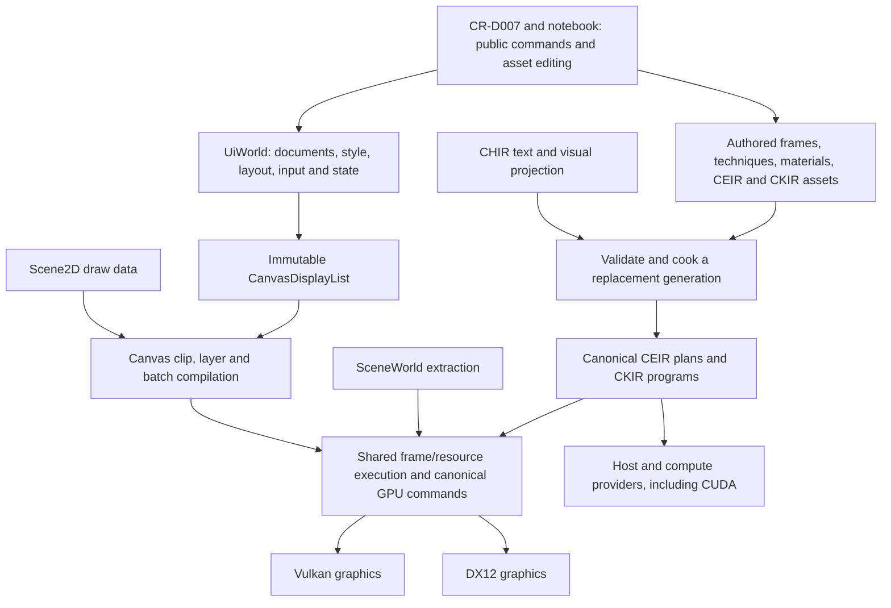
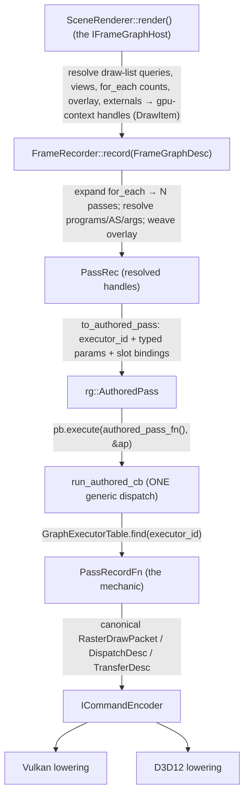

# Superseded planning records

<!-- doc-role: archive -->
> Historical reference; old status/schedules/grants are not current instructions. Current work: [ROADMAP](../ROADMAP.md); current rules: [AGENTS](../../AGENTS.md).

Historical source preservation from the 2026-09-12 consolidation. **No schedule or status here is live.**
Use [ROADMAP](../ROADMAP.md#master-table). Unique requirements are retained by the current contracts and table.
The older UI-in-scene, C++-only, notebook-first and platform-support claims below describe their own era.

<a id="roadmap"></a>
## Source: docs/ROADMAP.md

<a id="roadmap-cerid-engine--roadmap-hub"></a>
### Cerid Engine — Roadmap Hub

> **Cerid is a general-purpose C++20 real-time engine substrate.** Games are
> one consumer; simulation (incl. robotics), medical visualization,
> DAW-class creative tools, and offline cinematic pipelines are equal-class
> consumers.
>
> **This is a hub.** Don't read it end-to-end. Follow the link relevant to
> your task. The detailed plans live in `docs/phases/`, the architectural
> decisions live in `docs/decisions/`, and the live state lives in
> `context.md`.

---

<a id="roadmap-start-here"></a>
#### Start here

New to the project? Read **`docs/README.md`** — the Documentation Map (canonical reading
order + a map of every doc area). This file (ROADMAP) is the phase / decision-log / detour
hub the map points you to; below is the live phase status.

<a id="roadmap-status-snapshot"></a>
#### Status (snapshot)

> **The live front is detour D-007.** The CEIR execution spine is closed; renderer finishing and UI authoring
> now use one [master plan](2026-09-12-superseded-plans.md#d-007-rendering-ui-master-plan). Current state: `context.md`.
> The CEIR tracker preserves band history; the original D-007 master preserves full post-RAF contracts.
> The table below tracks the main-roadmap phases.
| Phase | State        | Detail                                       |
| ----- | ------------ | -------------------------------------------- |
| — **Detour D-007 (GPU program system)** | ACTIVE | [Renderer/UI master plan](2026-09-12-superseded-plans.md#d-007-rendering-ui-master-plan) — the single current plan. CEIR execution-spine history: [CEIR tracker](../detours/D-007-ceir-tracker.md). |
| 1.0   Foundations               | ✅ shipped       | `docs/phases/phase-1-foundations.md`     |
| 1.5   Application skeleton      | ✅ shipped       | `docs/phases/phase-1.5-app.md`           |
| 1.6   Configuration substrate   | ◧ 1.6a shipped; 1.6b hot-reload hook deferred (no active work) | `docs/phases/phase-1.6-config.md` |
| 2.0   RHI + Vulkan + triangle   | ✅ shipped (a–d) — the rhi modules were later **RETIRED 2026-07-23** (ADR-0105, RET band); the graphics layer today is `crd-gpu-context` | `docs/phases/phase-2-graphics.md`        |
| 2.1   ImGui debug overlay       | ✅ shipped (backend now lives on gpu-context) | `docs/phases/phase-2-graphics.md`        |
| 2.2   GPU memory + streaming    | ✅ shipped (allocator parity re-shipped on gpu-context at RET-4) | `docs/phases/phase-2-graphics.md`        |
| 2.3   Shader system             | ✅ shipped (a–g) — `crd-shader` later **RETIRED** (ADR-0105); shaders today are CKIR-authored (ADR-0101/0103/0104) | `docs/phases/phase-2.3-shader.md`        |
| 2.4   Renderer v1               | ✅ shipped (v1a–i) — `crd-renderer` later **RETIRED** (ADR-0105); rendering today = gpu-context + asset-driven RAF frame graphs (ADR-0106) | `docs/phases/phase-2-graphics.md` |
| 2.5   Jobs (threads + fibers)   | ✅ shipped       | `docs/phases/phase-2.5-jobs.md` (v1a–v1k all shipped; ADR-0033) |
| 2.6   Resources + asset cooker  | ✅ shipped       | `docs/phases/phase-2.6-resources.md` (v1a–v1g COMPLETE 2026-05-04; ADRs 0036–0041) |
| 2.7   Asset import bootstrap    | ✅ shipped       | `docs/phases/phase-2.7-asset-import.md` (Texture/Mesh/glTF + material foundation; ADRs 0042–0043, 0045, 0048) — the MATR/Effect pipeline was later superseded by CKIR materials (ADR-0104) |
| 2.8   Material completion       | ✅ shipped       | `docs/phases/phase-2.8-material-completion.md` (v1a–v1g complete 2026-05-06; ADRs 0044, 0046, 0048) — same CKIR supersession note as 2.7 |
| 3.0   Scene / ECS foundation    | ✅ shipped 2026-05-10 (v1a–v1p, all 17 slices) | `docs/phases/phase-3.0-scene-ecs.md` (8-layer slot architecture; ADRs 0049–0061) |
| 3.1   **Eylem (Cerid-native physics)** | ⏸ **paused at v1b close** (2026-05-11, per the ADR-0076 §12 sequencing pivot); v1c+ resumes after D-007 + hesap | `docs/phases/phase-3.1-eylem.md` (full v0–v9 slice plan + pause marker; ADRs 0062/0063/0066/0067/0068/0069/0075) |
| 3.1.6 **crd-hesap (numerical substrate)** | ⏸ **paused mid-v17** — v0–v13 ✅ (dense → sparse → orderings → eig/SVD → iterative+AMG → sparse-direct → sparse-eig → opt → ODE/DAE → FFT → DSP/wavelet/comms → special/stats → interp/quad/diff/motion) · v14 tensors ✅ 2026-07-05 · v15 forward AD ✅ · v16 reverse AD ✅ 2026-07-07 (ADR-0097) · **v17 GPU compute grew into detour D-007** (hesap-GPU is the detour's last stop) · v18 notebook+MCP planned | `docs/phases/phase-3.1.6-hesap.md` (ADR-0065; per-cluster verdict table there) |
| 3.1.7 **crd-geometry substrate** | ✅ **CLOSED 2026-05-19** (11+1 sub-modules; ADR-0076 §1–§28) | `docs/phases/phase-3.1.7-geometry.md` (full per-slice ledger preserved there) |
| 3.1.7.5 **crd-units** | ✅ **CLOSED 2026-05-15** (zero-overhead `Quantity<D, T>`, two-layer typed architecture, 6-layer conversions, `crd-no-untagged-physical-numeric` CI guard; ADR-0078) | `docs/phases/phase-3.1.7.5-units.md` |
| 3.1.8 **crd-brep (NURBS / B-rep)** | 📋 planned (ADR-0077) | `docs/phases/phase-3.1.8-brep.md` (parametric surfaces, B-rep solid topology, exact booleans, fillet/chamfer/sweep/loft, STEP / IGES / Parasolid import — the manufacturing/CAD substrate). |
| 3.1.9 **crd-cad-feature**        | 📋 planned (ADR-0077) | `docs/phases/phase-3.1.9-cad-feature.md` (feature trees, 2D sketching with constraints, ISO/ASME drafting, dimensioning, section views, GD&T per ASME Y14.5). |
| 3.1.10 **crd-cfd**               | 📋 planned (ADR-0077) | `docs/phases/phase-3.1.10-cfd.md` (unstructured grid topology, FVM/FEM, compressible/incompressible Navier-Stokes, k-ε / k-ω SST / LES / RANS turbulence, multiphase VOF + level-set, heat transfer, AMR, combustion). |
| 3.1.11 **crd-estimation + crd-control** | 📋 planned (ADR-0077) | `docs/phases/phase-3.1.11-estimation-control.md` (Kalman / EKF / UKF / particle filter / SLAM substrate; PID / LQR / MPC / optimal trajectory / robust control; path planning RRT / RRT* / PRM / A*). |
| 3.1.12 **crd-fea**               | 📋 planned (ADR-0077) | `docs/phases/phase-3.1.12-fea.md` (engineering FEA: static structural, modal, buckling, fatigue; linear→plastic→hyperelastic material models; thermal-structural coupling — distinct from eylem v7 dynamic FEM). |
| 3.1.13 **crd-cam**               | 📋 planned (ADR-0077) | `docs/phases/phase-3.1.13-cam.md` (3- / 5-axis milling toolpaths, turning, additive slicing, G-code post-processors, material-removal simulation, sheet-metal, PCB stack-up). |
| 3.1.14 **crd-ml-inference**      | 📋 planned (ADR-0077) | `docs/phases/phase-3.1.14-ml-inference.md` (ONNX runtime, GPU inference via `crd-gpu-context`, differentiable bridge extending `crd-hesap-autodiff`, denoising/SR/content-generation/in-game-AI consumers). |
| 3.1.15 **crd-procgen**           | 📋 planned (ADR-0077) | `docs/phases/phase-3.1.15-procgen.md` (noise primitives, Wave Function Collapse, L-systems, terrain erosion sim, city/building generation, Substance-style procedural materials). |
| 3.1.16 **crd-sciviz**            | 📋 planned (ADR-0077) | `docs/phases/phase-3.1.16-sciviz.md` (isosurfaces, streamlines, slice planes, vector-field LIC, perceptual color maps, in-engine 2D/3D plots, annotation + measurement — engineering / FEA / CFD validation tool). |
| 3.1.17 **crd-eda**               | 📋 planned (renewed-scope 2026-05-14) | `docs/phases/phase-3.1.17-eda.md` (PCB / EDA geometry substrate — board outline polygon + holes/cutouts + layers + keepout zones; trace geometry (segments + arcs + vias + pads + copper zones); DRC clearance checks (trace-trace + pad-trace + via + board-edge + zone-fill + acute-sliver); routing helpers (orthogonal + 45° + obstacle-avoidance; shove + autorouter are much-later follow-ups); Gerber X2/X3 + drill + solder-mask + paste output for manufacturing fab; future panelization. Future-major phase stub elevated 2026-05-14 from the renewed-scope review of Phase 3.1.7 `crd-geometry` — surfaces the EDA ambition without committing scope. Slot: after `crd-cad-feature` (3.1.9) close — EDA reuses the parametric-sketch + drafting substrate. Reading: KiCad architecture, FreeRouting algorithm survey, IPC-7351 land-pattern standards, Gerber X2/X3 format spec.). |
| 3     Simulation + visual effects | ⏳ — **note:** much of the 3.5–3.9 visual scope has since LANDED ahead of schedule inside D-007's CKIR frontier (gold GI/denoise/ReSTIR/NRC, atmosphere+clouds, FFT ocean, soft shadows, TAA, mesh shaders, GPU-driven culling); what remains is tracked as post-RAF bands, not here | `docs/phases/phase-3-simulation.md` (3.0 ✅ → 3.1 eylem → 3.2 animation (flesh out) → **3.3 crd-font** → 3.4 audio (flesh out incl. ray-traced acoustics) → **3.5** modern rendering prologue (mesh shaders / visibility buffer / GPU-driven culling / VRS / work graphs) + PBR+IBL+CSM+SSS+NPR+area lights → **3.6** sky atmosphere+volumetric fog+clouds+god rays+aurora → **3.7** bloom+GTAO+SSR+TAA+DoF+motion blur+upscaling → **3.8** GPU particles+ocean+decals+indirect rendering → **3.9** SSGI+DDGI+radiance cascades+lightmap baking; ADR-0047, ADR-0077 §4) |
| 4     Extensibility + Networking | ⏳              | `docs/phases/phase-4-extensibility.md` (4.0 C++ scripting, 4.1 advanced math, 4.2 networking; ADR-0034, ADR-0035) |
| 5     RT + UI + advanced rendering | ⏳ — **note:** the RT substrate (inline ray query + RT pipelines, both backends) landed in D-007; UI/2D is now designed as D-007 §UI/2D (I2D/SPR bands; ADR-0107 Proposed) | `docs/phases/phase-5-ui-rendering.md` (HybridRenderPath: BLAS/TLAS, RT AO/reflections/shadows/GI, ML denoiser via `crd-ml-inference`; crd-ui; node editor; ADR-0046) |
| 6     Platform expansion         | 📋 planned (ADR-0077) | `docs/phases/phase-6-platform-expansion.md` (console support PS5/Xbox/Switch, mobile iOS/Android, web WebGPU, VR/AR OpenXR, HPC/MPI distributed simulation. Reuses the slot left by the "Native physics" folding into Phase 3.1.) |
| 7     Editor                    | ⏳ — the editor is now designed as **CR-D007 / D7E** (assembled from I2D-9 widgets on the I2D UI foundation; D-007 §UI/2D) | `docs/phases/phase-7-editor.md`          |
| 8     Domain modules            | ⏳               | `docs/phases/phase-8-domain-modules.md` (application-layer integration: robotics (URDF+ROS2), aerospace (VLM + orbital prop), cinematic (mocap retarget + camera systems), medical viz (DICOM + transfer fn), manufacturing (full CAD/CAM/CAE), scientific computing (REPL+notebook); ADR-0077 §5) |

Legend: ✅ shipped · 🚧 active · ◧ partially shipped, no active work · ⏸ paused · ⏳ planned (near) · 📋 planned (far) · ❌ blocked

<a id="roadmap-strategic-execution-plan-locked-2026-05-15-revised-2026-05-19--agent-native-pivot--hesap-elite--c-only-scripting"></a>
#### Strategic Execution Plan (locked 2026-05-15; **revised 2026-05-19 — agent-native pivot + hesap-elite + C++-only-scripting**)

> **HISTORICAL — a locked plan, preserved as decided (2026-05-15/19).** The strategic *direction* here (engineering
> platform, agent-native, hesap-elite, ~~C++-only scripting~~ → a Cerid-owned CEIR/CHIR language stack, flipped by
> ADR-0108 2026-08-07) still stands. The *sequencing*, however, was overtaken by
> events: step 2 (hesap v0–v17) ran through v16, and **v17 GPU compute grew into detour D-007** — the user then locked
> (2026-07-11) the FULL visual frontier + RAF + the post-RAF programme *before* hesap-GPU and the eylem resume. For
> what to work on **today**, read `context.md` + `docs/detours/D-007-gpu-program-system.md`; this section explains how
> the sequence was originally decided and why.

After a step-back strategic review (Pathways A–E + cross-cuts) on
2026-05-15, the user locked the original execution sequence. On
2026-05-19, the user locked three additional load-bearing decisions
(see below).

<a id="roadmap-revision-2026-05-19-load-bearing-user-direction"></a>
##### Revision 2026-05-19 (load-bearing user direction)

- **Agent-native engine** is now a load-bearing cornerstone (ADR-0081
  Proposed; PRINCIPLES.md updated). CLI / JSON-RPC / **Anthropic MCP
  (exact compatibility)** is the source of truth; GUI is a
  visualization layer that emits CLI commands. AI agents (Claude
  Code, Anthropic SDK, OpenAI / Gemini Function Calling) drive the
  engine end-to-end via the same surface. Research dossiers:
  `docs/research/cerid-agent-native-engine.md` +
  `docs/research/cerid-hesap-2026-update.md`.

- **Cerid owns its executable-program language stack (CEIR/CHIR);
  C++ is one authoring surface, not the only one (ADR-0108).**
  Reusable algorithms are inspectable / serializable / hot-reloadable
  program assets, authored as text (CEIR/CHIR), a CR-D007 visual
  graph, a domain frontend, or a C++ builder. C++ stays first-class
  for native extension + programmatic authoring, and C++ DLL
  hot-reload remains supported. **No Lua / Python / GDScript /
  JavaScript embedded interpreter — CHIR is Cerid's OWN, not a wrapped
  VM.** ADR-0034 (C++ DLL hot-reload) is subsumed by ADR-0081 as one
  authoring sub-aspect. ~~Locked 2026-05-19; revisiting requires a new
  ADR.~~ **Historical:** the C++-ONLY clause was surgically superseded
  by ADR-0108 (Accepted 2026-08-07; cornerstone flip executed at the
  first CEIR vertical slice, CEIR-13z, 2026-08-10).

- **`crd-hesap` goes elite-and-big** (same precedent as Phase 3.1.7
  `crd-geometry`). Full SOTA scope from v0: matrix-type catalog
  (~30 types: dense / banded / triangular / Hermitian / Toeplitz /
  Hankel / circulant / Vandermonde / sparse {CSR/CSC/BSR/COO/ELL/HYB
  /DIA/CSR5/Merge-CSR} / hierarchical {HSS/H-matrix/BLR}),
  **complex-number support from v0**, `LinearOp<T>` abstraction,
  **task-DAG scheduling via crd-jobs** (vs fork-join BLAS),
  **mixed-precision iterative refinement** (HPL-AI pattern), modern
  preconditioners (SPAI / ILUPACK / SA-AMG / AGMG), **Krylov subspace
  recycling** for eylem-class consumers, **JAX-style operator-level
  autodiff** (vs tape-only), **modern hardware support** (AVX-512 /
  SVE2 / Apple AMX / Intel AMX). Hesap v0 expands from 1.5 weeks →
  ~5 weeks of v0a-f sub-slices. Full phase ~10-12 months elite-tier
  (~52 KLOC; comparable to geometry's 22 KLOC scaled by surface
  breadth).

- **Per-slice DoD adds CLI command schema registration** from
  2026-05-19 forward. Every new slice ships typed `CommandSchema`
  declarations alongside the C++ API. The CLI parser substrate
  itself ships in Phase 4.0 (sequenced after hesap) — protocol
  plumbing now, parser later (same pattern as ADR-0076 §12 used for
  geometry-before-eylem).

- **Phase 4.0 redefined** = `crd-cli` + `crd-rpc` + `crd-script`
  substrate (~12 weeks). MCP exact-compatibility + JSON-RPC server +
  capability-based security + transactional sessions + sandbox
  isolation + C++ hot-reload supervisor. Subsumes the original
  Phase 4.0 = "C++ scripting / DLL hot-reload" (now a sub-aspect).

- **Sequencing (locked 2026-05-19, supersedes 2026-05-15 calendar):**
  1. Phase 3.1.7 close (v11 in flight; targeted fixes verified; CI
     catches any residual drift per `feedback_targeted_fix_skip_resweep`).
  2. **Phase 3.1.6 `crd-hesap` v0-v17** elite-and-big (8-12 months).
     CLI protocol plumbing per slice; parser substrate deferred.
  3. **Phase 3.1 eylem v1c-v9 resume** — consumes geometry from
     day 1; consumes hesap-dense from v1f-articulation onward.
  4. **Phase 4.0 `crd-cli` + `crd-rpc` + `crd-script`** — the
     formalized agent-native substrate.
  5. Per-module CLI back-fill (cross-cutting); notebook + Claude
     Code agent reference integration; engine-wide MCP surface.

<a id="roadmap-pinned-strategic-decisions-2026-05-15-original-superseded-items-annotated"></a>
##### Pinned strategic decisions (2026-05-15 original; superseded items annotated)

1. **Pathway A — Units-first.** Phase 3.1.7.5 `crd-units` is the *immediate next phase*. Project-wide dimensional safety lands before any further geometry slices ship so the v4–v11 + v4-validate API surfaces are typed from day 1 (no retroactive-typing cost).

2. **Engineering-platform leader is the long-term direction (Pathway E).** Reason (user 2026-05-15): *"if engineering work is performant and good, it is easier to put game and animation and entertainment related stuff there."* Engineering rigor (deterministic + dimensional + numerically robust + differentiable) can't be retrofitted; rendering can. Cerid picks the harder-to-fake direction and lets entertainment features grow on top.

3. **Geometry phase ships in FULL (no consumer-driven cutting).** Per user 2026-05-15: *"I need curves, I need all the other things it is the base, we will plug in where we need them in the future and our needs are not secret."* The renewed-scope 49-slice plan stays intact. Pathway B (cut to consumer-driven) is rejected — the user has product clarity on every substrate's eventual consumer (curves → cinematic + robotics + path tools; polygon → PCB + navmesh + CAD sketches; mesh-processing → cooker LOD + FEA prep; delaunay → navmesh + FEA tetmesh; transform-aware → every consumer; v4-validate → cooker + editor mesh-import gate).

4. **`crd-hesap-dense` v0 ships BEFORE eylem v1c resume** (after 3.1.7 close). **REVISED 2026-05-19**: hesap-elite-and-big — full v0-v17 substrate (~10-12 months) ships before eylem v1c resume; v0 expands to v0a-f over ~5 weeks (matrix types + complex + LinearOp + task-DAG + mixed-precision IR + CLI plumbing + bench substrate). Aligns with the engineering-platform pivot. Eylem v7 FEM and v9 differentiable later consume hesap natively. Per the user "elite, no shortcuts" mandate.

5. **C++ scripting + DLL hot-reload DEFERRED to Phase 4.0 as planned.** Not pulled forward. **REVISED 2026-05-19**: ~~locked as the **ONLY** scripting language (no Lua / Python / GDScript)~~. **RE-REVISED 2026-08-07 (ADR-0108): C++ is no longer the ONLY scripting language — Cerid owns the CEIR/CHIR + CR-D007-visual language stack; C++ stays first-class native + hot-reload; the third-party-VM rejection (no Lua/Python/JS) stands.** Phase 4.0 absorbs `crd-cli` + `crd-rpc` + `crd-script` into one agent-native substrate phase. ADR-0034 is subsumed by ADR-0081 (Proposed). Original 2026-05-15 reasoning still valid: (a) no consumer-tier code exists yet to reload — hesap-v0 protocol plumbing serves as the first consumer; (b) DLL supervisor's state-migration design crystallizes when crd-hesap-repl + crd-cli land; (c) script-as-DLL-loaded-into-engine over a domain is the right shape (agent emits C++ → cooker compiles → hot-reload → call); (d) iteration-speed productivity gain available cheaper via per-slice protocol plumbing until Phase 4.0 ships the parser.

6. **Cross-cuts run in flight with units adoption + through geometry phase.** Four detours: **D-006 `crd-time` substrate ✅ shipped 2026-05-15** (absorbs `platform::Timer`/`FrameClock`, ships `Instant`/`Duration = Quantity<dim::Time, f64>`/`Stopwatch`/`FrameClock` fixed-step + alpha/`DeterministicClock`/`Deadline`/GPU timestamp delegation; **first major consumer of the units substrate**; foundation for D-003 + D-004 + eylem v1c+ fixed-step); **D-003 `crd-perf` profiler + ImGui frontend ✅ shipped 2026-05-15** (renamed from `crd-profiler` at v0a — collision with existing `crd-profile` quality-preset module; **all 8 slices v0a-v0h shipped same session** = substrate + UX + sandbox wiring + ADR-0079 + system doc + `win-shipping-profile` preset extending per-slice DoD 4 → 5 configs; 97 perf-* test cases / 336 assertions); D-004 deterministic-replay sandbox queued (uses D-006 `DeterministicClock`); D-005 config/resource hot-reload polish queued. Per-slice protocol fix shipped 2026-05-15 as Sprint 0 ahead of units v0a (codified in `feedback_per_slice_run_ctest.md` + `scripts/per-slice-check.{ps1,sh}` + `docs/protocols/per-slice-verification.md`).

7. **Eylem cold-storage mitigation.** Eylem v1b shipped 2026-05-11; v1c resumes ~7 months from now per this plan. To prevent code rot: as each geometry sub-module ships (v4 mesh / v5 spatial / v6 polygon / …), run a ~30-min integration smoke against the corresponding eylem v1c+ stub path (e.g. v4 mesh → smoke `eylem::TriangleMeshCollider` stub; v2 GJK → smoke eylem v1d narrowphase stub). Not a slice; a per-sub-module hygiene practice. See `feedback_per_slice_run_ctest.md` for the protocol.

<a id="roadmap-calendar-target"></a>
##### Calendar (target)

| Window | Work | Outcome |
|---|---|---|
| 2026-05-15 (done) | **Sprint 0** per-slice protocol fix + **Sprint 1 Phase 3.1.7.5 v0a `crd-units` substrate** ✅ shipped (138 cases / 464 assertions; ADR-0078; `docs/systems/units.md`; CI guard live) + **Detour D-006 `crd-time`** ✅ shipped (first major units consumer; `Duration = Quantity<dim::Time, f64>`) + **Detour D-003 `crd-perf` profiler + ImGui frontend** ✅ shipped (8 slices v0a-v0h; 97 perf-* cases / 336 assertions; ADR-0079; `docs/systems/perf.md`; `win-shipping-profile` preset; per-slice DoD 4 → 5 configs). | Project-wide dimensional safety substrate; timing substrate; live frame metrics (CPU per-thread + GPU per-pass + memory per-allocator + user counters); ImGui flame graph + capture/replay file export. |
| Now → +5 weeks | **Phase 3.1.7.5 v0b/c/d adoption pass** (`crd-config` + `crd-scene Transform` + glTF cooker for v0b ~600 LOC ~5 days; `crd-eylem RigidBody` + integrator + force fields + `crd-geometry-primitives` API surface for v0c ~800 LOC; `crd-renderer` + cookers + ImGui + Layer-6 format/parse/UnitPreferences + cross-engine readers + 17-config sweep close for v0d ~700 LOC) — IN PARALLEL with **D-004 replay sandbox**, **D-005 config/resource hot-reload polish** | Project-wide dimensional safety adopted across `crd-config`/`crd-scene`/`crd-eylem`/`crd-geometry`/`crd-renderer`/cookers; deterministic-replay validated; config-tier iteration speed |
| +5 weeks → +5 months | **Resume Phase 3.1.7** geometry: v4 `-mesh` (+ v4-validate) → v5 `-spatial` → v6 `-polygon` → v7 `-mesh-processing` → v8 `-delaunay` (with v8c-pre `insphere` Stage D paydown) → v9 `-gpu` + V-HACD + REPL → v9e shader-helpers GLSL/HLSL emit → v10 `-curves` (a–e) → v11 transform-aware. Per-sub-module eylem smoke against the relevant v1c+ stub. | All planned substrate consumers (sdf, renderer-cull, audio raycasts, editor picking, navmesh, V-HACD, cinematic paths, robotics trajectories, eylem mesh-collider) light up |
| +5 → +6 months | **Phase 3.1.7 CLOSE** (full 17-config sweep + ADR-0076 §19 amendment) + **Phase 3.1.6 `crd-hesap-dense` v0** (BLAS L1/L2/L3 + LAPACK-class direct: Cholesky / LU / QR — minimum to unblock eylem v7 FEM + future CFD/FEA/control) | Engineering-platform pivot officially starts; first real numerical-computing substrate slice |
| +6 → +9 months | **Resume Phase 3.1 eylem v1c+**: broadphase consuming `crd-geometry-bvh::DynamicBvh` → v1d narrowphase consuming v2 GJK/EPA → v1d-manifold consuming v2j → v1d-mesh consuming v4 mesh closest-point + raycast. **First playable physics demo** in the sandbox with units-throughout + profiler instrumentation + deterministic-replay validation. | Cerid's first integrated end-to-end demo; substrate dogfood |
| +9 months → … | Continue engineering-platform pivot: full hesap rollout (sparse / iterative / direct / eig / opt / ode / fft / dsp / stats / tensor / autodiff / gpu), then 3.1.5 sdf, then 3.1.8+ domain substrates (brep / cad-feature / cfd / estimation+control / fea / cam / ml-inference / procgen / sciviz / eda) | The 8-domain mandate per ADR-0077 starts shipping |

<a id="roadmap-what-this-plan-does-not-change"></a>
##### What this plan does NOT change

- ADR-0076 §1-§18 architecture (sub-module split, dimension exponents, predicate tiering, query API shape) — all stays as before.
- The renewed-scope 49 slices stay intact (no cutting).
- The substrate-first principle — extended with the engineering-platform priority for the medium-term sequencing.
- ADR-0077 multi-domain expansion — unchanged; the engineering-platform pivot just reorders WHEN these phases start (after physics demo, not after a hypothetical "game-first" milestone that no longer exists).

<a id="roadmap-what-this-plan-replaces"></a>
##### What this plan REPLACES

- The implicit "geometry → eylem v1c+ resume → sdf interleave → hesap (3.1.6) after eylem" sequence is REPLACED with: **geometry → units (3.1.7.5) → cross-cuts (D-003/D-004/D-005) → hesap-dense-v0 → eylem v1c+ resume → physics demo → full hesap → sdf → domain substrates.** The early hesap-dense-v0 is the engineering-platform pivot's first concrete artifact.
- The implicit "C++ scripting + DLL hot-reload land in Phase 4.0 someday" was already correct; this plan explicitly says **do not pull it forward** until a domain module's consumer pulls it.

*(Recorded: later ADR-0076 amendments reference this plan — see the ADR's §19+ amendment trail.)*

<a id="roadmap-decision-log"></a>
#### Decision log

All architectural decisions are individual ADRs under `docs/decisions/`.
Tag-indexed list: `docs/decisions/README.md`.

<a id="roadmap-detour-queue"></a>
#### Detour queue

Active detour, if any, is named in `context.md`. Queue and rules:
`docs/detours/README.md`.

<a id="roadmap-open-debt"></a>
#### Open debt

`docs/debt.md`.

<a id="roadmap-long-range-outlook"></a>
#### Long-range outlook

Direction, not commitment.

> **Dated snapshot (written ~2026-05-16; kept as the direction record).** Much of the "12–24 months" visual scope
> (atmosphere, clouds, TAA, PCSS, DDGI, ocean, GPU-driven rendering, RT + denoising) has since landed **ahead of
> schedule** inside D-007's CKIR frontier and the RAF/post-RAF programme — see
> `docs/detours/D-007-gpu-program-system.md` for what is real today. The phase numbering below is retained for the
> not-yet-started items.

<a id="roadmap-already-achieved-as-of-2026-05-16"></a>
##### Already achieved (as of 2026-05-16)
- Stable Vulkan backend, GPU allocator strategy in place
- Shader system v1 with hot-reload, variant keys, pipeline handoff
- Renderer v1a–i (Clustered Forward+, frame graph, descriptor system, material system)
- **Jobs system v1 complete** (v1a–v1k): fiber pool, work-stealing deque, ABA-safe scheduler, counter/wait, worker pool, public API (`run`/`wait`/`make_job`/`parallel_for`), 41-byte SBO, per-frame arena, crd-app wired
- ImGui debug tooling; crd-config TOML substrate
- **Resource system v1 complete** (v1a–v1g): handle table, ref-counting, sync/async/streamed loading, typed loaders (shader, material), hot-reload with atomic payload swap + mtime polling + callbacks, 2Q LRU eviction, memory budget, pin/unpin
- **Asset import bootstrap** (Phase 2.7): TextureResource + MeshResource + glTF + MaterialTemplate/Instance + GpuUploader + crd-meshgen + crd-sandbox
- **Material GPU wiring** (Phase 2.8): per-material pipeline cache + multi-pass ForwardRenderPath + depth-only prepass + sandbox 3D rendering + glTF demo asset bundle + unified Asset Browser
- **`crd-scene` v1a–v1p CLOSED 2026-05-10** (Phase 3.0): 8-layer slot-shaped ECS — Entity/SlotMap, Archetype+SparseSet hybrid storage, mixed-backend visitor, six built-in relations, Query DSL, System+Schedule+Commands (7-phase fixed), IComponentIndex framework + 5 reserved index shells (one now realized as `SpatialBVHIndex` LooseOctree-backed per Phase 3.1.7 v5-index-bringup), Transform+TransformPropagation (bit-exact deterministic), SceneResource+SceneLoader + cook_scene cooker, **Öbek system (ADR-0058)** with all 3 InheritPolicy values + transparent CoW + 4 revert granularities + AAAA-tier reservations (BatchHints / BatchInstanceTag / OBAT chunk for GPU instancing Phase 3.5+, ObekEntityGuid for replication/replay), ScriptComponent + reserved spatial DSL operators, API surface freeze. ADRs 0049–0061
- **Memory subsystem v2** (2026-05-07, Detour D-001 closed): production-grade `TlsfAllocator` (arbitrary alignment, try-allocate, ~7 KB metadata, ASan-validated) + `GrowablePoolAllocator` (page-pooled fixed-size aligned blocks, O(1) alloc/free); `ChunkAllocator` refactored on top of GrowablePool (closed v1c1 O(N) free debt); `World`/`ArchetypeGraph`/`SparseSetStorage` route every byte through one root `IAllocator`
- **Phase 3.1 eylem v0/v1a/v1a-material/v1a-draw/v1b-a..d shipped** (paused at v1b close per the Strategic Execution Plan 2026-05-15; v1c resumes after Phase 3.1.7 close + crd-hesap-dense v0)
- **Phase 3.1.7.5 `crd-units` CLOSED 2026-05-15** (v0a substrate + v0b/c/d adoption passes; ADR-0078 §1–§5): zero-overhead `Quantity<D, T>` + 6-layer conversion system + 8 SI dimensions + ~120 UDLs + `Vec<Quantity>` + 13 typed config accessors + scene::Transform::translation typed + glTF cooker `[cook] position_scale` + crd-eylem RigidBody/PhysicsConfig/IPhysicsScene dimensional with 80-byte freeze pin + crd-geometry-primitives struct widening + queries_typed.hpp boundary layer + Layer-6 UnitPreferences + 11 discipline-preset factories. **§5 two-layer typed architecture pin** locked engine-wide. **`crd-no-untagged-physical-numeric` CI guard** live
- **`crd-time` D-006 shipped 2026-05-15**: `Instant` + `Duration = Quantity<dim::Time, f64>` + `MonotonicClock` / `WallClock` / `CycleCounter` + `Stopwatch` + `FrameClock` (fixed-step + alpha) + `DeterministicClock` + `Deadline` + `GpuTimestampHandle`. Absorbs `platform::Timer` via ADR-0076 §13 move-and-delete pattern
- **`crd-perf` + `crd-perf-ui` D-003 shipped 2026-05-15** (v0a–v0h all in one day): per-thread SPSC ring of 32 B Samples + interned names + `ScopedRegion` RAII + `JobObserver` hook + VulkanProfilerBackend GPU timestamps + per-allocator memory stats + ImGui flame graph + capture/replay file export + `win-shipping-profile` preset (per-slice DoD 4→5 configs); ADR-0079
- **Phase 3.1.7 `crd-geometry` — 8 of 11 sub-modules COMPLETE** (59 of 49 renewed-scope slices shipped, 120%): `-primitives` ✅ v0a–v0f + v1h (2026-05-13) + `-bvh` ✅ v1a–v1g (2026-05-13) + `-convex` ✅ v2a–v2j + v2-close + v3 Shewchuk-predicates + hull-extension + simplify (2026-05-14/15) + `-mesh` ✅ v4a–v4d + v4-validate + v4-close (2026-05-16) + `-spatial` ✅ v5a–v5e + thread-safety pass + scene-index bringup + queries-extension + v5-close (2026-05-16) + `-polygon` ✅ v6a–v6e + v6-close (2026-05-16) + **`-mesh-processing` ✅ v7a HalfEdgeMesh + v7b QEM (Garland-Heckbert 1997) + v7c Loop (1987) + v7d Botsch-Kobbelt remesh (2004) + v7e Liepa hole-fill §3+§4+§5 (2003) + v7f manifoldness repair + v7g self-intersection removal (Möller 1997 + per-tri v6c CDT) + v7h Taubin smoothing (1995) + v7-close (2026-05-17)** + `-viz` ✅ v1j companion module. ADR-0076 §12+§13+§15+§16+§17+§18+§19+§20+§21+§22 amendments all accepted. 18-config full sweep PASS at each cluster close

<a id="roadmap-612-months-mid-2026-to-early-2027"></a>
##### 6–12 months (mid-2026 to early 2027)
- Resource system + asset cooker (Phase 2.6): handle table, ref-counted assets, hot-reload, cooked binary format ✅ SHIPPED
- Asset import bootstrap (Phase 2.7): TextureResource + MeshResource + glTF + material foundation + GPU upload + **crd-meshgen** + **crd-sandbox**; ADRs 0042–0043, 0045, 0048
- Material completion (Phase 2.8): per-material PSO cache + pass-keyed shader variants + depth-only prepass; ADRs 0044, 0046
- Scene/ECS foundation (Phase 3.0): hybrid hierarchy + SoA components + TOML → cooked binary
- **Eylem — Cerid-native physics (Phase 3.1)**: built from day 1 (no PhysX wrap step). **⏸ PAUSED at v1b close** (v0/v1a/v1a-material/v1a-draw/v1b-a..d ✅ shipped 2026-05-11). v1c+ resumes AFTER Phase 3.1.7 `crd-geometry` close + `crd-hesap-dense` v0 per the Strategic Execution Plan locked 2026-05-15 (engineering-platform pivot). When v1c resumes it consumes `crd-geometry-bvh`/`-convex`/`-mesh`/`-spatial`/`-polygon` from day 1 with no deferred-refactor. Pivot per ADR-0076 §12 amendment 2026-05-11.** Module split: `crd-eylem` substrate + `crd-eylem-rigid3d` (active; BodyPool + ColliderPool + EylemSystem + RigidBodyInterpolationSystem shipped) + `crd-eylem-rigid2d` / `-soft` / `-articulation` / `-vehicles` / `-ccd` / `-fem` / `-gpu` / `-diff` (planned) + `crd-eylem-aero` (planned per ADR-0073) + `crd-eylem-cine` (planned per ADR-0074) + `crd-eylem-viz` (companion bridging eylem to crd-draw VisualizerRegistry). v0 ✅ + v1a ✅ + v1a-draw d0..d4 ✅ + v1b-a/b/c/d ✅ + v1a-material a/b/c/d ✅ + v1b-e 🚧 (sweep running). v1 = rigid 3D substrate + crd-draw substrate + Material substrate + 5-tier collision filter + deferred ECS event-stream callbacks + force-field substrate (9 formulas) + conservation-law CI + deterministic snapshot/replay across 9 CI configs. v2-v9 stage 2D specialisation, XPBD soft/cloth/rope, articulations + cinematic bridge, vehicles + 5 friction models, CCD + Featherstone + URDF/SDF/MJCF + nonsmooth Newton + sensors + aerospace substrate, FEM + HuntCrossley, GPU acceleration + Newton restitution, differentiable + cross-engine bench. **8 ADRs Accepted** (0062 / 0063 / 0066 / 0067 / 0068 / 0069 / 0075 + 0066 §19.2.1 extension) + **5 ADRs reserved Planned** (0070 / 0071 / 0072 / 0073 / 0074 mint when their research dossiers ship at slice time). 4 research dossiers shipped; 6 more planned for Wave 2/3 ADRs. Supersedes ADR-0018 + Phase 6.
- **`crd-sdf` substrate (Phase 3.1.5)**: signed-distance-field module consumed by eylem (mesh colliders + closest-point), font (MTSDF), renderer (DFAO/DFGI in 3.5+), audio (acoustic occlusion in 3.4), editor (CSG modelling in 7). 8 slices over ~5–6 wk: v0 analytic primitives → v1 dense 3D grid + CRDR → v2 mesh-bake (Jacobson 2013 winding-number sign + BVH closest-point, parallel) → v3 narrow-band sparse → v4 CSG + smooth-min → v5 GPU 3D-texture upload + GLSL helper → v6 cooker → v7 Marching Cubes extraction → v8 reserved (GPU baker / VDB / Dual Contouring). ADR-0064; deterministic per ADR-0063; plan: `docs/phases/phase-3.1.5-sdf.md`; research: `docs/research/cerid-sdf.md`. **Slot unchanged by ADR-0076 §12 (2026-05-11): still interleaved between eylem v2 and v3.** v2 mesh-bake now consumes `crd-geometry-mesh` + `crd-geometry-bvh` directly from day 1 (no narrow-version refactor — the original ADR-0064 §4 deferred-refactor is OBSOLETE since geometry ships before sdf).
- **`crd-geometry` substrate (Phase 3.1.7)** — ADR-0076 ✅ Accepted 2026-05-11 + **11 amendments (§12 through §23) + §24/§25/§26 planned for v9 sub-cluster closes**. **Status:** 🚧 ACTIVE — **10 of 11 sub-modules COMPLETE 2026-05-18** (`-primitives` ✅ + `-bvh` ✅ + `-convex` ✅ + v3 hull extension ✅ + `-mesh` ✅ + `-spatial` ✅ + `-polygon` ✅ + `-mesh-processing` ✅ + `-delaunay` ✅ + **`-decomposition` ✅**; 73 of 49 renewed-scope slices shipped, 149%). **Phase 3.1.7.6 `crd-rhi-compute` prerequisite sub-phase ✅ CLOSED 2026-05-17** (6 slices v0a-v0e + v0-close; ~1290 LOC engine + ~1200 LOC tests; ADR-0080 Accepted with D1-D12 + D2/D7/D8 revisions; system doc `docs/systems/rhi-compute.md`; 5 days actual vs 4 wk budget ≈ 5-6× ahead). Substrate ready: compute pipelines + storage buffers + dispatch + cross-stage barriers + async compute queue + binary semaphores + spec-const & workgroup reflection. **v9-prereq-test-harness ✅ SHIPPED 2026-05-18** — GPU sanity-check infrastructure for the 16 v9 GPU slices: `crd::rhi::ValidationCapture` RAII messenger on `VkInstance` + `crd::test::ulp_compare<f32>` / `bit_compare<T>` + `crd::perf::measure_ms` + `CRD_PERF_BUDGET_LE` macro + `crd::test::gpu_determinism_check` + per-slice DoD `-IncludeRelease` flag (opt-in 5th config catches LTCG miscompiles). Discipline locked: every v9 GPU slice = (a) ValidationCapture asserts 0 errors/warnings, (b) ulp/bit_compare GPU vs CPU reference, (c) determinism check 3 rounds if claiming determinism, (d) CRD_PERF_BUDGET_LE per published per-kernel budget. 5-config DoD PASS in 02:48. **v9c-a V-HACD voxelize ✅ SHIPPED 2026-05-18** — new module `crd-geometry-decomposition` (10th `-geometry-*` sub-module); opens v9c `-decomposition` cluster. Algorithm: two strictly non-overlapping passes (D126) — (1) parallel SAT surface marking via Akenine-Möller 2001 13-axis exact test + per-voxel `std::atomic_ref<u8>::fetch_or(Surface)` race-free union via `crd::jobs::parallel_for`; (2) classification of still-Unknown voxels via WindingNumber (default, robust on non-watertight via Jacobson 2013) OR FloodFill (fast, requires watertight; leaks documented). `VoxelGrid` opaque dense `Array<u8>` + `atomic_ref` accessors (future bricked/sparse backend non-breaking). Sizing precedence: `fixed_resolution` wins, else `target_voxel_count`. Divergence from Mamou (D124): exact SAT not conservative centroid-classification — substrate serves CAD/SDF too. f32 only (matches `mesh_winding_number`); f64 follow-on. Pinned D123-D128 for ADR-0076 §24 amendment. **v9c-b V-HACD decompose ✅ SHIPPED 2026-05-18** — `vhacd_decompose(VoxelGrid, opts, alloc) -> VhacdResult { Array<QuickhullResult<f32>> parts; ... }`. Module gains PUBLIC dep on `crd-geometry-convex`. Mamou §3.2-3.4 recursive plane-search. Concavity D129 = voxel-fraction (NOT Hausdorff; documented divergence). Cluster repr D131 = voxel_indices + per-voxel sidecar. β=0 default. **v9c `-decomposition` CLUSTER CLOSED 2026-05-18** — 18-config full sweep PASS (`scripts/full-sweep.ps1`: 11 Windows + 7 Linux); ADR-0076 §24 amendment locks D123-D131 (9 design decisions); eylem v1c convex-collider-conditioning **stub integration smoke** SHIPPED (`[eylem-stub]` tag in test_vhacd.cpp; full pipeline triangle-mesh→voxelize→vhacd_decompose→per-part ConvexHullView→`contains(view, centroid)` — canary catches API drift before eylem v1c lands at Phase 3.1 v1c-resume). Cluster totals: 3 slices, ~1330 LOC engine + ~820 LOC tests, 21 cases / 89 assertions. 10 follow-on slices filed (none regressions). **Phase 3.1.7 sub-module 10 of 11 ✅** (primitives + bvh + convex + v3 hull-ext + mesh + spatial + polygon + mesh-processing + delaunay + **decomposition** ✅). **v9a-a + 4 follow-ons ALL SHIPPED 2026-05-18** — new sibling module `crd-geometry-bvh-gpu` (D132 — mirror of `crd-rhi`/`crd-rhi-vulkan`). **Base v9a-a**: 30-bit Morton CPU oracle + GPU dispatch; GLSL shader is mechanical translation of CPU body (D134); pre-existing rhi-vulkan VK_KHR_surface bug surfaced + fixed. **4 follow-ons paid in-line same day** (initial deferral overturned per user "build substrate fully" direction; memory rule refined): `v9a-a-typed` (Length<T> strip-compute-retag wrappers, D137); `v9a-60bit-cpu` (u64 60-bit Morton CPU oracle + km-scale discriminator, D138); `v9a-a-async-compute` (new `Device::create_command_buffer_for_queue` virtual + Vulkan compute-family pool + opt-in async dispatch, D139); `v9a-60bit-gpu` (`Device::supports_shader_int64` + GLSL u64 shader + sibling pipeline class, D140). 5-config DoD PASS in 39 s. Combined: 5 slices, ~1170 LOC engine + ~880 LOC tests, 26 cases / 175 assertions, 9 locked decisions D132-D140. RHI surface gained 2 new virtuals (both appended at END per vtable-stability). **v9a-b1 CPU stable LSD radix sort ✅ SHIPPED 2026-05-18** (`sort_morton_pairs<KeyT>` templated for `KeyT ∈ {u32, u64}` from day 1; 20 tests / 40 134 assertions; D141-D144 pinned). **v9a-b2 GPU LSD radix sort ✅ SHIPPED 2026-05-18** (`MortonRadixGpuPipeline::dispatch_radix_sort` — 4-bit-digit × 8 passes; prefix-sum scatter D146 ⇒ output byte-identical to v9a-b1 oracle, not throughput-tier; 4 compute shaders + 25 dispatches/sort; 9 tests / 8 257 assertions; D146-D149 pinned). **v9a-b1-simd scalar+prefetch ✅ SHIPPED 2026-05-18** (Investigated AVX2 sub-histograms + Wassenberg SWWC + multi-pass histogram via web research, all slower at 1M / 8MB working set; `_mm_prefetch` 8 iters ahead in scatter wins +7%; D145/D150/D151 pinned; debt cleared). **v9a-b1-parallel 3-phase parallel via crd-jobs ✅ SHIPPED 2026-05-18** (opt-in `sort_morton_pairs_parallel<KeyT>` with deterministic per-(chunk, bucket) stable-merge; 8 tests / 400 025 byte-identical assertions across worker-spanning corpus + num_jobs ∈ {1,2,4,8,16} byte-identity; measured **1.86× speedup → 2.56 ms / 1M u32 win-shipping**, 7.8× budget headroom; D152-D155 pinned; substrate template for eylem v1c broadphase + parallel BVH refit + cooker bakes). **v9a-c LBVH tree + AABB upsweep ✅ SHIPPED 2026-05-18 (elite combined slice, absorbs originally-separate v9a-d)** — Karras 2012 §2.2 binary-tree-from-sorted-codes + §2.4 atomic-counter parent-walk upsweep + canonical-layout DFS reorder; the original "atomic vs 2-pass barriers" decision-fork dissolves (D159: Karras §2.4 is BOTH faster AND bit-deterministic via commutative AABB union); `coherent` qualifier + `memoryBarrierBuffer()` load-bearing in GLSL upsweep (Lesson 09 — atomicAdd's acquire-release on the atomic does NOT synchronize non-atomic bounds writes); 12 tests / **379 021 byte-identical-topology + 1-ULP-bounds assertions** including 4 advisor-flagged degenerate cases (N=1 / N=2 / all-equal / adjacent-equal-interspersed) + end-to-end CPU↔GPU pipeline; D156-D164 pinned. **v9a-close ✅ CLUSTER CLOSED 2026-05-18** — ADR-0076 §25 ✅ Accepted, 33 design decisions D132-D164 locked, 18-config full sweep PASS, performance characterization honestly pinned (test-harness 53.7 ms / 1M dev box; pure-GPU pipeline ~5-8 ms / 1M RTX 3060 estimate). **Phase 3.1.7 sub-module 11 of 11 ✅ — `crd-geometry` substrate COMPLETE.** Cluster totals: 10 algorithmic slices + close in 1 day; ~5 600 LOC engine + ~3 800 LOC tests + ~71 cases / ~827 K assertions; 3 lessons captured (02, 04, 09) in `docs/lessons/`. **Next = v10 `-curves` cluster (Bezier / B-spline / Hermite, 5 slices, ~2 wk)** (16 unbundled slices: v9c V-HACD + v9a GPU LBVH + v9b GPU refit + v9e shader-helpers + 3 cluster-closes; ~7300 LOC / ~6 wk; ADR-0076 §24/§25/§26 amendments lock at sub-cluster closes) → v10 `-curves` → v11 transform-aware. **v9d REPL bindings deferred** to Phase 3.1.6+ when `crd-hesap-repl` host exists. Computational-geometry primitives + spatial-acceleration substrate. Peer module to `crd-math` / `crd-sdf` / `crd-hesap` (NOT bloated into `crd-math`). Multi-domain consumer list: eylem broadphase (BVH refit/build, v1c) + narrow phase (GJK + EPA, v1d) + mesh collider (closest-point + raycast on triangle mesh, v1d-mesh) + convex collider conditioning (v1c); crd-sdf v2 mesh-bake (winding-number test + BVH closest-point); crd-renderer Phase 3.5+ (frustum cull + occlusion BVH); crd-scene `SpatialBVHIndex` reserved shell (ADR-0053); crd-audio Phase 3.4 (acoustic ray-casts); crd-eylem-aero (ADR-0073, surface eval); crd-eylem-cine (ADR-0074, animated mesh queries); editor Phase 7 (V-HACD pipeline + selection + picking). Inherits ADR-0063 determinism contract (deterministic BVH SAH split tiebreak; deterministic GJK simplex update; deterministic-FP polygon predicates per Shewchuk 1997). 11 sub-modules: `-primitives` + `-bvh` + `-convex` + `-mesh` + `-spatial` + `-polygon` + `-mesh-processing` + `-delaunay` + `-gpu` + `-decomposition` + `-shader-helpers` (cooker-emitted GLSL/HLSL) + `-viz` (debug-draw companion, depends crd-draw). Two-layer API mirrors crd-hesap: typed C++ Eigen-class for engine code + opt-in cooker/editor façade. **§12 amendment dissolves the deferred-refactor pattern** — eylem v1c/v1d/v1d-mesh + sdf v2 all consume `crd-geometry` from day 1, no ships-own narrow versions. **§13 amendment (2026-05-11)**: v0a move-and-deletes the pre-existing `crd::math::geometry` into `crd-geometry-primitives` (`crd-math` then lean — Vec/Mat/Quat/Transform/SIMD/deterministic only); + new v0f cutting-edge/branchless/SIMD intersection corpus (watertight ray-tri Woop 2013, Baldwin-Weber 2016, branchless NaN-safe slab ray-AABB, Ize 2013 robust-traversal precompute, Plücker edge tests, Ericson Voronoi-region closest-point, `Vec4f`/`Vec8f` batch kernels). **§15 amendment (2026-05-13, checklist-driven):** 3 new slices — v1h primitives hardening (`constants.hpp` epsilon policy + `is_finite`/NaN-Inf contract + `signed_distance.hpp` iq analytic SDFs in C++ + `ConvexHullView`), v1i unified query facade (`queries.hpp` raycast/overlap/closest-point/contains/distance over {primitive, BvhTree, Bvh4Tree, DynamicBvh} + ray/sphere/box shapecast + `find_overlapping_pairs(DynamicBvh)` + degenerate/large-coordinate validation sweep), v1j `crd-geometry-viz` companion module — plus `-convex` v2 `ConvexHullView` queries + GJK convex shapecast, `-spatial` v5 dense `UniformGrid`, `-shader-helpers` v9e GLSL twins of `signed_distance.hpp`; pinned: query API compile-time-overload-polymorphic not virtual, NaN/Inf queries-tolerate-builders-reject, epsilon policy in one place. Full **33 slices / ~18.5 KLOC engine + ~5 KLOC editor + ~4 KLOC cooker-emitted GLSL/HLSL / ~6–8 months**. Research dossiers: `docs/research/cerid-geometry.md` (11,523 words base + §13 addendum) + `docs/research/cerid-geometry-supplement.md` (6,116 words); phase plan: `docs/phases/phase-3.1.7-geometry.md`.

- **`crd-hesap` substrate (Phase 3.1.6)**: MATLAB-class numerical computing substrate. Sequential successor to Phase 3.1 (eylem). 18 slices over ~6–8 months. Sub-modules: dense (BLAS L1/L2/L3 + LAPACK-class direct + SVD + eig), sparse (CSR/CSC/BSR/COO/ELL/HYB + spmv/spmm/spgemm), iterative (CG/PCG/BiCGSTAB/GMRES/MINRES/LSQR/IDR + Jacobi/IC/ILU/AMG preconditioners), direct (sparse LU/Cholesky/QR multifrontal + AMD/RCM/nested-dissection reorderings), eig (Lanczos/Arnoldi/IRA/LOBPCG), opt (L-BFGS/SQP/IPOPT-class NLP/OSQP-style QP/simplex+IPM LP), ode (DOPRI5/8 + BDF + Rosenbrock + Pantelides DAE), fft (Cooley-Tukey + Bluestein + DCT/DST/Hartley), dsp (FIR/IIR + biquad + polyphase resample + Welch spectral), stats (20+ distributions + tests + special functions + splittable PCG + Xoshiro256\*\*), tensor (N-dim + broadcasting + einsum), autodiff (forward dual/Jet + reverse tape over BLAS), gpu (mirrors CPU API via Vulkan compute + ADR-0061 UploadHandle/Fence), repl (interactive + `.cnb` notebook + plug-in C ABI per ADR-0034). Inherits ADR-0063 determinism contract; deterministic same-input → byte-exact-output across compilers/platforms/SIMD widths. Eylem v7 (FEM) ships its own narrow internal PCG until `crd-hesap` arrives, then refactors to use it. Underwrites the MATLAB-class scientific tool ambition. ADR-0065; plan: `docs/phases/phase-3.1.6-hesap.md`; research: `docs/research/cerid-hesap.md`.
- Animation (Phase 3.2): skeletal + blend trees + IK
- Font rendering (Phase 3.3): `crd-font` — MTSDF (consumes `crd-sdf`), HarfBuzz, billboard + 3D text; ADR-0047

<a id="roadmap-1224-months-20272028"></a>
##### 12–24 months (2027–2028)

- **Audio (Phase 3.4)**: spatialized audio, mix graph, DAW plugin host scaffold

- **PBR + lighting + NPR (Phase 3.5)**: the core visual quality of the engine.
  - HDR pipeline (R16G16B16A16F) + ACES / AgX tone map + auto-exposure
  - Cook-Torrance GGX PBR (metallic-roughness, albedo/normal/roughness/metallic/AO/emissive textures)
  - Image-Based Lighting: HDRI import → prefiltered env map + irradiance SH + BRDF LUT
  - Punctual lights: point, spot, directional with physical attenuation
  - Cascaded Shadow Maps (CSM, 4 cascades, PCF) + PCSS soft shadows + contact shadows
  - Area lights: rectangular/disk/sphere/tube (LTC approximation, Heitz 2016)
  - Emissive meshes (HDR values, drives bloom)
  - Extended shading models: **clear coat** (car paint, wet surfaces), **anisotropic specular** (brushed metal, hair, vinyl), **cloth/velvet** (Ashikhmin-Premoze), **iridescence** (soap bubbles, oil slicks, beetle shells), **transmission/refraction** (glass, ice, gems, thin fabric)
  - **Subsurface scattering**: pre-integrated (skin, wax, marble, jade, leaves — LUT per diffusion profile) + screen-space Jimenez separable blur (close-up skin, candles)
  - **Toon / NPR**: ramp-based cel shading, stepped specular, inverted-hull outline pass, rim lighting, hatching

- **Atmosphere + volumetrics (Phase 3.6)**: physically-based sky and participating media.
  - **Sky atmosphere** (Hillaire 2020): transmittance LUT + multi-scatter LUT + sky-view LUT + aerial perspective froxel volume; physical sun disc with limb darkening; moon + star field; time-of-day system
  - **Volumetric fog**: froxel grid (160×90×64), Henyey-Greenstein phase function, temporal reprojection
  - **God rays / volumetric light shafts**: screen-space radial blur, shadow-masked
  - **Volumetric clouds**: layered Perlin-Worley noise raymarching, powder term, temporal reprojection at ¼ res, wind animation
  - **Aurora borealis**: thin-volume emission curtain, spectrum LUT, temporal reprojection
  - **Weather system**: rain + snow + dust GPU particles, wet-surface material modulation, fog density coupling

- **Post-processing stack (Phase 3.7)**:
  - Bloom: dual-Kawase 6-level filter + lens dirt mask + anamorphic streaks
  - SSAO / GTAO (Jimenez 2021) + bent normals for directional occlusion
  - Screen-Space Reflections (SSR): HiZ traversal, roughness-blended fallback to IBL
  - Temporal Anti-Aliasing (TAA): Halton jitter + variance clipping + sharpening
  - Color grading: LUT-based (64³, `.cube` cooker import) + chromatic aberration + vignette + film grain
  - Depth of Field: CoC compute + hexagonal bokeh scatter-gather (near/far separated)
  - Motion Blur: per-object velocity buffer + tile-max filter + gather reconstruction
  - Lens flare: screen-space occlusion-tested sun/light flare sprites
  - Upscaling: FSR 3 (open default) / DLSS 3.x / XeSS — `IUpscaler` interface; replaces TAA when active

<a id="roadmap-2436-months-2028"></a>
##### 24–36 months (2028+)

- **GPU-driven rendering + particles + water (Phase 3.8)**:
  - Hi-Z occlusion culling (depth pyramid, async compute)
  - GPU-driven indirect rendering (compute cull → `VkDrawIndirectCount`, 100k+ objects)
  - GPU particle system (emit/update/sort compute; ribbons/trails)
  - VFX library: fire, smoke, explosion, magic sparks, dust, waterfall splash
  - Ocean / water: Gerstner wave sum + FFT mode, foam map, spray, Beer-Lambert underwater
  - Caustics: screen-space photon splat from water normals
  - Dynamic decals (`MaterialDomain::Decal`, OBB projection, GPU-culled)

- **Global Illumination pre-RT (Phase 3.9)**:
  - SSGI: half-res hemisphere ray march, temporal accumulation (~1.5ms)
  - **DDGI**: dynamic diffuse GI probe grid (Majercik 2021); 64 rays/probe/frame via BVH; irradiance/depth octahedral atlas; trilinear probe interpolation with visibility; relighting in ~1s (~2–4ms)
  - **Radiance Cascades** (Sannikov 2024): hierarchical radiance cache; spatial + angular multi-level merge; may supersede DDGI pending quality/perf evaluation
  - Lightmap baking pipeline: offline pathtracer → TextureResource atlas; xatlas UV unwrap
  - Bent normals + directional AO (free with GTAO)

- **Hardware ray tracing + denoising (Phase 5):** `HybridRenderPath` — rasterized primary visibility + RT secondary effects.
  - `AccelerationStructure` (BLAS/TLAS) + `RayTracingPipeline` as opt-in RHI extensions; software fallback on non-RT hardware
  - RT Ambient Occlusion (RTAO): 1 ray/pixel + OIDN/ReLAX denoiser; replaces GTAO
  - RT Reflections: 1 ray/pixel + temporal reprojection; replaces SSR
  - RT Shadows: per-light soft shadow rays; replaces CSM for primary directional
  - One-bounce RTGI: replaces DDGI for highest-quality mode
  - DLSS 3 / FSR 3 as the upscaling layer on RT output
  - Full path tracing: explicitly deferred (requires 4090-class; editor-only preview mode)
  - See ADR-0046

- **Deferred + Visibility-Buffer paths (Phase 5.2–5.3)**: second and third `IRenderPath` alongside Forward+; G-buffer deferred for high light-count scenes; Visibility Buffer for dense triangle scenes

- **`crd-ui` + shader node editor (Phase 5.0–5.1)**: retained-mode UI, HarfBuzz text, node-authored materials compiled to `crd-shader` CRDR artifacts

- **C++ hot-reload scripting (Phase 4.0)**: DLL reload supervisor, stable C ABI facade; ADR-0034

- **Networking (Phase 4.2)**: transport layer, deterministic simulation, rollback netcode; ADR-0035

- **Editor shell (Phase 7)**: node shader graph editor → CRDR material artifacts; scene hierarchy + inspector; asset browser from `crd-sandbox`

- **Domain modules (Phase 8)**: application-layer integration packs consuming the substrates:
  - **Robotics** (`crd-eylem` + `crd-estimation` + `crd-control` + `crd-geometry-spatial`): URDF / SDF / MJCF importers, ROS2 bridge, ROS-Industrial pattern
  - **Aerospace** (`crd-eylem-aero` + `crd-estimation` + `crd-control`): VLM solver, panel methods, orbital propagation (Kepler + J2/J3 + drag + SRP), atmosphere models (US Standard / COESA-76 / NRLMSISE-00)
  - **Cinematic** (`crd-eylem-cine` + animation + rendering): mocap pipeline, animation retargeting, cinematic camera systems
  - **Medical visualization** (`crd-sciviz` + volumetric `crd-rhi`): DICOM import, transfer-function authoring, multi-modal registration (CT+MRI overlay), surgical planning
  - **Manufacturing** (`crd-brep` + `crd-cad-feature` + `crd-cam` + `crd-fea`): full CAD/CAM/CAE workflow
  - **Scientific computing** (`crd-hesap` + `crd-ml-inference` + `crd-sciviz`): REPL + `.cnb` notebook integration (per ADR-0065)

- **Cerid-native physics (Phase 3.1, eylem)**: built from day 1 — no
  PhysX wrap step. Deterministic-by-construction, ECS-native,
  fiber-jobified, multi-domain (games + robotics + medical + cinematic
  + DAW), templated 2D + 3D, GPU-extensible. ADR-0062, ADR-0063;
  research: `docs/research/cerid-eylem.md`; plan:
  `docs/phases/phase-3.1-eylem.md`. Supersedes ADR-0018.

<a id="roadmap-crd-units-architectural-commitment-locked-2026-05-14"></a>
##### `crd-units` architectural commitment (locked 2026-05-14)

**Every physical and scientific quantity carries a compile-time unit, no exceptions.** Pinned in `docs/PRINCIPLES.md` as a Cerid project-wide rule (user mandate 2026-05-14, "make everything, every physical and scientific stuff always having units no matter what"). The substrate is **Phase 3.1.7.5 `crd-units`** — a leaf module (deps: `crd-core` only) wrapping every dimensional quantity in a zero-overhead `Quantity<D, T>` template. Internal canonical = SI base (m / kg / s / rad / K / A / cd / mol; Angle tagged as 8th compile-time dimension to keep `Angle + Length` a compile error). Precision tier (f32 / f64) is orthogonal to unit choice. Asset / file / UI / network boundaries normalize to SI at load via unit-tagged keys (TOML `length_mm = 25.4` / `mass_kg = 5.0` / `force_N = 100.0` / `voltage_V = 3.3` / `temperature_celsius = 25.0` / etc.). SIMD / GPU hot paths reach raw scalar via `.value` member (bit-equal layout, `static_assert`-pinned). `crd-math` stays raw — the dimensional layer is *around* `crd-math`, not inside it. ADR-0078 candidate minted at slice time. **Adoption sequencing**: ships between Phase 3.1.7 close and Phase 3.1 eylem v1c resume (4.5-week window) — eylem v1c+ consumes typed-math from day 1, and every later substrate (sdf, hesap, brep, cad-feature, cfd, estimation, control, fea, cam, ml-inference, procgen, sciviz, eda) consumes typed-math from day 1 by virtue of `crd-units` being upstream in the dependency graph. The Mars Climate Orbiter class of bug ($327M, 1999, Newton·seconds vs pound·force·seconds across a module boundary) becomes a compile error.

**6-layer conversion system (the boundary surface):** (1) **Linear units with `std::ratio` factors** — SI prefixes + standardised imperial encoded as exact compile-time rationals, bit-exact round-trips for `m ↔ mm` / `inch ↔ mm` / `mile ↔ km` / `lb ↔ kg`. (2) **Affine units** — `AffineUnit<Dim, Scale, Offset>` for temperature; distinct `Temperature` / `TemperatureDelta` types so `°C_a - °C_b` returns a delta-temperature (not an absolute), and `°C_a + °C_b` is a compile error. Reserved pattern for `Pressure / PressureDelta` (gauge vs absolute), `Datetime / Duration`. (3) **Non-linear units** — `NonLinearUnit<Dim, ToSi, FromSi>` for dB SPL / dB V / dB W / cents / semitones (v0a ships); stellar magnitude / pH / Richter via the same framework when consumers ask; arithmetic disabled at the type level (`dB + dB ≠ dB(sum)` — caller converts to linear, adds, converts back). (4) **Compound auto-derivation** — `UnitMul<A, B>` / `UnitDiv<Num, Den>` combine via `std::ratio_multiply` / `std::ratio_divide` at compile time; adding one base unit unlocks N compound units automatically (the extensibility multiplier). (5) **Federated domain registration** — `crd-eylem-aero::units` adds AU / ly / parsec / SolarMass / EarthRadius / JulianYear / SiderealDay / StandardG; `crd-eda::units` adds Mil / OhmCm / AmpHour / DbMilliWatt; `crd-cam::units` adds RPM / InchPerMinute / SurfaceFootPerMin / CubicInchPerMin; `crd-eylem-cine::units` adds Frame_24/25/30/48/60/120fps; future `crd-material::units` adds centipoise / pascal-second / specific-heat-capacity. **No central registry, no plugin system** — pure C++ namespace + ADL. (6) **Format + parse + UnitPreferences** — `format_quantity(q, UnitTag, FormatOptions)` for every dimension; `parse_*(StringView) → Result<Quantity>` with imperial-mixed support (`3'6"`), scientific notation, π-literal angles, error-as-value never-throws; `UnitPreferences` per-document with 11 discipline presets (game / CAD / robotics / aerospace / PCB / audio / 3D-print / CAM / cinematic / imperial / SI-strict / scientific); CRDR scene carries preference + raw-SI value (re-format on discipline switch, bytes-on-disk unchanged); cross-engine file readers (glTF `KHR_unit`, STEP `SI_UNIT`, IGES `GLOBAL`, FBX `UnitScaleFactor`, IFC `IFCSIUNIT`, Gerber `%MOIN*%` / `%MOMM*%`) plumb unit tags through their cookers. **Performance:** Layer 1/4 = 1 FP multiply; Layer 2 = multiply+add; Layer 3 = pow/log boundary-only; `Quantity` arithmetic = identical codegen to bare-scalar (objdump-verified). **Extensibility cost:** new base unit = 1 line; new domain pack = 1 header; new conversion class = ~50 LOC. **Frame transforms** (ENU / NED / ECEF, body-vs-inertial, world-vs-local) are *NOT* in `crd-units` scope — they live in `crd-math::Transform` + `crd-geometry::transform_aabb` (the conceptual line that prevents `Position<ENU, Length>` template explosions).

<a id="roadmap-multi-domain-substrate-expansion-adr-0077-scoped-2026-05-14"></a>
##### Multi-domain substrate expansion (ADR-0077, scoped 2026-05-14)

The roadmap added 9 new peer-module substrates to cover the full multi-domain mandate (gaming + simulation + manufacturing + CAD + CFD + math + aerospace + mechanics). These are **aspirational, not committed** — captured in advance so the substrate-first pattern stays clean and we don't bolt them on after the fact. See ADR-0077 §3 for scope, §6 for sequencing, §10 for revisit triggers.

- **Phase 3.1.8 `crd-brep` — NURBS / B-rep core.** Parametric surfaces, B-rep solid topology with tolerances, exact booleans, fillet / chamfer / sweep / loft, STEP / IGES / Parasolid import-export. The CAD/manufacturing substrate; without it, Cerid cannot serve real CAD/manufacturing users (triangle meshes are export-only for them). Slot: after Phase 3.1.7 close. Reading: Parasolid design papers, OpenCASCADE architecture, Piegl & Tiller "The NURBS Book".
- **Phase 3.1.9 `crd-cad-feature` — parametric features + drafting + GD&T.** Feature trees (parametric history), 2D sketches with geometric + dimensional constraints, ISO/ASME drafting, dimensioning, section views, GD&T per ASME Y14.5. Slot: after 3.1.8. Reading: Solidworks / Onshape / Fusion 360 workflow patterns; ASME Y14.5.
- **Phase 3.1.10 `crd-cfd` — computational fluid dynamics.** Unstructured grid topology (cell-centered + vertex-centered with face connectivity for flux computation), FVM/FEM solver framework, compressible/incompressible Navier-Stokes, k-ε / k-ω SST / LES / RANS turbulence models, heat transfer, multiphase VOF + level-set (builds on `crd-sdf`), AMR, combustion. Slot: after `crd-hesap` close (uses sparse + iterative + ODE). Reading: Versteeg & Malalasekera, Ferziger Perić & Street, OpenFOAM, SU2.
- **Phase 3.1.11 `crd-estimation` + `crd-control` — aerospace/robotics substrates.** Kalman / EKF / UKF / particle filter / SLAM substrate; PID / LQR / MPC / robust control / path planning (RRT*, PRM, A*). Slot: after hesap close. **+ OPTIMAL-CONTROL TRANSCRIPTION (pinned 2026-07-02): pseudospectral / direct-collocation optimal control** — the Radau/Lobatto points (v13-g, SHIPPED) + the v7 NLP (SHIPPED) + v15/16 exact transcription derivatives = the GPOPS/CasADi capability class; the low-thrust trajectory-optimization + Mars/Venus mission-sim row. Reading: Thrun-Burgard-Fox "Probabilistic Robotics", Stengel "Optimal Control and Estimation", LaValle "Planning Algorithms", Betts "Practical Methods for Optimal Control", Rao GPOPS-II papers.
- **Phase 3.1.12 `crd-fea` — engineering FEA.** Static structural, modal, buckling, fatigue analysis; linear → plastic → hyperelastic material models; thermal-structural coupling. Distinct from eylem v7 dynamic FEM (engineering FEA is offline steady-state / modal; eylem FEM is real-time time-domain). Slot: after hesap close. Reading: Bathe "Finite Element Procedures", Hughes "The Finite Element Method".
- **Phase 3.1.13 `crd-cam` — manufacturing toolpaths.** 3- and 5-axis milling, turning, additive slicing (FDM/SLA/SLS/DMLS), G-code output with configurable post-processors per machine controller, material-removal simulation, sheet metal, PCB stack-up. Slot: after `crd-brep` and `crd-cad-feature` close. Reading: Smid "CNC Programming Handbook", FreeCAD Path workbench architecture.
- **Phase 3.1.14 `crd-ml-inference` — neural network inference + differentiable bridge.** **FIRST ROWS (pinned 2026-07-02, closing the v14-m/v17-i micro-LLM loop): BPE tokenizer + KV-cache management + CPU attention ops** — with these, in-engine micro-LLMs are complete end-to-end (quantized + deterministic ⇒ lockstep-multiplayer-safe NN NPCs, the capability no other engine carries). Then: ONNX runtime integration, GPU inference via `crd-gpu-context` compute (`crd-rhi` retired — ADR-0105), differentiable programming layer extending `crd-hesap-autodiff`. Consumers: in-game AI / NPC behavior, denoising (OIDN/NRD), super-resolution (DLSS-class), content generation (text-to-mesh / text-to-texture), animation (motion-matching ML), audio (noise reduction / source separation). Slot: after `crd-hesap-autodiff` lands. Reading: ONNX spec, ggml architecture, NVIDIA TensorRT design.
- **Phase 3.1.15 `crd-procgen` — procedural content generation.** Noise primitives beyond formulary (Perlin / Worley / Voronoi / simplex), Wave Function Collapse, L-systems, terrain (erosion sim, hydrology), city/building generation, Substance-style procedural materials. Slot: after `crd-geometry-mesh-processing` (Phase 3.1.7 v7). Reading: Ebert et al. "Texturing & Modeling", Prusinkiewicz "Algorithmic Beauty of Plants".
- **Phase 3.1.16 `crd-sciviz` — scientific visualization.** Isosurfaces, streamlines, slice planes, vector-field LIC, perceptually-uniform color maps (viridis / plasma / magma / cividis), in-engine 2D/3D plotting (time series / scatter / surface / contour), annotation + measurement (distance / angle / area on 3D models). Slot: after `crd-cfd` and `crd-fea` (the consumers). Reading: ParaView architecture, VTK design, Schroeder/Martin/Lorensen "The Visualization Toolkit".
- **Phase 3.1.17 `crd-eda` — PCB / EDA geometry substrate.** Elevated 2026-05-14 from the renewed-scope review of Phase 3.1.7 `crd-geometry` (the missing-work inventory surfaced PCB/EDA as a domain area that `crd-geometry` should *not* directly address — it's a substantial domain phase of its own). Scope: board outline polygon + holes/cutouts + layer stack + keepout zones; trace geometry (segments, arcs, vias, pads, copper zones); DRC (design-rule checking) for trace-trace clearance, pad-trace clearance, via clearance, board-edge clearance, zone-fill validation, acute-angle / sliver detection; routing helpers (orthogonal, 45°, obstacle avoidance — shove routing + full autorouter are much-later follow-ups); Gerber X2/X3 + drill files + solder-mask + paste-mask output for manufacturing fab; future panelization. Slot: after `crd-cad-feature` (3.1.9) close — EDA reuses the parametric-sketch + drafting substrate (constraint solver, ISO/ASME-class drafting conventions) and the `crd-geometry-polygon` v6 layer (Vatti Boolean, polygon offset). Reading: KiCad source architecture, FreeRouting + DSN format, IPC-7351 land-pattern standards, Gerber X2/X3 format spec, JLCPCB/PCBWay fab capability documents.
- **Phase 3.1.18 `crd-embedded` — the embedded target pack (pinned 2026-07-02).** The v13 certification pillars (allocation-free / WCET-bounded / status-not-exception / deterministic) are ALREADY the embedded contract — this phase is the toolchain/ISA port, not an algorithm rewrite: ARM **NEON backend** for the crd-math SIMD layer (the scalar fallback already compiles anywhere C++20 runs) + arm-none-eabi / cross-compile CI + a Cortex-M/RTOS reference build (+ RISC-V stretch). Consumers: drone flight controllers (OTG/EKF/S-curve on-target), robot joint controllers, satellite OBCs. Slot: after 3.1.11 gives it its consumers. Reading: CMSIS-DSP architecture, ARM NEON intrinsics guide, MISRA C++:2023.
- **Phase 3.1.19 `crd-astro` — the astrodynamics pack (pinned 2026-07-02).** Thin domain layers over shipped math: force models (gravity harmonics / SRP / drag over the v9 ODE drivers) · coordinate frames + time systems (TT/TDB/UTC over crd-units/crd-time) · SPICE-kernel I/O (thin reader — the Chebyshev SPK eval pattern SHIPPED in v13 interp) · Lambert + patched conics (over v7 + rootfinding) · the v15-g Taylor-series integrator = the solar-system-dynamics method class (TIDES). With 3.1.11 GNC + optimal-control transcription ⇒ the full Mars/Venus mission-sim capability. Slot: after 3.1.11. Reading: Vallado "Fundamentals of Astrodynamics", NAIF SPICE docs, Montenbruck & Gill "Satellite Orbits".

<a id="roadmap-modern-rendering-pipeline-prologue-phase-35-amendment-adr-0077-4"></a>
##### Modern rendering pipeline prologue (Phase 3.5 amendment, ADR-0077 §4)

The existing Phase 3.5 (PBR / IBL / CSM / SSS / NPR / area lights) gains a v0 prologue covering the modern GPU pipeline. AAA engines (UE5 Nanite, Frostbite, idTech) are all moving this way; ship the pipeline before the shading content.

- **Mesh shaders** (`VK_EXT_mesh_shader` / DX12 mesh shaders) — replaces vertex-shader / tessellation chain for fine-grained per-meshlet culling and LOD.
- **Visibility buffer rendering** — Nanite-class. Record visibility (mesh + triangle id) to a buffer; do material shading deferred.
- **GPU-driven culling** — frustum + occlusion on compute; `VkDrawIndirectCount` for variable draw lists.
- **Work graphs** (DX12 Ultimate / `VK_EXT_work_graphs` proposal) — replaces dependency-graph dispatching with self-feeding compute pipelines.
- **Variable rate shading (VRS)** — per-tile / per-primitive shading rate.

<a id="roadmap-platform-expansion-phase-6--reuses-the-folded-native-physics-slot-adr-0077-5"></a>
##### Platform expansion (Phase 6 — reuses the folded "Native physics" slot, ADR-0077 §5)

- **Console support** — PS5, Xbox Series, Switch (each NDA-gated; substrate layer abstracts where possible).
- **Mobile** — iOS (Metal backend for `crd-rhi`), Android (Vulkan + adaptive resolution).
- **Web** — WebGPU backend; emscripten / WASM toolchain.
- **VR/AR** — OpenXR integration; head/hand tracking; per-eye render passes.
- **HPC / cluster computing** — MPI integration for distributed simulation (CFD multi-node, FEA partitioned solve, multi-player physics islands).

The goal: Cerid becomes a real-time substrate for interactive applications
across **games, simulation, creative tools, manufacturing, CAD, CFD, aerospace, mechanics, and engineering** — not "another Vulkan engine."

<a id="roadmap-glossary"></a>
#### Glossary

- **Channel** — a named log filter for one subsystem.
- **Sink** — a log destination (Console / File / Debugger / RingBuffer / Null).
- **RHI** — Render Hardware Interface; the API-agnostic graphics layer.
- **TLSF** — Two-Level Segregated Fit; an O(1) general-purpose allocator.
- **VMA** — Vulkan Memory Allocator (AMD library; Cerid writes its own).
- **ADR** — Architecture Decision Record; one decision per file.
- **SPSC** — Single Producer Single Consumer (lock-free queue class).
- **TOI** — Time of Impact (continuous collision detection).
- **GJK / EPA** — narrowphase distance / penetration algorithms.
- **Forward+ / Clustered Forward** — forward shading with per-tile or
  per-cluster light lists; scales to many lights without a G-buffer.
- **Visibility Buffer** — render path that defers material evaluation by
  storing only triangle IDs in the framebuffer.
- **Hi-Z** — depth pyramid used for occlusion queries.
- **Fiber** — a cooperative-switch execution context on an OS thread stack; suspends without blocking the thread. Fibers ensure threads are never idle while runnable work exists.
- **DLL hot-reload** — recompile a shared library and swap it at runtime without restarting the process; a stable C ABI boundary prevents name-mangling and vtable issues across the reload.
- **Rollback netcode** — client-side input prediction with server-authoritative correction; the server sends authoritative state, the client re-simulates diverged frames. Canonical for action/fighting games.
- **Deterministic replay** — engine state is reproducible from an initial snapshot plus an input log; prerequisite for rollback netcode, debugging, and simulation validation.
- **ROS2** — Robot Operating System 2; the industry standard message-passing middleware for robotics. Target integration for Cerid's robotics domain module.
- **Digital twin** — real-time synchronization between a physical system (robot, aircraft, medical device) and its Cerid simulation counterpart; driven by live sensor feeds.
- **SE(3)** — Special Euclidean group in 3D; the Lie group of rigid-body transforms (rotation × translation); core to robotics kinematics and aerospace flight models.
- **IBL** — Image-Based Lighting; environment light encoded as a prefiltered cubemap (specular) and spherical harmonics (diffuse irradiance). Drives ambient shading in PBR.
- **CSM** — Cascaded Shadow Maps; multiple shadow map frustums at increasing range to give high-resolution near shadows and wide-coverage far shadows from a directional light.
- **PCSS** — Percentage-Closer Soft Shadows; blocker search in the shadow map to estimate penumbra width; produces soft shadows whose size scales with blocker distance.
- **LTC** — Linearly Transformed Cosines; analytic approximation for area light shading that reduces an arbitrary area light integral to a lookup in two 64×64 LUTs. Heitz 2016.
- **SSS** — Subsurface Scattering; light penetrates a translucent surface (skin, wax, marble) and re-exits at a different point, giving a soft warm glow. Pre-integrated (LUT) or screen-space (blur pass).
- **NPR** — Non-Photorealistic Rendering; shading styles that intentionally diverge from physical accuracy — toon/cel shading, hatching, watercolour, outline passes.
- **Froxel** — frustum-aligned voxel; a cell in a 3D grid aligned to the camera frustum (X/Y in screen tiles, Z in view-space slices). Used for volumetric fog and clustering.
- **Hillaire atmosphere** — Sébastien Hillaire's 2020 EGSR paper on scalable precomputed atmospheric scattering; transmittance + multi-scatter + sky-view + aerial perspective LUTs. Used in UE5.
- **DDGI** — Dynamic Diffuse Global Illumination; probe-based irradiance caching (Majercik 2019/2021). Probes trace rays each frame via BVH; surfaces trilinearly interpolate nearby probes.
- **Radiance cascades** — Alexander Sannikov's 2024 GI algorithm; hierarchical spatial/angular radiance cache merged from coarse to fine each frame. Eliminates probe placement artifacts.
- **GTAO** — Ground-Truth Ambient Occlusion (Jimenez 2021); horizon-based SSAO variant that also outputs bent normals for directional occlusion weighting.
- **SSR** — Screen-Space Reflections; HiZ-traversal ray marching in screen space; blends with IBL at high roughness; falls back to cubemap when reflection leaves the screen.
- **TAA** — Temporal Anti-Aliasing; Halton-jittered projection + history reprojection + variance clipping; prerequisite for temporal effects (SSR, SSGI, DDGI reprojection).
- **DoF** — Depth of Field; CoC (circle of confusion) compute pass + bokeh scatter-gather blur; near/far fields separated to prevent background-leaking-into-foreground artifacts.
- **FSR / DLSS / XeSS** — Temporal upscaling algorithms (AMD FidelityFX Super Resolution / NVIDIA Deep Learning Super Sampling / Intel Xe Super Sampling). Reduce render resolution; reconstruct full-res output. Replaces TAA when active.
- **BLAS / TLAS** — Bottom/Top Level Acceleration Structure; Vulkan RT extension BVH representation for hardware ray traversal. BLAS per mesh; TLAS per scene frame.
- **Gerstner waves** — analytic ocean surface model: sum of sinusoidal wave trains each producing circular particle orbits, yielding the characteristic peaked crests and flat troughs of ocean waves.
- **Dual-Kawase bloom** — efficient downsample/upsample bloom filter by Marius Bjørge; better frequency response and fewer samples than Gaussian; used in production engines (Unreal, Godot 4).
- **AgX** — tone mapping operator designed by Troy Sobotka; superior hue preservation in high-chroma highlights compared to ACES; becoming the new standard in Blender / open-source workflows.
- **GGX** — Trowbridge-Reitz normal distribution function; the standard specular NDF for PBR; produces a long tail (characteristic "sparkle") and physically correct energy conservation.
- **Iridescence** — structural colour from thin-film interference; phase shift of reflected light varies with angle, producing rainbow sheen on soap bubbles, oil slicks, beetle shells, and CD surfaces.
- **Beer-Lambert** — optical transmittance law: `T = exp(-extinction × distance)`; used for deep water colour, coloured glass absorption, fog density, and underwater visibility.

<a id="roadmap-document-conventions"></a>
#### Document conventions

The doc-system map (every doc area, its purpose, its index, the design rules) has ONE home:
**`docs/README.md`** — not duplicated here. Two reminders that concern this hub:

- `docs/ROADMAP.md` (this file) — navigation only. Doesn't grow.
- After a system has shipped, **prefer adding to its session log over rewriting its overview**.

---

<a id="d-007-rendering-ui-master-plan"></a>
## Source: docs/detours/D-007-rendering-ui-master-plan.md

<a id="d-007-rendering-ui-master-plan-cerid--renderer-completion-and-ui-authoring-master-plan"></a>
### Cerid — Renderer completion and UI authoring master plan

> **The one document to track this programme.** Created 2026-09-11 from the current working tree.
> **State: planning complete; implementation awaits the decisions in §2.** No architecture acceptance or
> implementation completion is implied by this plan. CEIR-1…35 remain closed on their recorded contracts.
> **Purpose:** make Cerid's renderer dependable and fully extensible through runtime-editable assets, then
> build the shared UI/2D foundation and CR-D007 authoring environment on that renderer.

<a id="d-007-rendering-ui-master-plan-1-dashboard"></a>
#### 1. Dashboard

**Recommended next action:** review the refreshed RAH-0 decision packet in §2, accept the amended ADR-0107
direction, then implement **RAH-1a.2** against the complete attachment contract in §5. Do not start Canvas on
the old fixed-slot model. Do not treat deleting the old G-buffer as completion of all RAH-1 obligations.

| Milestone | State | Observable exit |
|---|---|---|
| **M0 — Contracts and baseline** | Review | RAH-0 and I2D-0 accepted; current asset/consumer census and no-loss baseline pinned. |
| **M1 — Renderer ready for UI** | Open | Complete RAH-1/2; RAH-6/7/8 contracts exercised by the existing viewport; its required RAH-3/5 seams complete. Asset edits render correctly, reject safely, and invalidate only affected work. |
| **M2 — Canvas and text** | Open | I2D-1/2: authored primitives, images, clips and real Turkish text render through one compositor on Vulkan/DX12, against a CPU reference. |
| **M3 — Retained application UI** | Open | I2D-3: document reload preserves interaction state; real commands and bindings drive a working sample. |
| **M4 — CR-D007 and notebook vertical slice** | Open | I2D-4 plus the notebook contract in §7: edit/run/save/reopen a cell; inspect a real result and renderer output inside the shell. |
| **M5 — Complete UI/2D substrate** | Open | I2D-5…8 and SPR-0…4 satisfy their full inherited contracts; advanced rendering uses the hardened canonical model. |
| **M6 — Live authoring tools** | Open | I2D-9 satisfies every D7E domain, including real graph editing, undo/redo, diagnostics, capture and preview. |
| **M7 — Full renderer and production qualification** | Open | All Track A contracts in §8 and RAH-0…8 close; PQP-0…4 and I2D-PQ evidence supports each claimed feature tier. |

M5–M7 describe converging workstreams, not a requirement to postpone all 3D work until UI finishes. The
execution order is §4. These are **programme milestones**, not replacements for existing slice IDs.
**Review / Open / Active / Verified / Closed** are workflow states; feature maturity remains the separate
[machine-readable capability registry](../capabilities/gpu-platform-capabilities.toml).

**Scope preservation:** this plan owns future rendering/UI scheduling and status. The
[original post-RAF contracts](D-007-gpu-program-system.md#pr-7-band-contracts-dod-and-prior-art-anchors) and
[U-1…U-20](D-007-gpu-program-system.md#u-1-the-five-concepts-never-collapse-them-into-one-worldrenderer) remain
the detailed requirements. Every item there is inherited, including items summarized here. No omission
from a short row defers a deliverable. The [CEIR tracker](../detours/D-007-ceir-tracker.md) retains execution-spine history;
its former RAH work now tracks here. The UI-only draft is replaced by this plan.

<a id="d-007-rendering-ui-master-plan-2-decisions-to-approve-together"></a>
#### 2. Decisions to approve together

The user requested examination and a plan, which authorizes this documentation work. It does not record
acceptance of the previously Proposed architecture. The following is the concrete review packet; subsequent
implementation should not repeatedly reopen decisions once approved.

| Decision | Recommendation and rationale | What acceptance unlocks |
|---|---|---|
| **RAH-0 canonical model** | Accept the direction of the [audit](../systems/rah-0-canonical-model-audit.md), with the current-tree corrections below and the full RAH-1…8 contracts in §5. Typed images/views, structural attachments, resident bindings, explicit contracts and dependency-driven reload are the correct substrate. The August audit's inventory is historical, not today's no-loss census. | RAH implementation, starting with the G-buffer migration and complete attachment/view design. |
| **I2D-0 / ADR-0107** | Accept [ADR-0107](../decisions/0107-ui-2d-architecture.md) after incorporating §6's scope corrections: dedicated UiWorld, shared Canvas, canonical CEIR/RAF execution, Cerid-owned font/shaping, existing app event propagation, and the complete I2D-5/8 contracts. D2's distinct UiWorld was already user-chosen; the whole ADR still needs acceptance. | I2D/SPR implementation after each row's technical prerequisites. |
| **Order and notebook home** | Renderer readiness first; bootstrap CR-D007 early; make the notebook a reusable document/workspace within that shell, with a thin standalone host possible through the same public modules. Record HGP-6 as the full scientific-notebook contract; M4 is its first vertical slice. This resolves the old "where does the notebook live?" question without inventing a second UI framework or moving all HGP work forward. | The sequence in §4, one notebook consumer, and its explicit supporting work in §7. |

**Review status:** all three recommendations are pending. The `advisor` tool required by AGENTS.md is not
available in this session (tool catalogue checked). This document has a direct source/contract review, not
an advisor sign-off. Obtain the required advisor review before a non-trivial implementation slice; do not
silently label this plan advisor-approved. The old CEIR autonomous-loop grant ended at its fulfilled goal.

**Commit is separate:** the user owns commits. A large CEIR working-tree batch exists, including authored
assets and deletion work. Preserve it, record the reviewed baseline, and propose commit boundaries; do not
erase work, require an unrelated commit to write a design, or run commit/push automatically.

<a id="d-007-rendering-ui-master-plan-findings-that-change-the-handoff"></a>
##### Findings that change the handoff

| Finding | Evidence checked on 2026-09-11 | Consequence for this plan |
|---|---|---|
| **I2D-5 was not missing from the source plan.** | Original master §U-14 explicitly defines styling/themes/materials/animation. The new UI draft called it unenumerated. | Restore the complete I2D-5 row. No new scope decision is needed to recover an existing obligation. |
| **I2D-8 includes the product widget library.** | §U-14 includes controls, virtual lists, trees/tables, property grids, menus, docking, accessibility and localization. | Platform extensions alone cannot close I2D-8. |
| **RAH-1a is smaller than RAH-1.** | Current [command model](../../engine/gpu-context/include/crd/gpu/command_model.hpp) retains `IGBufferTarget* gbuffer`, a fixed color array and a combined depth descriptor. Original RAH-1 additionally requires full views, signed/unsigned/float formats, stencil, resolve and multiview. | Keep 1a.2 and 1a-close, then explicitly account for the parent contract before RAH-1 closes. No inheritance of a green from one typed-clear proof. |
| **CEIR resource planning is not resident descriptor management.** | CEIR-12d plans live ranges; CEIR-14d proves table type/hazards. [ResourceBinding](../../engine/gpu-context/include/crd/gpu/command_model.hpp) still carries `texture_array` and an eight-texture cap; [BindingKind](../../engine/render-asset-core/include/crd/renderasset/binding.hpp) still has six kinds. | RAH-2 remains substantive backend/runtime work. Use the existing CEIR analysis; complete its provider-side realization. |
| **The manifest migration did not finish granular reload.** | [scene_programs.manifest](../../assets/scene_programs.manifest) feeds `register_from_manifest`; [scene_renderer.cpp](../../engine/scene-render/src/scene_renderer.cpp) still has `CookTag`, specialized loader callbacks and `retire_all_programs`/`prepare_reinit`. | Preserve CEIR-34's valid closure. RAH-7 must finish dependency-driven variants and remove per-technique cache bookkeeping. An asset set is not yet a generic dependency registry. |
| **Late reload failure needs an explicit proof.** | `src_stage` validates authoring inputs; `src_commit` discards `rebuild_programs()`'s result and advances the generation. This is a source-observed coverage concern; no runtime failure was reproduced in this review. | Add injected backend compilation/allocation/link failure tests and stage the full replacement before publication. Do not claim last-good for this scenario from a parser-rejection test. |
| **App propagation already exists.** | [Application::dispatch_propagated](../../engine/app/src/application.cpp) walks layers in reverse and stops at `handled`; [InputEvent](../../engine/platform/include/crd/platform/input.hpp) provides raw key/mouse/resize events. | Reuse the app path. Add UiWorld capture/target/bubble/focus semantics above it and grow missing OS events; do not build a duplicate app event bus. |
| **UI, font, vector and general reflection are new modules.** | Module/CMake and public-header searches found no `engine/ui`, `canvas`, `font`, `vector` or `reflect` module. Scene component registration and preset interfaces exist, but do not constitute the U-20 property system. | Schedule reflection/transactions with the first retained UI consumer. Text is a real sub-programme. |
| **The agent backend is partial, not absent or complete.** | [hesap CommandRegistry](../../engine/hesap/include/crd/hesap/cli/command_registry.hpp) and [ceridc MCP dispatch](../../tools/ceridc/src/mcp.cpp) exist; ceridc exposes seven asset/timeline verbs. | Reuse them; explicitly implement UI/document/transaction/notebook command integration. A displayed cell is not an agent-native notebook. |
| **The UI effect and CHIR proofs have specific limits.** | [CEIR-31 close](../sessions/2026-09-06-ceir-31z-band-close.md): full-backdrop, raster blur, fixed mask. [CEIR-32 close](../sessions/2026-09-06-ceir-32z-band-close.md): five-construct language proof, with value-feedback and shared-handler-state limitations. | I2D-7 owes per-panel effects; UI handlers/notebook execution must prove the actual authored behaviour. Do not advertise CHIR-0 as a complete application language. |
| **Execution qualification does not qualify every renderer.** | [CEIR-35 close](../sessions/2026-09-11-ceir-35z-band-close.md) explicitly routes feature quality to owning bands; [CEIR-33 C2](../design/ceir-33-d7e-orientation-census.md) routes widgets to I2D-9. | Keep per-feature visual, temporal, performance and shipping gates. No blanket production or editor-maturity promotion. |

This was an **architecture survey and targeted source audit**, not an exhaustive code review or fresh
execution of every test. Session-reported results are attributed to their logs. This planning session
ran no engine builds, GPU tests or benchmarks and makes no new performance or runtime-pass claim.

<a id="d-007-rendering-ui-master-plan-3-system-model-and-reuse-boundaries"></a>
#### 3. System model and reuse boundaries

Cerid is a modular C++20 real-time substrate for games, scientific/robotic simulation, medical/scientific
visualization, CAD/CAM, DAW/creative tools and offline cinema. The UI and renderer must serve all of them.
The objective is a common executable-asset platform, not an engine with a privileged game renderer and
separate scientific or editor paths.

| Layer | Existing foundation | What this programme does with it |
|---|---|---|
| Core/runtime | memory, containers, units, math, time, jobs, config, app, platform, perf | Keep allocation ownership, typed public quantities, deterministic clocks and one-way module edges. Reuse event routing and profiling. |
| Data/scene | resources, cooked packs, archetype scene/ECS, asset-io, meshgen, lod | SceneWorld provides scene data and draw resources. Resource handles and pack lifecycles remain shared infrastructure. |
| Geometry/numerics | geometry family; hesap dense/sparse/solvers/FFT/DSP/interp/tensor/autodiff | Reuse geometric predicates, curves, spatial queries and numerics; link only the needed modules. UI animation uses the existing hesap-interp curve engine. |
| Execution | CEIR core, cook, host/GPU providers; CKIR; CHIR-0 | Use the finished semantic and execution machinery. Extend only when a real consumer exposes a missing expressible primitive, with a verifier and execution gate. |
| Render assets | render-asset-core, render-program/material/pass/graph, frame/technique/material/vertex/light/shader cookers | Preserve identities, diagnostics, dependency data and authoring formats; complete attachment/binding/reload semantics. |
| GPU | gpu-context with Vulkan/DX12 graphics and CUDA compute; backend CKIR emitters | One neutral public contract. CUDA is not a presentation backend. Other emitter targets are not automatically qualified graphics stacks. |
| Current consumers | scene-render, draw/debug ImGui, anim, timeline, audio, ceridc | Reuse the runtime seams; keep debug/recovery UI available. Audio's CEIR bridge does not imply all real-time audio has migrated. |
| New consumers | Canvas, UiWorld, font/shaping, vector, property/transaction integration, CR-D007, notebook | Build reusable modules with real fields, commands and assets from their first vertical slices. |
| Preserved later work | HGP/MLR/CGP breadth, MED, eylem resume and engineering applications | Consume the same substrate at their recorded sequence points; do not silently declare D-007 or the whole engine complete here. |

The [systems index](../systems/README.md) remains the module inventory. The table above is a boundary map,
not a second per-module status ledger.



**Ownership that must remain true:** CHIR owns source-language semantics, CEIR execution semantics, CKIR
device-kernel semantics. `.frame.toml` is a frontend to `ceir.frame` under
[ADR-0127](../decisions/0127-ceir-frame-dialect-and-converter.md), not a competing scheduler. Scene-render is
an orchestration/scene-data adapter. UiWorld owns retained UI semantics; Canvas owns compiled paint;
the common execution/resource layer owns scheduling and GPU lifetime. Neither UI nor Scene2D records a
private backend path. `UiNodeId` and scene `EntityId` are distinct.

**What “editable during runtime” means:** an editor/tool edits text or a graph projection, validates and
cooks a candidate, then installs an immutable generation at a safe boundary. The render loop consumes
cooked/compiled forms. Parameter changes update typed runtime values; specialization, interface and
topology changes trigger the appropriate recook/replan. They do not justify parsing source or rebuilding
reflection per draw. Shipping without source files must also work; authoring services may run beside the
runtime in a development tool. Native providers/cookers remain implementation machinery; reusable
rendering/effect/control algorithms and default policies are authorable assets. No host-side rendering
algorithm builders or asset-name switches added to route around an expressiveness gap.

<a id="d-007-rendering-ui-master-plan-4-execution-order"></a>
#### 4. Execution order

1. **M0:** accept the decision packet; refresh the no-loss inventory against CEIR-14…35; pin the current
   executable/asset provenance and the exact regression targets. Accepting an August inventory unchanged
   would miss the newly shipped renderer/UI/overlay paths.
2. **M1:** finish RAH-1 and RAH-2, carrying RAH-6 validation and RAH-8 capabilities in each increment.
   Pull RAH-5 view/readback/upload work wherever the migration requires it, and RAH-3 for affected draws.
   Finish RAH-7's generic loading and granular transactional reload before multiplying UI materials.
   Re-qualify the existing viewport and its material/lighting/temporal/display contracts (§8 baseline).
3. **M2–M4:** Canvas → Text → retained UiWorld → CR-D007 shell plus one usable notebook workspace.
   Bring input, reflection, transactions, persistence and command integration in at their first consumer
   (§7). A static Canvas image does not wait for IME; an editable text field does require text events.
4. **After M1, alongside the UI sequence:** complete the remaining RAH-3/4/5 requirements and expand RPL,
   GVA, LSH, MAT, TPR, TXS and VFX in complete vertical slices. RAH-4/5 gate production RT/streaming.
   The renderer is an equal workstream, not something opened only if a notebook happens to request it.
5. **After M4:** build I2D-5…9 inside CR-D007, and SPR on the common Canvas substrate. Bring the relevant
   D7E contract forward whenever a live inspector/editor first consumes it. Define maturity per feature;
   a shell window alone grants no authoring tier.
6. **M7 convergence:** complete advanced RPL/RTX/ARG/VGE and all retained Track A contracts, I2D-PQ and
   PQP. VGE and Lumen-class ARG-6 start after their baseline material/geometry/lighting/temporal/resource
   dependencies, never on known canonical-model gaps. Preserve the later HGP/EYL exits of D-007.

“Alongside” is dependency scheduling, not permission to launch agents or simultaneous all-core builds.
Work in a bounded slice, finish its checks and evidence, then advance. No calendar promises before the
RAH and font decompositions have implementation evidence.

<a id="d-007-rendering-ui-master-plan-5-renderer-hardening--complete-rah-contract"></a>
#### 5. Renderer hardening — complete RAH contract

The following rows retain original IDs. **Only RAH-1a.1 is recorded closed.** RAH-1a.2 and 1a-close
already existed; other decompositions below describe planned work, not previously approved new slice IDs.

| Slice | State | Deliverable and completion gate |
|---|---|---|
| **RAH-0** | Review | Refresh the [audit](../systems/rah-0-canonical-model-audit.md): every current resource/pass/command field and consumer, old→new ownership, serialized compatibility, all breaking changes, and an executable no-loss matrix. Include CEIR-18/19/31/34 assets and app overrides. |
| **RAH-1a.1** | Closed, historical | Float/uint attachment clear; `RenderingDesc.visbuffer/clear_id` removal. Evidence: [CEIR RAH history](ceir-execution-history.md#parallel-track--rah). Preserve the exact integer-ID and heterogeneous-MRT regressions. |
| **RAH-1a.2** | Open, first implementation | Replace `IGBufferTarget`, `RenderingDesc.gbuffer`, `create_gbuffer_target`, `draw_gbuffer` on both backends. First provide plain-vertex MRT into ordinary attachments plus regular image readback; migrate all callers, mocks and fixtures discovered by search. The old “~8 sites” is a historical estimate, not a search limit. Prove nonidentical outputs and per-attachment clears; delete the old mechanic. |
| **RAH-1a-close** | Open | Re-run migrated device paths and the current no-loss matrix, both graphics backends. Prove canonical serialization, field survival and invalid-input rejection. This closes the legacy-mechanic removal, not the whole parent RAH-1. |
| **RAH-1 (parent)** | Partial | General image/view attachments: float/signed/unsigned formats and clears; color spans subject to advertised hardware limits; independent depth/stencil load/store and read-only aspects; mip/layer/aspect/array/cube views; MSAA and per-attachment resolve modes; multiview; shading-rate/foveation seam. Remove role flags where structural contracts replace them. Pass every existing color/depth/MRT/visibility/velocity/selection/MSAA path and format/view adversary gates. |
| **RAH-2** | Open | Full resource-view/binding vocabulary: uniform, raw/structured/typed storage, read/write views, offsets/ranges/stride/alignment, sampled/storage images, texel buffers, samplers/comparison, AS, runtime arrays, BDA, coherent/atomic intent and stage visibility. Resident global tables with compact stable indices, version/lifetime/residency and immutable execution snapshots replace fixed numbered slots and pointer arrays. Stress beyond eight and beyond the pinned production workload; prove all supported binding combinations without new backend virtuals. |
| **RAH-3** | Open | Strong geometry/command variants: procedural/streams/indexed/pull/meshlet/patch/curve and direct/indirect/count/mesh-task/work-graph forms. Remove `native_args:void*`; use typed buffer views and stable serialized IDs. Validate argument ranges and unsupported variants before recording. Preserve multi-draw batching, DrawIndex, first vertex/index, winding and all mesh/tess paths. |
| **RAH-4** | Open | Production RT contracts: program/pipeline assets, multi raygen/miss/hit groups, procedural and triangle hits, CH/AH/intersection/callable, payload/attribute/recursion, SBT sections/records/local parameters/strides, inline and pipeline execution; BLAS/TLAS build/update/refit/copy/compaction and instance data. Carry curves/hair, opacity micromaps, displacement/micro-mesh and capture seams with explicit capabilities. Gate a multi-material, multi-hit/miss, procedural and dynamically refitted scene on both capable backends. |
| **RAH-5** | Open | Canonical regional buffer/image copy, blit, resolve, mip generation, staging upload/readback, sparse/tiled map/unmap, queues/ownership and media interop. Texture and geometry streaming plus capture use these commands. Readback migrates here; test ergonomics cannot preserve the old target zoo. |
| **RAH-6** | Open, continuous | Validate program↔bindings, ranges/alignment, array lengths, image format/aspect, sampler/depth, stage I/O↔attachments, geometry↔stages, declared↔recorded accesses, indirect/count ranges, capabilities and aliases. Static contracts at cook/install; dynamic values at execution. Every new field needs an accept and discriminating reject case. |
| **RAH-7** | Open, M1 priority | Complete stable program/variant registry: shader→interface→technique/material→variant/pipeline→graph dependency closure; deterministic content keys; granular invalidation; atomic install; last-good; deferred retirement; dependency diagnostics. Replace retire-all/full-scene reinit for a local edit. Manifest entries describe generic source/stages/contracts/specialization, rather than requiring a new technique-specific `CookTag`. Reuse existing registries and resolvers; delete superseded bookkeeping. |
| **RAH-8** | Open, continuous | Unify capability requirements, feature/fallback selection and evidence with the existing two-axis manifest. Distinguish device limits from artificial packet capacities; test over-limit diagnostics. A shader compile is not backend execution. No maturity increases without the exact consuming asset, test and qualification evidence. |

<a id="d-007-rendering-ui-master-plan-rah-sequencing-details-that-prevent-another-partial-close"></a>
##### RAH sequencing details that prevent another partial close

- **Attachments/views:** inventory → common view/format contract → typed MRT migration → general aspects,
  resolve and multisample/multiview → backend parity → serialize/deserialize field-survival → deletion.
  Make image/view ownership common with RAH-2 before choosing incompatible representations.
- **Tables:** type/layout contract → provider realization → kernel indexing and declared-access integration
  → generation/residency/retirement → migrate every fixed-slot consumer → capacity and lifetime stress.
  A nonuniform index must not hide a resource hazard from the graph. Declare the reachable table/resource
  set conservatively where exact accesses are unavailable; prove that model against execution.
- **Capabilities:** use the best legal backend path, with explicit supported fallbacks. Do not promise
  unlimited MRT or identical descriptor mechanisms. Vulkan descriptor indexing has individually queried
  feature requirements; descriptor buffers are a separate realization. DX12 uses shader-visible heap
  categories. Backend selection stays below the public table contract.
  Sources: [Khronos indexing guide](https://docs.vulkan.org/guide/latest/extensions/VK_EXT_descriptor_indexing.html),
  [descriptor buffers](https://docs.vulkan.org/spec/latest/chapters/descriptorbuffers.html),
  [Microsoft heaps](https://learn.microsoft.com/en-us/windows/win32/direct3d12/shader-visible-descriptor-heaps).
- **Reload:** dependency census → generic program definition → staged full replacement, including backend
  objects → atomic publication → completion-aware retirement → stress. The existing frame-count release
  queue must be proved against real submission completion, including skipped/minimized windows and
  multiple queues/windows; do not extend its assumptions blindly.

<a id="d-007-rendering-ui-master-plan-the-runtime-editing-acceptance-matrix-m1-then-rerun-for-each-new-asset-family"></a>
##### The runtime-editing acceptance matrix (M1, then rerun for each new asset family)

| Edit or failure | Required observation |
|---|---|
| Dynamic material/light/effect parameter | Pixels or computation change through a typed public update; no unnecessary program rebuild. |
| CKIR body or specialization | Affected programs change; unrelated keys/generations and compile counters remain unchanged. |
| Technique, shader interface or resource binding | Revalidate and rebuild the complete compatible dependency closure; otherwise reject with expected/actual contract and source location. |
| Frame pass order, insertion, format, extent or history | Recompile scheduling/resources; install one coherent generation; reinitialize only invalid histories. |
| Add/replace an app program and shadow an engine asset | Resolve through the public asset path; new source works without editing a central host switch or recompiling the engine. |
| Remove a source, malformed IR, invalid binding, cook/link/device allocation failure | Diagnostic names the failing asset and dependency chain; last-good frame, programs and generation remain usable. |
| In-flight old frame during reload, rapid edits, no-op edit | Old references remain valid until completion; newest validated generation wins deterministically; no-op recook avoids churn. |
| Source-free packaged run and restart | Cooked dependencies load without repository-relative paths or source imports; caches invalidate correctly on schema/content changes. |

<a id="d-007-rendering-ui-master-plan-6-ui2d--full-inherited-i2d-and-spr-scope"></a>
#### 6. UI/2D — full inherited I2D and SPR scope

**Foundation:** [ADR-0107](../decisions/0107-ui-2d-architecture.md) D1–D8 plus master §U-1…20. All rows are open
except the drafted I2D-0 design. The order Canvas→Text→UiWorld→shell is binding; the remaining technology
is built inside that shell. An MVP is a vertical milestone, not a waiver of the later full contract.

| Slice | Deliverable | Gate / dependency |
|---|---|---|
| **I2D-0** | Accepted ownership, typed paint/command seam, asset taxonomy, style/material/effect boundaries, diagnostics, lifecycle and maturity contracts. Reconcile old “UI is a scene entity” language in affected living docs. | §2 acceptance; all I2D/SPR implementation waits for this. |
| **I2D-1 Canvas** | Typed immutable display lists; rect/rounded rect/border/image/nine-slice/gradient, transforms, basic clips, premultiplied alpha and basic glyph-run consumption. UiMaterial contract and clip/layer/batch compiler; independent CPU reference and Vulkan/DX12 execution. | Complete RAH-1/2; golden images, clipping/blending/order tests, no per-primitive backend API. Glyph-run shape is established here; font production comes in I2D-2. |
| **I2D-2 Text** | Cerid-owned font assets and shaping: Latin/Turkish, kerning/ligatures, fallback, line layout, coverage for small text, MSDF/MTSDF for medium/large, atlas management, selection/caret. Preserve the U-20 OpenType/TrueType/CFF/CFF2, variable-font and COLR/CPAL obligations in its decomposition. | Turkish corpus and small/medium/large quality; font reload and glyph lifetime on both backends. FreeType/HarfBuzz are test oracles only. |
| **I2D-3 UiWorld** | Stable identities/ordered hierarchy; document/builder/direct APIs converge on retained nodes; basic style/layout, hit testing, focus, mouse/keyboard, buttons/labels/images/text input/scroll, reflected bindings and paint invalidation. | Real sample app; compatible document reload preserves state; no SceneWorld entity requirement; supporting contracts §7. |
| **I2D-4 CR-D007** | Main window, split/dock skeleton, viewport host, outliner, inspector, asset list, console/log, perf overlay, theme, basic commands and persistence. | Useful editing through the new UI; real field changes affect output; ImGui remains debug/recovery. First-boot “Agent 007 — licensed to compute” preserved. |
| **I2D-5 Style/animation** | Cooked CSS-inspired selectors/pseudo-states, deterministic cascade/inheritance, tokens/themes, transitions and animation assets, UiMaterials and effect metadata, hot reload. Reuse hesap-interp for easing, FLIP, springs and interruptible/retargetable motion by reflected property path. | Default dark/light and app theme; animated custom-shader button without engine changes; deterministic-clock and reduced-motion checks. |
| **I2D-6 International text/editing** | Unicode segmentation, bidi, Arabic/Hebrew, Indic, CJK, emoji, IME, rich text, advanced editing, clipboard, undo, syntax-highlighting seam. Logical start/end throughout layout and whole-interface RTL mirroring. | Pinned conformance corpus, multilingual golden/replay tests, RTL sample, IME on supported OS paths; pseudo-localization and expansion/reflow. |
| **I2D-7 Vector/effects** | Cerid-owned compute-first vector renderer; path fill/stroke, arbitrary clips/masks/layers, filters/shadows/blur/glass/backdrop and cached layers. CPU/hybrid is a supported fallback/export path. | Complex vector scene and node curves; per-panel glass with bounds/cacheability, region capture and resize/reload; both backends and CPU fallback. No UI mini scheduler. |
| **I2D-8 Product library** | Full controls, virtual lists, trees/tables, data/property grids, menus/popups/tooltips, commands, drag/drop, docking, multi-window, accessibility/localization. Modal edit transactions: live preview, numeric entry, constraints/snap, Esc rollback, one undo step on commit. | Editor-grade workflow, keyboard/gamepad navigation, screen-reader semantics, multi-monitor DPI, platform/device loss and close/reopen behaviour. |
| **I2D-9 Authoring widgets** | Every D7E domain plus node editor, sequencer/timeline, curve editor, code editor, asset/file browser, data grid, profiler, resource and reload inspectors. | Each edits or inspects real assets/runtime data; round-trip, undo/redo, source diagnostics and live preview. A graph schema or static screenshot is insufficient. |
| **I2D-PQ** | Accessibility/localization, DPI/HDR/SDR, multiple windows, images, input replay, stress, memory/performance, recovery, backend parity, docs and samples. | Per-feature qualification; CR-D007 daily usable. No core-product-UI production claim until this passes. |

**Text decomposition at band open:** inventory parsers/math already reusable → robust cooked font format
and parser adversaries → outline/raster/atlas lifetime → Latin/Turkish shaping and line layout → adaptive
glyph representation → editing/caret/hit-test semantics → font formats/variation/color coverage → reload
and quality matrix. Attach every U-20 font-table obligation to an increment before implementation. Begin
Unicode conformance infrastructure in I2D-2 and expand it in I2D-6; do not wait until the end to test text.
Pin the Unicode version and its matching data/test files together; grapheme boundaries need a normative
segmentation contract, not a codepoint-count assumption. [Unicode UAX #29](https://unicode.org/reports/tr29/).

**Effects:** default materials and kernels are directly authored CKIR assets; composition is authored
CEIR/frame assets. Extend the [frosted-glass proof](../../assets/frame/ui_frosted_glass.frame.toml) to actual
panel bounds, damage and cache dependencies. Prefer a UI metadata wrapper around ordinary frame assets
unless a concrete missing contract justifies a distinct UiEffectGraph asset kind; decide with I2D-7's
consumer, not by adding an alternative execution system. Define linear working space, premultiplication,
HDR/SDR composition and the single output transfer explicitly; test asymmetric images and absolute
orientation on both backends.

**SPR is part of completion, not silently dropped by notebook-first scheduling.** It shares Canvas
mechanisms while SceneWorld retains gameplay/sprite semantics. I2D-0/1 and relevant RAH gates apply.

| Slice | Full contract and visible gate |
|---|---|
| **SPR-0** | Sprite/atlas assets, sorting/instancing, pixel-perfect camera, custom material and reload; platformer sample on both backends, including atlas replacement. |
| **SPR-1** | Chunked orthogonal/isometric/hex tilemaps, autotiling/animation/metadata, collision/nav seam, streaming/editor tools; large stable editable world without an entity per static tile. |
| **SPR-2** | Flipbooks, skeletons/skinning/IK, mesh deformation/morphs/sprite shapes and motion vectors; animated character and previous-frame/reload proofs. |
| **SPR-3** | Lit/unlit normal/height materials, 2D Forward+, light types, polygon/SDF/soft shadows, emission and 2.5D; authored renderer assets, light stress and debug visualization. |
| **SPR-4** | Particles/trails/distortion/masks/weather/fog/feedback with lighting; complex scene, reload and declared performance budgets. |

Cross-world proofs remain required: WorldAnchor with occlusion/edge clamping; diegetic UiWorld→RTT→scene
material plus UV/ray input reprojection; reactive scene/UI bindings fail closed on world destruction;
game UI links without the editor. Build them on shared public surfaces, not one-off demo code.

<a id="d-007-rendering-ui-master-plan-7-supporting-work-and-the-notebook--explicitly-budgeted"></a>
#### 7. Supporting work and the notebook — explicitly budgeted

These packages are **proposed decompositions of existing U-20/ADR-0081/HGP-6 obligations**, not claims that
new canonical slice IDs already exist. They prevent hidden prerequisites from appearing halfway through UI.

| Package / owner | Reuse and missing work | Needed by / acceptance |
|---|---|---|
| **Input and coordinates — platform/app/ui** | Reuse raw Input and app layer propagation. Add committed Unicode text separately from physical keys, composition/preedit, window focus/loss, timestamps/window identity and logical-pixel↔framebuffer transforms. UiWorld owns hit testing, capture, target/bubble routing and focus; lost focus/capture must cancel safely. | Basic subset before I2D-3 text interaction; IME/clipboard for I2D-6; touch/pen/gamepad/drag-drop/multi-window/DPI complete by I2D-8. Input replay through the real router, not direct widget method calls. |
| **Reflection and transactions — shared property substrate** | Audit scene component descriptors, preset targets, existing command schemas and asset identities. Build U-20's general typed property paths, ranges/flags/enum domains/change notifications; commands provide validation, preview/commit/cancel, undo/redo and stable addressing. Do not force Canvas to depend on hesap or scene. | Initial real field at I2D-3; inspector at I2D-4; full property grid and modal operations at I2D-8/9. GUI and CLI/MCP invoke the same operation. |
| **Portable asset/reload services — render-asset-core/scene-render/ceir-cook** | Identity/dependency/generation primitives are shared already, but RAF reload orchestration is private to scene-render. Extract or bridge reusable orchestration at its proper acyclic layer, preserving CEIR state migration and GPU retirement contracts. No second UI watcher/registry with independent truth. | UiMaterial/UiDocument/font reload without linking a 3D SceneRenderer into Canvas or duplicating lifetime state. RAH-7 → I2D-1…3. |
| **Documents and workspace persistence — ui/resources/tools** | Cooked assets, stable local node IDs, document reconciliation, focus/cursor/selection/scroll retention, version migration and diagnostics. Workspace layout references documents/resources rather than serializing GPU objects. | I2D-3/4: save, close, reopen, reload; compatible state preserved and removed nodes invalidated safely. |
| **Commands and agent integration — ceridc/shared registry** | Existing hesap typed schemas and ceridc CLI/MCP transport are starting points. Design an acyclic common dispatch/transaction seam; expose document edits, property queries, graph validation/cook/run/save and result inspection. Version schemas; expose actual capabilities/errors. | First operation with I2D-3; notebook M4 and every I2D-9 editor. No hand-coded GUI-only actions or automatic claim of full RPC/security coverage. |
| **Authored handlers — chir/ceir/provider bridge** | Reuse CHIR-0 lowering and state IDs. The first UI event handler must update a real value, feed paint/layout or an operation, survive reload and respect cancellation/lifetime. Resolve needed CHIR state/result gaps with the actual handler as its gate. | I2D-3 bindings/event behaviour. Existing native intrinsics stay versioned; no hidden native algorithm as a substitute for a supposedly authored handler. |
| **Capture and introspection — perf/render/resources/tools** | Reuse diagnostics/perf and device readback; make runtime snapshots consumable by tools: active graph/program generations, resources/views/lifetimes/barriers, variants/fallbacks, dirty UI regions, atlas usage, timing and reload outcomes. | Lightweight inspection from M1/M2; shell shows it at M4; full D7E widgets at I2D-9. Capture/replay is independent of ImGui. |

**Notebook milestone definition (one meaning):** M3 can display and edit cell-shaped UI. **M4 is the first
usable notebook**, delivered as an application/workspace consuming I2D-4 and the shared command layer.
It must create/edit/run/cancel a real typed command or executable asset, show status/errors and an actual
result, render a table/plot/image or 3D output through the same renderer, preserve workspace/result identity
across save/reopen, and expose the operation to an agent through the same schema. Test stale completion
after cell edit/deletion and deterministic replay where claimed. Cell execution references canonical
CEIR/CHIR/program assets or versioned native commands; the old `.crds.cpp`-only framing is superseded by
[ADR-0108](../decisions/0108-ceir-owned-language-stack-supersedes-cpp-only-scripting.md).

M4 does not close **HGP-6**: the complete notebook still owes workspace browsing, rich 2D/3D visualization,
CPU/GPU selection, compute-graph inspection, profiling, replay/export and Geometry/Eylem integration, with
the broader HGP numerical families. Those obligations remain in the programme continuation, §10.

<a id="d-007-rendering-ui-master-plan-8-renderer-finishing--all-track-a-contracts-retained"></a>
#### 8. Renderer finishing — all Track A contracts retained

**First readiness corpus (M1):** reuse existing forward/CSM, Forward+/clustered, deferred and visibility
frames; depth/ID/normal debug, transparency composite, velocity/TAA, offscreen+present, app override, and
CEIR-31 glass. Relevant source assets live under [assets/frame](../../assets/frame); published maturity
comes from the capability registry. Reconfirm every migrated path through its real consumer, including
Vulkan/DX12 and the Linux Vulkan leg. Pick one default viewport profile with explicit material, lighting,
shadow, temporal, exposure/output and fallback contracts; run it as an ordinary shipped asset in both
the sandbox and the shell. This is renderer readiness, not closure of all variants below.

| Band / slices | Completion scope (full source contract inherited) | Key dependency / qualification |
|---|---|---|
| **RPL-0…6** | Diagnostic/scientific views; forward/basic/shadowed/tiled/clustered/transparency/MSAA/editor/XR; classic/tiled/clustered deferred, decals/texturing/G-buffer variants; visibility with barycentrics, material resolve/binning, derivatives/LOD, alpha and motion; hybrid RT; full RT/reference/realtime PT; CAD/point/voxel/volume/NPR/capture and app renderer. | RAH; no family closes on a single proof scene. Per-family assets, reload, capability fallbacks and feature-quality evidence. |
| **GVA-0…5** | Static streams/sections/instancing and indirect draw; CPU/GPU cull/HZB/LOD/history/binning; LBS/DQS and skin cache; morph/VAT/procedural deformation; task/mesh/tess/displacement/fallback; curves/hair/terrain/foliage/point/voxel/SDF geometry. | Same geometry/bounds/previous-position contracts across depth, shadow, visibility, color and RT. Preserve measured batching, not just pixels. |
| **LSH-0…5** | Physical light taxonomy and units; robust tiled/clustered assignment/overflow; complete map/filter/atlas/caster families; virtual shadow maps; area/stochastic/ReSTIR-DI lighting; RT shadows with opacity/hair/animated policies. | RAH tables/streaming and GVA. Strong oracle/golden and worst-case light/caster tests. VSM includes residency/invalidation, not merely address math. |
| **ARG-0…6** | AO; probe/planar/SS/RT reflections; baked/probe/DDGI; screen/cache GI; SDF/voxel GI; hardware RTGI/ReSTIR-GI; complete Lumen-class hybrid scene/cache/update/fallback architecture. | LSH, RTX, TXS, TPR; ARG-6 also VGE integration and explicit scene representation/update budgets. |
| **RTX-0…4** | Production scene AS runtime; hybrid effect library; temporal/spatial denoising; full path tracing/MIS/BSDF/light/environment/media/AOV/checkpoint/reference; advanced geometry and opacity/displacement structures. | RAH-4/5; preserve OFF-1…9 reference/offline obligations. A wavefront proof does not finish the full integrator or AS runtime. |
| **MAT-0…5** | Definition/instance/contracts/variants/reload plus MaterialX/OpenPBR interchange; general surfaces; layers/optics; specialist domains; NPR; macro/meso/microgeometry policy. | RAH-7 and real RPL consumers. Energy/BRDF/reference checks, phase compatibility, bounded variants; UI materials reuse this machinery. |
| **TPR-0…3** | Canonical motion/history/cut/disocclusion/exposure; AA/reconstruction/upscaler seams; tone/color/HDR/SDR/output; full post library. | GVA motion and RPL attachment contract. History invalidation across resize, camera cut and reload; one output transfer; temporal sequence quality, not one still. |
| **VFX-0…3** | Transparency/OIT/refraction/overflow; particles/trails; atmosphere/sky; fog/cloud/volume rendering and interaction. | MAT/LSH/TPR/RAH. Full render and history paths, correct blend/depth ordering and stress. |
| **TXS** | Complete dimensional/view/format/codec/transcode/mip model; sparse/virtual textures, feedback, UDIM, residency/eviction/procedural sampling and safe reload. | RAH-2/5. Streams while assets reload; no stale descriptors or hidden synchronous upload path. |
| **VGE-0…6** | Deterministic cluster/hierarchy/error/compression/page cook; streaming; hierarchy/culling/SSE/compaction; HW/software raster; material/shadow/temporal integration; dynamic/displaced geometry; RT representation. | RAH, TXS, GVA, baseline RPL/MAT/LSH/TPR. Large scene streams, shades, shadows, moves and participates in RT within declared error/memory/performance budgets. |

Each family gets its full prior-art→consumer→gap census before code. A math implementation, backend
mechanic, authored asset and production feature are different evidence levels. Existing CEIR-18/19
and pre-CEIR tests are reuse evidence, not a licence to rebuild everything or to mark the future
taxonomy done wholesale. The detailed [PR-7 taxonomy](D-007-gpu-program-system.md#pr-7-band-contracts-dod-and-prior-art-anchors)
owns feature clauses; this table owns the workstream's completion accounting.

<a id="d-007-rendering-ui-master-plan-9-evidence-and-qualification"></a>
#### 9. Evidence and qualification

**Every implementation increment:** name the purpose; read its parent contract; search existing consumers;
record reused code, actual gaps and deletion targets; consult advisor; implement authored asset + real
consumer; verify changed modules and blast radius; record evidence here and in the slice's session log.
Use a per-slice design spec when needed, linked from this plan. No hidden scope reduction.

| Gate | Required evidence |
|---|---|
| **Authorability** | Directly edited/shadowed committed CEIR/CKIR/frame/material/UI asset changes the running result without an engine rebuild. No retained algorithm builder or host feature switch becomes the shipping source. |
| **Serialization** | Parsed values survive cook/read field-by-field; deterministic canonical representation; schema migration/rejection; malformed inputs. Writer/reader agreement alone cannot prove an omitted field survives. |
| **GPU correctness** | Real execution on Vulkan and DX12 where supported, validation capture/debug-layer clean, meaningful CPU/reference comparison. Distinguish exact integer/deterministic semantics from declared raster/float tolerances. Capability skips list the checked device and missing feature. |
| **Resource/lifetime** | Last descriptor/index, empty/over-limit tables, aliasing, view ranges, resize, delayed completion, load/store/no-draw clear, concurrent generations, streaming/eviction and failed reload. |
| **Visual and temporal quality — PQP-0** | Versioned scene/font/image corpora, independent reference, justified numerical/perceptual metric and tolerances, motion/disocclusion sequences, HDR/SDR and geometry/shadow/material-specific checks. PSNR/SSIM/FLIP selection is feature-dependent. |
| **Performance — PQP-1** | Pinned machine/build/workload/reference before optimization; per-pass GPU and CPU recording, allocation, bandwidth/VRAM, table usage, cook/cache/reload/upload/readback/streaming costs and worst cases. Record the full relevant peer board in docs/bench at measurement time, including losses. No fabricated budgets or universal peer comparison for unrelated operations. |
| **Failure recovery — PQP-2** | Missing/corrupt assets, shader/backend failure, OOM, capability mismatch, device-removal diagnostics and recovery policy, long reload/streaming soak. Test the failure after CPU parse as well as before it. |
| **Platform/view matrix — PQP-3** | Current supported graphics backends; Linux Vulkan; offscreen/headless, multiple windows/views, RTT/cubemap, stereo/multiview/XR/foveation/VRS/dynamic resolution/HDR/MSAA where claimed. More CKIR emitters do not prove all these surfaces. |
| **Shipping — PQP-4** | Source-free cooked package, version/cache invalidation, reproducible assets, app/plugin isolation, backward-compatibility policy, sample applications and generated capability evidence. |
| **UI — I2D-PQ** | Golden display lists/images, text conformance, deterministic routed input replay, focus/edit/undo/reload state, accessibility/localization, DPI/platform stress and measured interaction/paint/layout budgets. |

**Local verification follows [BUILDING.md](../BUILDING.md):** changed targets plus all relinked consumers
and relevant guards; scoped CTest runs, never a remembered binary green. Current CEIR practice is two
Windows and two Linux configurations plus incremental LLVM-20 tidy; include release/shipping checks
for the relevant optimized/GPU/LTCG behaviour. Honor the applicable slice's full DoD and record exact
configs. Whole-repository per-slice/full sweeps belong to CI; do not run them on this host. Cap builds,
bound GPU CTest duration, check nonzero test discovery and verify the instrument before declaring a defect.

**Completion levels:** the registry's RAF L6 / CEIR L7 authoring levels require the relevant working
I2D-9 tool, not merely C2's domain contract or M4's shell. RAF L7 / CEIR L8 additionally require the
feature's production evidence. CEIR-35's closed substrate qualification does not waive these gates.
Recipes are written when studied techniques become code; benchmark boards remain their own files.

<a id="d-007-rendering-ui-master-plan-10-continuation-and-single-document-maintenance"></a>
#### 10. Continuation and single-document maintenance

The rendering/UI programme completes at M7 only when its full RAH, Track A, I2D, SPR, D7E and production
obligations are closed. The larger D-007 contract still includes **CGP-0…4, HGP-0…6, MLR-0…4, MED-0…3
and EYL**, plus inherited offline/audio/media obligations. Keep their full contracts in the original
master; record their activation here when they become the live front. HGP completes the original
hesap-GPU purpose; eylem v1c+ resumes under the existing locked sequence. Notebook-first does not
silently replace the whole numerical programme, and renderer-ready does not close the whole engine.

**Operating rule:** the user tracks this document; agents follow its links. At the end of each slice,
update its row here with state, remaining work and a session/bench/spec link. Detailed proof histories
stay in those evidence files. Context and ROADMAP carry a short pointer, not another status table.
The capability TOML remains machine-readable feature truth; update it and its generated matrix when
evidence changes. Reconcile disagreements before closing, rather than creating another tracker.

Before marking a parent closed, account for every original contract item as **verified**, **not yet
verified**, or **explicitly changed by a linked user decision**. Record platform-limited capability
tiers with the check and fallback; never turn them into silent universal support claims. The historical
CEIR band closures and user decisions remain intact.

**Planning review checklist (this revision):**

- [x] Read AGENTS, BUILDING, PRINCIPLES, SANITY, context, external project MEMORY index and latest CEIR close logs.
- [x] Survey module architecture and inspect renderer/asset/command/input/agent seams in source.
- [x] Restore I2D-5 and I2D-8; retain complete RAH, Track A, SPR and qualification contracts.
- [x] Define one notebook milestone and explicitly schedule missing shared services.
- [x] Separate observed source state, historical execution evidence and proposed decisions.
- [x] Check local plan/navigation links and section anchors, scope-ID presence, context structure and documentation whitespace.
- [ ] Advisor review and user acceptance of §2.
- [ ] Implementation and per-feature qualification, as tracked above.

---

<a id="phase-5-ui-rendering"></a>
## Source: docs/phases/phase-5-ui-rendering.md

<a id="phase-5-ui-rendering-phase-5--cerid-ui--node-editor--advanced-rendering"></a>
### Phase 5 — Cerid UI + node editor + advanced rendering

**Status:** ⏳ planned

Replace ImGui as the user-facing UI surface. ImGui remains as the debug
overlay forever. Renderer grows beyond the Forward+ baseline.

<a id="phase-5-ui-rendering-slices"></a>
#### Slices

| Slice | Module / Topic                       | Notes                                                                |
| :---: | ------------------------------------ | -------------------------------------------------------------------- |
| 5.0a  | `crd-ui` core                        | retained-mode tree, layout, input routing, theming                   |
| 5.0b  | `crd-ui` widgets                     | text, button, list, tree, table, splitter, dock host                  |
| 5.0c  | `crd-ui` styling                     | TOML theme via `crd-config`; runtime swap                             |
| 5.0d  | `crd-ui` text                        | shaping, fallbacks, complex scripts, SDF rendering                    |
| 5.0e  | `crd-ui` ↔ scene tree                | UI Control nodes coexist with Spatial nodes in `crd-scene`            |
| 5.1a  | `crd-node-editor` runtime            | typed graphs, evaluation, serialization                               |
| 5.1b  | `crd-node-editor` view               | pan / zoom / connect / group / subgraph                               |
| 5.1c  | shader graph                         | node-authored materials, compiled to `crd-shader` programs            |
| 5.1d  | script graph                         | optional node-authored scripting layer above `crd-scripting`          |
| 5.2a  | Hi-Z occlusion culling               | depth pyramid + GPU readback or async culling pass                    |
| 5.2b  | GPU-driven rendering                 | indirect draw, persistent draw streams                                 |
| 5.2c  | mesh shaders                         | optional, hardware-conditional path                                   |
| 5.3a  | Deferred render path                 | second `IRenderPath`; G-buffer, light pass; coexists with Forward+    |
| 5.3b  | Visibility Buffer path               | third `IRenderPath`; software/visibility-driven; high-density scenes   |
| 5.3c  | render path selector                 | per-scene profile picks the best path; user override available        |

<a id="phase-5-ui-rendering-decisions"></a>
#### Decisions

- ADR-0023 — UI architecture (retained-mode, ImGui debug-only)

---

<a id="phase-7-editor"></a>
## Source: docs/phases/phase-7-editor.md

<a id="phase-7-editor-phase-7--editor"></a>
### Phase 7 — Editor

**Status:** ⏳ planned

The editor is a Cerid application, not a separate codebase. Built on
`crd-ui` + `crd-node-editor` + `crd-config` + `crd-resources`.

<a id="phase-7-editor-sandbox-predecessor-crd-sandbox"></a>
#### Sandbox predecessor (`crd-sandbox`)

**Decision (2026-05-05):** Rather than jumping straight from automated smokes to a full editor,
Phase 2.7 v1d introduces `crd-sandbox` — an interactive application on `crd-app` + `LayerStack`
with Dear ImGui panels. It grows alongside each new system (renderer, physics, scene/ECS, animation)
as the primary interactive testbed. When Phase 7 opens, `crd-ui` replaces the ImGui panels; the
`crd-app` + `LayerStack` + `EventBus` foundation carries over unchanged. The editor is therefore
`crd-sandbox` + a professional UI shell, not a rewrite.

**Design decisions carried into Phase 7:**
- `crd-sandbox` is built on `crd-app::Application` + `LayerStack` — the same foundation Phase 7 will use.
- Each system that ships gets an ImGui panel in `crd-sandbox` (mesh/texture inspector, material editor,
  scene outliner stub, job monitor). These panels drive the Phase 7 panel feature list.
- `--headless` flag allows CI-compatible offline rendering for regression tests without a display.
- `OrbitCamera` (smoothed, exponential lerp) provides camera navigation across all sandbox sessions:
  - State: `{yaw, pitch, distance, target}` (input-driven) + `{s_yaw, s_pitch, s_dist, s_target}` (rendered)
  - Update: `s_val = lerp(s_val, val, 1.0f - exp(-SPEED * dt))` (framerate-independent)
  - Controls: left-drag = orbit, Ctrl+MMB = pan, scroll = zoom; pitch clamped to ±89°
- ImGui panels stay debug-only: they are never exposed to game/simulation runtime, consistent with
  `crd-imgui` being debug-only forever (see `CLAUDE.md` architecture overview).

**Phase 7 continuity plan:**
- `crd-ui` panel API will be designed to mirror the ImGui panel contracts already in use in `crd-sandbox`
  (same lifecycle: `on_attach`, `on_detach`, `on_ui_render`).
- Panel-by-panel porting: one ImGui panel → one `crd-ui` panel per slice; no big-bang rewrite.
- `crd-node-editor` (shader graph, material graph) does not exist in `crd-sandbox`; it's a Phase 7 addition.

<a id="phase-7-editor-slices"></a>
#### Slices

| Slice | Topic                                | Notes                                                                |
| :---: | ------------------------------------ | -------------------------------------------------------------------- |
| 7.0a  | shell + docking                      | window panels, persistence, theme via `crd-config`                    |
| 7.0b  | content browser                      | asset DB view, drag/drop, cooker integration                          |
| 7.0c  | scene editor                         | gizmos, selection, transform tools, undo/redo                         |
| 7.0d  | inspector                            | reflection-driven; introspects components / nodes                     |
| 7.0e  | profiler                             | CPU + GPU + memory + jobs + frame timing                              |
| 7.0f  | shader graph integration             | live preview; compile errors surfaced inline                          |

<a id="phase-7-editor-decisions"></a>
#### Decisions

(none yet — design happens when this phase opens)

---

<a id="phase-ui-tooling"></a>
## Source: docs/phases/phase-ui-tooling.md

<a id="phase-ui-tooling-phase-unscheduled--cerid-ui--tooling-architecture-crd-ui--gizmos--editor-overlays"></a>
### Phase (unscheduled) — Cerid UI & Tooling Architecture (`crd-ui` · gizmos · editor overlays)

**Status:** 📋 planned — **unscheduled; late cross-cutting system.**
**Detail level:** architecture-deep, **slices provisional** (this captures the design + aspirations from the 2026-05-22 brainstorm; concrete slicing happens when the prerequisites land).
**Sequencing (hard dependencies):** after **renderer maturity** (a UI overlay pass + render-to-texture), **`crd-font`** (MSDF/SDF text substrate), **`crd-scene`** (ECS + ADR-0020 UI-in-scene-tree), and ideally the **command layer** (`phase-4.0-platform.md` — the "UI emits committed command-verbs" model + undo-from-command-log). UI is *consumer-driven*: it sits near/after the platform layer because the command model is its interaction architecture.
**Relationship to other docs:** ADR-0020 (hybrid scene; UI nodes coexist in the scene tree, Godot-style) is the scene-side foundation. `phase-4.0-platform.md` §"The application model" is where the *button = UI entity + command verb + binding* decomposition lives — this doc is the UI/tooling *system* that realizes it. `crd-imgui` is the debug overlay (debug-only forever, CLAUDE.md), **not** this.

---

<a id="phase-ui-tooling-1-thesis-ui-is-mostly-not-a-rendering-system-and-gizmos-are-ui"></a>
#### 1. Thesis: UI is mostly *not* a rendering system, and gizmos are UI

Two reframes anchor the whole design.

**(a) UI is ~80% not-rendering.** By weight a UI system is layout (constraint/flex solving, anchoring, DPI scaling) + a widget library + input/event routing (hit-test, focus, keyboard nav, drag) + text (font atlases, shaping, MSDF) + styling + scene-tree integration + command-emission. **Rendering is the smallest part (~15–20%)** — batched, clipped, alpha-blended 2D quads + text. So UI is *not* a slice of "advanced rendering" (deferred/GI/shadows/clustered-forward+ are orthogonal — UI rendering is *simple*). It's its own system that *consumes* a small renderer capability.

**(b) Gizmos and UI are the same pattern.** Both are **entities + driving systems + emitted command-verbs.** A panel widget and a transform gizmo differ only in *where they live and what they manipulate* — a gizmo is tooling-UI that targets the 3D viewport instead of a screen panel. Build one interaction model; gizmos are a specialization.

---

<a id="phase-ui-tooling-2-the-unified-interaction-model"></a>
#### 2. The unified interaction model

<a id="phase-ui-tooling-21-two-worlds-the-central-idea"></a>
##### 2.1 Two worlds (the central idea)

The entity space splits in two — this is how every elite editor works (Unity editor-only/`HideFlags.DontSave`; Unreal transient package + editor actors; Godot `EditorPlugin` gizmos; Blender gizmo groups):

- **Document world** — the scene content the user edits. Saved, shown in the scene-tree panel, undoable.
- **Tooling/editor world** — gizmos, selection highlights, manipulators, editor overlays. **Transient: never serialized, hidden from the scene-tree panel, NOT in the user's undo stack.** Composited *over* the document.

Implementation in `crd-scene`: either a **separate registry/world** for tooling entities, or a **component tag** (`EditorOnly` / `Transient` / `HiddenFromTree`) that excludes an entity from (a) the scene-tree panel query, (b) serialization, (c) the document undo log. The tag approach is lighter and fits the query model — the scene-tree panel queries "document entities without `EditorOnly`." *This is the "entities non-visible in the scene tree" the design started from — it's the canonical pattern, not a hack.*

<a id="phase-ui-tooling-22-the-logic--visual--command-triple-the-elite-discipline"></a>
##### 2.2 The Logic / Visual / Command triple (the elite discipline)

Every gizmo **and** every widget decomposes into three *separable* parts:

| Part | What | Lives as |
|---|---|---|
| **Logic** | the brain: selection, drag state, hit-testing, "what does manipulating this mean" | a **System** (the "script") |
| **Visual** | the handles / arrows / quads / text the user sees | entities (tooling world) **or** immediate-draw — *swappable* |
| **Command** | the actual edit | a **committed verb** (`editor.transform.set`) |

The discipline: **keep Logic independent of Visual**, so the representation can change without rewriting the brain; and **route every edit through a Command**, so the action is replayable, undoable, and agent-callable. The "gizmo as hidden entity" is just one *Visual* choice; the brain is always a System.

<a id="phase-ui-tooling-23-why-this-matters-the-agent-native-invariant-holds"></a>
##### 2.3 Why this matters: the agent-native invariant holds

Because every edit is a command-verb, **the gizmo is never the *only* path to it.** `editor.transform.set` works headlessly — an agent (or hotkey, or console) moves the object by calling the verb, no gizmo involved. The gizmo is *one emitter* of a verb (ties to `phase-4.0-platform.md` §application model + §Pillar 7 runtime agents). This is the deep reason to separate Logic/Visual/Command.

---

<a id="phase-ui-tooling-3-gizmos-as-a-specialization"></a>
#### 3. Gizmos as a specialization

<a id="phase-ui-tooling-31-lifecycle-concrete-a-transform-gizmo"></a>
##### 3.1 Lifecycle (concrete: a transform gizmo)

1. `Selection` (shared state — a singleton component / resource, read by the panel UI, the gizmo, and the command layer) changes.
2. The **GizmoSystem** reacts: spawns/positions handle entities (3 axis arrows, 3 plane quads, center) in the tooling world, tagged `EditorOnly` — or draws them immediate-mode (see §5).
3. Drag → the system updates the target transform *live* (cheap, in-place) for instant feedback.
4. **Release → emit ONE `editor.transform.set` command** (the committed-command rule). That single command enters undo + replay.
5. Deselect → despawn/stop drawing handles.

**Undo invariant:** the *transform* (the command) is undoable; the *gizmo spawn/despawn* is NOT. Tooling churn never touches the user's undo stack. (Trap: get this wrong and Ctrl-Z undoes "showed the gizmo" instead of "moved the cube.")

<a id="phase-ui-tooling-32-the-elite-traps-good--elite"></a>
##### 3.2 The elite traps (good → elite)

- **Constant screen-size gizmos** — scale handles by distance-to-camera so they stay a fixed *pixel* size; per-viewport.
- **Overlay pass / depth** — gizmos draw in a viewport overlay pass, usually depth-cleared / always-on-top so geometry doesn't occlude them (optional occlusion for some handles).
- **Pointer capture during drag** — once a drag starts on a handle, that handle captures the pointer so the drag continues when the cursor leaves its bounds. (The #1 "gizmo feels broken" bug.)
- **Selection is shared state**, not gizmo-owned — panel UI, gizmo, and commands all read one `Selection`.
- **Per-viewport / multi-window** — each camera gets its own handle scaling + hit-testing.

<a id="phase-ui-tooling-33-the-planned-cluster"></a>
##### 3.3 The planned cluster

This is the gizmos cluster already flagged as a high-priority future UI cluster (memory `project_gizmos_direct_manipulation_cluster`): transform gizmos + curve control-point gizmos + navmesh editing + Blender-class mesh vertex/edge select. It sequences *after* the command layer because gizmos emit commands. Until it lands, sandbox scenes use ImGui `DragFloat3` as the stopgap.

---

<a id="phase-ui-tooling-4-rendering-integration"></a>
#### 4. Rendering integration

<a id="phase-ui-tooling-41-two-flavors-one-content-system"></a>
##### 4.1 Two flavors, one content system

- **Screen-space overlay UI** (HUD, editor panels): a dedicated **2D ordered pass** in the frame graph — painter's order, no depth test, scissor/clip, heavy alpha blend, batched by atlas + clip-rect. It is a **frame-graph pass with a UI material set**, *not* an `IRenderPath` (those are 3D scene strategies). Consumes draw-lists the UI system produces.
- **Worldspace / diegetic UI** (3D panels, VR menus, medical/cinematic overlays, gizmos): **renderable objects** — transforms in 3D, depth-tested in the viewport, in (or composited over) the scene.

**Decouple content from compositing.** The UI system produces a **draw-list / offscreen surface** once; *placement* decides whether it's blitted to screen (overlay) or mapped onto a worldspace quad (diegetic) via render-to-texture. So "is UI a renderable?" resolves to: content is produced once, placement chooses the path. (Worldspace = renderable; screen-space = 2D pass.)

<a id="phase-ui-tooling-42-what-the-shader--resource-systems-need-additive-not-structural"></a>
##### 4.2 What the shader & resource systems need: ADDITIVE, not structural

The existing systems already anticipate this — you *extend*, you don't retrofit:

- **Shader system (`crd-shader`):** add UI shaders — textured-quad + vertex-color + clip-rect; MSDF text; rounded-rect/SDF-shape. The shaderc→SPIR-V→reflection→`VariantPipelineDesc` pipeline compiles arbitrary shaders already; UI pipeline states (alpha blend, scissor, no depth-test, per-vertex color) are standard RHI state. **No structural change.**
- **Resource system (`crd-resources`):** add resource types + `ILoader`s — a font resource (glyph atlas + metrics), UI texture atlases (already plain textures), UI-scene/theme assets. The manager is loader-extensible (2Q eviction, CRDR pack all still apply). **Add loaders, don't retrofit the manager.**
- **The one genuinely new substrate is `crd-font`** — MSDF/SDF glyph atlases (crisp at any DPI), cooker-generated + runtime shaping. *That's* the real prerequisite, and it's its own module, not a shader/resource edit.

<a id="phase-ui-tooling-43-renderer-keep-the-door-open-items-verify-during-renderer-work-dont-build-ui-then"></a>
##### 4.3 Renderer "keep the door open" items (verify during renderer work, don't build UI then)

- Frame graph allows an ordered transparent **overlay pass** (post-3D, pre-present) with scissor/clip + custom pipeline.
- Render-to-texture (for diegetic UI) — likely already there for post-processing.
- `IRenderPath` / material layering must not assume "everything is a PBR mesh."

---

<a id="phase-ui-tooling-5-input-hit-testing-and-the-immediate-vs-retained-call"></a>
#### 5. Input, hit-testing, and the immediate-vs-retained call

<a id="phase-ui-tooling-51-input-layering--hit-testing"></a>
##### 5.1 Input layering & hit-testing

Input flows top-down through a stack: **editor overlay → UI → gizmos → 3D scene.** A click tries UI first, then gizmo handles, then falls through to scene picking. Two elite details:
- **Reuse the spatial index** — `crd-geometry-spatial`'s query facade answers "what's under the cursor ray" for scene picking *and* gizmo handles; UI hit-testing is a 2D variant. ECS-native UI gets efficient hit-testing for free.
- **Pointer capture** during drag (see §3.2).
- **Focus model** for keyboard nav / text fields.

<a id="phase-ui-tooling-52-immediate-vs-retained--the-honest-tradeoff"></a>
##### 5.2 Immediate vs retained — the honest tradeoff

- **Logic is always retained** — a System + selection/drag state. No debate.
- **Visual is swappable per-tool:**
  - **Immediate-draw** (rebuild geometry each frame from state, via `crd-geometry-viz` debug-draw): zero entity-lifecycle churn, dead simple — great for *transient* tools like gizmos.
  - **Retained entities** (real entities with UI components): uniform with the panel-UI model, queryable, composable, but you manage spawn/despawn churn.

**Recommendation:** gizmo *visuals* are often best **immediate-draw** (transient, regenerated from state anyway); persistent panel UI is best **retained** (hierarchical, benefits from layout/query systems). Both share the Logic-as-System + Command-as-verb spine. The elite move is making the *visual representation swappable behind the system*, so it's a per-tool choice, not an architectural lock-in.

---

<a id="phase-ui-tooling-6-crd-imgui-vs-crd-ui-dont-conflate"></a>
#### 6. `crd-imgui` vs `crd-ui` (don't conflate)

- **`crd-imgui`** — immediate-mode Dear ImGui *debug* overlay. Debug-only forever (CLAUDE.md). Dev scaffolding.
- **`crd-ui`** (this doc) — the production *retained* UI: entities in the scene tree (ADR-0020), driven by systems, emitting command-verbs. Layout + widgets + text + theming + events. ImGui is the stopgap until `crd-ui` exists.

---

<a id="phase-ui-tooling-7-module-mapping-cerid"></a>
#### 7. Module mapping (Cerid)

| Concern | Cerid module |
|---|---|
| Entities / systems / queries / worlds-or-tags | `crd-scene` (8-layer ECS; ADR-0020) |
| Gizmo & overlay immediate-draw | `crd-geometry-viz` |
| Hit-testing (ray-pick scene + handles) | `crd-geometry-spatial` query facade |
| Text substrate (MSDF/SDF) | `crd-font` (new, prerequisite) |
| UI shaders | `crd-shader` (add shaders) |
| Font/atlas/UI-scene loaders | `crd-resources` (add `ILoader`s) |
| UI overlay pass / render-to-texture | `crd-renderer` (frame-graph pass + material set) |
| Commands / undo / agent-callable verbs | `phase-4.0-platform.md` command layer |
| Coordinates / DPI scaling (typed) | `crd-units` (length-typed UI coords) |

---

<a id="phase-ui-tooling-8-open-questions-decide-at-execution"></a>
#### 8. Open questions (decide at execution)

- Two worlds: **separate registry** vs **`EditorOnly` tag** on one registry. (Lean: tag, for query uniformity.)
- Layout engine: flexbox-class vs constraint-solver (Cassowary) vs both.
- Widget set authoring: data-driven UI scene files vs script-built vs both (Godot does both).
- Diegetic-UI compositing: render-to-texture-then-quad vs direct in-scene draw.
- Per-tool visual policy: which gizmos are immediate-draw vs retained entities.
- How much UI state is itself in the command/replay log (panel layout changes? or only document edits?).

---

<a id="phase-ui-tooling-9-references"></a>
#### 9. References

- **ADR-0020** — hybrid scene model; UI nodes coexist in the scene tree (Godot-style). The scene-side foundation.
- **`phase-4.0-platform.md`** — §"The application model" (button = UI entity + command verb + binding) + §Pillar 7 (runtime agents); the command layer this consumes.
- Memory: `project_gizmos_direct_manipulation_cluster` (the planned gizmos cluster), `project_command_layer_unified_action_interface` (UI/gizmo/agent unified action interface).
- Engine precedents: Unity (editor-only objects, `HideFlags`), Unreal (transient package + editor actors), Godot (editor-as-app, `EditorPlugin` gizmos, UI-in-scene-tree), Blender (gizmo groups, `bpy.ops` operators).
- Text rendering: Valve MSDF (Chlumský `msdfgen`), SDF text (Green 2007).

---

<a id="phase-3.3-font"></a>
## Source: docs/phases/phase-3.3-font.md

<a id="phase-3.3-font-phase-33--font-rendering-crd-font"></a>
### Phase 3.3 — Font Rendering (`crd-font`)

**Status:** ⏳ planned — begins after Phase 3.2 (animation) ships
**ADRs:** ADR-0047 (font rendering system)
**New modules:** `crd-font` at `engine/font/`
**Depends on:** Phase 2.7 (TextureResource), Phase 2.6 (ResourceManager), `crd-meshgen` (for extruded text)

---

<a id="phase-3.3-font-goal"></a>
#### Goal

Ship a production-quality font rendering system that covers 2D screen-space text (UI labels, HUD,
menus), 3D world-space billboard text (scene annotations, medical labels, debug overlays, DAW channel
names), and 3D extruded text (architectural signage, cinematic logo animation, engineering labels).

All six architectural decisions are locked in ADR-0047. Summary:

1. **Atlas:** MTSDF (4-channel RGBA — RGB=MSDF for sharp corners, A=SDF for smooth effects). Godot 4 approach.
2. **Baking libs:** FreeType 2 + msdfgen ≥ 1.9. Cooker-only for offline path; runtime for dynamic.
3. **Atlas management:** Both offline baked (cooker-only) and dynamic (runtime glyph cache). No deferrals.
4. **Text shaping:** HarfBuzz from v1b — full complex scripts (Arabic RTL, CJK, ligatures, diacritics) from day one.
5. **3D extruded text:** `crd-font::make_text_mesh()` returns `crd::meshgen::MeshData` — FreeType outlines tessellated + extruded.
6. **Module structure:** `crd-font` is separate from `crd-ui` and `crd-renderer`. `crd-ui` depends on it.

---

<a id="phase-3.3-font-architecture"></a>
#### Architecture

<a id="phase-3.3-font-fontresource"></a>
##### `FontResource`

```cpp
// engine/font/include/crd/font/font_resource.hpp
namespace crd::font
{
struct GlyphMetrics
{
    crd::math::Vec2f  uv_min, uv_max;  // rect in MTSDF atlas (UV space)
    crd::math::Vec2f  bearing;          // offset from baseline to glyph top-left
    crd::f32          advance;          // horizontal advance in pixels at bake size
};

struct FontResource
{
    ResourceHandle<TextureResource>                      atlas;      // MTSDF/SDF RGBA8 atlas
    crd::containers::HashMap<crd::u32, GlyphMetrics>     glyphs;     // glyph_id → metrics
    crd::f32  line_height;
    crd::f32  ascender;
    crd::f32  descender;
    crd::f32  sdf_range;      // in atlas pixels; used by MTSDF shader
    crd::u32  atlas_size;     // atlas side length (always square power-of-two)

    explicit FontResource(crd::IAllocator* a);
};
} // namespace crd::font
```

<a id="phase-3.3-font-itextshaper--harfbuzzshaper"></a>
##### `ITextShaper` + `HarfBuzzShaper`

```cpp
// engine/font/include/crd/font/text_shaper.hpp
namespace crd::font
{
struct ShapedGlyph
{
    crd::u32          glyph_id;    // font-specific glyph ID (not codepoint)
    crd::math::Vec2f  offset;      // x/y offset from pen position
    crd::math::Vec2f  advance;     // advance for the next glyph
};

class ITextShaper
{
public:
    virtual ~ITextShaper() = default;
    virtual crd::containers::Array<ShapedGlyph> shape(
        crd::containers::StringView text,
        const FontResource& font,
        crd::IAllocator* a) = 0;
};
} // namespace crd::font
```

`HarfBuzzShaper` is the production implementation. FreeType provides font data to HarfBuzz via
`hb_ft_font_create()`. HarfBuzz outputs shaped glyph IDs with per-glyph offsets and advances.

<a id="phase-3.3-font-dynamicfontatlas-v1c"></a>
##### `DynamicFontAtlas` (v1c)

Runtime glyph cache. Rasterizes missing codepoints on demand via FreeType + msdfgen. Internally
grows the GPU texture as new glyphs are added; `FontResource::atlas` handle is swapped atomically.
Required for: DAW plugin text (unknown at build time), robotics annotation with dynamic labels,
user-input CJK.

<a id="phase-3.3-font-crdr-fourccs"></a>
##### CRDR FourCCs

| FourCC | Meaning |
|--------|---------|
| `FONT` | FontResource artifact type |
| `FMTX` | Font metrics chunk (line_height, ascender, descender, sdf_range, atlas_size, glyph_count, atlas_resource_id[16]) |
| `GLPH` | Glyph table chunk — packed `[glyph_id u32, uv_min f32×2, uv_max f32×2, bearing f32×2, advance f32][]` |
| `KERN` | Kerning pair table (optional; `[left_id u32, right_id u32, advance_adjust f32][]`) |
| `CSET` | Baked character set table (list of Unicode range pairs `[first u32, last u32][]`) |

The atlas is a standard TXTR artifact (Phase 2.7) referenced by UUID in the `FMTX` chunk.

<a id="phase-3.3-font-dependency-graph-additions"></a>
##### Dependency graph additions

```
crd-meshgen ←── crd-font ←── crd-renderer  (billboard text)
                           ←── crd-ui       (full 2D layout, Phase 5)
```

---

<a id="phase-3.3-font-demo-font"></a>
#### Demo font

**Noto Sans** (SIL Open Font License 1.1) stored in `assets/source/fonts/`. Covers virtually all
Unicode scripts (Latin, Cyrillic, Arabic, Hebrew, CJK, Devanagari, Thai, and more). Enables HarfBuzz
integration testing across scripts from day one.

---

<a id="phase-3.3-font-slices"></a>
#### Slices

<a id="phase-3.3-font-v1a--fontresource--offline-mtsdf-cooker--fontresourceloader"></a>
##### v1a — FontResource + offline MTSDF cooker + FontResourceLoader

**Scope:**
- `engine/font/` module scaffold: `CMakeLists.txt`, umbrella header `font.hpp`.
- `FontResource` struct (`font_resource.hpp`) + `GlyphMetrics`.
- `FontResourceLoader` registered via `crd::font::register_font_loader(rm)`. Parses `FMTX` + `GLPH`
  chunks, resolves atlas `ResourceHandle<TextureResource>` via transitive `load_sync`.
- CRDR FourCCs `FONT`, `FMTX`, `GLPH`, `KERN`, `CSET` added to `crdr.hpp`.
- Cooker font handler (`.ttf`/`.otf` → `FONT` artifact): FreeType 2 loads the font; msdfgen generates
  4-channel MTSDF atlas; cooker emits one `TXTR` artifact (the atlas) + one `FONT` artifact
  (FMTX + GLPH + optional KERN/CSET chunks). Character set declared in a `.font.toml` sidecar.
- FreeType + msdfgen are **cooker-only** deps in this slice (no runtime call to either library).
- `smoke_font_offline.exe` (headless): cook Noto Sans Latin subset → mount → `load_sync<FontResource>`
  → assert atlas handle Ready + glyph table non-empty → exit 0.

**Tests:**
- FMTX + GLPH round-trip (write chunks, read back, verify metrics match).
- Missing FMTX chunk → `FontResource` load fails gracefully.
- Atlas transitive load via FontResourceLoader.
- `.font.toml` cooker round-trip.

<a id="phase-3.3-font-v1b--harfbuzz-shaping--billboard-text-renderer--mtsdf-shader"></a>
##### v1b — HarfBuzz shaping + billboard text renderer + MTSDF shader

**Scope:**
- HarfBuzz added as a runtime dependency (`crd-font` links it).
- `ITextShaper` interface + `HarfBuzzShaper` implementation.
  `HarfBuzzShaper::shape()` calls `hb_ft_font_create()` + `hb_shape()`, converts HarfBuzz
  glyph positions to `ShapedGlyph` array.
- `TextRenderer` class in `crd-font`: takes a `FontResource&`, `ITextShaper&`, and a string;
  produces a quad mesh (one textured billboard quad per glyph) + UV coordinates into the MTSDF atlas.
- MTSDF surface shader (`.vert.glsl` + `.frag.glsl`): median-of-three on RGB channels for the MSDF
  edge; A channel for SDF effect overlay. `sdf_range` passed as push constant or UBO field.
  Registered as `MaterialDomain::Surface` for world-space billboard text.
- `crd-renderer` wired: `ForwardRenderPath` recognises `MaterialDomain::Surface` MTSDF materials,
  submits billboard quads into the opaque or translucent draw list.
- `smoke_font_billboard.exe` (GPU/window): renders "Hello, Cerid!" as world-space billboard text,
  one frame, exit 0. GPU/window smoke — added to the manual GPU list.

**Tests:**
- `HarfBuzzShaper` shapes ASCII string → glyph IDs non-empty, advances sane.
- `HarfBuzzShaper` shapes Arabic RTL string → glyph IDs valid (tests library linkage).
- `TextRenderer` glyph quads generated for a known string + font (count = shaped glyph count).

<a id="phase-3.3-font-v1c--dynamic-atlas-dynamicfontatlas"></a>
##### v1c — Dynamic atlas (`DynamicFontAtlas`)

**Scope:**
- `DynamicFontAtlas` class: runtime glyph cache. FreeType + msdfgen become runtime deps in this mode.
- Constructor takes a `ResourceManager*`, an `IAllocator*`, and atlas parameters (initial size,
  padding, glyph pixel size). Lazily rasterizes codepoints via `ensure_glyph(glyph_id)`.
- When atlas is full: doubles atlas side, re-packs all cached glyphs, uploads new `TextureResource`,
  atomically swaps `FontResource::atlas` handle.
- `DynamicFontAtlas::bind(FontResource& out)`: overwrites the `atlas` handle and `glyphs` map of
  a caller-supplied `FontResource` with the current live state. Consumers see the same
  `ResourceHandle<TextureResource>` type regardless of offline vs dynamic origin.
- `smoke_font_dynamic.exe` (GPU/window): creates a `DynamicFontAtlas`, renders ASCII + CJK range,
  forces atlas grow (adds enough glyphs to overflow initial atlas), asserts handle still valid,
  exit 0. GPU/window smoke.

**Tests:**
- `DynamicFontAtlas` rasterizes a glyph on first access, cache hit on second.
- Atlas grow: after overflow, glyph metrics remain valid in new atlas.
- `bind()` writes correct atlas handle and glyph map into `FontResource`.

<a id="phase-3.3-font-v1d--extruded-3d-text-mesh-make_text_mesh"></a>
##### v1d — Extruded 3D text mesh (`make_text_mesh`)

**Scope:**
- `crd-font` gains `crd-meshgen` as a dependency (for `MeshData` return type).
- Free function:
  ```cpp
  // engine/font/include/crd/font/text_mesh.hpp
  namespace crd::font
  {
  crd::meshgen::MeshData make_text_mesh(
      crd::containers::StringView  text,
      const FontResource&          font,
      crd::f32                     extrude_depth,
      crd::f32                     bevel_size,
      crd::IAllocator*             a);
  } // namespace crd::font
  ```
- FreeType provides glyph outline Bézier curves (`FT_GLYPH_FORMAT_OUTLINE`). The function
  tessellates each glyph contour (ear-clipping or monotone decomposition) and extrudes the resulting
  polygon along Z by `extrude_depth`. Bevel caps optional when `bevel_size > 0`.
- Output is `crd::meshgen::MeshData` (48B/vertex, same format as `MeshResource` — interleaved
  position + normal + UV0 + tangent). Compatible with the standard `MeshResource` upload path.
- `smoke_font_extruded.exe` (GPU/window): renders "CRD" extruded 3D text, one frame, exit 0. GPU/window smoke.

**Tests:**
- `make_text_mesh("A", font, 0.1f, 0.0f, a)` → vertex count > 0, all UVs in [0,1].
- Zero extrude_depth → flat planar polygon (Z coords all == 0).
- Non-ASCII codepoint (e.g. U+00C9 É) → valid mesh produced.

<a id="phase-3.3-font-v1e--sandbox-integration--noto-sans-asset"></a>
##### v1e — Sandbox integration + Noto Sans asset

**Scope:**
- `assets/source/fonts/NotoSans-Regular.ttf` added to the repository. License: SIL OFL 1.1.
- `assets/source/fonts/NotoSans.font.toml` — character set declaration: Latin + Latin Extended +
  Cyrillic + Greek subsets for the offline-baked atlas.
- Cooker CMake target extended: font handler registered, Noto Sans cooked at build time.
- `crd-sandbox` font panel added to the ImGui asset browser: switch loaded font, display glyph atlas
  texture, render a sample text line in the viewport (billboard), toggle dynamic vs offline atlas.
- `--headless` mode: font panel skipped gracefully.

**Definition of done:** sandbox builds with font panel, `smoke_font_offline.exe` (headless) exits 0,
sandbox renders Noto Sans billboard text on screen with no Vulkan validation errors.

---

<a id="phase-3.3-font-module-layout"></a>
#### Module layout

```
engine/font/
  include/crd/font/
    font.hpp                  ← umbrella header
    font_resource.hpp         ← FontResource, GlyphMetrics
    text_shaper.hpp           ← ITextShaper, HarfBuzzShaper, ShapedGlyph
    dynamic_font_atlas.hpp    ← DynamicFontAtlas (v1c)
    text_mesh.hpp             ← make_text_mesh() (v1d)
  src/
    font_resource_loader.cpp  ← FontResourceLoader (v1a)
    harfbuzz_shaper.cpp       ← HarfBuzzShaper (v1b)
    text_renderer.cpp         ← TextRenderer (v1b)
    dynamic_font_atlas.cpp    ← DynamicFontAtlas (v1c)
    text_mesh.cpp             ← make_text_mesh() (v1d)
  CMakeLists.txt

assets/source/fonts/
  NotoSans-Regular.ttf        ← demo font (SIL OFL 1.1)
  NotoSans.font.toml          ← character set declaration

runtime/examples/
  smoke_font_offline.cpp      ← v1a (headless)
  smoke_font_billboard.cpp    ← v1b (GPU/window)
  smoke_font_dynamic.cpp      ← v1c (GPU/window)
  smoke_font_extruded.cpp     ← v1d (GPU/window)
```

---

<a id="phase-3.3-font-new-cmake-dependencies"></a>
#### New CMake dependencies

| Library | Version | License | When |
|---------|---------|---------|------|
| FreeType 2 | ≥ 2.13 | MIT/FTL | cooker always; runtime in v1c+ |
| msdfgen | ≥ 1.9 | MIT | cooker always; runtime in v1c+ |
| HarfBuzz | ≥ 8.0 | MIT | runtime from v1b |

---

<a id="phase-3.3-font-definition-of-done-phase-33"></a>
#### Definition of Done (Phase 3.3)

1. All five slices (v1a–v1e) shipped with unit tests.
2. `smoke_font_offline.exe` exits 0 (headless — in CI matrix).
3. `smoke_font_billboard.exe`, `smoke_font_dynamic.exe`, `smoke_font_extruded.exe` exit 0 on a
   Vulkan-capable machine (GPU/window — manual verification).
4. `crd-sandbox` renders Noto Sans billboard text with no Vulkan validation errors.
5. `docs/systems/font.md` written.
6. Six-configuration green: win-debug / win-relwithdebinfo / win-release / win-asan / win-clang-cl / win-tidy.
7. Noto Sans font attribution recorded in `assets/source/fonts/LICENSES.md`.

---

<a id="phase-3.3-font-open-questions"></a>
#### Open questions

- **Glyph cache eviction policy in `DynamicFontAtlas`:** When the atlas is full and grow is not
  possible (max size reached), evict LRU glyphs or return an error? Lean toward error + force-grow
  limit configurable at construction time. CJK full character set is ~70k glyphs; a 4096² atlas at
  64px/glyph holds ~4096 glyphs → max size must be configurable.
- **Right-to-left cursor advance:** `ShapedGlyph::advance` can be negative for RTL. `TextRenderer`
  must apply signed advance. Verify with Arabic string in v1b tests.
- **`make_text_mesh` tessellation:** Ear-clipping is O(n²) but trivially implementable and correct
  for typical Latin/CJK glyphs. Monotone decomposition is O(n log n) but complex. Profile at v1d
  to decide.

---

<a id="phase-3.3-font-references"></a>
#### References

- ADR-0047 — Font rendering system (all 6 decisions)
- ADR-0045 — `assets/source/` layout (fonts subdirectory)
- ADR-0043 — MeshResource vertex layout (extruded text uses same 48B/vertex format)
- ADR-0042 — Texture cooked format (atlas stored as TXTR artifact)
- ADR-0046 — MaterialDomain enum (`Surface` for billboard text, `UI` for screen-space text in Phase 5)
- `docs/phases/phase-2.7-asset-import.md` — TextureResource (atlas resource type)
- `docs/phases/phase-3.2-animation.md` — Predecessor phase
- `docs/phases/phase-3.4-audio.md` — Successor phase
- `docs/systems/sandbox.md` — Phase 3.3 sandbox gains font rendering panel

---

<a id="phase-4.0-platform"></a>
## Source: docs/phases/phase-4.0-platform.md

<a id="phase-4.0-platform-phase-40--cerid-platform-layer-reflection--command-interface--scripting--agents"></a>
### Phase 4.0 — Cerid Platform Layer (Reflection · Command Interface · Scripting · Agents)

**Status:** 📋 planned — **sequenced after Phase 3.1.6 `crd-hesap` (full) + Phase 3.1 `crd-eylem` (full)**.
**Detail level:** architecture-deep, **slices provisional** (this doc executes ~2 years out; the durable content is the pillar structure, decisions, dependency order, and open questions — fine-grained slice mechanics are sketched, not pinned, and get sliced concretely when execution nears).
**Consolidates / supersedes:**
- **ADR-0081** (Agent-Native Engine: CLI + RPC + MCP) — the command-interface decision; becomes **Pillar 2** here. Not re-decided; referenced.
- **ADR-0034** (C++ hot-reload DLL scripting) — already folded into ADR-0081's `crd-script`; becomes part of **Pillar 3**.
- The old **`phase-4-extensibility.md` §4.0** (pre-ADR-0081 scripting framing) — superseded by this doc.
- The old **`phase-4-extensibility.md` §4.1** (advanced math) — **obsolete**: entirely absorbed by Phase 3.1.6 `crd-hesap`.
- **Out of scope (stays separate):** networking (old `phase-4-extensibility.md` §4.2 → re-home as its own phase). This doc is the *platform/scripting/agent* layer only.

> **Why a phase doc now, when execution is ~2 years out?** Two reasons. (1) It **consolidates five scattered half-decisions** (ADR-0081, ADR-0034, the C++-scripting pivot, the reflection idea, the packaging idea) into one coherent picture so the vision stops drifting. (2) It is **load-bearing on how we build hesap and eylem in the meantime** — knowing reflection-codegen is coming keeps the command-registration pattern consistent and reflection-friendly *as we go*, so the future "CLI back-fill" pass is a cheap annotate-and-regenerate rather than a rewrite. **hesap's hand-written CLI commands literally become the codegen's correctness fixture later.**

---

<a id="phase-4.0-platform-1-the-bet-cerid-stops-being-an-engine-and-becomes-a-platform"></a>
#### 1. The bet: Cerid stops being an engine and becomes a platform

This phase is the layer that turns Cerid from "the engine" into "the substrate other people build apps on, *and* that AI agents operate from outside." Three capabilities converge here, and the insight that makes them one phase is that **they share a single foundation — reflection metadata:**

1. **A command interface** (CLI + RPC + MCP) — *calling* exposed engine verbs. External, language-agnostic, agent-drivable, replayable.
2. **A C++ hot-reload script system** — *authoring* native logic/behavior, ECS-integrated, packable into a shipped app. The gameplay/app layer, in the same language as the engine.
3. **A reflection/codegen substrate** — *parses annotated, exposed, marshallable C++ (functions, structs, enums, handles) and generates the bindings* that the command interface, RPC, MCP, serialization, the editor inspector, and networking all consume.

**The unifying claim:** these are not three subsystems — they are three consumers of one reflection layer, plus the runtime that hosts authored code. Build the reflection once, and CLI + RPC + MCP + serialization + inspector + replication all get cheaper at once (the Unreal-UHT lesson: one metadata system underpins Blueprints, replication, serialization, and the editor).

<a id="phase-4.0-platform-the-three-tier-mental-model-a-spectrum-not-silos"></a>
##### The three-tier mental model (a spectrum, not silos)

```
Engine C++ (compiled in)        — fastest, the substrate, rebuilt
      │
Hot-reload script C++           — native speed, fast iteration, full API, in-process   ← Pillar 3/4
      │   (authored logic; can REGISTER commands)
Command interface CLI/RPC/MCP   — marshalled, remotable, discoverable, automatable     ← Pillar 2
      ▲
      │ all marshalled surfaces generated from …
Reflection / codegen metadata   — annotation → parse → bindings                        ← Pillar 1 (foundation)
```

Scripts can register commands (Pillar 5), so the *author* surface and the *call* surface fuse. Agents have two gears: **call existing verbs** (safe, schema'd) or **author a script** (unbounded, the notebook path).

---

<a id="phase-4.0-platform-2-pillars"></a>
#### 2. Pillars

In dependency order. Each: purpose · key decisions · dependencies · provisional slice sketch · open questions.

<a id="phase-4.0-platform-pillar-1--reflection--codegen-substrate-crd-reflect--the-foundation"></a>
##### Pillar 1 — Reflection & codegen substrate (`crd-reflect`) — THE FOUNDATION

**Purpose.** A build-time pass that parses *annotated* C++ declarations and emits the marshalling + schema + registration code that every other pillar consumes. The single source of truth: **the C++ signature *is* the schema** — no hand-maintained divergence.

**Key decisions (proposed, ADR-candidate ADR-0084 to mint at execution):**
- **Parser:** Clang LibTooling / libclang (understands real C++ — templates, the no-STL container types, `Quantity<D,T>`), run as a CMake codegen step. Custom header parser (Unreal UHT style) rejected as higher-maintenance. **C++26 static reflection (P2996) is the eventual native replacement** — when MSVC/our toolchain ships it, the external tool retires; design the annotation surface so that migration is mechanical.
- **What it generates:** `CommandSchema` registration, `ArgValue`→typed-args unmarshalling, result→`CommandResult` marshalling, struct/enum (de)serialization, MCP tool descriptors, and a queryable runtime metadata registry (`meta.list-types`, `meta.schema-of`).
- **Marshalling scope:** functions, structs, enums, and the engine's opaque handles (`MatrixId`/`VectorId`/`EntityId`/`ComponentId` — `[generation:32|index:32]`). Nested structs, arrays, optionals, `Quantity<D,T>` (units travel in the schema!).
- **Templates:** hesap is template-heavy (`gemm<T,Layout>`, the f32/f64/c32/c64 quartet). The annotation specifies the instantiation set; the generator loops it — mirroring hesap's existing explicit-instantiation lists.
- **Quality:** generated code must pass clang-tidy/format/the DoD (clean generator, or scoped NOLINT regions).

**Dependencies:** none upstream (it's the base). Validated *against* hesap.

**Validation gate (the elegant one):** **regenerate hesap's hand-written CLI commands and diff against the manual versions.** If the generator reproduces ~290 known-good commands byte-for-byte (modulo formatting), it's correct. hesap's manual toil today is the test oracle tomorrow.

**Provisional slices:** annotation scheme + attribute parser → primitive + struct marshalling → handle + `Quantity` marshalling → command-schema emit → MCP descriptor emit → metadata runtime registry → hesap regen-and-diff validation.

**Open questions:**
- Annotation **inline** (`[[crd::expose]]`, truth-next-to-code, pollutes headers) vs **sidecar manifest** (clean headers, drifts). Unreal chose inline; Godot chose explicit bind calls. → decide at execution.
- Full-API exposure vs a **curated reflected surface** (trust/safety; see cross-cutting §4).

<a id="phase-4.0-platform-pillar-2--command-interface-cli--rpc--mcp-crd-cli--crd-rpc---adr-0081"></a>
##### Pillar 2 — Command interface: CLI + RPC + MCP (`crd-cli` + `crd-rpc`) — ≈ ADR-0081

**Purpose.** The external/agent control surface. Already specified in detail by **ADR-0081** — this pillar *executes* that ADR, now fed by Pillar 1's codegen instead of hand-registration.

**Inherited from ADR-0081 (not re-decided here):** three-layer surface inversion (CLI is source of truth, GUI emits commands); versioned introspectable `CommandSchema`; structured `CommandResult`; capability-based security; dry-run/transactions/sandbox/replay/quotas/provenance safety set; JSON-RPC 2.0 + **exact MCP compatibility** (tools/resources/prompts/sampling/roots); stdio/TCP/Unix-socket/WebSocket transports; `meta.*` introspection; `.crds` (`'CRDS'` FourCC) deterministic replay artifacts.

**What this doc adds:** the binding layer is **generated by Pillar 1**, not hand-written. The hesap protocol-plumbing (registry types, `ArgValue`, `CommandResult`, MCP descriptors — already shipped in hesap v0a) is the seed `crd-cli`/`crd-rpc` formalize.

**Registry lifecycle — scoped removal (new requirement; surfaced by the script consumer 2026-05-22).** The hesap registry today is *register-only* (`register_command`/`find`/`all` — no `unregister`), which is correct for static-init commands that live the whole process. **Hot-reload scripts and per-app command sets break that:** a `CommandImpl` is a raw function pointer into a DLL/app module; if it isn't removed before the module unloads, `find()->impl()` dispatches into freed code. So the formal registry must support **owner-scoped removal:**
- Every record carries an `OwnerId` — static-init engine commands use a sentinel `OwnerId::kEngine` (never torn down); each script DLL / app gets a fresh owner id on load.
- **Removal-stable storage:** a slot-map with generation indices (reuse the `crd-scene` ECS `[generation:32|index:32]` pattern) or hashmap-keyed records — **not** the current position-indexed `Array` (erase shifts indices and dangles the `all()` pointer cache).
- `unregister_owner(id)` bulk-removes everything an owner added (robust even if a script forgets an individual command), exposed via an RAII `ScriptCommandScope` whose destructor calls it.
- **Thread-safety invariant:** dispatch and register/unregister never overlap (the reload quiesces — Pillar 3); *no thread holds a raw `CommandImpl` across a reload/unload boundary.*

**Dependencies:** Pillar 1 (codegen). **Provisional slices:** per ADR-0081 §9 (`crd-cli` registry+parser+REPL+structured output → `crd-rpc` JSON-RPC+MCP server+capabilities+transactions+sandbox) + scoped-removal registry + `ScriptCommandScope`.

<a id="phase-4.0-platform-pillar-3--c-hot-reload-script-runtime-crd-script"></a>
##### Pillar 3 — C++ hot-reload script runtime (`crd-script`)

**Purpose.** Author native logic in C++, hot-reload it live, no restart. Scripts ARE `.crds.cpp` files compiled to hot-reloadable DLLs (ADR-0081 §9 / ADR-0034). **~~The only scripting language~~ A first-class scripting surface — no Lua/Python/GDScript** (decision locked in ADR-0081; ⚠ **superseded in part by ADR-0108 (2026-08-07): C++ is no longer the ONLY authoring surface — Cerid owns the CEIR/CHIR + CR-D007-visual language stack; the no-third-party-VM rule stands.** Rationale for the C++ surface: one language, no marshalling, full type system + debugger, deterministic FP, AI-writable).

**Key decisions:**
- **Hot-reload mechanism:** `DynamicLibrary` load → suspend `crd-jobs` → swap DLL → re-bind symbols → resume. Per-type **state-migration callbacks** across reload (the hard part — preserving live state when a struct layout changes). Reference patterns: Live++, Anvil, JetBrains C++ hot-reload, RemedyBG.
- **Iteration loop is make-or-break.** The edit→compile-DLL→hot-swap latency *is* the gameplay-iteration experience. Tiny TUs, PCH, fast linker, only-recompile-changed-cell. This is where C++-scripting wins or loses against C#/Lua mindshare — invest accordingly.
- **C ABI boundary** (old 4.0b): stable versioned C facade; all persistent state lives in engine-owned memory (handles), so a reload can't strand state in a DLL.
- **Reload protocol — commands deregister *before* the DLL unloads.** The supervisor runs: suspend `crd-jobs` (quiesce — no command dispatch in flight) → destroy each script module (its RAII `ScriptCommandScope` dtor calls `unregister_owner`, Pillar 2) → unload old DLL (safe now: the registry holds no pointers into it) → load new DLL → reconstruct modules (re-register commands under a fresh owner id) → resume. **The dangling-`CommandImpl`-into-an-unloaded-DLL is the #1 hazard;** the quiesce + deregister-first ordering is what prevents it. Command de/re-registration is *part of* state migration, not separate from it.

**Dependencies:** `crd-jobs` (suspend/resume — note the fiber asm context-switch interaction), platform `DynamicLibrary`, Pillar 2 scoped-removal registry.

**Provisional slices:** DLL load/swap/resume → symbol re-binding → state-migration callbacks → fast-iteration tooling → scripting cookbook (gameplay tick, custom layers, asset hooks).

**Open question:** in a **WASM/browser build**, hot-reload-of-WASM is exotic — scripting is the hard part of the browser story (see cross-cutting §4 + memory `project_browser_wasm_deployment_goal`). Likely: native-only hot-reload; browser uses the command interface (Pillar 2) as its primary surface.

<a id="phase-4.0-platform-pillar-4--ecs-integrated-scripting-model"></a>
##### Pillar 4 — ECS-integrated scripting model

**Purpose.** Scripts aren't just free functions — they integrate with `crd-scene`'s 8-layer ECS just like gameplay scripts in mainstream engines (the native-C++ analog of Unity `MonoBehaviour` / Unreal components). This is what makes "write a section of your app as a script" real.

**Key decisions (to design at execution):**
- Scripts register as **ECS systems** (operate over component queries each tick) and/or define **script-components** (per-entity state + lifecycle: spawn / enable / tick / disable / destroy).
- Lifecycle + scheduling integrate with the scene's existing system scheduler and `crd-jobs` (deterministic ordering — ADR-0063).
- Script-component fields exposed to the **editor inspector** and **serialization** via Pillar 1 reflection (the same metadata that powers CLI powers the inspector — the multiplier paying off).

**Dependencies:** Pillar 1 (reflection for fields), Pillar 3 (runtime), `crd-scene`.

**Open question:** full ECS API to scripts vs a curated "gameplay-safe" reflected surface (trust vs power).

<a id="phase-4.0-platform-pillar-5--scripts--commands-the-unification"></a>
##### Pillar 5 — Scripts ↔ commands (the unification)

**Purpose.** A hot-reload script can **register CLI commands** via the same Pillar-1 reflection. You author a capability in a script, and it instantly becomes agent-drivable / RPC-callable / replayable — without touching the engine core.

**Why it matters:** this fuses the *author* surface (Pillar 3/4) and the *call* surface (Pillar 2). It's also the agent superpower: an agent authors a `.crds.cpp` that exposes a new verb, and every other agent/tool can then call it. The v18-notebook idea (a cell is either a command invocation *or* a `.crds.cpp` script) is the visible form of this fusion.

**Dependencies:** Pillars 1–4. **Provisional slices:** script-side `CRD_CLI_REGISTER` working through hot-reload (re-register on reload) → schema lifecycle across reload → notebook cell = command-or-script.

<a id="phase-4.0-platform-pillar-6--app-packaging--build-pipeline-crd-pack--build-tooling"></a>
##### Pillar 6 — App packaging & build pipeline (`crd-pack` / build tooling)

**Purpose.** "Pack your scripts and build an app with them." The dev→ship pipeline: hot-reload DLLs during development → **baked-in compiled scripts** for a shippable, distributable app (Unreal's editor-hot-reload → cooked-build model).

**Key decisions (to design at execution):**
- Release build statically links the scripts that were hot-reload DLLs in dev (no DLL-swap machinery shipped to players → smaller, faster, safer).
- Asset + script + config packaging into a distributable (CRDR pack format; reuse `crd-resources` cooker pipeline).
- Per-platform targets (native; **WASM** as a target — ties to the browser goal).

**Dependencies:** Pillars 3–5, `crd-resources` (cooker/pack), build system.

<a id="phase-4.0-platform-pillar-7--agents-at-authoring-time-and-runtime-npcs"></a>
##### Pillar 7 — Agents at authoring-time AND runtime (NPCs)

**Purpose.** Agents operate at **two scopes over the same command + capability surface.** This *extends* ADR-0081, which is authoring-focused → **candidate for an ADR-0081 amendment (or a small new ADR) when this pillar nears.**

**Scope 1 — Authoring-time agents (external / cloud).** Claude / GPT / Gemini via MCP/RPC drive the editor, generate content, act as dev helpers. Mostly specified in ADR-0081 §4–§5 (capabilities, dry-run, transactions, sandbox, replay, quotas, provenance) — this pillar *hardens and references*:
- Reference **MCP server** bundled (`cerid --rpc-stdio`); reference Claude Code agent harness; agent telemetry.
- **Capability/permission model** (`CommandSchema.required_caps`) governs both command calls *and* agent-authored scripts — an agent-authored script runs with the session's capability set, not unrestricted.
- Adversarial-agent threat model: each capability gets attack-surface analysis.

**Scope 2 — Runtime agents bound to entities (NPCs, companions, helpers).** *The* forward bet: the same surface that lets a dev-time agent drive the editor lets a runtime agent **inhabit the world.** An NPC-agent **perceives** via scene/ECS queries (exposed as MCP resources) → **reasons** (a local **micro-LLM** via `crd-ml-inference` / v14 tensors / v17 GPU for low latency, or a cloud model for high-capability companions) → **acts** via a *constrained command set that IS its capability/action space* (an NPC gets `npc.move` / `npc.speak` / `npc.interact`; never `scene.delete_entity`). **Full circle: hesap's ML/tensor layer powers the model, the command registry is the action API, the scene is the perception source.**

Honest caveats (designed-in, not afterthoughts):
- **Determinism vs LLM nondeterminism.** LLM output isn't bit-deterministic, so the replay logs the agent's *chosen commands*, not the model internals — the `.crds` session captures *what the agent did*, so it replays even with a black-box model (ADR-0063 determinism preserved at the command layer).
- **Latency.** Cloud round-trips are too slow for per-frame NPC decisions → agents decide on **events / intervals**, not every frame; micro/local models for the fast paths (same latency lesson as real-time audio).
- **Safety = gameplay design.** The capability set IS the NPC's action space; sandboxing becomes a design knob (what can this NPC do?), not only a security control.

**Dependencies:** Pillars 1–2 (command surface + capabilities) + `crd-ml-inference` / v14 / v17 (runtime model backend) + `crd-scene` (perception).

<a id="phase-4.0-platform-the-application-model--cerid-as-spine-editorgamedaw-as-apps"></a>
##### The application model — Cerid as spine, editor/game/DAW as apps

The pillars combine into one model: **Cerid is a spine; the editor, a game, a DAW are *apps on top of it*** — not the engine itself (the Godot "the editor is a Godot app" inversion, vs Unity/Unreal's editor-monolith).

- **Command ownership is layered.** The **engine** registers domain verbs (ECS `scene.entity.spawn` / `scene.component.set` / `scene.query.run`, physics, geometry, hesap) — always present. **Each app** registers its own verbs as an **owner-scoped command set** (Pillar 2 `OwnerId`) that loads on app launch and `unregister_owner`s on teardown. The editor is just an owner whose verbs (`editor.material.create`, `editor.selection.frame`, …) appear when the editor launches.
- **The GUI is an *emitter*, not the logic (the Godot × Blender synthesis).** A button decomposes into three separable things: a **UI entity** (Godot scene-tree node — UI nodes coexist in the scene tree per ADR-0020), a **command verb** (Blender operator — in the registry), and a **click→command-name binding** (the glue). The button emits the command *by name*; it never contains the logic. **Agent-native invariant: every UI action is a standalone callable verb,** reachable by hotkey / console / agent with no UI present — which is exactly what makes the editor itself agent-drivable, and (via Scope-2 runtime agents) what makes an NPC's action space just a constrained set of verbs.
- **GUI emits *committed* commands.** Discrete actions emit a command on click; continuous interactions (slider drag, viewport orbit) update state live and **commit one command on release** (the granularity rule — per-event commands would be too chatty; same lesson as real-time audio/DAW).
- **Undo/redo falls out for free.** Because every action is a reversible command (`CommandSchema.reversible` + the transaction/journal of ADR-0081 §5), **the command log *is* the undo stack** — no separate editor undo system. This is why Blender / Photoshop-class tools structure around operators.
- **Precedents:** Godot (editor-as-app; UI-in-scene-tree), Blender (every action is a `bpy.ops` operator — a full DCC application proves the pattern scales).

> **The UI/tooling system that realizes this model** — retained `crd-ui` entities, gizmos, the document-vs-tooling two-worlds split, the Logic/Visual/Command triple, screen-space-vs-worldspace rendering — is specified in **`docs/phases/phase-ui-tooling.md`**. It *consumes* this command layer (every UI action / gizmo drag emits a committed verb).

---

<a id="phase-4.0-platform-3-dependency-order--sequencing"></a>
#### 3. Dependency order & sequencing

**Within the phase:** P1 (reflection) → P2 (command interface) → P3 (script runtime) → P4 (ECS scripting) + P5 (scripts↔commands) → P6 (packaging) → P7 (agent hardening). P1 is strictly first (everyone consumes it); P2 and P3 can proceed in parallel once P1 is up.

**Within the roadmap:** **after** Phase 3.1.6 `crd-hesap` (full v0–v17/18) **and** Phase 3.1 `crd-eylem` (full v0–v9). Rationale = **consumer-driven design**: reflection-codegen needs hesap's full command corpus as its correctness fixture, and ECS-scripting needs eylem's gameplay requirements to be designed right. Building either in a vacuum risks the wrong abstraction. (This matches `feedback_ship_at_consumer_template_from_day_one` — substrate ships proactively, but consumer-specific shapes wait for the consumer.)

**Meanwhile (the cheap-now investment):** every hesap and eylem slice keeps shipping CLI per the ADR-0081 §10 DoD rule, using a consistent registration pattern, so Pillar 1's later back-fill is annotate-and-regenerate, not rewrite.

---

<a id="phase-4.0-platform-4-cross-cutting-concerns"></a>
#### 4. Cross-cutting concerns

- **Capability/permission model** — one model governs CLI calls, RPC sessions, and agent-authored scripts (`required_caps`). Narrow caps for agents on shared machines.
- **Determinism & replay** — the command log is the session document (`'CRDS'`). Commands are serializable → recordable/replayable/undoable. Scripts are replay-safe only if they mutate state through deterministic engine APIs (ADR-0063). Pull: the more behavior flows through commands, the more of the session is reproducible — but hot-loop logic can't be command-marshalled (too slow), so the boundary is partly "does this need to be in the replay log?"
- **Schema versioning/stability** — ADR-0081 §2 policy: the *command schema* is the multi-year-stable contract (versioned, deprecation windows, CI back-compat gate); the *C++ API* can churn under it. External consumers + agents couple to the stable schema; C++ scripts couple to the churning API (recompile).
- **Full-API vs curated reflected surface** — recurring trust/power decision across Pillars 1, 4, 7. Likely answer: curated reflected surface for the *exposed/agent* path, full API for *in-process scripts authored by trusted developers*.
- **Browser/WASM portability** (memory `project_browser_wasm_deployment_goal`) — the command interface (P2) is browser-native (RPC over WebSocket); C++ hot-reload scripting (P3) is the hard part in WASM (likely native-only). Two deployment flavors: compile-to-WASM-in-tab vs thin-browser-client-over-RPC, chosen per module.

---

<a id="phase-4.0-platform-5-resolved-design-questions-from-the-2026-05-22-brainstorm"></a>
#### 5. Resolved design questions (from the 2026-05-22 brainstorm)

- **"A scripting language for the CLI?"** → **No new Turing-complete language.** Orchestration is covered by: C++ scripts calling commands (in-process), external clients driving RPC in their own language (agents/Python/browser), and at most a **thin declarative command-sequence/batch format** (for replay/automation — ADR-0081 already names YAML batch + `.crds` replay). Inventing a bespoke CLI language fights the one-language-C++ mandate and is rejected.
- **CLI granularity differs per module.** hesap is naturally CLI-shaped (clean data ops → a command per op). Stateful/per-frame modules (renderer/rhi/app) expose a curated *verb + query + config + debug-capture* surface, not a 1:1 function wrap. "Every op a command" = every *capability worth exposing/automating*.
- **Which old modules get the CLI back-fill pass:** ops-heavy ones first (geometry, meshgen, math); stateful ones get thin verb surfaces. Codegen (P1) makes this tractable.

---

<a id="phase-4.0-platform-6-open-questions-deferred-to-execution"></a>
#### 6. Open questions (deferred to execution)

- Annotation location: inline attributes vs sidecar manifest (P1).
- Full-API vs curated reflected surface for scripts (P4) and the exposed command set (P1/P7).
- State-migration ergonomics across hot-reload when struct layouts change (P3) — the hardest runtime problem.
- WASM scripting story (P3/P6) — native-only hot-reload, or a WASM-recompile path?
- Where the notebook (ADR-0081 §9 Phase 4.0+2; v18) lives — its own phase or a pillar here.

---

<a id="phase-4.0-platform-7-definition-of-done-provisional"></a>
#### 7. Definition of done (provisional)

- Pillar 1 regenerates hesap's CLI commands and diffs clean against the hand-written set.
- An off-the-shelf Anthropic agent (Claude Code, `cerid --rpc-stdio`) drives a non-trivial end-to-end workflow over MCP.
- A sample app is authored partly as hot-reload scripts, ECS-integrated, then **packed and built into a standalone distributable**.
- A script registers a CLI command that an external agent then calls.
- A full session replays bit-exactly from its `.crds` log (ADR-0063 determinism gate).
- ADR-0084 (reflection-codegen) minted + ADR-0081 moved Proposed→Accepted on `crd-cli` v0 ship.

---

<a id="phase-4.0-platform-8-references"></a>
#### 8. References

- **ADR-0081** — Agent-Native Engine: CLI + RPC + MCP (the command-interface decision; Pillar 2).
- **ADR-0034** — C++ hot-reload DLL scripting (folded into ADR-0081 / Pillar 3).
- **ADR-0063** — Eylem determinism contract (makes replay reproducible).
- **ADR-0078** — Units substrate (typed command params; units travel in schemas).
- **ADR-0084** (to mint) — Reflection & codegen substrate (Pillar 1).
- `docs/research/cerid-agent-native-engine.md` — vision dossier.
- Memory: `project_agent_native_engine_strategic_direction`, `project_browser_wasm_deployment_goal`, `feedback_hesap_clean_structure_over_calendar`.
- Anthropic MCP — https://modelcontextprotocol.io ; JSON-RPC 2.0 — https://www.jsonrpc.org/specification.
- Reference scripting hot-reload: Live++ (Molecular Matters), Anvil (RAD), JetBrains C++ hot-reload, RemedyBG.
- Reflection precedent: Unreal Header Tool (`UFUNCTION`/`UPROPERTY`), Godot `ClassDB`, pybind11; C++26 static reflection (P2996).

---

<a id="phase-4-extensibility"></a>
## Source: docs/phases/phase-4-extensibility.md

<a id="phase-4-extensibility-phase-4--extensibility--networking"></a>
### Phase 4 — Extensibility + Networking

**Status:** ⏳ planned — **partially superseded; see notes below.**

> **Restructured 2026-05-22.** This file's original §4.0 (scripting) and §4.1 (advanced math) are superseded:
> - **§4.0 C++ hot-reload scripting** → folded into the consolidated **`docs/phases/phase-4.0-platform.md`** (Cerid Platform Layer: reflection + command interface + scripting + agents), which unifies it with ADR-0081 (agent-native CLI/RPC/MCP) and the reflection-codegen + ECS-scripting + packaging additions. The §4.0 table below is retained for history only.
> - **§4.1 Advanced math** → **obsolete**: entirely absorbed by **Phase 3.1.6 `crd-hesap`** (the elite numerical substrate; far beyond this stub's scope).
> - **§4.2 Networking** → still live; remains here (re-home as its own phase when it nears).

<a id="phase-4-extensibility-slices"></a>
#### Slices

<a id="phase-4-extensibility-40--c-hot-reload-scripting--superseded--see-phase-40-platformmd-retained-for-history"></a>
##### 4.0 — C++ hot-reload scripting  *(superseded — see `phase-4.0-platform.md`; retained for history)*

| Slice | Module / Topic                       | Notes                                                                          |
| :---: | ------------------------------------ | ------------------------------------------------------------------------------ |
| 4.0a  | `crd-scripting` C++ hot-reload       | DLL reload via DynamicLibrary; suspend job system, swap DLL, resume            |
| 4.0b  | C ABI plugin boundary                | stable versioned C facade; all persistent state lives in engine-owned memory   |
| 4.0c  | scripting cookbook                   | published patterns: gameplay tick, custom layers, asset hooks                  |

<a id="phase-4-extensibility-41--advanced-math--obsolete--absorbed-by-phase-316-crd-hesap"></a>
##### 4.1 — Advanced math  *(OBSOLETE — absorbed by Phase 3.1.6 `crd-hesap`)*

| Slice | Module / Topic                       | Notes                                                                          |
| :---: | ------------------------------------ | ------------------------------------------------------------------------------ |
| 4.1a  | `crd-math` dense numerical           | small dense solves, factorisations, least squares                              |
| 4.1b  | `crd-math` sparse + iterative        | CSR / CSC, CG, BiCGSTAB, GMRES, preconditioners                                |
| 4.1c  | `crd-math` parallel solvers          | task-graph driven via `crd-jobs`; SIMD specialization                          |
| 4.1d  | `crd-math` robust geometry           | exact predicates, clipping, hulls, intersection robustness                     |

<a id="phase-4-extensibility-42--networking--live"></a>
##### 4.2 — Networking  *(live)*

| Slice | Module / Topic                       | Notes                                                                          |
| :---: | ------------------------------------ | ------------------------------------------------------------------------------ |
| 4.2a  | `crd-net` transport layer            | UDP socket abstraction; reliable ordered + unreliable unordered channels; platform-neutral; standalone (no scene/job dependency) |
| 4.2b  | deterministic simulation substrate   | fixed-step loop, input log (timestamped + serializable), snapshot serialization, deterministic replay from snapshot + log |
| 4.2c  | client-server sync + rollback        | authoritative server, client-side prediction, Ggpo-style rollback netcode for action scenarios; extrapolation mode for tolerant scenarios |
| 4.2d  | session / lobby API                  | backend-neutral: `crd-net-steam` adapter, `crd-net-raw` (UDP/LAN), peer discovery, matchmaking stubs |
| 4.2e  | ROS2 bridge                          | bidirectional `crd-net` ↔ ROS2 topic/service adapter; prerequisite for Phase 8.0 robotics digital-twin |

<a id="phase-4-extensibility-decisions"></a>
#### Decisions

- ADR-0034 — C++ hot-reload DLL scripting as primary scripting mechanism
- ADR-0035 — Networking architecture principles (layered, determinism-first)

---

<a id="phase-6-native-physics"></a>
## Source: docs/phases/phase-6-native-physics.md

<a id="phase-6-native-physics-phase-6--native-physics"></a>
### Phase 6 — Native physics

**Status:** ⚠ **Folded into Phase 3.1 (Eylem) on 2026-05-10.**

This phase originally planned to replace a PhysX-first binding with a
Cerid-native backend. ADR-0062 (2026-05-10) collapsed the two-phase
plan into one: Cerid builds **eylem** native from day 1, no PhysX wrap
step. ADR-0018's bind-then-replace lifecycle is superseded.

**Where to look now:**

- **`docs/phases/phase-3.1-eylem.md`** — the full slice plan
  (~30 slices over v0–v9; v0 = `crd-math` SIMD substrate; v1 = rigid 3D
  substrate; v2 = rigid 2D specialisation; v3 = XPBD soft / cloth / rope;
  v4 = maximal-coord articulations; v5 = vehicles; v6 = CCD +
  Featherstone reduced-coord articulations; v7 = FEM mesh deformation;
  v8 = GPU acceleration; v9 = differentiable + 9-config replay-hash CI).
- **`docs/decisions/0062-eylem-physics-architecture.md`** — module
  split, AoSoA-8 layout, broadphase / solver / 2D-3D-codebase /
  threading / determinism choices, ECS-native integration model.
- **`docs/decisions/0063-eylem-determinism-contract.md`** — FP contract,
  Cerid-internal trig / sort / hash substitutions, cross-thread merge
  discipline, snapshot-replay CI matrix.
- **`docs/research/cerid-eylem.md`** — industry survey + algorithm
  catalogue + the *why* behind every architectural choice.

The Phase 6 number is retained in the ROADMAP for legacy linking but no
new work lands here.

---


<a id="system-ceir"></a>
## Source: pre-audit systems/ceir.md

The following overview is historical; current overview lives in systems.

# crd-ceir — CEIR (the Cerid execution IR: the master compute + engineering substrate)

> The single execution substrate the whole engine rides (ADR-0108/0109). CEIR owns *execution* — an
> Operation/Value/Block/Region IR with a printer/parser/binary encoding, a compiler (lowering, analyses, provider
> partitioning, optimizer, autodiff, autotune), and cross-backend execution through pluggable providers. CHIR (the
> source-language layer, `docs/systems/chir.md`) lowers one-way INTO CEIR; CKIR (the kernel/shader IR, `crd-kir`) is the
> device-kernel layer CEIR's GPU provider lowers THROUGH. The split — CHIR owns *language* semantics, CEIR owns
> *execution*, CKIR owns *device kernels* — is mission §4 and not re-openable (ADR-0109).

## What CEIR is

The aim (D-007): **one portable-GPU, deterministic, everything-is-an-asset substrate** carrying every engine pillar —
hesap numerical/scientific, rendering, eylem physics, geometry, anim, audio, ML — as authored CEIR programs rather than
hand-written C++. A capability is a committed `.ceir`/`.ckir`/`.chir` asset; C++ is the cooker/provider that lowers and
runs it, never the algorithm. `scene_renderer.cpp` gets zero rendering-technique C++ (the standing order in
`context.md`); a program is added by authoring an asset, not by editing the engine.

The IR core (CEIR-1): `Context` (interner + type/attr uniquing) · `Module`/`Operation`/`Value`/`Block`/`Region` ·
a canonical text **printer/parser** (round-trip byte-stable) · a **binary** encoding (ADR-0104-versioned, graceful-reject
on malformed) · a builder. Symbol identity is an **attribute**, not grammar (recall memory
`[[feedback_ceir_symbol_identity_is_an_attr_not_grammar]]`). A permanent mutation-fuzz harness guards every text/binary
entry point (`tests/ceir/test_fuzz.cpp`; extended to a systematic corpus at CEIR-35b).

## Dialects

CEIR is multi-dialect; each dialect is generated from a `*.ceirop.toml` op definition (`engine/ceir/ops/`) into
`engine/ceir/generated/` — ⛔ opgen regenerates ALL dialects at once (memory
`[[feedback_opgen_regen_is_all_dialects_diff_HEAD_lies_in_an_uncommitted_batch]]`).

- **core** — funcs, control flow, arithmetic, `core.state` (reload-stable cells), resources.
- **render** (CEIR-14) — the frame/technique vocabulary; `scene.raster` → `record_ceir_render` (CEIR-16 §128).
- **frame** (CEIR-15, ADR-0127) — the `.frame.toml` frame-graph, converted to/from `ceir.frame`; `validate_ceir_frame` is
  the cook gate.
- **rt** (CEIR-19) — ray tracing / the wavefront path tracer (§134).
- **compute / tensor-ML** — GPU compute + the fused-MLP / NRC ML path (bit-exact vs oracle, both backends).
- **audio** (CEIR-31) — `ceir.audio`, executed bit-exact vs the kept render_graph oracle.
- **autodiff** (CEIR-25) — reverse-mode differentiation as a compiler transform (§56/§57/§139).
- **transform / rewrite** (CEIR-27) — optimization strategy as an authorable asset (§71/§72/§146).
- **dist** (CEIR-30) — multi-device sharding; placement is semantic (§68/§103/§140).

## Compiler + execution + lifecycle

- **Compiler:** lowering (CEIR → provider plans), analyses (effects, memory-liveness, hazards), the §70 **provider
  partitioner** (CEIR-29), the optimizer (CEIR-26 — DCE → canonicalize/fold → CSE → specialize, greedy `RewritePattern`
  driver, differential bit-exact proofs), autodiff (CEIR-25), and autotune + config cache + deterministic locked mode
  (CEIR-28, §80/§81/§82).
- **Execution:** the **plan cache** (CEIR-10b), and pluggable **providers** — `crd-ceir-gpu` (Vulkan + D3D12, lowering
  through CKIR/`crd-kir`), `crd-ceir-host` (CPU reference/interpreter), the **CUDA-Graphs** launch-graph provider (CEIR-29
  CGP, bit-exact on two RTX). Every executor is gated on BOTH GPU backends; a migrated executor's gate runs both
  (memory `[[feedback_migrated_executor_gate_runs_both_gpu_backends]]`). Since CEIR-34, the render/overlay path is ONE
  execution-program shape — no privileged native bypass.
- **Lifecycle:** deterministic cook (CEIR-10b cache, ADR-0063 determinism contract, byte-exact + parallel-cook ==
  serial-cook) · the CEIR-10a **hot-reload decision table** (HotSwap / NoChange / NeedsMigration / ContractChange-reject)
  · CEIR-32e source-derived watermark-safe **state migration**.

## Maturity model + the §174 manifest

The forward maturity model is **CEIR L0–L8** (mission §173); `docs/design/ceir-0g-maturity-and-manifest.md` reconciles it
with the post-RAF L0–L7 RAF-asset axis (a two-axis transition: `raf_level` = what runs today, `ceir_level` = the CEIR
track, converging at CEIR-13z for the A/A+R/A+E classes). The machine-readable §174 manifest is
`docs/capabilities/gpu-platform-capabilities.toml` (the operational source of truth; the level is the honest claim, prose
never exceeds it). ✅ **Status (2026-09-11):** the ceir-0g §4 two-axis migration LANDED — `schema = 2`, `level` →
`raf_level`, and `ceir_level`/`providers`/`determinism_tier` added to all 39 rows (rule-driven per the header, ceiling
CEIR-L6; CEIR-L7 = CR-D007 authoring is gated on Decision C, L8 = production qualification on Decision A). ✅ All 9 major
CEIR-native families (tensor-ML/autodiff/optimizer/transform/autotune/CGP/dist/audio/CHIR) are now rowed (48 features),
and the **ceir-0g §4 step-4 matrix generator EXISTS** (`tools/ceir_capability_matrix/gen_matrix.py` → `docs/generated/
gpu-platform-capability-matrix.md`, HARD checks + review flags, gated by the `crd-ceir-capability-matrix-{drift,validator}`
ctests). RESIDUAL (ungated, finer-grained): ceir.ml/24 full-MLP breadth, sparse (23d/e). The autonomous §174 work is done.

## Relationship to CHIR and CKIR

- **CHIR** (`docs/systems/chir.md`, CEIR-32) — the source-language layer (modules/generics/ADTs/closures/ownership/
  async/state/events). One-way lowering CHIR → CEIR (`lower_chir`); CHIR owns language, CEIR owns execution.
- **CKIR** (`crd-kir`) — the device-kernel/shader IR. CEIR's GPU provider lowers a compute/render op THROUGH CKIR to
  SPIR-V (Vulkan) / DXIL (D3D12). CKIR assets are hand-authored `.ckir` (⛔ no C++ KGraph builders —
  `[[feedback_no_cpp_kgraph_builders_author_ckir_directly]]`); `ckir_read` loads them (hardened at CEIR-35b to reject
  malformed input rather than accept-then-crash).

## Band history (compressed — the tracker is the authoritative per-slice record)

`docs/detours/D-007-ceir-tracker.md` holds every slice with file:line evidence + proposed commits; each band close has a
`docs/sessions/YYYY-MM-DD-ceir-NNz-band-close.md` log. In brief:

- **1** core IR substrate (+ the permanent fuzz harness) · **2→13** GPU-device convergence, CKIR assets, the execution
  seam (plan cache, providers, the reference executor, execution proofs) · **14→15** the render + frame dialects and the
  `.frame.toml` unification · **16→18** the scene-render §128 migration (`record_ceir_render`), the visbuffer dissolution,
  and the CEIR-18 renderer proof-suite (every renderer an authored asset, zero hand-built KGraph) · **19a-c** the `ceir.rt`
  dialect → the authored hybrid RT-shadow renderer on three devices → the §134 wavefront path tracer.
- **25** autodiff · **26** optimizer · **27** transform/rewrite strategy-as-asset · **28** autotune/config-cache/locked
  mode · **29** native graph providers (CUDA-Graphs) · **30** `ceir.dist` sharding · **31** media/UI/audio bridges ·
  **32** CHIR-0 language prototype (ADR-0128).
- **34** legacy deletion → one execution-program architecture (the CEIR-0h ledger; E4 program-manifest + R2 overlay-verb
  retirement; CLOSED 2026-09-11, `docs/sessions/2026-09-11-ceir-34z-band-close.md`).
- **35** production qualification (spine + engine-breadth re-verification; fuzz/hot-reload-soak/large-graph; the DoD
  answered item-by-item — `docs/design/ceir-35-production-qualification-census.md`).
- **33** the D7E universal program editor — un-parked; rides the finished substrate.

## Authoritative docs

- **Decisions:** ADR-0108 (CEIR owns the language stack) · 0109 (CEIR/CHIR/CKIR ownership + module placement) ·
  0125 (GPU lowering bridge) · 0126 (GPU execution seam) · 0127 (frame dialect + converter) · 0128 (CHIR-0 binding).
- **Design notes:** `docs/design/ceir-0a…0z-*.md` (execution-path inventory, maturity/manifest, close-report) +
  per-band `ceir-NN-*.md` (execution plan cache, reference executor, render dialect, framegraph unification, …).
- **The law:** mission `docs/detours/D-007-gpu-program-system.md` (§4 the split · §173 maturity · §174 manifest · §PR-7
  PQP). **Live state:** `context.md`. **Per-slice + commits:** the tracker.


<a id="system-chir"></a>
## Source: pre-audit systems/chir.md

The following overview is historical; current overview lives in systems.

# crd-chir — CEIR-32 (CHIR: the Cerid high-level language layer)

> The SOURCE-language layer above CEIR (ADR-0108/0109/0128): modules, generics, ADTs, closures, ownership,
> async/state/events — it LOWERS/ERASES one-way into CEIR. Host-only compiler frontend; deps `crd-ceir` +
> `crd-core`/`crd-log`/`crd-memory`/`crd-containers`/`crd-units` ONLY (ADR-0128 D6). CHIR owns *language* semantics;
> CEIR owns *execution* — the split (mission §4) is not re-openable.

## What CHIR is

CHIR-0's runnable proof (§143) is the event handler `on event: query entities / parallel update / await async task /
update state`, authored two ways — CHIR **text** and a **CR-D007 graph document** — both lowering through the SAME
CHIR→CEIR path to the SAME CEIR module, then hot-reloaded. Binding decisions: **[ADR-0128](../decisions/0128-chir-0-language-binding-decisions.md)**
(scope = the §143 five constructs only; ownership = the composite onto the built `TypeKind::Qualified`/`BorrowedView`;
reload survival = source-derived stable ids; text/graph = two projections of one model; module = `crd-chir` host-only).

## The source model (CEIR-32b)

One canonical structured source model (`node.hpp`): **semantic nodes** + **stable ids** (ADR-0114, reused from
`crd-ceir`) + **source spans** (`SourceLoc`) + a **layout side-table** keyed by stable id. A `ChirNode` is
Operation-shaped (kind + id + span + typed pins + attrs + child regions) but carries SOURCE-language semantics, so 32d's
lowering is a structural walk — it is NOT `ceir::Operation` (ADR-0128 ruling 1). Storage is an arena-pooled
`Array<ChirNode>` addressed by `u32` handles, allocator-parametrized (the D4 handles+arenas idiom). A pin type is an
interned type NAME (a `StringView` into the model's pool), resolved at 32d — CHIR-0 has NO type system yet.

- **`NodeKind`** (v1): `Program` · `EventHandler` (→ `func.func` + time-domain) · `StateDecl` (→ `core.state` cell) ·
  `Query` (→ ECS bridge) · `ParallelFor` (→ `task.parallel_for`, ⛔ STATE-FREE body) · `Await` (→ `async.launch`/`await`)
  · `StateUpdate` (→ a cell write, SEQUENTIAL after the parallel body).
- **Stable ids** (`derive_ids`, ADR-0128 ruling 3/D3): a NAMED node's id = `fnv1a(parent.id ‖ kind ‖ name)` —
  **position-independent** (reorder siblings → id unchanged), the property that makes the state schema reload-stable
  (a re-lower after a body edit reproduces the same ids → CEIR-10a Migrate not Reject). Anonymous nodes key on an
  ordinal among same-kind siblings.
- **`semantic_hash`** (§180 #10): a hash of kind + name + pins + attrs + child ids + edges, **ignoring layout AND source
  spans** — a semantic diff. Move a node's coordinates → unchanged; delete/rename → changes.

## The CR-D007 graph-schema projection (CEIR-32b)

`schema.hpp` — the visual projection's DATA form: a canonical, deterministic, LF-only text serialization of the source
model (nodes + typed pins + edges + the layout side-table). It is a **serialize fixed-point** (`print(read(x)) == x`),
so the committed-asset anti-drift-through-the-printer gate holds. It is NOT the CHIR text SYNTAX (that is 32c's parser);
CEIR-33/D7E RENDERS this schema. Committed proof asset: `assets/chir/event_handler.chirgraph` (the §143 program),
bootstrapped from the KEPT `build_event_handler_model` oracle.

## The CHIR text projection (CEIR-32c)

`text.hpp` — the human-authored LANGUAGE surface: `print_chir` renders the model as CHIR text, `parse_chir` reads it
back. It is the SECOND projection of the ONE source model (ADR-0128 D5). Unlike the graph schema (a machine-canonical
document carrying ids + layout + spans verbatim), the text form is **semantics only** — span-blind and layout-blind by
construction (a language prints neither line numbers nor node coordinates). That is what makes it the parity anchor:
`semantic_hash` ignores exactly span + layout (§180 #10), so all four teeth hold BYTE-exactly with no normalization —

1. `print_chir(oracle) == ` committed `.chir` (anti-drift through the printer);
2. `print_chir(parse_chir(t)) == t` (text FIXED-POINT for a canonical `t`);
3. `semantic_hash(parse_chir(.chir)) == semantic_hash(oracle)`;
4. `semantic_hash(parse_chir(.chir)) == semantic_hash(read_schema(.chirgraph))` — the two committed projections AGREE
   (the literal CEIR-32d precondition).

`parse_chir` re-derives ids (pre-order construction reproduces the oracle's node indices → the committed ids) and
computes a real `SourceLoc` for every node from its text position (spans survive). Malformed input is a graceful reject
with a `line:col` diagnostic (`ChirParseResult`), the `fail`-latches-the-first-error mold from `ceir/parse.cpp`.

Edge sources are referenced by NAME (`node.pin`), so **edge sources must be uniquely-named nodes** — a text-projection
restriction (the graph projection carries indices, not names); a duplicate source name is rejected at parse, and an
anonymous source is unrepresentable. The text form is therefore lossless for models whose edge sources are uniquely
named — which the §143 program (and any CHIR authored AS text) is by construction.

**Grammar** (canonical form; whitespace insignificant on parse, 2-space indent on print). One uniform node form:

```
node    := KIND [NAME] [ '[' attr (',' attr)* ']' ] [ '(' pin (',' pin)* ')' ] [ '{' node* '}' ]
attr    := IDENT '=' IDENT
pin     := ('in'|'out') IDENT ':' IDENT [ '=' PINREF ]      # '=' src only on an 'in' pin — the incoming edge
PINREF  := IDENT                                            # split at the LAST '.' → <node-name>.<pin-name>
KIND    := program | event_handler | state_decl | query | parallel_for | await | state_update
```

`IDENT`s allow `.` (so a dotted attr value like `Position.Velocity` is bare — no quoting), but a NODE NAME is DOT-FREE
(a `PINREF` splits at its last dot). A NAME that spells a KIND keyword is not a name — it begins the next sibling (so
`await await` is two anonymous awaits). Edges are bound at the CONSUMER in-pin, so they arrive in canonical
`(to_node, to_pin)` order; **`SourceModel::add_edge` now keeps edge storage canonical** (a 32b model correction surfaced
by 32c — edges are a SET keyed by the single-writer consumer pin), which is what makes `semantic_hash` and the
`.chirgraph` edge section identical across the two projections regardless of authoring order. The `.chir` example:

```
program event_demo {
  state_decl world_state (out cell: World)
  event_handler on_tick [domain=event] {
    query q [components=Position.Velocity] (out entities: EntitySet)
    parallel_for update (in entities: EntitySet = q.entities, out updated: EntitySet)
    await task (out result: TaskResult)
    state_update commit (in cell: World = world_state.cell, in updated: EntitySet = update.updated)
  }
}
```

## The CHIR→CEIR lowering (CEIR-32d)

`lower.hpp` — `lower_chir(SourceModel, ceir::Context&) → ceir::Module*`, a deterministic one-way structural walk (ADR-0128
D1). Because it is a pure function of the source model, **both projections lower to the byte-identical CEIR** (the
text/graph PARITY gate, §180 #13 — the runnable §143 proof). The D1 node→op map (zero new ops):

| CHIR node | CEIR |
|---|---|
| `EventHandler` | `func.func` (params = the query view) + a `domain` time-domain attr (ADR-0116) — **no `event` op** |
| `Query` | the entity view = the func's block-args (component storages); v1 "existing registration bridge" |
| `ParallelFor` | `task.parallel_for(%lo,%hi,%step){ ^(%iv): core.yield <view> }` |
| `Await` | `async.launch{ … } → %token` ; `async.await(%token)` (token consumed once) |
| `StateDecl` | `core.state(%init,%next) → %current` — ONE §20 StateEdge cell per declaration, PINNED to a reload-stable id (D3, CEIR-32e) |
| `StateUpdate` | folds into its cell's `%next` feedback — no separate op (the CEIR-32e unification; the write IS the cell's next value) |

**The D2 query-view read path** (the ADR-named 32d prerequisite): §143's `parallel update` iterates the query result, an
OUTER value (the storages are func block-args). The parallel body references that view directly (`core.yield %view`) — and
that is **structure-verifier-clean**: `task.parallel_for` is NOT `IsolatedFromAbove` (only `func.func` is), so the view
param *dominates* the body (no `CaptureThroughIsolation`/`UseBeforeDef`). Self-containment ("outer captures are
UndefinedValue at execution", task.ceirop.toml:19) is an EXECUTION caveat, so seeding the capture at run is the ADR-named
CEIR-32e/runtime refinement; 32d lands the structurally-correct read that **verifies + round-trips + parity-gates**. The
gate asserts identity, not category: the parallel body's yield operand *is* `func.arg(0)`. This is legal CEIR without
inventing a mock `ecs` dialect or a new op — the honest, ADR-faithful lowering.

**The lowering THREADS the CHIR dataflow** (it does not fabricate inputs): every out-pin that lowers to an SSA value is
recorded, and each consumer resolves its in-pins through `m.edges()` — so `parallel update (in entities = q.entities)`
reads the real producer (the view), `state_update`'s `%init` reads the declared cell's `%current` (the `st.cell→su.cell`
edge), and only a genuinely unconnected/unbacked in-pin falls back to a const. Parity is necessary but NOT sufficient, so
the gate includes a falsifier: **oracle-minus-edges lowers to a DIFFERENT module** (without the `q→pf` edge the body
yields `%iv`). One honest mismatch, documented not hidden: `task.parallel_for` has NO CEIR result, so `pf.updated`
resolves to no SSA value (its consumers, incl. the state feedback, fall back to a const). Each `StateDecl` emits ONE
`core.state` carrying a `chir_decl` source-name attr (the D3 seam CEIR-32e pins the reload id onto); the `update state`
verb folds into that cell's `%next` (see 32e below) — CEIR-32e unified the two placeholder cells 32d's draft emitted.

## Hot reload + state migration (CEIR-32e)

The §143 fifth requirement — a program **survives a reload**: an edit re-lowers to a state schema the CEIR-10a supervisor
(`interface_hash`/`contract_hash`/`collect_state_schema`) can key on, so the runtime **MIGRATES** each state cell's value
(exec `restore_state_by_id`, which matches a snapshot to the new module **by stable-id VALUE**) instead of losing it to a
re-numbering. The load-bearing correctness (ADR-0128 D3): CHIR **pins each `state` cell's CEIR stable id from its SOURCE
identity**, not textual position. The mechanism:

- **The id** = `1 + (chir_node_id % kChirStateIdReserve)` (a reserved LOW band, `1<<24`), where the CHIR node id is itself
  `fnv1a(scope ‖ name)` (position-independent). So a body/reorder/insert edit reproduces the **same** cell id (→ the value
  migrates), while a **rename** yields a **different** id (→ a fresh cell identity, a state-schema change). Cells are
  processed in CHIR-id order and linear-probed within the band, so a (negligible) hash collision resolves deterministically
  and position-independently — never a silent alias.
- **Watermark-safe** (D3 constraint b): `lower_chir` floors the module watermark to the reserve (`reserve_stable_id_floor`),
  so `assign_stable_ids` gives every OTHER (sequential, reload-invisible) op an id strictly ABOVE the band — the pinned ids
  never track the sequential space, avoiding the raw-hash watermark-jump the ADR forbids.
- **Two NEW lowering-time Context APIs**, DISTINCT from the deserialization-only `set_stable_id`/`set_stable_id_watermark`
  the ADR pins (D3 constraint a): `pin_stable_id(op, id)` (the per-cell pin) and `reserve_stable_id_floor(m, floor)` (the
  reserve). The 32d `chir_decl` attr is the seam 32e consumes.

The decision table it lands (proven in `test_chir_lower.cpp`, the §143 program built with reload edits): a **body edit**
(add a statement) → `interface_hash` EQUAL → **CompatibleReuse**; a **reorder** of two state decls → SAME cell ids
(position-independent) → CompatibleReuse; **adding** a cell → `interface_hash` differs, `contract_hash` EQUAL (`core.state`
declares zero effects, so the caller-visible mask is unchanged) → **Migrate**, and the existing cell keeps its id even when
the new cell is declared BEFORE it (the sequential-scheme corruption the pin prevents); a **rename** → the cell id changes →
`interface_hash` differs but `contract_hash` EQUAL → **Migrate** (a rename touches only the `chir_decl` attr, which neither
the funcs projection [signature + transitive effect mask] nor the caps projection [derived from each op's KIND, not its
attrs — `gather_program_caps`] reads); a **signature** change (a new query component → a new func param) → the funcs
projection differs → `contract_hash` differs → **Reject**. The text
and graph projections pin the SAME cell ids (one reload schema, two projections). The falsifier is band-membership: a pinned
cell sits in `[1, reserve]` while a non-state op (`func.func`) is ABOVE it — unpin the cell and it would land above the reserve
like the func.

## Status

- **CEIR-32-0** ✅ — band-open census (the runnable proof + rulings + slice ladder + deferral ledger).
- **CEIR-32a** ✅ — [ADR-0128](../decisions/0128-chir-0-language-binding-decisions.md) (binding decisions against the corpus).
- **CEIR-32b** ✅ — the source model (`node.hpp/cpp`) + the graph-schema projection (`schema.hpp/cpp`) + the committed
  `event_handler.chirgraph` + the reading gate (anti-drift, fixed-point, id-determinism, position-independence,
  layout-separability). Proves §180 items 1/2/3/4/6/9/10 with zero parser/lowering.
- **CEIR-32c** ✅ — the CHIR text projection (`text.hpp/cpp`: `print_chir` + `parse_chir`) + the committed
  `event_handler.chir` + the four-tooth parity anchor + spans-survive + `line:col` graceful reject. Model correction:
  `add_edge` canonicalizes edge order (single-writer consumer key), so text ⇄ graph agree on `semantic_hash`.
- **CEIR-32d** ✅ — the CHIR→CEIR lowering (`lower.hpp/cpp`) + the text/graph PARITY gate (both committed projections →
  byte-identical CEIR) + structure-verifier-clean + CEIR round-trip + the D1 op map + the D2 read-path identity.
- **CEIR-32e** ✅ — hot reload + state migration: the source-derived, watermark-safe stable-id pin (ADR-0128 D3;
  `pin_stable_id`/`reserve_stable_id_floor`) + the `StateDecl`/`StateUpdate` collapse to ONE reload-stable cell per
  declaration + the CEIR-10a decision-table proof (CompatibleReuse / Migrate / Reject) across body/reorder/insert/rename/
  signature edits, both projections pinning the same cell ids.
- **CEIR-32z** ✅ — band close (`docs/sessions/2026-09-06-ceir-32z-band-close.md`).


<a id="system-rendering-foundation"></a>
## Source: pre-audit systems/rendering-foundation.md

The following overview is historical; current overview lives in systems.

# Rendering Foundation (the RAF architecture)

> **Era note (2026-09-11):** this overview describes RAF before CEIR convergence. Its asset and ownership
> concepts remain useful; the execution route and executor census below are historical. The current frame
> frontend converges through `ceir.frame` ([ADR-0127](../decisions/0127-ceir-frame-dialect-and-converter.md));
> CEIR-34 retired the residual execution paths. Current system boundaries and remaining renderer work:
> [renderer/UI master plan §3](#d-007-rendering-ui-master-plan-3-system-model-and-reuse-boundaries).

> The gold-standard asset-driven rendering foundation built by the **RAF band** (D-007, RAF-0…13). One overview for
> the whole stack: what each concept is, how the pieces depend on each other, and how a frame flows from an authored
> asset to backend commands. Mission constitution:
> `docs/research/2026-08-03-gold-standard-asset-driven-rendering.md`. Decisions: ADR-0106 (unified runtime),
> ADR-0098/0101/0103/0104 (CKIR + IR-as-crdr). This doc is the RAF-13 answer to *"a new engineer can answer from docs
> …"* — read it once and the questions in the last section should all be answerable.

## 1. The one idea

**Every GPU program the engine runs is an ASSET, not C++.** An application (or the engine itself, or an agent)
describes a renderer with a handful of declarative assets; the cooker proves those assets fit together; the runtime
executes them without interpreting strings; and each backend lowers ONE canonical command model. Adding a texture, a
material, a pass, or a whole renderer is an **asset edit — never an engine-interface change** (§22-34/35).

The five authored declarations, each cooked to a canonical binary:

| declaration | file | describes | cooked by → |
|---|---|---|---|
| **Frame graph** | `*.frame.toml` → `.crdr` | the SCHEDULE — which passes exist, what they read/write, formats, draw lists | `crd-frame-cook` |
| **Technique** | `*.crdt` | the LIGHTING MODEL — how a surface is shaded (a `.crdl` lighting graph) | `crd-technique-cook` |
| **Geometry stage** | `*.crdv` | the VERTEX/amplification stage | `crd-vertex-cook` |
| **Light set** | `*.crdl` | the LIGHT model a technique consumes | `crd-light-cook` |
| **Surface** | `*.crdm` | the MATERIAL — surface response, no lighting | `crd-material-cook` |

All cook to **CKIR** (the central shader IR) or a canonical blob, and load on Vulkan AND D3D12 to produce
bit-identical output. ⛔ If a rendering change needs a recompile, it belongs in one of these, not in code.

## 2. What each concept IS (the vocabulary)

- **Material** (`crd-render-material`) — a SURFACE response: base colour, roughness, textures/samplers, a surface
  graph. It structurally **cannot** touch lighting state (`RenderChannel` split). Many instances share one definition.
- **Technique** — a SHADING algorithm (Lambert, standard PBR forward, toon, forward+CSM). It consumes a surface + a
  light set and produces the fragment program. It **cannot** schedule frame passes.
- **Render phase** — WHEN/WHERE a draw happens (shadow, depth-prepass, g-buffer, forward). A pass names a phase; a
  material variant is selected per (technique, material, phase).
- **Pass executor** (`crd-render-pass`) — the MECHANIC of a pass ("bind these attachments and iterate a draw list",
  "dispatch a kernel", "copy"). A **registered** unit with a stable `ExecutorTypeId`, a typed versioned schema (its
  params + resource slots + queue), and a runtime record callback. Built-ins: `scene.raster`, `fullscreen.raster`,
  `compute.dispatch`, `transfer.{clear,copy,blit,resolve}`, `raytrace.{dispatch,pipeline}`, `tess.raster`,
  `mesh.raster`, `mesh.indirect`, `visbuffer.raster`, `present`. **A new mechanic is a new registered executor — never
  an engine-enum edit** (this is what retired `FramePassKind` at RAF-12.3).
- **Frame graph** (`crd-render-graph`) — the TOPOLOGY: a DAG of passes over graph-owned resources, with derived
  ordering, barriers, transient aliasing, persistent/history buffers, subgraphs, anchors/injection and one submission.
  It owns no scene entities and holds no arbitrary logic.
- **Program** (`crd-render-program`) — a shader+program CONTRACT: typed stage I/O, resource declarations with binding
  frequencies, a `VariantKey`, an interface hash. Cooking resolves names+frequencies to stable layout slots.
- **Application render pipeline** — the app's chosen top-level frame graph + its material/technique/executor assets,
  composed over the engine defaults through the SAME public registries the engine uses.
- **Backend pipeline object** — a Vulkan/D3D12 PSO (or shader-object) the backend creates by lowering the canonical
  command model; its cache key contains every correctness-relevant property.

## 3. Module dependency graph (one-way, acyclic)

```
render-asset-core   (identity · diagnostics · dependency graph · cooked-header · BindingKind/Frequency)
        ▲
        ├── render-program   (shader+program contract)
        ├── render-pass      (executor registry + typed PassPayload)   ◄── gpu-context (command model, IFrameGraph)
        └── render-graph     (frame-graph runtime: template · compile · execute_frame · run_authored_cb)
                ▲
        frame-cook   (FrameGraphDesc · .crdr blob · FrameRecorder · the cooked→template load bridge)
                ▲
        scene-render (SceneRenderer = the IFrameGraphHost orchestrator)  ──►  app assets (public registries)
```

Every RAF module is a leaf added without a back-edge. `render-graph` depends on neither `frame-cook` nor `scene`, so
the host seam (below) keeps `frame-cook ⊥ scene`.

## 4. Asset lifecycle

```mermaid
flowchart LR
  A["authoring text<br/>*.frame.toml / *.crdm / *.crdt / *.crdv / *.crdl"]
  A -->|parse + VALIDATE by name| D["Desc (in-memory)<br/>FrameGraphDesc, MaterialDef, …"]
  D -->|cook: names+frequencies → stable slots<br/>executor name → ExecutorTypeId| C["Cooked blob (.crdr)<br/>CookedHeader: magic·schema·interface-hash·content-hash·deps"]
  C -->|load: read header, reject bad schema/version| R["Runtime form<br/>generation-tagged RuntimeSlot / PassPayload"]
  R -->|variant key: technique+gen · material+gen · phase · caps| V["Program variant (CKIR)"]
  V -->|graph compile: lifetimes · aliasing · barriers · one submission| P["CompiledFrameGraph / AuthoredPass list"]
  P -->|record via ONE dispatch| E["run_authored_cb → executor → ICommandEncoder"]
  E -->|direct backend lowering| B["Vulkan / D3D12 commands + PSOs"]
```



The **five forms stay separate** (§22-4): authoring text · Desc · cooked blob · runtime/compiled · backend object.
The `Desc` keeps typed authoring fields (validated authoring data, §8); the RUNTIME reads the typed `PassPayload` /
`AuthoredPass`, never the Desc — so no single struct spans all stages.

## 5. Per-frame command lifecycle (the live path)



Key properties this path guarantees: the pass mechanic is the cooked `ExecutorTypeId` (**no record-time string
lookup**, §22-18); ordinary draw recording does **no heap allocation** (§22-19); ordering/barriers/aliasing/one-
submission are DERIVED by the graph, never authored. The **programmatic / hand-built** path
(`FrameGraphTemplate → compile → execute_frame`) funnels through the **same** `run_authored_cb` executors — that
shared funnel is the "hand-built == authored" guarantee (§22-7 / Gate 7).

## 6. The canonical command model (RAF-2)

One backend-neutral model collapses the old ~57 combinatorial `draw_*/dispatch_*/trace_*` verbs
(`gpu-context/command_model.hpp`): explicit `RenderingDesc` (attachments with load/store/clear/blend), a typed
`ResourceBindingTable` (Frame/Pass/Material/Object/Draw frequencies), an 8-variant `GeometrySource`, strong
`RasterCommandKind` (Draw · DrawIndexed · DrawIndirect · DrawIndexedIndirect(+Count) · DispatchMesh(+Indirect) ·
DrawPatches), and `DispatchDesc`/`TransferDesc`/`TraceDesc`. The `TranslatingCommandEncoder` lowers every kind through
each backend directly — no verb-per-feature-combination survives on `IRasterContext` (§22-9, RAF-12.4).

## 7. How to … (the Gate-13 questions, answered)

- **Replace the renderer (app, no engine edit):** mount app assets under `app://`; select a frame graph by canonical
  id (`SceneRenderer::set_frame_graph("app://frame/…")`), or include an engine graph as a subgraph, or inject a pass
  at a declared anchor. Add an `app://material/…`, an `app://technique/…`, or an `app://post/…` display transform —
  each shadows an engine name through the same public registry (last-match wins). Proven end-to-end by
  `tests/scene-render/test_raf10_app.cpp` (10 ways, both backends), which is forbidden to call any engine-private
  method, add a backend virtual, edit a central enum, hard-code a backend slot, or embed its frame asset as a string.
- **Add a custom pass mechanic:** register a `PassRecordFn` under a stable id —
  `SceneRenderer::register_pass_executor("app://executor/outline", fn, user)` — and author a `kind = "custom"` pass
  whose `executor = "app://executor/outline"`. The renderer resolves it through the SAME `GraphExecutorTable` a
  built-in uses (`executor_type_id` hashes both identically). No new enum, no engine edit.
- **Diagnose invalid bindings:** every cross-asset contract is checked **at cook time, by name**, and returns a typed
  diagnostic (never a runtime surprise on a player's machine): unknown pass kind, missing shader/kernel/draw-list,
  a fullscreen MRT, a visbuffer target that isn't `R32Uint`, a composite with no blend, a raytrace with no
  acceleration structure, a custom pass with no `executor`, a technique whose declared pass-frequency bindings don't
  match a pass's reads (name+location+width+interpolation), a duplicate binding slot, an out-of-range layer, …
- **What is rebuilt after a shader reload (RAF-11):** the reloader computes the dependency closure
  (`DependencyGraph::affected_by`, reverse-BFS), rebuilds only the affected set deepest-first, REJECTS the whole set on
  an interface-hash change (never a half-generation), commits atomically (last-good on failure), and defers freeing the
  retired GPU objects until `frames_in_flight` `begin_frame` cycles have passed. A shader-body edit re-runs
  `init_programs` (made re-runnable) which re-cooks the program variants and bumps the shared program-input generation.

## 8. Where the code lives

`engine/render-asset-core` · `engine/render-program` · `engine/render-material` · `engine/render-pass` ·
`engine/render-graph` · `engine/frame-cook` · `engine/scene-render`. Assets: `assets/frame|technique|vertex|lighting`
+ `.crdm` materials. Gates: `crd-<module>-tests` (`raf<N>` tags), `crd-scene-render-tests` (the live GPU gate, both
backends), `crd-render-graph-gpu-tests` (hand-built == authored), the sandbox `--smoke-test 2` (the real 11-pass frame).


<a id="detours-index"></a>
## Historical detour index

# Detour Queue

Side missions that interrupt the main roadmap. Use this when you need to
pause Phase X to do something else (a bug, a refactor, an experiment, an
external request).

## Rules

- Each detour gets its own file: `D-NNN-<slug>.md`.
- A detour pauses the main roadmap. `context.md` records "Active detour:
  D-NNN" so future-you knows.
- Each detour has: title, why, scope, exit criteria. Same DoD applies
  (per-slice DoD + the full sweep at close — AGENTS.md).
- When done: close the detour file per the AGENTS.md session-end ritual.
  If it changed architecture, it produces a new ADR; otherwise a session
  log entry. The main roadmap then resumes.
- Detours that grow beyond their exit criteria become real phase slices —
  promote them, don't let them quietly take over.

## Active detours

- **D-007 + D-008 (merged) — the GPU program system.** ACTIVE. The one current working document is the
  [renderer/UI master plan](../ROADMAP.md#master-table): renderer hardening/completion, UI/2D,
  CR-D007 and the notebook consumer. It records the pending RAH-0/ADR-0107 decisions and preserves the
  full scope. [CEIR tracker](../detours/D-007-ceir-tracker.md) = closed execution-spine history;
  [original master](../archive/D-007-gpu-program-system.md) = detailed post-RAF contracts and historical ledger.
  Live focus: [context.md](../../context.md). The former UI-only draft redirects to the master plan.
<!-- Historical D-003 plan retained for reference; see Closed detours
     for the actual shipped state. Each slice has its own session log
     at docs/sessions/2026-05-15-d003-v0{a,b,c,d,e,f,g,h}-*.md and
     ADR-0079 captures the locked design decisions.

**Why a perf substrate, why now:** The user-stated quality bar is
"elite, very understandable, ergonomic, top-quality visualizations,
profile everything in our system." Without instrumentation, every later
perf decision (BVH4 vs binary tuning, parallel-job sizing, GPU upload
tradeoffs, units-overhead measurement, eylem step budget) is informed
by guesswork. D-006 just shipped the timing substrate that D-003 needs;
the cost of building it now (~2-3 weeks) is paid back across every
subsequent slice. Replaces "crd-profiler" name from the original plan
to avoid collision with the existing `crd-profile` quality-preset
module.

**Module shape:**
- `engine/perf/` — substrate (this detour). Deps: `crd-core` + `crd-time`
  at v0a; `crd-jobs` + `crd-rhi` added at v0c–v0d.
- `engine/perf-ui/` — ImGui frontend (lands at v0g). Deps: `crd-perf` +
  `crd-imgui`. Separate target so the substrate stays ImGui-free and the
  frontend is swappable.
- `engine/rhi-vulkan/` — gains `VulkanProfilerBackend` (VkQueryPool wrapper
  implementing the `crd-time::gpu_timestamp.hpp` API) at v0d.

**8-slice plan:**

| Slice | Scope | Status |
|---|---|---|
| **v0a** | Per-thread SPSC ring + 32 B Sample POD + name interning + ScopedRegion RAII + `CRD_PERF_SCOPE` macro + init/shutdown + thread registration + frame-mark + fiber-migration wire format + determinism-contract test + zero-overhead-gate test | ✅ shipped 2026-05-15 |
| **v0b** | `CounterKind` (Set/Add) × `CounterType` (i64/f64/Duration) = 6 macros + `FrameRecord` 2080 B POD + 240-slot history ring + Add-kind frame-reset + multi-thread atomic writes (CAS-loop on f64) | ✅ shipped 2026-05-15 |
| **v0c** | crd-jobs `JobObserver` hook (4 callbacks: job_begin / job_end / fiber_yield / fiber_resume) + `crd-perf` jobs adapter: every job in the engine becomes a `Category::Job` Sample with begin_thread/end_thread captured; **zero call-site code needed**. Plus `win-shipping-profile` preset (per-slice DoD 4 → 5 configs; LTCG + profiling ON). Scene `Schedule` + frame graph + RHI cmd-buffer hooks fold into later slices when each substrate is touched. | ✅ shipped 2026-05-15 |
| **v0d** | GPU timestamp backend: `IProfilerGpuBackend` in `crd-perf` (Vulkan-free, opaque cmd-buffer `void*`) + `VulkanProfilerBackend` in `crd-rhi-vulkan` (VkQueryPool sized for `max_spans_per_frame × frames_in_flight × 2`, non-blocking `vkGetQueryPoolResults`) + `CRD_PERF_GPU_SCOPE(cmd, "name")` macro + dedicated "gpu" track on the profiler timeline via the new `emit_gpu_sample` external-write helper | ✅ shipped 2026-05-15 |
| **v0e** | Memory tracking: `MemoryStats` gate widened (`CRD_DEBUG || CRD_ENABLE_PROFILING`; `win-shipping-profile` now sees real numbers) + allocator registry (`register_allocator` / `unregister` / `allocator_info` / `allocator_snapshot` [live] / `allocator_snapshot_history` [FrameRecord]) + `AllocatorRecord[32]` array stamped into every FrameRecord (size grew 2080 B → 3616 B; ring memory ~870 KB total) | ✅ shipped 2026-05-15 |
| **v0f** | CPROF FourCC v1 capture format: pinned POD layout (CprofHeader/ThreadHeader/CounterMeta/AllocatorMeta + sparse NameBlob preserving NameId across save/load + FrameRecord + Sample) + `save_capture_to_buffer`/`save_capture_to_file`/`validate_capture_buffer` + `CaptureView` read-only view mirroring the live profiler's introspection API one-to-one | ✅ shipped 2026-05-15 |
| **v0g** | ImGui frontend `crd-perf-ui` (new module, ~1100 LOC): `IProfilerSource` polymorphic seam + `LiveProfilerSource`/`CaptureViewSource` (same panel code renders live and loaded) + seven sub-panels in `ProfilerPanel` (Frame Summary top-N table + Timeline with zoom/pan/hover + red-border on fiber-migrated samples + Flame Graph fraction-bars + Counters type-aware table-plus-line-plot + GPU Passes auto-detected + Memory allocator-table-plus-bytes-in-use-plot + Capture Controls save/load/pause/clear) + panel_helpers (deterministic per-name HSV color, format_duration/bytes/count, aggregate_top_level_by_name) | ✅ shipped 2026-05-15 |
| **v0h** | Sandbox wiring + `smoke_perf` binary + ADR-0079 + `docs/systems/perf.md` + full 17-config `scripts/full-sweep.ps1` pass | queued |

**Locked design pins (v0a):**
1. Module name `crd-perf` (collision-free vs `crd-profile`).
2. Wire format = paired Sample + `(begin_thread, end_thread)`. UI default = per-OS-thread tracks; per-fiber Tracy-style view reconstructed via JobObserver fiber-yield events in v0c.
3. Sample = exactly 32 bytes; on-disk CPROF format memcpys arrays verbatim.
4. Gate = existing project-wide `CRD_ENABLE_PROFILING` (no new build switch).
5. ADR-0063 substrate-level pin: profiling is observable-effect-free on deterministic computation. Tested at v0a; the test re-runs every slice.
6. Per-slice DoD = **5-config per-slice-check** (win-debug + win-asan + win-shipping + **win-shipping-profile** + win-tidy) per `feedback_per_slice_run_ctest.md` (extended 2026-05-15 from 4 → 5 configs during D-003 v0b post-discussion). Rationale: `win-shipping-profile` mirrors `win-shipping` (LTCG + `/O2` + `/OPT:ICF`) but with `CRD_ENABLE_PROFILING=ON`, so the entire substrate + all `CRD_PERF_*` instrumentation sites compile under max optimization. Without it, gated code only runs under debug/asan opt; LTCG-class bugs in profiler hot paths would slip into production. `win-shipping` (profiling OFF) still runs to verify the consumer-ship zero-overhead contract. Full 17-config sweep at v0h close per `feedback_full_sweep_required.md`.
-->

## Queued (Strategic Execution Plan 2026-05-15)

- **D-004 — Deterministic-replay sandbox.** ~1–2 weeks. Exercises ADR-0063 determinism contract end-to-end on a real workload (ECS + eylem v0/v1 + scene). Captures initial scene state + input log + steps the engine + verifies bit-exact reproducibility across replays. Foundation for: debugging ("I saw a bug at frame 4732, replay from frame 4700"), networking (rollback netcode), simulation validation (regression on real workloads), reproducible bug reports. Opens after D-003 close (so capture can be profiler-instrumented from day 1).
- **D-005 — Config / resource hot-reload polish.** ~1 week. Tightens hot-reload on substrates already shipped: scene file hot-reload (sandbox watches `.scene.toml`, recooks, swaps live), material instance parameter hot-reload (already partial via resource manager — tighten the loop), profile + preset hot-reload (per ADR-0061; surface in sandbox UI), eylem parameter live-edit (gravity / restitution / friction / step), filesystem-watched shader hot-reload (extends Phase 2.3 v1 atomic swap). **The "iteration speed gain you wanted from C++ scripting"** — delivered cheaper via config-tier hot-reload, without DLL-supervisor / state-migration / reflection-layer cost. Opens after D-004.

## Closed detours

- **D-003 — `crd-perf` profiler substrate + ImGui frontend — FULLY CLOSED 2026-05-15.** Detour opened + closed same session. All 8 slices (v0a-v0h) shipped; substrate + UX + sandbox integration + ADR-0079 + system doc + sweep extension complete. ~6400 LOC across `crd-perf` + `crd-perf-ui` + `crd-rhi-vulkan` extensions + `crd-jobs` observer hook + `crd-memory` gate widening + sandbox wiring. 97 perf-* test cases / 336 assertions. Full project ctest grew 1775 → 1844 (+69 cases). ADR-0079 + `docs/systems/perf.md` + 8 session logs in `docs/sessions/2026-05-15-d003-v0{a,b,c,d,e,f,g,h}-*.md`. Calendar target 2-3 weeks; actual 1 session. Per-slice entries below give the per-slice detail.

- **D-003 v0h — sandbox wiring + ADR-0079 + system doc + sweep extension** (shipped 2026-05-15, detour close). `sandbox/src/main.cpp` gains the canonical profiler bring-up sequence (init + register_allocator + `create_vulkan_profiler_backend` + set_gpu_backend + install_jobs_adapter, all before `jobs::init`) + tiny local `ProfilerPanelLayer` (~5 LOC overlay layer; `on_render` calls `panel.draw()`) + per-frame `resolve_gpu_frames()` + `frame_mark()` + strict-mirror teardown. `crd-sandbox --smoke-test 3` smoke ran **529 frames presented @ 176 fps avg** with all 7 ProfilerPanel sub-panels populating live. **ADR-0079** `docs/decisions/0079-crd-perf-substrate-architecture.md` captures the 15 locked design decisions across v0a-v0g + slice ledger (LOC + test counts per slice) + consequences; ADR index updated. **`docs/systems/perf.md`** system overview written (quick-start, module graph, public API surface, on-disk format struct table, panel→data mapping, sizing knobs, determinism contract reference). **`scripts/full-sweep.ps1` extended** to include `win-shipping-profile` (Win sweep 10 → 11 configs). **First sweep surfaced a pre-existing `crd-units` clang-cl bug**: deprecated `operator"" _name` UDL syntax in `engine/units/include/crd/units/literals.hpp` (C++23 mandates no whitespace between `""` and suffix; clang-cl `-Werror=deprecated-literal-operator`). One-line whitespace fix applied to 53 macro instances. Plus four pre-existing v0g code-quality items flagged by clang-cl's stricter `-Wreorder-ctor` / `-Wunused-function` / `-Wunused-private-field` (unused `align_up_8`, ctor init-order mismatch, three unused private fields). All fixed inline. Session log: `docs/sessions/2026-05-15-d003-v0h-close.md`. **D-003 detour fully closed.**

- **D-003 v0g — `crd-perf-ui` ImGui frontend** (shipped 2026-05-15). New module `engine/perf-ui/` (~1100 LOC engine + 14 cases / 56 assertions). **`IProfilerSource`** polymorphic seam (`include/crd/perf/ui/profiler_source.hpp`) + `LiveProfilerSource` (delegates to global `crd::perf::*`) + **`CaptureViewSource`** (`include/crd/perf/ui/capture_view_source.hpp`; wraps a `crd::perf::CaptureView` so the same panel code renders loaded captures). **`ProfilerPanel`** (`include/crd/perf/ui/profiler_panel.hpp`; `src/profiler_panel.cpp` ~800 LOC) renders seven sub-panels: **Frame Summary** (top-16 region table with name/total/avg/hits), **Timeline** (Tracy-style horizontal per-thread tracks + zoom/pan + hover-tooltip + **red border on fiber-migrated samples** = visual payoff of the v0a-locked wire format), **Flame Graph** (fraction-sized bars sorted by total time), **Counters** (type-aware table + per-counter mini line plot over 240-frame history), **GPU Passes** (auto-detected via `gpu_thread_index()`; last 64 spans), **Memory** (allocator table with format_bytes/format_count + per-allocator bytes_in_use line plot), **Capture Controls** (save/load/pause/clear/back-to-live). **Panel helpers** (`include/crd/perf/ui/panel_helpers.hpp`): `color_for_name(NameId) -> Color32` deterministic FNV-1a→HSV→RGB32 palette + `color_for_category` + `format_duration/bytes/count` + `aggregate_top_level_by_name`. **`crd-perf-ui`** PUBLIC-links `crd-core`/`crd-perf`/`crd-memory`/`crd-imgui`; vendor ImGui pulled in via SYSTEM PRIVATE (same pattern as `crd-imgui`). **No `<imgui.h>` in any public header** — consumers don't accidentally pull it into engine code. **One-way capture load**: `ProfilerPanel::load_capture_from_file` reads via `fopen_s`/`fread`, validates, constructs owned `CaptureView` + `CaptureViewSource`, swaps active source pointer; "Back to live" resets. 2 test files / 14 cases / 56 assertions (helpers + source adapters; ImGui rendering itself integration-tested in v0h sandbox). **5-config DoD PASS**: win-debug 1844/1844 full project; win-asan 14/14 perf-ui; win-shipping 9/9 (5 gated cases compile out); win-shipping-profile 14/14 (LTCG); win-tidy clean. Session log: `docs/sessions/2026-05-15-d003-v0g-imgui-frontend.md`. **D-003 substrate + UX complete; only v0h close remains.**

- **D-003 v0f — `crd-perf` CPROF capture file format** (shipped 2026-05-15). New `engine/perf/include/crd/perf/capture.hpp` + `src/capture.cpp` (~430 LOC): FourCC `'CPRO'` v1, pinned POD layout (`CprofHeader` 72 B + `ThreadHeader` 56 B + `CounterMeta` 64 B + `AllocatorMeta` 64 B + NameBlob with sparse `Sample.name_id`-preserving offsets + `FrameRecord` 3616 B + `Sample` 32 B; all little-endian; sizes static-asserted; any change bumps `kCprofVersion`). `save_capture_to_buffer(IAllocator*) -> Array<u8>` allocator-aware; `save_capture_to_file(path)` via `fopen_s` on MSVC; `validate_capture_buffer` cheap header check. New `engine/perf/include/crd/perf/capture_view.hpp` + `src/capture_view.cpp` (~200 LOC): `CaptureView` parses a buffer once at construction (no allocations); accessors mirror live profiler API 1:1 (`thread_count`/`thread_samples`/`counter_info`/`allocator_info`/`frame_records`/`resolve_name`). One-way save policy — loaded captures live in a `CaptureView` and never overwrite live state (sidesteps SPSC-ring race). Two public introspection extensions in `profiler.hpp`: `intern_name_capacity()` + `intern_name_count()`. `crd-perf` PUBLIC-links `crd-containers`. 1 test file / 7 cases / 47 assertions including full save→view round-trip with names/counters/allocators/frame records all verified. **5-config DoD PASS**: win-debug 1830/1830 full project; win-asan 83/83 perf; win-shipping 6/6 (off-path inert); win-shipping-profile 83/83 (LTCG); win-tidy clean. Session log: `docs/sessions/2026-05-15-d003-v0f-cprof-capture.md`. **Substrate side of D-003 is now COMPLETE. Unlocks v0g ImGui frontend.**

- **D-003 v0e — `crd-perf` memory tracking** (shipped 2026-05-15). Three things: (1) `MemoryStats` tracking gate widened from `CRD_DEBUG`-only to `CRD_DEBUG || CRD_ENABLE_PROFILING` so `win-shipping-profile` shows real allocator stats instead of zeros (substantive behavioural change to a foundational module — principled because stats are observation-not-action and the off-gate zero-overhead contract still holds for the consumer-ship configs). (2) New `engine/perf/include/crd/perf/memory.hpp` (~50 LOC) + impl in `profiler.cpp` (~150 LOC): `AllocatorRegistry` API (`register_allocator(name, IAllocator*) -> u32` dedup-by-pointer, `unregister_allocator(idx)` preserves the high-water count, `allocator_info` / `allocator_snapshot` live + historical via FrameRecord). `kMaxAllocators = 32`. (3) `FrameRecord` extended with `AllocatorRecord[32]` array (32 × 48 B = 1536 B); record size 2080 B → 3616 B; static-asserted; on-disk CPROF format now pinned to the new layout. `crd-perf` PUBLIC-links `crd-memory`. 1 new test file / 9 cases / 36 assertions. **5-config DoD PASS** including the load-bearing **win-shipping-profile full project ctest 1818/1818 under LTCG** that exercises the widened MemoryStats gate on every test in the engine. Session log: `docs/sessions/2026-05-15-d003-v0e-memory-tracking.md`. **Unlocks v0f CPROF capture format.**

- **D-003 v0d — `crd-perf` GPU timestamp backend** (shipped 2026-05-15). New `engine/perf/include/crd/perf/gpu_scope.hpp` + `src/gpu_scope.cpp` (~250 LOC): `IProfilerGpuBackend` abstract base (Vulkan-free; cmd buffer is opaque `void*`); `GpuSpanHandle`; `set_gpu_backend()` / `current_gpu_backend()` (atomic acquire/release singleton, same pattern as v0c JobObserver); `gpu_thread_index()` + `emit_gpu_sample()` (the only legitimate "external thread" sample write; backed by new `detail::write_external_sample` in `profiler.cpp`); `GpuScopedRegion` RAII + `CRD_PERF_GPU_SCOPE(cmd_void_ptr, "name")` macro. New `engine/rhi-vulkan/include/crd/rhi/vulkan_profiler_backend.hpp` + `src/vulkan_profiler_backend.cpp` (~280 LOC): `VulkanProfilerBackend` implements the interface over a single `VkQueryPool` sized `max_spans_per_frame × frames_in_flight × 2` slots; per-frame slot ring; `vkCmdWriteTimestamp(BOTTOM_OF_PIPE_BIT)` for begin/end; non-blocking `vkGetQueryPoolResults` (`VK_NOT_READY` skips + retries); resolved ticks converted via `VkPhysicalDeviceLimits::timestampPeriod` → `emit_gpu_sample` onto the "gpu" track; `vulkan_profiler_begin_frame()` convenience that also emits `vkCmdResetQueryPool`. `crd-rhi-vulkan` PUBLIC-links `crd-perf`. `crd::perf::shutdown()` now clears the cached GPU backend pointer + gpu thread index via `detail::reset_gpu_state()`. 1 test file / 8 cases / 25 assertions (mock-backend driven; real Vulkan exercised in sandbox at v0h). **5-config DoD PASS**: win-debug 1814/1814 full project ctest; win-asan 67/67 perf; win-shipping 6/6 (off-path inert); win-shipping-profile 67/67 (LTCG); win-tidy clean. Session log: `docs/sessions/2026-05-15-d003-v0d-gpu-backend.md`. **Unlocks v0e memory tracking integration.**

- **D-003 v0c — `crd-perf` jobs adapter + `win-shipping-profile` preset** (shipped 2026-05-15). Three things in one slice: (1) New `crd::jobs::JobObserver` hook in `crd-jobs` (function-pointer table; on_job_begin / on_job_end / on_fiber_yield / on_fiber_resume; atomic acquire/release set_observer; wired into `WorkerPool::run_job_in_fiber` at 4 call sites). (2) `crd-perf` jobs adapter (`jobs_adapter.hpp` + `.cpp`, ~230 LOC): observer callbacks turn job lifecycle into Sample push/pop tagged `Category::Job`; `BeginToken` parked in a 512-slot open-addressed table keyed by `FiberHandle` so cross-thread pop produces a Sample with `begin_thread != end_thread` (fiber migration captured). `install_jobs_adapter()` / `uninstall_jobs_adapter()` reset stats on every off↔on transition. **`crd-perf` PUBLIC-links `crd-jobs`** (substrate observes substrate; no reverse edge). 1 test file / 6 cases / 22 assertions. (3) New `win-shipping-profile` preset (`win-shipping` LTCG + `CRD_ENABLE_PROFILING=ON`); per-slice DoD extended **4 → 5 configs** (codified in `feedback_per_slice_run_ctest.md`). v0a + v0b retroactively validated under `win-shipping-profile`: 1795/1795 full project ctest. 5-config DoD on v0c itself: win-debug 1806/1806; win-asan 59/59 perf cases; win-shipping 6/6 (off-path inert); win-shipping-profile 59/59 (LTCG); win-tidy clean. Session log: `docs/sessions/2026-05-15-d003-v0c-jobs-adapter.md`. **Unlocks v0d GPU timestamp backend.**

- **D-003 v0b — `crd-perf` counters substrate + frame snapshot ring** (shipped 2026-05-15; D-003 detour as a whole remains active). Extends `engine/perf/` with `counters.hpp` + `frame_record.hpp` (~310 LOC engine, ~510 LOC tests): `CounterKind` (Set | Add) × `CounterType` (I64 | F64 | DurationNs) = 6 macros (`CRD_PERF_COUNTER_SET_I64/F64/DURATION` + `_ADD_*`); content-keyed registration dedups by (name, kind, type) triple; cold-path mutex on insert + hot-path atomic-relaxed writes (CAS-loop on f64 Add — most ISAs lack lock-free `fetch_add<f64>`); `FrameRecord` POD (2080 B; pinned by static_assert; on-disk CPROF format depends on it); 240-slot rolling history ring captured at every `frame_mark()`, Add-kind counters reset to 0 at the boundary, Set-kind survive (overwrite-last-wins). 5 new test files / 25 cases / 63 assertions including multi-thread atomicity (4 threads × 25,000 fetch_add = 100,000 exact). 4-config per-slice-check green (win-debug 1800/1800 full project ctest; win-asan 53/53; win-shipping 6/6 with v0b cases compiled out at gate; win-tidy clean). Session log: `docs/sessions/2026-05-15-d003-v0b-perf-counters.md`. **Unlocks v0c auto-instrumentation hooks.**

- **D-003 v0a — `crd-perf` substrate skeleton** (opened 2026-05-15; v0a slice only; D-003 detour as a whole remains active). New module `engine/perf/` (5 headers + 1 cpp, ~700 LOC): per-thread SPSC ring + 32 B `Sample` POD + content-keyed FNV-1a interned names + `ScopedRegion` RAII + `CRD_PERF_SCOPE` / `CRD_PERF_SCOPE_CATEGORY` / `CRD_PERF_SCOPE_COLOR` / `CRD_PERF_FRAME_MARK` macros + thread registration + fiber-migration wire format via `BeginToken` (begin_thread + begin_fiber captured at push, written into Sample at pop). 9 test files / 28 cases / 87 assertions. 4-config per-slice-check green (win-debug 1775/1775 full project ctest; win-asan 28/28; win-shipping 3/3 with 22 cases compiled out at gate proving off-path inert; win-tidy clean). ADR-0063 determinism-contract substrate-level pin proven: profiling produces bit-identical f64 output on `deterministic_compute(10000)` whether the profiler is inactive, active+unwrapped, or active+CRD_PERF_SCOPE-wrapped every iteration. Session log: `docs/sessions/2026-05-15-d003-v0a-perf-substrate.md`. **Unlocks v0b counters substrate.**

- **D-006 — `crd-time` substrate** (opened + closed 2026-05-15 in one session; inserted into the Strategic Execution Plan after user-prompted architectural pivot "timer-inside-profiler vs separate-module"). Ships `engine/time/` new leaf module (deps: `crd-core` + `crd-units` only): `Instant` monotonic time point + `Duration = Quantity<dim::Time, f64>` (first major `crd-units` consumer) + `MonotonicClock`/`WallClock`/`CycleCounter` (rdtsc on x86, cntvct_el0 on ARM64) + `Stopwatch` RAII + `ScopedStopwatch<Callback>` + `CRD_TIME_SCOPED_STOPWATCH` macros + `FrameClock` with variable-step + fixed-step accumulator + alpha interpolation (Glenn Fiedler integrator pattern; the form eylem v1c+ needs per ADR-0063) + `DeterministicClock` integer-tick (foundation for D-004 replay + lockstep networking) + `Deadline` + `sleep_for`/`sleep_until`/`yield_thread` + `GpuTimestampHandle` delegation API (impl lives in `crd-rhi-vulkan` + D-003 profiler). Move-and-deletes `engine/platform/include/crd/platform/timer.hpp` + `src/timer.cpp` per the ADR-0076 §13 pattern; `platform_compat.hpp` provides `crd::platform::Timer` / `crd::platform::FrameClock` aliases so existing consumers compile unchanged. 53 test cases / 102 assertions; full per-slice-check (win-debug + win-asan + win-shipping + win-tidy) green. Session log: `docs/sessions/2026-05-15-d006-crd-time-substrate.md`. **Unlocks: D-003 profiler, D-004 replay sandbox, future eylem v1c+ fixed-step.**
- **D-002 — Concurrent containers + stress-hardening of containers, allocators & scene storages** (opened + closed 2026-05-12). Mini-phase, slices v0–v6: stress harness (`tests/stress/`, fiber + std::thread-mirror) → scene-storage concurrency-contract inventory (`docs/systems/scene-concurrency.md`) → `Array` debug `freeze()`/`FrozenView` + `jobs::parallel_reduce` → `crd::containers::ConcurrentQueue<T>` (promoted Vyukov MPMC out of `jobs/src/mpmc_queue.hpp`; jobs scheduler re-pointed; new `crd-jobs → crd-containers` PRIVATE edge) → `crd::containers::AtomicArray<T>` + `CacheLinePadded<T>` → allocator stress matrix (per-allocator-contract) → scene-storage stress matrix. Concurrent hash map + sharded global allocator deferred to debt; `[.soak]` tests CI-hidden, run on demand. Built + run green on win-debug/win-asan/win-clang-cl/linux-gcc-debug per slice; full 14-config sweep + soaks delegated to CI. See `D-002-concurrent-containers-and-stress-hardening.md` (closed) and the session log `docs/sessions/2026-05-12-d002-concurrent-containers-stress.md`.
- **D-001 — Memory infrastructure for elite-tier allocator coverage** (opened + closed 2026-05-07). Shipped `TlsfAllocator` (canonical Conte/Masmano TLSF, arbitrary alignment, `try_allocate` non-throwing path) + `GrowablePoolAllocator` (auto-growing pages of fixed-size aligned blocks) + refactored `crd::scene::ChunkAllocator` to wrap GrowablePool. Closed the v1c1 O(N) `ChunkAllocator::free` perf debt. See `D-001-memory-infrastructure.md` (closed) and the two session logs.
