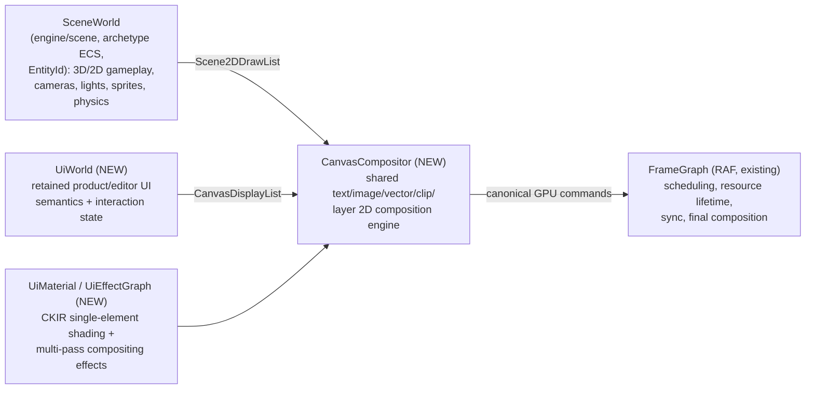
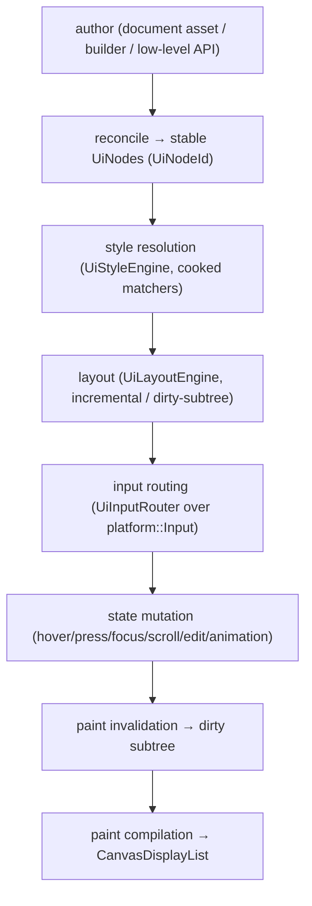
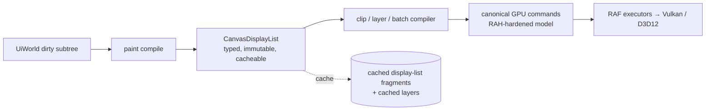
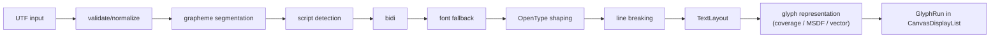
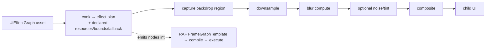
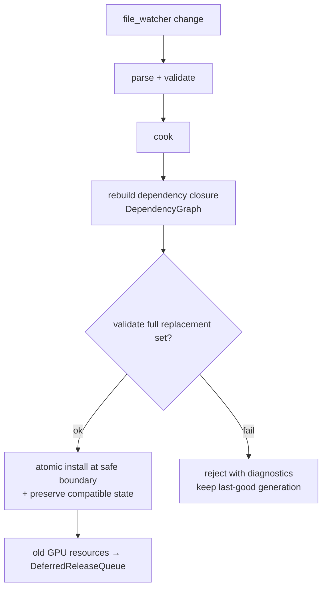

# ADR-0107 — Interactive UI + 2D rendering architecture: `UiWorld`, `CanvasCompositor`, and the paint-to-command seam

**Status:** Proposed (2026-08-07) — the **I2D-0** gate of the post-RAF **I2D band** (D-007 §UI/2D SUB-PROGRAMME, U-1…U-19).
The **bespoke retained UiWorld** decision (D2 — reuses ECS *concepts* only, `UiNodeId` ≠ `EntityId`) was user-chosen 2026-08-07,
superseding REN·B's "UI is ECS entities" premise. Independent design review cleared 2026-08-07 (RAH-1 seam consistent).
This ADR is the design gate that must be **reviewed and accepted before any I2D/SPR implementation**; I2D-1 (Canvas) also
depends on RAH-1 (typed attachments) + RAH-2 (resource-table bindless) landing first.
**Phase:** D-007 (post-RAF programme, I2D band). Source: `CRD_D007_UI_2D_MASTER_ROADMAP_PROMPT` (2026-08-07).
**Tags:** `[ui]` `[2d]` `[canvas]` `[text]` `[architecture]` `[frame-graph]` `[asset-driven]` `[cr-d007]`

---

## Context

Cerid has an asset-driven **render foundation** (RAF: authored `engine://frame/...` graphs, a canonical command model,
one live `crd-render-graph` runtime, dependency-aware hot reload — ADR-0106) but **no product/editor UI, no retained UI
model, no 2D compositor, no text stack, and no sprite/tilemap platform.** The next programme (D-007 §UI/2D SUB-PROGRAMME)
adds them. Before any code, the architecture must be locked, because the failure modes here are structural and expensive
to unwind later: collapsing UI into the gameplay ECS, an untyped command blob, a mini scheduler beside the frame graph,
"every UI element is a scene entity", or one giant universal 2D object type.

**What already exists (verified 2026-08-07, the seams we build ON, not around):**

- `engine/scene` — the gameplay world: an **archetype ECS** keyed by `crd::scene::EntityId` (`entity.hpp`), with
  components/queries/relations/commands. This is `SceneWorld`. It is the WRONG representation for a button, a table cell,
  or a node-editor socket.
- `engine/platform` — `Window` (a **single** OS window, GLFW-backed PIMPL: `framebuffer_size`/`window_size`, `native_handle`
  escape hatch; **no DPI-scale query, no multi-monitor, no docking**) and `Input` (a frame-coherent `InputState` snapshot +
  an optional ordered `InputEvent` queue; keyboard-subset + 5 mouse buttons + move + scroll + modifiers). Its comment is
  explicit: *"No propagation / consumption flags here; that responsibility lives in a future crd-app layer."* There is **no
  touch, pen/stylus, gamepad, IME, clipboard, or drag/drop.** The `UiInputRouter` **is** that future layer — it builds on
  `platform::Input`, it does not replace it.
- `engine/imgui` + `engine/perf-ui` + `engine/draw-imgui` — Dear ImGui debug UI. **Kept** as debug/recovery UI (§36). It is
  **not** the product/editor UI foundation, and it is **not deleted** when the new UI lands.
- `engine/draw` — debug visualization (`DebugLine`, `DebugText`, shapes, overlay pass). A **separate debug system**, not the
  `CanvasCompositor`. It renders developer overlays in world/screen space; it is not a retained 2D UI engine.
- `engine/anim` — animation primitives the UI transition/animation system shares (rather than re-inventing curves).
- `engine/render-asset-core` — the asset substrate the UI reuses wholesale: `AssetId`/`AssetRef` (`identity.hpp`,
  `engine://`/`app://` schemes), `InterfaceHash`/`ContentHash`/`Generation` (`cooked.hpp`), `DependencyGraph`
  (`dependency.hpp`), `DiagnosticList`/`DiagCode` (`diagnostic.hpp`). Plus RAF-11's `RenderAssetReloader` +
  `ReloadableVtbl` + `DeferredReleaseQueue` (transactional, last-good, deferred GPU destruction).
- `engine/frame-cook` + `engine/render-graph` — the RAF frame-graph runtime (`FrameGraphTemplate → compile → execute`,
  executors recording the canonical command model). `engine/material-cook` — MAT, the CKIR material cook.
- `engine/platform/file_watcher.hpp` — the file-change trigger for hot reload.

**No `Sprite`/`Glyph`/`FontAtlas`/`TextLayout`/`Canvas`/`UiNode`/`DisplayList` type exists anywhere** — the UI/2D core
concepts are genuinely new. This ADR defines their boundaries; it does not duplicate a concept under a new name.

---

## Decision

### D1 — Five distinct concepts; never collapsed into one world or renderer

The architecture explicitly separates five concepts that **share lower-level infrastructure but never merge**:

**Type-ownership table (the authoritative boundary — no responsibility appears twice):**

| Responsibility | Owner | Module | Notes |
|---|---|---|---|
| Gameplay entities, transforms, physics, scene culling | `SceneWorld` | `engine/scene` | `EntityId`; NOT a UI concern |
| Stable UI node identity + ordered tree | `UiWorld` | `engine/ui` (new) | `UiNodeId` (≠ `EntityId`) |
| Widget type/role, local+computed style, layout, interaction/animation/binding state, a11y semantics, paint invalidation, cached display-list fragments | `UiWorld` | `engine/ui` (new) | see D2 |
| Compiled backend-neutral paint (shapes/images/text/vector/clip/layer/filter) | `CanvasDisplayList` + `CanvasCompositor` | `engine/canvas` (new) | see D3 |
| Single-element programmable shading + interface/effect metadata | `UiMaterial` | `engine/ui-material` (new, cooks via MAT/CKIR) | see D5 |
| Multi-pass compositing effects (glass/blur/glow) | `UiEffectGraph` | compiles to RAF frame graph | see D5 |
| Scheduling, resource lifetime, sync, transient aliasing, final composition, backend command recording | `FrameGraph` | `engine/render-graph` (RAF) | UI/Scene2D are ordinary participants |
| OS window + raw input | `platform::Window` / `platform::Input` | `engine/platform` (existing) | UI input router builds ON this |
| Asset identity/cook/hash/dependency/reload/diagnostics | render-asset-core + RAF-11 reloader | `engine/render-asset-core` | reused, not re-invented |

**⛔ The rule (recorded verbatim, D-007 U-1):** *A game menu, HUD, inventory, settings screen, dialogue panel, editor
panel, tooltip, tree view, and text field are UI even when their appearance uses sprites or animated images.* A sprite is
visual content; UI adds layout, interaction, focus, navigation, accessibility, localization, persistent state, semantics,
binding, input capture, scroll, and modal behaviour. The same low-level image quad may paint both a UI icon and a game
sprite; their higher-level semantics differ.

### D2 — `UiWorld` is a dedicated retained world, NOT the gameplay ECS

**⛔ Rejected: "every UI element is a normal `SceneWorld` entity."** A button, text fragment, table cell, menu entry, or
node-editor socket must **not** be forced into the archetype ECS. Instead a dedicated retained **`UiWorld`** is defined.
Internally it may use data-oriented pools / archetype-like storage / sparse sets (Cerid infra); externally it exposes UI
concepts: `UiNodeId` · `UiDocumentHandle` · `UiWorld` · `UiNode` · `UiComponentStorage` · `UiTree` · `UiFocusManager` ·
`UiInputRouter` · `UiLayoutEngine` · `UiStyleEngine` · `UiAccessibilityTree`.

**`UiNodeId` is stable and entity-like but is a DISTINCT type from `crd::scene::EntityId`** — the two identity spaces never
alias. **`UiWorld` OWNS:** stable node identity · parent/ordered-child relations · widget type/role · local+computed style ·
layout input+computed layout · visibility · enabled/disabled · hover/pressed/selected/checked/focused · text-edit state ·
scroll state · drag/drop state · animation state · binding state · accessibility semantics · paint invalidation · cached
display-list fragments · event-routing metadata. **`UiWorld` does NOT own:** Vulkan/D3D12 objects · scene culling · physics
· gameplay transforms · frame-graph scheduling · backend command recording (all behind `CanvasCompositor`/RAF).

### D3 — `CanvasDisplayList`: a typed, backend-neutral, compiled paint representation

**⛔ The UI renderer must NOT traverse `UiWorld` and issue backend commands.** An explicit compiled paint representation is
interposed: **`CanvasDisplayList`** — backend-neutral · ordered · compact · immutable during execution · frame-arena/cache
friendly · independent of `UiWorld` pointers · usable by BOTH a CPU-reference path and GPU rendering · validatable ·
serializable for capture/debug. Typed command variant (exact types may differ; **not** an untyped blob; **no** Vulkan/
D3D12 structs; **no** widget semantics inside a Canvas command): `SolidRect · RoundedRect · Border · ImageQuad ·
SpriteQuad · NinePatch · GlyphRun · PathFill · PathStroke · GradientFill · BoxShadow · InnerShadow · CustomMaterialDraw ·
PushTransform/PopTransform · PushClip{Rect,RoundedRect,Path}/PopClip · BeginLayer/EndLayer · ApplyFilter`.

**THE SEAM (this is the load-bearing boundary):** `CanvasDisplayList` → a clip/layer/batch compiler → **the RAH-hardened
canonical GPU command / resource / attachment / binding model**, recorded through RAF executors. This ADR does **not**
define that command model — it is being hardened in parallel by the RAH-0 canonical-model audit
(`docs/systems/rah-0-canonical-model-audit.md`) and the RAH-1/RAH-2 slices. The Canvas layer targets the RAH model as-is;
concretely, **I2D-1 (Canvas MVP) cannot begin until RAH-1 (typed attachments) and RAH-2 (resource-table bindless) land**,
because the compositor must lower into typed attachments + a resident resource table, not the current fixed
`color1..3`/`input0..7` role-bit arrays. Scene sprites flow the same way via a parallel `Scene2DDrawList` → the same batch
compiler → canonical commands.

### D4 — Three authoring paths, one `UiWorld`

All three converge on the same retained structures and behaviour:

1. **Declarative UI document assets** — `engine://ui/document/property-inspector`, `app://ui/document/main-menu`, … carrying
   hierarchy · widget types · stable local IDs · classes · style refs · bindings · templates · events/commands ·
   accessibility metadata · animation refs.
2. **C++ builder / reconciliation API** — an immediate-*feeling* surface that **reconciles stable retained nodes**: it
   resolves stable IDs and deterministically creates/updates/removes `UiNode`s. **⛔ It must never mint fresh identity every
   frame** (that would defeat retention, break focus/scroll/animation state, and thrash caches).
3. **Low-level `UiWorld` API** — advanced apps create/modify nodes directly.

### D5 — Style / `UiMaterial` / `UiEffectGraph` are distinct layers with declared contracts

- **Style** is a typed, deterministic, CSS-*inspired* system (NOT a browser clone). Selectors + pseudo-states are **cooked
  into compact matching structures** (⛔ no per-frame string-selector evaluation); typed layout/paint/behaviour properties;
  design tokens; deterministic cascade/inheritance; transitions. Owner: `UiStyleEngine`.
- **`UiMaterial`** is a **CKIR-backed** single-element shader asset (`engine://ui/material/{solid,image,text,glass,outline}`,
  `app://ui/material/...`) that **must declare a strict interface contract** — inputs (local pos/UV, element size/bounds,
  screen pos, device-pixel ratio, time/frame, hover/pressed/focus/disabled amounts, pointer pos, theme values,
  texture/mask/backdrop, custom params) **and effect metadata** (premultiplied, blend mode, required visual-overflow
  margin, requires-backdrop, requires-offscreen-layer, time-dependent redraw, required texture bindings, cacheability,
  clip interaction, color-space contract). The compositor uses the metadata for dirty bounds, culling, layer allocation,
  cache invalidation, frame-graph deps, and diagnostics. **⛔ A shader may not emit effects outside its declared bounds
  without informing the compositor.** It cooks through MAT/CKIR — no new shading language.
- **`UiEffectGraph`** is an asset for **multi-pass** effects (frosted glass, backdrop blur, Kawase/multi-pass glow, bloom,
  distortion/refraction, chromatic separation, hologram, masked reveal, complex drop shadows) that **compiles to RAF
  frame-graph work — it reuses the frame graph, it does NOT create a mini scheduler.** It declares required input
  resources, output format, temporaries, bounds expansion, quality tiers, capability requirements, explicit fallback,
  cache policy, update policy. Classification **A+R**; it is the UI-facing analogue of an RPL frame graph.

### D6 — UI and Scene2D are ordinary frame-graph participants

Compose UI in a **defined linear working color space**; apply the display transfer/OETF **exactly once**; preserve HDR/SDR
correctness. Declare all resource dependencies; use RAF transient aliasing; prefer **bounded regional effects over
full-screen copies** (e.g. glass captures only the backdrop region); select quality/fallback paths explicitly. There is no
separate "UI pass" outside RAF — UI and Scene2D are graph nodes like any other.

### D7 — Asset taxonomy, diagnostics, and maturity reuse existing systems

- **Asset taxonomy** under the existing `AssetId`/`AssetRef` scheme: `engine://ui/{document,material,effect,theme,
  stylesheet,font,icon,animation}/...`, `engine://sprite/...`, `engine://tilemap/...`, `engine://frame/sprite_*` (2D
  renderers are ordinary RAF frames). Apps mirror under `app://...`.
- **Diagnostics** extend the existing `DiagnosticList`/`DiagCode` (render-asset-core) with typed UI/2D domains (doc parsing,
  selector/property, layout cycles, missing fonts, shaping failures, missing glyphs, material-contract mismatch,
  effect-graph, invalid clips/layers, atlas packing, sprite/tilemap refs, accessibility/localization omissions, hot-reload
  compatibility, GPU failures) — each carrying asset id/path, source location, node/widget id, property, expected/actual
  type, dependency chain, human message, and a **stable error code**. No parallel diagnostics system.
- **Maturity** uses the same L0–L7 model and A/A+R/A+E/B/T classification as the post-RAF programme, recorded in
  `docs/capabilities/gpu-platform-capabilities.toml`. **⛔ A UI feature is not complete because a shader exists.** Nothing
  exceeds **L5** today; **L6 is defined by CR-D007 inspection/authoring** (below).

### D8 — CR-D007 reconciliation, ImGui coexistence, and the easter egg

- **CR-D007 bootstrap early (§35):** `Canvas MVP (I2D-1) → Text MVP (I2D-2) → UiWorld MVP (I2D-3) → CR-D007 bootstrap
  (I2D-4) → build the rest of the UI/editor tech inside CR-D007.` Do not finish all UI technology before starting the editor.
- **D7E is reframed, not duplicated:** the post-RAF D7E band no longer builds its own UI. Its editor domains (frame-graph /
  material / CKIR / geometry graph editors; the frame/resource/program/material/hot-reload inspectors; capture/regression/
  profiling) are delivered as **I2D-9 flagship widgets on the CR-D007 shell (I2D-4)**. D7E therefore = the *domain contracts*
  those widgets satisfy, and it **defines the L6 bar** (a feature is L6 only when authorable/inspectable/hot-reloadable
  through these public systems).
- **ImGui coexists (§36):** Dear ImGui / the current debug path remains for bootstrap, debug overlays, GPU diagnostics,
  recovery, emergency asset errors, low-level dev panels, and tests. It is neither the product UI nor deleted.
- **Easter egg preserved (D-007 §Lore):** on first boot CR-D007 prints, to the effect of, *"Agent 007 — licensed to
  compute." 🍸* — used tastefully.

---

## Lifecycle diagrams

**UiWorld lifecycle** (authoring → retained tree → frame update → paint):

**Paint-compilation lifecycle** (the seam to canonical commands):

**Text lifecycle** (staged; `TextLayout` independent of glyph representation):

**UiEffectGraph → frame-graph lifecycle** (glass example; reuses RAF, no mini scheduler):

**Hot-reload lifecycle** (reuses RAF-11 `RenderAssetReloader`; transactional, last-good, deferred destruction):

State preserved across a compatible reload: text cursor, focus, scroll, expanded tree items, dock layout, selection, and
compatible animation progress.

---

## Consequences

**Positive.** UI, editor UI, game UI/HUD, and 2D games share one asset/hot-reload/frame-graph/diagnostics/backend-neutral
foundation without confusing UI semantics with gameplay entities or sprite visuals. The `CanvasDisplayList` seam lets a CPU
reference path, golden-image tests, headless capture, and both GPU backends consume identical paint. Reusing render-asset-
core + the RAF-11 reloader means UI hot reload is transactional and last-good from day one, with no parallel machinery. The
five-concept split makes the §37 architecture traps hard to fall into by construction.

**Costs / obligations.** A new retained `UiWorld`, a `CanvasCompositor`, a staged text stack, a vector renderer, a style
engine, and a widget library are large new modules. The compositor is **blocked on RAH-1/RAH-2** (typed attachments +
resource-table bindless) — I2D-1 cannot start until those land. `platform::Input` must grow (or be wrapped) to reach
touch/pen/gamepad/IME/clipboard/drag-drop and an event-propagation model; `platform::Window` must grow multi-window /
docking / per-monitor DPI (I2D-8, §20). ~~Text ownership (shaping/font parsing vs. an external library) is deferred to
I2D-2~~ **RESOLVED (2026-08-07, D-007 §U-20 / REN-12 lineage): Cerid OWNS the font+shaping stack (`crd-font`, HarfBuzz-class;
FreeType/HarfBuzz = test oracles only)** — the codec doctrine; the I2D-2 conformance plan uses the Unicode UAX test files.

---

## Alternatives considered (rejected)

- **UI on the gameplay ECS** — rejected (D2): forces scene-entity overhead + identity onto every socket/cell; wrong lifetime
  and query model; the §37 canonical trap.
- **Immediate-mode-only UI (extend ImGui as the product UI)** — rejected: no retained semantic state (focus/scroll/edit/
  a11y/binding); ImGui stays as debug/recovery (§36).
- **UI renderer traverses `UiWorld` and records backend commands directly** — rejected (D3): no CPU path, no caching, no
  capture, backend leakage; the `CanvasDisplayList` interposition is mandatory.
- **A separate UI mini-scheduler for effects** — rejected (D5): `UiEffectGraph` compiles to the RAF frame graph.
- **One universal 2D object type / untyped command blob** — rejected (D1/D3): typed nodes, typed commands.

---

## Open questions (resolved before or during the named slices, not now)

1. **Text ownership** — Cerid-owned shaping/font-parsing vs. an approved external library (HarfBuzz-class), with a
   conformance/golden plan. → I2D-2 / I2D-6.
2. **`platform` growth** — event-propagation model, touch/pen/gamepad/IME/clipboard/drag-drop, multi-window/docking/
   per-monitor DPI. This ADR fixes that the `UiInputRouter`/windowing layer OWNS routing/capture/focus above `platform`; the
   platform extensions land with I2D-8 (§14/§20). → I2D-3 (basic) / I2D-8 (full).
3. **Exact `CanvasCommand` set + `UiMaterial` interface struct** — refined against the RAH-hardened command model at I2D-1.
4. **Vector renderer split** (GPU compute-first vs. CPU/hybrid fallback boundaries) — I2D-7 (CPU/hybrid is an intentional
   fallback/export path, not only a test oracle).

## Gate (I2D-0 definition of done)

This ADR + the type-ownership table (D1) + the lifecycle diagrams (above) satisfy the I2D-0 gate, and **no ambiguous "all
UI is a scene entity" statement remains** (D2 rejects it explicitly). Acceptance of this ADR unblocks I2D-1 (subject to
RAH-1/RAH-2). Until then, **no I2D/SPR implementation** proceeds.
