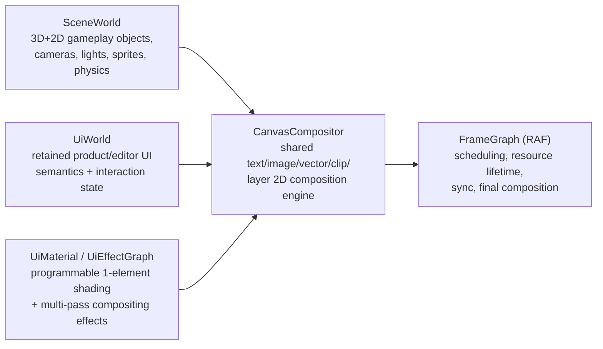
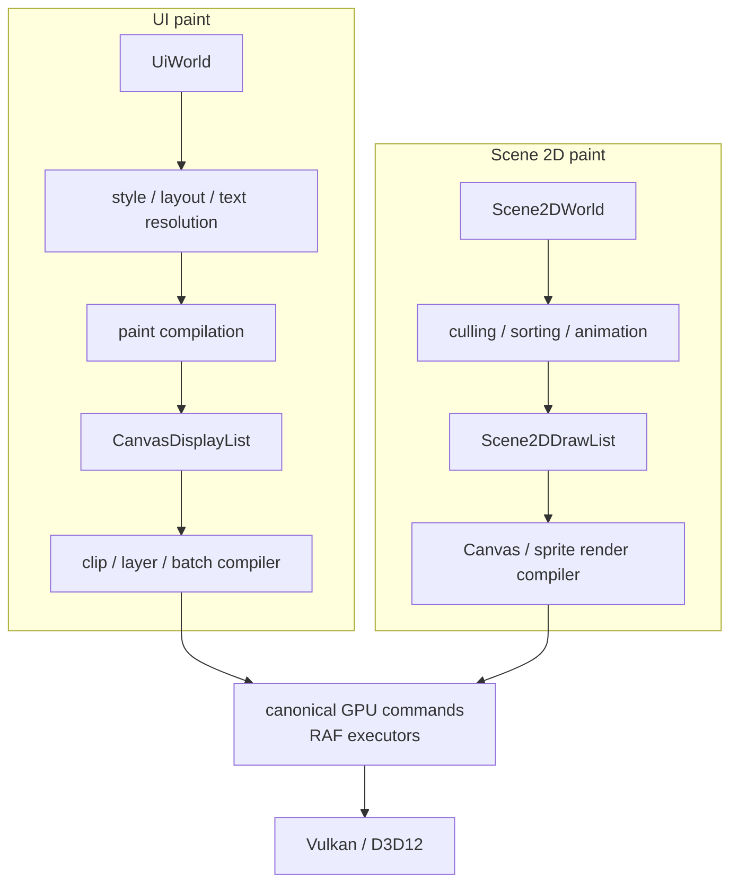
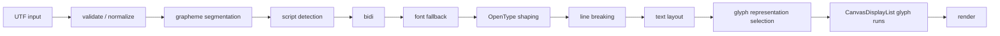

# Inherited renderer and UI requirements

<!-- doc-role: contract -->
> Current shared contract; status lives in ROADMAP. Current work: [ROADMAP](../ROADMAP.md); current rules: [AGENTS](../../AGENTS.md).

This is a **reference catalogue**, not a tracker. Order, current state and subslices live only in
[ROADMAP](../ROADMAP.md#master-table). The [execution contract](renderer-ui-execution-contract.md) supplies current
ownership, staging and acceptance rules. The [audit](../research/2026-09-12-system-audit.md) records corrections.

The PR-7 and U-1…20 requirements below were consolidated from D-007 without dropping feature scope. Historical
prior-art assertions require fresh evidence before being used as completion claims. The current user order is the
entire renderer library → full UI/CR-D007 → hesap/notebook → media/remaining work. Thus the old instruction to start
CR-D007 early means early **inside the UI programme**, after the renderer gate. CEIR L0–L8 and RAF L0–L7 are different
axes; the capability manifest and CEIR-35 decisions determine their actual meaning. C2 closed schemas, not widgets.

MED-1…12 are the original codec slices. MED-GPU-0…3 are the distinct post-RAF media architecture contracts; this
disambiguates their former duplicate IDs. Dated codec patent/royalty assertions below are unverified historical
statements, not a current distribution decision. MED-REVIEW must resolve the contradictory codec scope before work.

## PR-7. Band contracts, DoD, and prior-art anchors

Each band: **purpose · classification · prior art already in-tree (the L1/L2 head-start) · sub-band taxonomy · DoD.**
The sub-band bullets ARE the closed taxonomy; per-feature maturity/evidence lives in the registry.

### RAH — Render Architecture Hardening (FIRST executable band)
*Prior art / gaps found in audit:* the executor schemas use **fixed small slot arrays** — `input0..7`, `color1..3`,
`storage0..3` (`executor_registry.cpp`) — and the descriptor **cap=8** scar (`feedback_ckir_gpu_dispatch_binding_cap_and_sort_unroll_explosion`);
program reload is a **hand-maintained ~40-cache retire-all** (`scene_renderer.cpp`, the RAH-7 target). These are exactly
the "historical test limits masquerading as public contracts" RAH removes.
- **RAH-0** canonical-model audit: inventory every command/resource/pass field; flag renderer-family-specific fields, backend/untyped escape hatches, bounded test-limit capacities, duplicate notions of RT/G-buffer/visibility/view/geometry/indirect-args; old/current/target ownership diagram. **DoD:** reviewed design note names every breaking change, proves no shipped asset/mechanic is lost.
- **RAH-1** general typed attachment model (arbitrary color spans; f/i/u formats; typed clear union; load/store; depth+stencil independent; read-only depth/stencil; mip/layer/aspect/array/cube views; multiview; per-attachment resolve + modes; MSAA; shading-rate; foveation seam). Visibility/primitive-id/object-id/barycentric/G-buffer become **ordinary typed attachments, not boolean modes**. **DoD:** all existing color/depth/MRT/visibility/velocity/G-buffer/MSAA/selection paths migrate with no special low-level flags; both backends + golden pass.
- **RAH-2** complete resource-view + binding model (UBO; raw/structured/typed storage; RO/RW views; offset/range/stride/align; sampled/storage images; texel buffers; samplers + comparison; AS; runtime-sized arrays; BDA; coherent/atomic intent; stage visibility; immutable tables; **resident global resource-table bindless with compact stable indices + lifetime/residency** — replacing the fixed small pointer arrays). **DoD:** a shader binds arbitrary validated combinations without a new backend virtual; bindless stress exceeds production counts + lifetime tests.
- **RAH-3** strong geometry/command variants (procedural/vertex-stream/indexed/pull/meshlet/patch/curve geometry; draw / indexed / indirect / indexed-indirect / indirect-count / mesh-task / indirect-mesh / patch / work-graph). Remove backend pointer payloads + boolean bags. **DoD:** invalid combos unrepresentable or rejected pre-record; existing direct/indexed/indirect/mesh/tess gates stay green.
- **RAH-4** production RT model (RT program/pipeline assets; multi raygen/miss/hit-group; triangle + procedural hit; CH/AH/intersection/callable; payload/attr/recursion contracts; SBT sections/records/local params/strides; inline + pipeline; BLAS/TLAS build/update/refit/copy/compaction; instance masks/flags/transforms; procedural AABBs; curves/hair seam; opacity micromaps; displacement/micro-mesh seam; serialize/capture; capability/fallback). **DoD:** a multi-material scene with multiple miss/hit groups + procedural geometry + dynamic refit renders both backends; SBT/AS validation clean.
- **RAH-5** transfer/sparse/streaming family (buffer↔buffer/image regions; mip/layer/aspect; copy vs blit vs resolve; mip-gen; staging up/readback; sparse/tiled residency; page map/unmap; up/readback queues; media interop; queue/ownership transitions). **DoD:** texture/geometry-page streaming + readback + media upload use canonical commands, no hidden backend calls.
- **RAH-6** program-contract-aware runtime validation (all required bindings present; no illegal dups; type/frequency/array-length/range/alignment/usage match; texture kind/aspect/format-class; comparison-sampler↔depth; stage visibility; FS outputs↔attachments; geometry↔stage-family; declared↔recorded accesses; indirect-arg/count ranges; capabilities; no illegal aliasing). Cook/install validates immutable contracts; per-frame validates dynamic values only.
- **RAH-7** dependency-driven **Program Registry** (retire the hand-list; keyed by stable program/variant identity; propagation shader-module → interface → technique → material → variants → pipelines → dependent graphs; granular invalidation; atomic install; last-good; deterministic keys; no pointer identity; dep-chain diagnostics; **no full-scene reinit for a local edit**). *This is the new home of `scene_renderer.cpp`'s ~40-cache retire-all.*
- **RAH-8** capability registry + feature manifest (unify device/backend caps + feature-maturity registry + asset requirements + fallback + test evidence + editor presentation).
- **RAH DoD:** no renderer-specific special case in the canonical command model; views/bindings production-complete for later bands; RT + transfer support later systems without redesign; program reload dependency-driven; feature claims machine-readable + CI-gated.

### RPL — Renderer Pipeline Proof Library
*Prior art:* B8-a..l gold-standard lighting/shadow MATH is ✅ bit-exact CKIR (L1 for the whole family); forward/mesh/tess/
visbuffer frames already ship (L5). RPL turns "expressible" into shipped, hot-reloadable, both-backend proof.
Each renderer needs: `engine://frame/...` asset + resource/pass diagram + representative material/scene + Vk+DX12 visual
gate + golden/cross-backend where deterministic + hot reload of frame/shader/technique/material + capability+fallback +
CR-D007 inspection schema + debug modes + perf counters.
- **RPL-0** minimal/diagnostic: unlit · depth-only · object/primitive/material-ID · wireframe · normals/tangents/UV · overdraw · headless/offscreen · scientific scalar-field view.
- **RPL-1** forward family: basic · shadowed · **Forward+ tiled** · clustered · clustered+transparent · MSAA · reduced-feature · editor viewport · XR/multiview.
- **RPL-2** deferred family: classic G-buffer · tiled · clustered · deferred-opaque+forward-transparent · decals · deferred texturing · light-volume vs fullscreen/compute lighting · compact/extended G-buffer · bandwidth debug.
- **RPL-3** visibility-buffer: vis-ID+barycentric/depth raster · compute material resolve · compute lighting · material/shading binning · derivative/LOD reconstruction · alpha-test policy · motion vectors · transparent forward companion · GPU-driven draw integration.
- **RPL-4** hybrid raster/RT: raster + RT shadows / reflections / RTAO / RTGI · visibility + RT effects · explicit SS/probe/RT fallback chains · denoise + temporal reuse.
- **RPL-5** full RT & reference: lit full-image RT · interactive PT · **unbiased reference PT** · denoised realtime PT · scientific ray/volume caster · AOV/debug.
- **RPL-6** nontraditional: CAD/technical · point cloud · voxel · volume · stylized/NPR · checkerboard/interleaved · RTT/cubemap capture · custom application renderer sample.
- **RPL DoD:** users move among major architectures by selecting/composing assets, not editing engine renderer code. *(The proof-quartet — Forward+, classic deferred, raster+RT hybrid, lit full RT — is the first RPL milestone; §PR-9.)*

### GVA — Geometry, Visibility, Animation *(A+R)*
*Prior art:* REN-39 indexed-pull vertex reuse, F7 procedural-vertex vocabulary, F16 amplification, GPU-cull frames, skinning MATH (B8-j LBS+DQS ✅), REN-38 bindless multi-draw — all in-tree.
- **GVA-0** static completeness (indexed/non-indexed · multi-stream · multi-material sections · per-instance transform+material · hw instancing · multi-draw · indirect/indirect-count · bindless geometry/material tables · negative-scale/winding · double-sided/alpha-test · robust tangents/normals).
- **GVA-1** draw-list + culling (CPU/GPU frustum · HZB occlusion · instance/small-primitive/backface-cone cull · LOD/SSE · impostors · command compaction · material/pipeline sort · binning · visibility history · streaming-aware cull · debug heatmaps/reason codes).
- **GVA-2** animation/skinning (skeleton+anim assets · LBS · DQS · VS/compute skinning · skin cache · rigid/skinned phase · prev-frame positions · skinned motion vectors · shadow/depth/vis/RT consistency · crowds).
- **GVA-3** morph/deformation (morph targets · correctives · VAT · procedural CKIR deform · wind · cloth/soft-body output consumption · neural deform · composition order · bounds · BLAS refit policy · motion-vector correctness).
- **GVA-4** mesh/task/tessellation (task+mesh · meshlet contract · indirect mesh · hw tess · adaptive tess · displacement/vector displacement · crack-free boundaries · compute-tess fallback · terrain/subdivision).
- **GVA-5** special domains (curves/hair · ribbons/trails · particles · terrain/heightfield · foliage · point clouds/splats · sparse voxels · implicit/SDF · marching cubes/dual contouring · CRD-Geometry procedural).

### LSH — Lighting & Shadows *(A/A+R)*
*Prior art:* B8-c punctual, B8-d LTC area (rect/disk/sphere/tube + aniso), B8-g PCF/PCSS/EVSM/MSM, B8-h stable CSM + SDSM, B8-i contact + VSM addressing, B8-e IBL split-sum — all ✅ bit-exact CKIR (L1). ReSTIR-DI gold core in-tree.
- **LSH-0** light data model (directional/point/spot/rect/disk/sphere/tube/mesh-emissive/environment · IES · cookies · channels/masks · volumetric-only · static/mixed/dynamic · physical units + exposure).
- **LSH-1** assignment/culling (object lists · Forward+ tiles · clustered 3D grid · tiled/clustered deferred · depth-aware bounds · large/global lights · overflow policy · compact lists · bindless light data · debug · worst-case stress).
- **LSH-2** shadow-map families (hard · stable CSM · SDSM · PCF · PCSS · VSM · EVSM · MSM · point cubemap · spot · area approx · contact/SS-contact · cached/static · alpha-test/transparent policy · colored · atlas alloc/defrag · receiver/caster masks · debug).
- **LSH-3** virtual shadow maps (page layout · requests · residency/cache · directional clipmaps · invalidation · VGE integration · nonvirtual fallback · filtering · budgets).
- **LSH-4** area & stochastic direct (LTC + textured area · mesh-light extraction/sampling · importance/reservoir sampling · **ReSTIR-DI** temporal/spatial reuse · stochastic many-light/MegaLights-class · RT visibility · denoise · disocclusion · deterministic reference).
- **LSH-5** ray-traced shadows (hard/soft · alpha-test/opacity · area sampling · hybrid fallback · reservoir reuse · denoise · animated · foliage/hair policy).

### ARG — AO, Reflections, GI *(A+R)* → ends in a **Lumen-class hybrid**
*Prior art:* SVGF gold denoiser, DDGI gold, ReSTIR gold, NRC functional core — all CKIR in-tree (L1/L2 heads).
- **ARG-0** AO: SSAO · HBAO · GTAO · CACAO-class compute AO · bent normals · multi-bounce approx · temporal AO · RTAO · hybrid SS+RT · presets/debug.
- **ARG-1** reflections: static cubemaps · probes · box projection · planar · SSR · hierarchical/rough SSR · stochastic SSSR-class · RT reflections · hybrid SSR→probe→RT fallback · multi-bounce/reference · roughness-aware denoise · transparent/refraction policy.
- **ARG-2** baked/probe GI: lightmaps · irradiance probes · reflection captures · volumetric light fields · **DDGI** · probe relocation/classification · scrolling volumes · dynamic object integration · bake/import/debug.
- **ARG-3** screen-space/cache GI: SSGI · radiance cache · surfel cache · screen-probe gather · temporal/spatial reuse · history/disocclusion · probe/env fallback.
- **ARG-4** distance-field/voxel GI: mesh/global SDF · sparse DF · clipmaps · Brixelizer-class sparse SDF · voxel cone tracing · sparse voxel/radiance · SDF AO/shadows · foliage/alpha cache · animated update · diffuse+specular · debug.
- **ARG-5** hardware-RT GI: single-bounce RTGI · multi-bounce/reference · irradiance/radiance-cache integration · **ReSTIR-GI** resampling · probe-guided sampling · denoise · transparent/emissive policy · dynamic geo/light.
- **ARG-6** **Lumen-class hybrid** (a coordinated architecture, NOT one shader): screen traces · software-trace rep · hw-RT path · surface/material cache · card/surfel rep · radiance cache · reflection + diffuse paths · scene update/invalidation · VGE integration · foliage/transparent policy · emissive · quality tiers · explicit fallback selection · diagnostics · budgets. Cerid-native, same *class* of scalable hybrid capability — not an Unreal-internals copy.

### RTX — Ray/Path Tracing platform *(A+R/B)*
*Prior art:* B9/C3 frontier rows (SER, opacity micromaps, LSS ray-traced curves/spheres, cluster AS/DGF), the offline OFF-1..9 path-tracing band (BDPT/VCM/guiding/MLT/spectral/reference volumetrics), hair-RT renderer — all in-tree design/math.
- **RTX-0** scene AS runtime (static BLAS cook · dynamic update/refit · TLAS instance mgmt · compaction · streaming/residency · skinned/deformed policy · VGE RT rep · procedural · curves/hair · opacity · debug + memory accounting).
- **RTX-1** hybrid effect library (shadows · AO · reflections · diffuse GI · translucency/refraction · contact · ray-query + pipeline variants · screen/probe/raster fallbacks).
- **RTX-2** denoising platform (temporal accumulation · moments/variance · spatial filters · disocclusion · motion vectors · normal/depth/material guides · shadow/reflection/GI-specific denoisers · NRD/plugin seam · reference comparisons).
- **RTX-3** path tracing (unbiased reference · MIS · direct lighting · emissive/mesh lights · env sampling · BSDF sampling all materials · volumes · transparent media · spectral seam · ReSTIR-PT seam · AOVs · accumulation/checkpoint · deterministic regression scenes). *Consolidates with OFF-1..9.*
- **RTX-4** advanced primitives (micro-mesh/displaced micro-mesh · opacity micromaps · procedural/intersection shaders · hair/curve primitives · neural/compressed geometry seam).

### MAT — Materials & Shading *(A)*
*Prior art:* the CKIR material→surface contract (B6 MaterialX node library, B7 lowering, B8 gold renderer), OpenPBR slab (B5), thin-film/transmission/SSS lobes — all ✅ math in-tree.
- **MAT-0** architecture hardening (definition vs instance · surface contract · technique contract · phase compatibility · static options vs dynamic params · deterministic bounded variants · inheritance/composition · subgraphs/functions · per-instance overrides · dependency-driven reload · **MaterialX import/export + OpenPBR profile** · graph source mapping/diagnostics).
- **MAT-1** general surface library (unlit · metallic-roughness · specular-glossiness · OpenPBR standard surface · emissive · opacity modes · normal/bump/parallax · displacement/vector displacement · decals · lightmaps · baked/procedural inputs).
- **MAT-2** layering & optics (layers · masks/blending · clear coat · sheen/fuzz · anisotropy · thin-film/iridescence · transmission · refraction · absorption · thin-walled/solid media · SSS · energy conservation/compensation · spectral seam).
- **MAT-3** specialist domains (skin · eye · hair/fur · cloth/velvet · water/ocean · glass · foliage · terrain/layered · snow/wetness/dust/weathering · particles · volume media · scientific scalar/vector/tensor · CAD/technical).
- **MAT-4** NPR/stylization (toon/cel · Gooch · outlines · hatching · halftone · painterly · matcap · light ramps · stylized shadows · procedural illustration · mixed PBR/NPR).
- **MAT-5** microgeometry policy (macro=authored geometry · meso=virtual geometry/tess/displacement · micro=normal/roughness distributions; bump/normal/parallax are options, not substitutes where silhouette/contact/shadow/RT need real shape).

### TPR — Temporal, Post, Resolution *(A)*
*Prior art:* the TAA motion-vector + velocity contracts (⛔ scars in memory), FFT bloom, AgX/sRGB tonemap — all in-tree.
- **TPR-0** canonical temporal contracts (jitter · current+previous transforms · rigid/skinned/morph/procedural motion vectors · camera cuts · history invalidation · disocclusion · reactive masks · transparency masks · exposure history · ping-pong · dyn-res-aware history · per-feature history ownership).
- **TPR-1** AA/reconstruction (FXAA/SMAA · MSAA · TAA · TAAU · TSR-class · FSR seam · DLSS/XeSS/plugin seam · frame-gen seam · ray-reconstruction/neural-denoise seam · sharpening · presets).
- **TPR-2** tone/color/display (sRGB · AgX · ACES · custom filmic · auto-exposure/histogram · white balance · grading/LUT · lift/gamma/gain · HDR10/PQ · scRGB · wide-gamut · OpenColorIO seam · dithering · SDR/HDR UI compositing).
- **TPR-3** post library (bloom · FFT bloom/glare · lens dirt · DoF · motion blur · chromatic aberration · distortion · vignette · film grain · local tone mapping · CAS · edge detection · stylized · capture/AOV).

### VFX — Transparency, Particles, Atmosphere, Volumes *(A/A+R)*
*Prior art:* B17 OIT (two tiers + RTT-blend), atmosphere gold sky, clouds + oracle memo, ocean/FFT — all in-tree.
- **VFX-0** transparency (alpha test · alpha-to-coverage · sorted/premultiplied/additive/modulate · refraction · thin/thick transmission · transparent shadows/motion vectors · **WBOIT** · moment OIT · per-pixel linked lists · stochastic · depth peeling · hair/foliage policy · correctness+overflow gates).
- **VFX-1** particles (CPU+GPU emitters · spawn/update/compact/sort · sprites · mesh particles · ribbons/trails · volumetric · collisions · lighting/shadowing · indirect draw · deterministic replay · editor graph).
- **VFX-2** atmosphere/sky (physical atmosphere · sky model · sun/moon/stars · aerial perspective · LUT gen · weather params · env-lighting integration).
- **VFX-3** fog/clouds/volumes (height fog · local fog volumes · volumetric fog · froxel lighting · god rays · volumetric clouds · cloud shadows · sparse volume textures · smoke/fire · volume ray marching · temporal reprojection · RT interaction · debug).

### TXS — Textures, Streaming, Residency *(A+R/B)*
1D/2D/3D · arrays/cube arrays · cubemaps · MSAA images · full mip/layer/aspect views · sRGB/linear reinterpret rules ·
depth/stencil views · storage images · BC/ASTC/ETC + platform formats · transcoding · env-map filtering · mip-gen ·
streaming · **sparse/virtual texturing** · page tables/caches · feedback/sampler-feedback abstraction · residency/eviction ·
UDIM · procedural · blue-noise/sampling libs · streaming viz/budgets · **hot reload without invalid resource references**.
*Prior art: own-HDR-codec mandate; texture_resource/mesh_resource systems in-tree.*

### VGE — Virtualized Geometry *(A+R/B)* — Cerid-native **Nanite-class** (NOT "mesh shaders")
*Prior art:* F16 amplification, cluster mesh-shader REN-41 (both-backend L4), meshlet cook — in-tree heads.
- **VGE-0** offline cook (robust import · cluster/meshlet gen · hierarchy · simplification · geometric error metrics · quantization/compression · page packaging · material-section handling · displacement bounds · fallback reps · deterministic cook · validation/inspection).
- **VGE-1** streaming/residency (page store · async I/O · decompression · GPU upload · page table · requests/feedback · prioritization · budgets · eviction · temporal stability · editor viz).
- **VGE-2** runtime hierarchy/culling (instance hierarchy · frustum · occlusion/HZB · SSE selection · persistent visibility · streaming-aware fallback · cluster work compaction · indirect dispatch/draw gen · debug reasons/heatmaps).
- **VGE-3** rasterization (hw mesh/task · classic fallback · software raster for selected microgeometry · small-triangle strategy · depth/vis output · material binning · motion vectors · alpha-test policy · MSAA policy · both-backend validation).
- **VGE-4** shading/renderer integration (vis-buffer resolve · forward/deferred companions · material eval · shadows + VSM · decals · transparency boundary · temporal reconstruction · debug).
- **VGE-5** dynamic/displaced (animated instances · limited deformation policy · tessellated/displaced clusters · runtime cluster-gen research · terrain · procedural · raster/shadow/RT consistency).
- **VGE-6** RT representation (proxy/fallback BLAS · streamed BLAS · micro-mesh · displacement/opacity structures · update policy · Lumen/GI/shadow integration).
- **VGE DoD:** a large high-density scene streams, culls, shades, casts shadows, produces motion vectors, participates in hybrid RT within declared memory/perf/error budgets on both backends.

### CGP — Compute & General GPU Platform *(A)*
*Prior art (STRONG):* the AS auto-scheduler (GEMM at/above cuBLAS parity, flash-attention fusion, reduce autotuner), GM modules (transformer block from named CKIR fns), FFT (crushes cuFFT 4/5 regimes), scan/sort/reduce bit-exact — all ✅ in-tree. This band packages them as reusable workflow assets.
- **CGP-0** execution/scheduling (dispatch dims · indirect dispatch · async compute · queue ownership · subgroup/wave ops · barriers/memory model · persistent kernels where portable · work-graphs capability/fallback · coop matrix/vector capability · profiling/timestamps · cancellation/error reporting).
  - Compute backends are capability-gated across Vulkan, DX12 and CUDA. `engine/gpu-context-cuda` now exists; the August statement that CUDA was absent was stale. Selector/indirect/provider completeness is re-audited in CGP-0; existence is not blanket completion.

- **CGP-1** parallel primitives (reductions · scans · stream compaction · histograms · radix+comparison sorts · partition/select · gather/scatter · segmented ops · hash tables · work queues · graph traversal · deterministic + high-perf variants).
- **CGP-2** signal/image (convolution · separable filters · resampling · pyramids/mips · **FFT 1/2/3D** · spectral convolution · wavelets seam · morphology · distance transforms · image stats · color conversion · compression helpers).
- **CGP-3** geometry processing (normals/tangents · adjacency · meshlet/cluster · simplification · subdivision · tessellation · marching cubes · dual contouring · SDF gen · voxelization · point-cloud · surface reconstruction · BVH helpers · physics-viz geometry). *Feeds CRD-Geometry.*
- **CGP-4** general workflow assets (typed I/O · persistent/transient buffers · parameter blocks · subgraphs · dispatch policies · validation · deterministic cook · hot reload · headless execution · visualization taps · export/readback).

### HGP — CRD-Hesap GPU Completion *(A)* — the original reason D-007 began
Every op: correct CPU reference · CKIR impl · Vk+DX12 validation · tolerance/bit-exact policy · vendor/reference perf comparison · memory/workspace policy · composable graph asset · CR-D007/Matlab-like viz.
- **HGP-0** dense LA (BLAS 1/2/3 · GEMM variants · batched · triangular/symmetric/Hermitian · LU · QR · Cholesky · SVD · eigensolvers · mixed precision · iterative refinement). *Prior art: v17g GEMM cuBLAS parity ✅.*
- **HGP-1** sparse LA (formats · SpMV/SpMM · sparse triangular solve · preconditioners · CG/BiCGSTAB/GMRES · sparse factorizations · reorderings · inspection/viz). *Prior art: hesap-sparse/iterative/ordering in-tree.*
- **HGP-2** optimization (LP · QP · nonlinear · constrained · gradient methods · line-search/trust-region · least squares · autodiff integration · differentiable-opt seam).
- **HGP-3** DE/simulation math (ODE integrators · stiff solvers · DAE · PDE building blocks · FD/FV/FE primitives · spectral methods · event handling · adaptive stepping · parameter sweeps · live viz).
- **HGP-4** tensor + autodiff (N-D tensors · views/slices · broadcasting · reductions · einsum · gather/scatter · complex · forward AD · reverse AD · higher-order · GPU tape/checkpoint · viz).
- **HGP-5** statistics/workflows (descriptive stats · distributions · sampling · regression · PCA · clustering · Monte Carlo · signal analysis · interpolation · fitting · import/export · reproducibility).
- **HGP-6** Matlab/notebook app contract (REPL cells · workspace browser · tables · plots · 2D/3D viz · compute-graph inspection · CPU/GPU backend select · profiler · deterministic replay · export · CRD-Geometry/Eylem integration).

### MLR — ML/AI & Neural Rendering *(A+R/B)* — a coherent model/tensor/runtime layer sharing resources with CKIR
*Prior art:* C6 cooperative-vector device-enabled, NRC fused-MLP moat (2.37× cuBLAS), 3DGS 1080p — in-tree.
- **MLR-0** tensor/model asset system (tensor types/shapes/strides/layouts · quantized types · model-graph asset · weights asset · versioning/hashes · pre/post graphs · deterministic cook · ONNX seam · backend-neutral runtime · CPU reference · DirectML/vendor/plugin seam · CKIR-native small-model path · resource sharing with render graphs).
- **MLR-1** inference primitives (convolution · GEMM/MLP · attention · normalization · activation · embeddings · recurrent/stateful · sparse/MoE seam · quantization · mixed precision · **coop matrix/vector acceleration** · fallback kernels · profiling/validation).
- **MLR-2** neural rendering (upscaling · denoising · ray reconstruction · neural texture compression · neural materials/BRDFs · neural radiance caches · neural light-transport approx · NeRF/radiance fields · **Gaussian splatting** · neural scene reps · neural deform/animation · super-resolution for media/sci-data · deterministic quality/reference gates).
- **MLR-3** AI app workflows (vision · segmentation/detection · depth/normal estimation · pose/tracking · audio · speech/music analysis · simulation surrogates · optimization/control · agent-facing compute tools · local-model scheduling).
- **MLR-4** work graphs + future GPU execution (DirectX Work Graphs · portable emulation/fallback · coop vectors/matrices · shader execution reordering · neural shader delivery/caching · Vulkan equivalents · NPU interop) — **capability tiers + explicit fallbacks, never a vendor-only primitive exposed as universal.**

### MED — GPU Media & Compositing *(B/A+R)* — near-greenfield (only prior art: the own-HDR/EXR codec mandate)
- **MED-GPU-0** media data model (image frames · audio blocks · compressed packets · timestamps/time bases · color + HDR metadata · channel layouts · codecs/containers · deterministic ownership/lifetime · CPU/GPU surface interop).
- **MED-GPU-1** decode/encode (software fallback · Vulkan Video capability · DX12/vendor seams · codec set subject to MED distribution review (the older H.265 wording conflicts with the codec-band exclusion); AV1 + future per platform · image/audio codecs · zero/minimal-copy decode surfaces · encode from render targets · async queues · seeking/frame accuracy · error recovery).
- **MED-GPU-2** GPU processing (color-space conversion · chroma up/down · scaling · deinterlace · compositing · masks · keying · transitions · LUT/grading · denoise/sharpen · optical flow · interpolation · audio analysis/viz · render-graph integration).
- **MED-GPU-3** timeline/export (timeline assets · tracks/clips · image sequences · A/V sync · caching/proxies · preview renderer · final-quality export · cinematic integration · CR-D007 UI · future DAW/NLE/compositor). *Composes with the PLG audio-platform band.*

### D7E — CR-D007 Editor, Authoring, Inspection *(T)* — starts EARLY, matures alongside every band
> Lore preserved (see §Lore above): **the editor is CR-D007; on first boot it prints "Agent 007 — licensed to compute." 🍸**
Multiple **typed** graph domains over shared editor infra — NOT one giant untyped node graph.
- **D7E-0** common graph framework (typed ports · schema/versioned nodes · validation · subgraphs/functions · deterministic serialization · source mapping · undo/redo · copy/paste · diff/merge · search/palette · docs/tooltips · live diagnostics · preview values · hot reload · schema migration · agent-readable representation).
- **D7E-1** Frame-Graph editor · **D7E-2** CKIR Shader/Kernel editor · **D7E-3** Material editor (MaterialX/OpenPBR) · **D7E-4** Technique/Shading editor · **D7E-5** Geometry/Deformation editor · **D7E-6** Compute/Hesap workflow editor.
- **D7E-7** frame+resource inspector (pass DAG · culled passes · resource lifetimes · physical aliases · barriers/transitions · queue scheduling · injection origin · selected capability/fallback · GPU timing · image/buffer viewer · mip/layer/aspect · depth/normal/ID viz · histograms · NaN/Inf · motion vectors · light clusters · shadow pages/cascades · virtual-geometry pages · RT AS).
- **D7E-8** program/material inspector (CKIR · stage I/O · binding contract · active variant key · generated backend source in debug tools only · bytecode stats behind backend tooling · descriptor/register usage · pipeline-cache hits · dependency chain · compile/cook timings · material values + selected technique).
- **D7E-9** hot-reload inspector (changed source · recooked asset · affected dependency closure · old/new generation · rejected-replacement reason · last-good · deferred GPU deletion · timings · active renderer graph).
- **D7E-10** capture/regression/profiling (deterministic frame capture · resource dumps · graph/program/material snapshots · golden compare · backend differential · GPU crash breadcrumbs · perf capture · scripted scenes · automated reports · feature-maturity links).
> **L6 is defined by D7E:** no feature reaches L6 until it is authorable/inspectable/hot-reloadable through these public systems.

### PQP — Production Qualification & Platform Matrix
- **PQP-0** quality methodology (reference/path-traced compare · PSNR/SSIM/FLIP or perceptual · temporal stability · ghosting/disocclusion · noise/convergence · geometry/shadow error · material energy/BRDF checks · numerical tolerances · deterministic vs stochastic policy).
- **PQP-1** performance/budgets (per-pass GPU time · CPU recording · allocations · bandwidth · transient/persistent VRAM · descriptor/table use · pipeline create/cache · up/readback · streaming latency · shader compile/cook · hot-reload time · worst-case light/material/geometry counts). Every L7 feature declares target tiers + budgets.
- **PQP-2** validation/failure recovery (Vk validation clean · DX12 debug-layer clean · GPU-assisted validation · device-removal handling · breadcrumbs/dumps · missing/corrupt asset · failed reload · OOM · streaming failure · shader-compile failure · capability mismatch · soak tests).
- **PQP-3** platform/view matrix (Vulkan · DX12 · future Metal/WebGPU per policy · headless · multi-window · multi-viewport/camera · RTT · cubemap capture · split screen · stereo · multiview · XR · foveation · VRS · dyn-res · HDR/SDR · MSAA modes).
- **PQP-4** shipping/compat (cooked-asset versioning · cache invalidation · reproducible builds · shader/pipeline caches · package size · app/plugin isolation · backward-compat policy · deprecation · doc generation · sample apps).

### EYL — CRD-Eylem integration & visualization *(A+R)* — last; consumes the finished platform
Physics/sim exposed as **normal typed resources/assets** through the same frame-graph/material/compute/resource systems
(NOT a physics-only renderer): rigid-body state · contacts/manifolds · broad/narrow phase · constraints · forces/impulses ·
solver residuals · iteration convergence · energy/momentum diagnostics · soft bodies · cloth · fluids · particles · FEM/PDE
fields · deterministic replay · time scrubbing · frame/solver compare · plots + 3D overlays · GPU compute+render without
unnecessary readback · media export.

## U-1. The five concepts (never collapse them into one world/renderer)

They **share lower-level rendering infrastructure** (Canvas primitives, image/text/vector, the RAF command model) but are
**typed and distinct**. `SceneWorld` = gameplay (the ECS `engine/scene`). `UiWorld` = retained UI semantics (NEW). The
`CanvasCompositor` is the shared 2D engine both UI and scene-sprites use where semantics permit. `UiMaterial`/
`UiEffectGraph` are the programmable shading layer. `FrameGraph` schedules it — UI and Scene2D are **ordinary frame-graph
participants**, not a side renderer.

**⛔ THE RULE (record verbatim):** *A game menu, HUD, inventory, settings screen, dialogue panel, editor panel, tooltip,
tree view, and text field are UI even when their appearance uses sprites or animated images.* A sprite is **visual
content**; UI adds layout · interaction · focus · navigation · accessibility · localization · persistent state ·
semantics · binding · input capture · scroll · modal behaviour. The same low-level image quad may render both a UI icon
and a game sprite; their higher-level semantics differ.

**UI vs sprite decision table:**

| Thing | Representation | Rendered by | Why |
|---|---|---|---|
| Animated menu background | Scene2D / video / particles / 3D scene | scene renderer → offscreen | visual content, no interaction semantics |
| Logo | image/sprite content | CanvasCompositor `ImageQuad` | visual content laid out by UI |
| Play button | **UiNode** (text/image/material/style + behaviour) | UiWorld → Canvas | has focus/hover/press/activate semantics |
| Save-game list | **retained UI** (virtualized, focus, scroll, binding) | UiWorld → Canvas | persistent state + navigation + data binding |
| Character in a platformer | **Sprite** in Scene2D | SPR sprite renderer | gameplay visual, not UI |
| Inventory grid of item icons | **UiNodes** whose paint is sprites | UiWorld → Canvas | grid layout + selection + drag/drop = UI |

## U-2. UiWorld — a dedicated retained world (NOT the gameplay ECS)

**⛔ Do not force every button / text fragment / table cell / menu entry / node-editor socket to be a normal `SceneWorld`
entity.** Define a dedicated retained **`UiWorld`**. **⭐ Decision (user-chosen 2026-08-07, resolving the REN·B fork): the
UiWorld is a BESPOKE retained store** — it reuses ECS *concepts* (data-oriented pools / sparse-sets / archetype-like
storage) but **NOT crd-scene's ECS implementation**, and its change-detection / command-buffer-undo / layout-persistence
are its OWN mechanisms. This supersedes REN·B's earlier "UI IS ECS entities in the crd-scene machinery" premise (see the
struck REN·B block + §U-20). It externally exposes UI concepts: `UiNodeId` (stable, entity-like, **a distinct type from the
gameplay `EntityId` — the two identity spaces never alias**) ·
`UiDocumentHandle` · `UiWorld` · `UiNode` · `UiComponentStorage` · `UiTree` · `UiFocusManager` · `UiInputRouter` ·
`UiLayoutEngine` · `UiStyleEngine` · `UiAccessibilityTree`.

**UiWorld OWNS:** stable node identity · parent/ordered-child relations · widget type/role · local+computed style ·
layout input+computed layout · visibility · enabled/disabled · hover/pressed/selected/checked/focused · text-edit state ·
scroll state · drag/drop state · animation state · binding state · accessibility semantics · paint invalidation · cached
display-list fragments · event-routing metadata.
**UiWorld does NOT own:** Vulkan/D3D12 objects · scene culling · physics · gameplay transforms · frame-graph scheduling ·
backend command recording. (Those belong to gpu-context / RAF, kept behind the compositor.)

## U-3. Three authoring paths, one UiWorld

All three converge on the same retained structures/behaviour:
1. **Declarative UI document assets** — `engine://ui/document/property-inspector`, `app://ui/document/main-menu`, … carrying
   hierarchy · widget types · stable local IDs · classes · style refs · bindings · templates · events/commands ·
   accessibility metadata · animation refs.
2. **C++ builder / reconciliation API** — an immediate-*feeling* surface that **reconciles stable retained nodes** (resolves
   stable IDs; deterministic create/update/remove; ⛔ never mints fresh identity every frame): `ui.panel("Inspector")
   .column([&]{ ui.text("Transform"); ui.property_row("Position",[&]{ ui.vec3_field(model.position); }); ui.button("Reset")
   .on_click(reset); });`
3. **Low-level UiWorld API** — advanced apps create/modify nodes directly.

## U-4. CanvasDisplayList + the canonical flows

**⛔ The UI renderer must NOT traverse UiWorld and issue backend commands.** Interpose an explicit **compiled paint
representation**: `CanvasDisplayList` — backend-neutral · ordered · compact · immutable during execution · frame-arena/
cache friendly · independent of UiWorld pointers · usable by CPU-reference AND GPU rendering · validatable · serializable
for capture/debug. Typed command vocabulary (NOT an untyped blob, NO Vulkan/D3D12 structs, NO widget semantics inside a
Canvas command): `SolidRect · RoundedRect · Border · ImageQuad · SpriteQuad · NinePatch · GlyphRun · PathFill · PathStroke
· GradientFill · BoxShadow · InnerShadow · CustomMaterialDraw · PushTransform/PopTransform · PushClip{Rect,RoundedRect,
Path}/PopClip · BeginLayer/EndLayer · ApplyFilter`.

**Frame-graph integration** — UI/Scene2D are ordinary RAF participants. Compose UI in a **defined linear working color
space**; apply the display transfer/OETF **once**; preserve HDR/SDR; declare all resource deps; use transient aliasing;
prefer bounded regional effects over full-screen copies; select quality/fallback explicitly. Example glass-UI frame:
`scene color → regional backdrop capture → blur compute → UI glass composite → child UI → display transform → present`.
Example 2D-game frame: `tile/sprite culling → 2D light prep → opaque/masked sprites → transparent sprites → particles →
2D post → game UI → display transform → present`.

## U-5. UiMaterial (single-element) + UiEffectGraph (multi-pass)

**UiMaterial** — every visual element can use a programmable, **CKIR-backed** `UiMaterial` asset
(`engine://ui/material/{solid,image,text,glass,outline}`, `app://ui/material/holographic-button`). It declares a **strict
interface contract**: inputs (local pos/UV · element size/bounds · screen pos · device-pixel ratio · time/frame · hover/
pressed/focus/disabled amounts · pointer pos · theme values · texture/mask/backdrop · custom params) and **effect
metadata** (premultiplied · blend mode · required visual-overflow margin · requires backdrop · requires offscreen layer ·
time-dependent redraw · required texture bindings · cacheability · clip interaction · color-space contract). ⛔ A shader
may **not** emit effects outside its declared bounds without informing the compositor. The renderer uses the metadata for
dirty bounds · culling · layer allocation · cache invalidation · frame-graph deps · diagnostics.

**UiEffectGraph** — multi-pass compositing effects (frosted glass · backdrop blur · Kawase/multi-pass glow · bloom ·
distortion/refraction · chromatic separation · hologram · masked reveal · complex drop shadows) authored as an asset that
**compiles to compositor/frame-graph work** — it **reuses RAF/frame-graph, never a mini scheduler**. Declares required
input resources · output format · temporaries · bounds expansion · quality tiers · capability requirements · explicit
fallback · cache policy · update policy. (This is the UI-facing analogue of an RPL frame graph; classification **A+R**.)

## U-6. CSS-like typed style + animation

**Typed, deterministic, CSS-*inspired* style system — NOT a browser CSS clone.** Selectors (widget type · id · class ·
bounded ancestor/descendant · child · attribute/state · theme scope · pseudo-states `:hover :pressed :focused
:focus-visible :disabled :checked :selected :dragging :drop-target :invalid`) cook into **compact matching structures**
(⛔ no per-frame string-selector evaluation). Typed properties across **layout** (width/height/min/max · margin/padding ·
row/column · flex · alignment · grid · gap · absolute · aspect-ratio · overflow · scroll), **paint** (background · border ·
radius · text color · font · opacity · cursor · image · UiMaterial · effect graph · shadow · clip · blend mode) and
**behaviour** (hit-test mode · focusability · nav order · pointer-capture · tooltip delay · transition · animation).
**Design tokens** (`color.surface`, `spacing.small`, `radius.panel`, `duration.fast`, `font.body`) give typed theme
values; deterministic cascade/inheritance precedence (no browser-specific surprises). **Hot reload** recomputes only
affected style scopes, invalidates layout/paint only when necessary, preserves interaction state, emits structured
diagnostics. **Animation/transitions** (CSS-like `transition: background 120ms, transform 80ms` + reusable animation
assets for complex sequences) separate **paint/transform** from **layout-affecting** animation and expose the perf
difference in tooling; curves/springs/keyframes/state-transitions/timeline-sync/reversible/reduced-motion/pause-seek/hot-
reload. Shares `engine/anim` primitives.

## U-7. Text — a first-class staged subsystem (not a glyph-texture helper)

Features: UTF-8/canonical Cerid string · Unicode validation · grapheme/word/sentence boundaries · bidi · script runs ·
font fallback · OpenType shaping · kerning · ligatures · combining marks · variable fonts · emoji · color fonts · CJK ·
Arabic · Hebrew · Indic · Thai/complex · vertical text · line breaking/wrapping · hyphenation seam · tabs · rich-text
spans · inline images/icons · baseline alignment · selection · grapheme caret · IME · clipboard · undo/redo · password ·
syntax-highlight seam · text accessibility. **Adaptive rendering (⛔ not one method at all sizes):** small = hinted
grayscale/coverage · medium/large = MSDF/MTSDF · extreme zoom/vector-export/print/CAD = vector outlines. `TextLayout` is
**independent of the glyph representation**. Glyph atlas management · eviction/residency · multi-page · size/range quality
policy · subpixel policy · LCD only where correct · HDR-safe composition · **CPU reference raster path** · golden text
corpus. External shaping/font libs only if consistent with Cerid ownership policy; if Cerid owns shaping/parsing, document
scope + conformance plan.

## U-8. Vector renderer — GPU compute-first, CPU/hybrid intentional

Targets icons · curves · graph connections · waveforms · timelines · CAD overlays · selection outlines · diagrams · UI
decoration · text outlines · SVG-like assets · export. Three paths: **GPU compute-first · CPU · hybrid** — the CPU/hybrid
path is **an intentional fallback/export path**, not just a test oracle (headless tests · recovery mode · unsupported
devices · tiny workloads · print/export · deterministic screenshots · GPU-pressure fallback). Bézier paths · fill rules ·
stroke expansion · caps/joins · dashes · gradients · transforms · AA · path clipping · boolean-op seam · tessellation
fallback · compute binning/tiling · dirty-region · cached vector layers · golden-image + cross-backend parity. Shares
CGP-2/CGP-3 compute primitives.

## U-9. Input · focus/navigation · layout

- **Input/events (builds on `engine/platform` `input.hpp`):** mouse · touch · pen/stylus · keyboard · gamepad · multi-
  pointer · hi-res wheel · IME · drag/drop · clipboard · window focus · pointer capture · hover · click/double/long-press ·
  gestures · text input · shortcut/command routing. Event model: hit-test · capture/target/bubble phases · stop-propagation
  · prevent-default · pointer capture · focus transfer · modal/popup scopes · **input replay** (for tests). ⛔ Do not couple
  event routing to rendering order.
- **Focus/navigation (essential for game menus + editor):** keyboard + gamepad focus · tab order · directional nav · focus
  groups/scopes · restoration · modal focus · focus-visible styling · default/cancel action · menu nav · accessibility
  focus · custom overrides · diagnostics.
- **Layout engine (deterministic, incremental):** intrinsic/fixed/min-max · row/column · flex · margin/padding · alignment ·
  gap · absolute · overlay/stack · scroll containers · aspect ratio · DPI scaling · baseline. Advanced: grid · constraint ·
  virtualized list/tree/table · text-dependent measurement · percent/viewport units · split panes · docking · pixel
  snapping · layout animation · **incremental layout + dirty-subtree propagation** (⛔ no full-tree recalc for a paint-only
  change). Tooling shows computed box · constraints · parent allocation · intrinsic size · overflow · invalidations · cost.

## U-10. Accessibility + localization (first-class, architectural)

**Accessibility is architectural, not post-hoc metadata:** build a semantic **UiAccessibilityTree** from UiWorld — role ·
name · description · value · state · actions · relationships · heading levels · live regions · focus · selection · range/
text controls · tree/table semantics · **screen-reader OS bridge** · high contrast · reduced motion · font scaling ·
color-blind-safe themes · keyboard-only operation. Automated tests validate semantic trees + navigation.
**Localization:** string catalogs · stable keys · parameterized messages · pluralization · gender/select rules · locale
formatting (number/date/time) · RTL layout · mirroring policy · font fallback · pseudo-localization · text-expansion
tests · hot reload · missing-key diagnostics. ⛔ Do not store user-visible text only inside compiled C++.

## U-11. Widget library + windowing/docking

**Widgets** (all themeable + custom-UiMaterial-capable): basics (panel/label/image/icon/button/toggle/checkbox/radio/
slider/progress/separator/spacer/scrollbar/scroll-view) · text+value editing (text field/multiline/search/numeric/vector/
color-picker/enum-dropdown/combo/spin/**unit-aware**/expression-aware) · containers (row-column/grid/overlay/tabs/split/
collapsible/group/toolbar/status-bar) · data views (list/**virtual list**/tree/**table-data-grid**/property-grid/asset-
grid/thumbnail/breadcrumb/filter-sort) · overlays (tooltip/popup/context-menu/main-menu/modal/toast/notification/command-
palette) · editor-grade (docking/multi-window host/node-graph/curve-editor/timeline/sequencer/waveform/code-editor/console/
log/profiler-timeline/flame-graph/resource-viewer/image-viewer/2D-viewport/3D-viewport-host/gizmo-overlay/inspector/
outliner/asset-browser).
**Windowing/docking (extends `engine/platform` `window.hpp`; ⛔ never assume one global window/scale):** main + native
child/top-level windows · docking tree · tabs · splitters · floating windows · persistent layout · multi-monitor ·
per-monitor DPI · window drag/drop · native resize · fullscreen · modal · popup placement · cross-monitor tooltips · state
restore · render-surface lifecycle · swapchain recreation · HDR/SDR per display · cross-window input routing.

## U-12. Scene2D / sprite platform (band SPR) — Scene not UiWorld

Uses `SceneWorld`/a dedicated scene-layer model (NOT UiWorld). **Sprite asset** (texture/region · stable id · pivot · PPU ·
original/trimmed bounds · atlas rotation · mirroring · nine-slice · tile/stretch · color · multi-channel · sockets ·
collider outline · metadata · material/technique · hot reload). **Atlas** (offline + justified-runtime packing · stable
refs · multi-page · padding/extrusion · mipmap safety · compression · resolution variants · streaming · repack
invalidation · incremental cook · editor preview · diagnostics). **Submission** (instancing · bindless/resource-table ·
sorting layers/order · explicit depth · Y-sort · isometric sort · stable painter order · material sort without violating
order · chunked · culling · pixel snapping · pixel-perfect + parallax + multi-camera · render layers/masks). **Tilemaps**
(orthogonal/isometric/hex/staggered · layers · animated/rule tiles + autotiling · terrain transitions · metadata ·
collision/nav · occluders · lighting masks · per-tile color/data · variants · **chunking/streaming + large-world coords** ·
editor paint/fill/select/stamp · procedural seam · hot reload; ⛔ **no entity per static tile** — chunked/instanced GPU
reps). **2D animation/deformation** (flipbook + state machine/blend · **2D skeletal** mesh/bones/weights/LBS/DQS/IK/
constraints/attachments/skin-swap/sockets/prev-pose/motion-vectors · deformation morphs/curve-driven/procedural-CKIR/
cloth+physics input/neural seam/GPU-compute; shares GVA-2/3 + CRD-Geometry/Eylem where sensible). **2D materials** (unlit/
lit/normal/height/emissive/toon/palette-swap/outline/dissolve/hologram/water-distortion/refraction/SDF/pixel-art/custom-
CKIR; channels albedo/normal/height/mask/emission/rough/metallic/thickness/SDF/custom). **2D lighting/shadows** (unlit →
basic-forward → **tiled/Forward+ 2D** → clustered/height-aware 2.5D → optional deferred 2D; point/spot/directional/polygon/
sprite-shaped/cookie/line-tube/area; shadows polygon-caster/sprite-alpha/**SDF**/soft/ray-marched/height-aware/cached/
dynamic/contact/colored-seam; effects volumetric-2D/god-rays/fog-layers/bloom/emissive-particles). ⛔ **every shipped 2D
renderer is a normal `engine://frame/...` asset using RAF systems.** **2D VFX** (CPU+GPU particles/flipbook/trails/ribbons/
beams/distortion/refraction/dynamic-masks/dissolve/decals/weather/fog/heat-haze/shockwaves/fluid-like/render-texture-
feedback/lighting-aware/collision/event-spawn/editor-graph/hot-reload; integrates CGP + CKIR + frame graph).

## U-13. Integration patterns · hot reload · diagnostics · performance · testing

- **Integration patterns (§27):** game menu (`Scene2D/video/3D bg → post → UiWorld menu → Canvas → display → present`) ·
  decorative sprite in UI (`SpriteView` UiNode laid out by UI, painted by compositor) · complex scene in UI (`SceneViewport`
  UiNode → offscreen texture → UI image) · **world-space UI** (a bridge renders UiWorld docs into offscreen/world-space/
  curved surfaces — still UI semantics, not converted to sprites unless the bridge chooses).
- **Hot reload (§29):** UI docs · stylesheets · themes · tokens · UiMaterials · UiEffectGraphs · fonts · icon/vector · sprites
  · atlases · animations · tilemaps · sprite materials · 2D renderer frame graphs · localization — all dependency-aware +
  transactional (detect → parse/validate → cook → rebuild deps → validate set → atomic install at safe boundary → preserve
  compatible state → reject incompatible with diagnostics → last-good → deferred GPU destruction). State preserved: text
  cursor · focus · scroll · expanded tree items · dock layout · selection · compatible animation progress. Reuses the RAF-11
  reloader substrate + `platform/file_watcher`.
- **Diagnostics (§30):** typed domains (doc parsing · selector/property · layout cycles · missing fonts · shaping failures ·
  missing glyphs · material-contract mismatch · effect-graph · invalid clips/layers · atlas packing · sprite/tilemap refs ·
  accessibility/localization omissions · hot-reload compat · GPU failures), each with asset id/path · source location ·
  node/widget id · property · expected/actual type · dependency chain · human message · **stable error code**.
- **Performance (§31):** incremental style/layout · dirty-subtree paint compilation · cached display-list fragments + layers ·
  frame arenas · ⛔ **no per-element heap alloc during rendering · no per-frame selector string matching · no authoring-text
  parse on render thread** · compact handles · batch without violating painter order · atlas/resource-table · partial redraw ·
  avoid unnecessary offscreen layers · virtualize large data views. Sprite/2D: instancing · GPU cull · chunked tilemaps ·
  stable sort · bindless · indirect draws · GPU anim/deform · streaming · ⛔ avoid one draw per sprite / one entity per tile.
  Metrics (⛔ success is NOT just a low draw-call number): style/layout/shaping/paint-compile time · display-list size ·
  upload bytes · draw count · pipeline/material changes · clip/layer count · filter cost · cache-hit rate · GPU time · atlas
  residency · sprite/tile count · overdraw.
- **Testing (§32):** unit (identity/tree-ops/cascade/selector/layout/focus/input-routing/binding/text-seg-shape-layout/atlas-
  pack/sprite-sort/tile-chunk/animation/a11y-tree/localization) · **golden image** (shapes/text-sizes/scripts/clipping/layers/
  gradients/shadows/blur-glass/UiMaterials/sprites/tilemaps/2D-lighting/pixel-perfect) · **cross-backend** (Vk+DX12,
  match-or-tolerance, validation-layer clean) · **interaction replay** (mouse/keyboard/gamepad/touch/IME/drag-drop/docking/
  menu-nav) · **stress** (100k+ UI primitives · very large trees · virtual lists of millions of rows · large tilemaps · high
  sprite counts · many 2D lights · complex text corpus · many windows · DPI changes · hot reload under interaction) · a11y/
  localization (roles/keyboard-only/screen-reader-tree/RTL/expansion/missing-glyphs/reduced-motion/high-contrast).

## U-14. Band I2D — Interactive & 2D Rendering Foundation (contracts + gates)

*Classification A/A+R/T. Depends on RAH-1 (typed attachments) + RAH-2 (resource-table bindless) for the compositor's
lowering target; reuses RAF frame graph, MAT, TXS, CGP-vector. I2D-0 gates all I2D/SPR code.*
- **I2D-0 — architecture & contracts.** UiWorld-vs-SceneWorld · CanvasDisplayList · shared compositor · asset taxonomy ·
  diagnostics · style/material/effect boundaries · frame-graph integration · maturity manifest. **Gate:** an ADR + type-
  ownership table + lifecycle diagrams; **no ambiguous "all UI is a scene entity" statement remains.** *(This is the FIRST
  executable I2D slice — a design gate, not code.)* **Architecture proposal (acceptance remains I2D-0): [ADR-0107](../decisions/0107-ui-2d-architecture.md)**
  — D1–D8 lock the five concepts + `UiNodeId`≠`EntityId` + the CanvasDisplayList→canonical-command seam (I2D-1 blocked on
  RAH-1/RAH-2) + 6 lifecycle diagrams; the seam matches the parallel [RAH-0 audit](../systems/rah-0-canonical-model-audit.md).
- **I2D-1 — Canvas compositor MVP.** rects · rounded rects · borders · images · nine-slice · basic gradients · basic clips ·
  transforms · premultiplied alpha · basic glyph run · Vk+DX12 paths · **CPU reference path**. **Gate:** golden images ·
  cross-backend · no per-primitive backend API exposure. *(Needs RAH-1/2.)*
- **I2D-2 — Text MVP.** font assets · Latin/**Turkish** shaping · kerning · fallback · line layout · small coverage text ·
  MSDF/MTSDF medium/large · selection/caret basics · atlas management. **Gate:** Turkish corpus · small/medium/large quality ·
  hot reload · cross-backend.
- **I2D-3 — Retained UiWorld MVP.** stable nodes · ordered hierarchy · basic style/layout · hit testing · mouse/keyboard ·
  focus · buttons/labels/images · text input · scroll · bindings · paint invalidation. **Gate:** functional sample app ·
  state preserved across compatible document reload · **no normal SceneWorld entity requirement.**
- **I2D-4 — CR-D007 bootstrap.** the smallest useful shell: main window · split/dock skeleton · viewport host · outliner ·
  inspector · asset list · console/log · perf overlay · theme · basic commands · persistence. **Gate:** CR-D007 launches on
  the new UI · ImGui remains a debug/recovery overlay · basic work can be performed. *(§35: build the rest of the UI/editor
  INSIDE this shell — do not wait for every UI feature.)*
- **I2D-5 — styling, themes, materials, animation.** CSS-like style · selectors · pseudo-states · design tokens · theme
  inheritance · transitions · animation assets · UiMaterials · hot reload · effect metadata. **Gate:** default dark/light +
  custom app theme · an animated custom-shader button · no engine changes required.
- **I2D-6 — international text & editing.** full Unicode segmentation · bidi · Arabic/Hebrew · Indic · CJK · emoji · IME ·
  rich text · advanced editing · clipboard · undo · syntax-highlight seam. **Gate:** multilingual corpus · RTL editor sample ·
  IME validation where the platform supports it.
- **I2D-7 — vector & compositing.** paths · stroke/fill · GPU compute renderer · CPU/hybrid fallback · arbitrary clips ·
  masks · layers · blur · shadows · filters · glass/backdrop · cached layers. **Gate:** complex vector scene · node-graph
  curves · a glass panel · cross-backend · CPU fallback.
- **I2D-8 — product UI library.** full controls · virtual lists · tree/table · property grid · menus · popups · tooltips ·
  drag/drop · commands · docking · multi-window · accessibility · localization. **Gate:** editor-grade app flow · keyboard/
  gamepad nav · screen-reader semantic tree · multi-monitor DPI test.
- **I2D-9 — flagship editor widgets.** node editor · **frame-graph editor · material graph · CKIR graph · geometry graph**
  (these ARE the reframed D7E editor domains) · sequencer · timeline · curve editor · code editor · profiler · resource
  inspector · hot-reload inspector. **Gate:** each widget edits real Cerid assets · round-trip · undo/redo · diagnostics ·
  live preview.

## U-15. Band SPR — Sprite & 2D Rendering Platform (contracts + gates)

*Classification A/A+R. Depends on I2D-0/1 (Canvas) + RAH; reuses GVA (instancing/skinning/deform), MAT (2D materials),
LSH-analogue (2D lights), TXS (atlas streaming), VFX (2D particles). Every shipped 2D renderer is an `engine://frame` asset.*
- **SPR-0 — sprite foundation.** sprite assets · atlases · sorting · instancing · pixel-perfect camera · custom materials ·
  hot reload. **Gate:** platformer sample scene · cross-backend · atlas hot reload.
- **SPR-1 — tilemaps & worlds.** chunked tilemaps · orthogonal/isometric/hex · autotiling · animated tiles · metadata ·
  collision/nav seam · streaming · editor tools. **Gate:** large streaming tilemap · **no entity per static tile** · stable
  editing/cooking.
- **SPR-2 — animation & deformation.** flipbooks · 2D skeletons · skinning · IK · mesh deformation · morphs · sprite shape ·
  motion vectors. **Gate:** animated character · previous-frame motion · hot reload · CPU/GPU path where intended.
- **SPR-3 — 2D materials, lighting & shadows.** lit/unlit · normal/height · 2D Forward+ · light types · polygon/SDF shadows ·
  emission · soft shadows · 2.5D height-aware. **Gate:** shipped engine renderer assets · light stress test · debug viz ·
  Vk+DX12.
- **SPR-4 — 2D VFX.** particles · trails · distortion · dynamic masks · weather · fog · feedback effects · lighting
  integration. **Gate:** complex sample scene · hot reload · performance budget.

## U-16. I2D-PQ — UI/2D production qualification (feeds PQP)

Accessibility · localization · DPI · HDR/SDR · multi-window · golden images · input replay · stress · memory · performance ·
recovery paths · backend parity · documentation · samples. **Gate:** L7 qualification for core product UI · L7 for the
default sprite renderer · **CR-D007 daily usable.**

## U-17. CR-D007 bootstrap strategy · ImGui coexistence · D7E reconciliation

**⛔ Do NOT finish all UI technology before starting CR-D007.** Sequence: `Canvas MVP (I2D-1) → Text MVP (I2D-2) → UiWorld
MVP (I2D-3) → CR-D007 bootstrap (I2D-4) → build the remaining UI/editor tech INSIDE CR-D007`. CR-D007 is simultaneously the
first major consumer · the authoring environment · the diagnostics surface · the regression-test application · the
historical product of D-007. **Easter egg preserved** (see §Lore): on first boot it prints *"Agent 007 — licensed to
compute." 🍸* — used tastefully.
**ImGui (§36):** Dear ImGui / the current debug UI (`engine/imgui`, `perf-ui`, `draw-imgui`) is **kept** for bootstrap ·
debug overlays · GPU diagnostics · recovery · emergency asset errors · low-level dev panels · tests. ⛔ It is **not** the
final product/editor UI foundation, and it is **not deleted** because the new UI exists — the two serve different purposes.
**D7E reconciliation:** the post-RAF **D7E** band (CR-D007 authoring/inspection/profiling) is **REFRAMED** — it no longer
builds its own UI. Its editor DOMAINS (frame-graph/material/CKIR/geometry graph editors, the frame/resource/program/
material/hot-reload inspectors, capture/regression/profiling) are delivered as **I2D-9 flagship widgets + the CR-D007
shell (I2D-4)** on the I2D UI foundation. D7E therefore = the *domain contracts* (what each editor/inspector must show +
round-trip) that those I2D widgets satisfy; it **depends on I2D**, and defines the **L6 bar** for every feature (nothing is
L6 until authorable/inspectable/hot-reloadable through these public systems).

## U-18. Architecture traps (reject any design that does one)

Every UI element is a normal gameplay entity (use UiWorld nodes) · UI is only immediate-mode calls (retain semantic state) ·
retained UI must have a painful API (provide builder/reconciliation + document assets) · sprite renderer implements
interaction semantics (sprites are visuals only) · UI and sprites have entirely separate lower renderers (share compositor/
image/text/vector where semantics permit) · one giant universal 2D object type (typed nodes/assets/commands) · CSS copied
exactly (typed deterministic Cerid style) · custom shader without effect metadata (require bounds/cache/resource/layer
contracts) · glass as fake transparent fill only (real backdrop/effect graph) · one text renderer for all sizes (adaptive) ·
MSDF perfect for all text (keep small-hinted + vector) · CPU vector path only as test code (intentional fallback/export) ·
one entity per tile (chunked) · UI waits until every feature is complete (bootstrap CR-D007 early) · tooling added last
(build inspectors/metrics alongside) · "feature exists" = shader code exists (use L0–L7).

## U-19. Maturity + registry

Same L0–L7 model (§PR-3) and A/A+R/A+E/B/T classification (§PR-4). UI/2D per-feature status lives in the same
`docs/capabilities/gpu-platform-capabilities.toml` (seeded 2026-08-07 with the existing seams at honest levels + the I2D/SPR
targets at L0/L1). ⛔ A UI feature is **not** complete because a shader exists — nothing exceeds L5 today, and L6 needs the
CR-D007 inspectors (I2D-9). **Documentation (§38):** the architecture diagram (U-1), the two paint flows + text pipeline
(U-4/U-7), the band dependency graph (PR-6), the UI-vs-sprite decision table (U-1), authoring options (U-3), and the
lifecycle/gate contracts (U-14..U-16) live here; deeper per-widget schemas land with I2D-0's ADR.

## U-20. REN·B lineage — the Cerid-specific decisions folded in

> **Provenance:** the pre-RAF **REN·B** band (REN-10…28, 31, 32 — the old "interactive frontier") is SUPERSEDED by I2D+SPR
> (see the master table's struck REN·B block for the full REN→I2D/SPR mapping). REN·B's *architecture premise* ("UI IS ECS
> entities in the crd-scene machinery") is **replaced** by the bespoke-UiWorld decision (ADR-0107, user-chosen 2026-08-07):
> UiWorld reuses ECS **concepts** (data-oriented pools/sparse-sets) but **not crd-scene's implementation**, and
> `UiNodeId` ≠ gameplay `EntityId`. But REN·B's *feature/decision* content is world-class and is **inherited here** — it is
> the Cerid-specific detail the generic UI/2D prompt under-named. These bind into the I2D/SPR slices as noted.

- **`crd-reflect` — the RNA-class property system (I2D-3/8/9).** Registered descriptors over UiNode (and app-object)
  properties: name · **crd-units-typed** (a length field reflects as `Length` — the Mars-Climate-Orbiter guarantee reaches
  the inspector) · range/step/soft-limits · flags (animatable · keyable · undoable · transactional) · enum domains · **path
  addressing** (`node.Component.property`) · change notification. **One system, seven consumers:** inspector · reactive
  bindings · undo · animation channels · themes · MCP introspection · CommandSchema (ADR-0081) verbs. This is what makes
  "an agent composes/edits UI it has never seen, transactionally" true — a Cerid differentiator. UiWorld's OWN
  change-detection drives paint/layout invalidation; its OWN command-buffer drives undo (ECS *concepts*, bespoke impl).
- **`crd-font` — Cerid's OWN OpenType/TrueType stack (I2D-2).** Resolves I2D-0's "text-ownership TBD" → **own it** (the codec
  doctrine): sfnt/cmap/glyf/CFF/CFF2/GSUB/GPOS/GDEF/kern parsing, glyph-outline extraction, **variable fonts** (fvar/gvar/
  avar), **COLR/CPAL color fonts**; zero third-party — **FreeType is a TEST ORACLE only**. Fonts are cooked/UUID'd/
  hot-reloadable resources. Shaping (REN-14 → I2D-6) is likewise **HarfBuzz-class own** with HarfBuzz + the Unicode UAX
  test files as conformance oracles, laddered (Latin+kern+ligatures → bidi → Arabic joining → CJK breaking → Indic).
- **`crd-vector` — the Vello-class compute-first GPU path renderer (I2D-7).** CKIR-authored (C5 dispatch_indirect; the AS
  autotuner tunes the binning/fine kernels — 2D raster as a tuned compiler property), CPU-scanline-oracle-gated
  (conflation + watertightness are the named hazards). Serves CAD sketches, node wires, DAW automation lanes, icons, charts.
- **`crd-ui` — the product-UI module (I2D-3).** Mints the crd-ui ADR **superseding ADR-0023 in place**; `crd-imgui` stays
  the debug/recovery overlay (§36). `crd-ui` is the product UI.
- **`hesap-interp` = the ONE curve engine for UI animation (I2D-5).** UI animation's 4th consumer (⭐ user-flagged "very
  important"): eased transitions · FLIP layout animation · **spring dynamics** · interruptible/retargetable mid-flight ·
  deterministic given the clock · reduced-motion — targeting **reflected properties by path** (crd-reflect).
- **Logical start/end directions ONLY (I2D-6/§18).** Never bare left/right — so an RTL locale **mirrors the whole interface
  by flipping ONE flag** (the no-rewiring localization guarantee); flexible-by-default sizes so localized text expansion
  (German +35%) reflows instead of clipping. Pseudo-localization is a first-class dev tool.
- **Modal operators (I2D-8/§14) — the DCC interaction crown jewel.** An interactive edit IS a **preview transaction** on the
  command buffers: live drag preview · **numeric entry mid-drag** ("type 2.5 while grabbing") · axis/plane constraints ·
  snap + precision modifiers · **Esc = bit-exact rollback** · release = commit-as-one-undo-step. Gizmos and every draggable
  edit ride it.
- **The interaction test harness (I2D-PQ/§32).** Synthetic-input **record/replay** through the input router on the
  deterministic clock — scripted hover→press→drag→drop sequences with asserted state per phase, run headless in CI. "Fully
  perfect" = specified + regression-gated.
- **öbek/SCEN layout persistence + agent-drivable UI (I2D-3/4/8).** Panels/layouts/workspaces are cooked, diffable,
  hot-reloadable assets (record a live layout → cook → restore — the Blender-workspace story); an agent assembles a tool
  panel from data via `ceridc`/MCP verbs.
- **The editor shell is an ASSEMBLY, not new engineering (I2D-4/9).** The **editor** (docked viewports + outliner + reflect
  inspector + node editor + sequencer + asset browser), the **DAW** (sequencer with audio-track payloads + AGRF node editor
  + PLG plugin panels), the **hesap-MATLAB** (data grid + REPL + crd-vector plots), and the **CAD workbench** (viewports +
  vector canvas + property system) are all assemblies of the I2D substrate. The five flagship widgets (node editor,
  sequencer, curve editor, file/asset browser, data grid) drive **real graphs** from day one — KGraph (CKIR authoring — the
  GM band's node-editor frontend lands here), the AGRF audio graph, and material/geometry graphs — through the transactional
  command layer (undoable, agent-drivable).
- **UI-in-world (SPR + U-13) — REN-27's game-side proof.** `WorldAnchor` (screen-space UI anchored to scene entities:
  health bars/nameplates/markers, with occlusion + edge-clamping) · **diegetic UI** (a UiWorld → RTT → sampled by a scene
  material, with input re-projection: viewport ray → surface UV → synthesized pointer event) · **cross-World reactive
  bindings** (a HUD property bound to a reflected gameplay-component property; fails closed on World death) · the **2D-scene
  render path** (the crd-vector/sprite batching pointed at world space through a 2D camera → SPR). Game UI runs WITHOUT the
  editor spine — the substrate scales down as well as up.

## Detailed obligations recovered from the original table

The original identifiers below remain intact. Embedded dated results are historical evidence, not present qualification.

### D6

**joint VS+FS variant specialization** — specialize a SHARED vertex+fragment raster graph as ONE unit so a *material* übershader (feature toggles as `ShaderOption`s) cooks as VS+FS variants and dedups. Today `optimize`'s renumber corrupts the sibling entry when you specialize one of a shared VS/FS pair; the fix gathers BOTH entries' live roots (VS position/varyings + FS out[]/discard) and pins all options + folds ONCE. Extend `shadercook::specialize` to a `(vs, fs)` overload routing through `cook_raster_shader`. Gate: a 2-toggle material → VS+FS variants, dedup + both stages GPU-valid.

### TXS-0

views/formats/compression (1/2/3D · arrays/cube · mip/layer/aspect · BC/ASTC · sRGB rules · storage images)

### TXS-1

env filtering · mip generation · transcoding · procedural · blue-noise/sampling libs

### TXS-2

sparse / virtual texturing (page tables/caches · sampler-feedback abstraction · residency/eviction)

### TXS-3

streaming · UDIM · streaming viz/budgets · hot reload without invalid refs

### OFF-1

**offline render MODE seam + convergence orchestrator** — the flip real-time↔offline: tiled/bucketed wavefront scheduling, **adaptive sampling** to a per-pixel variance/noise threshold, thousands of spp, deterministic per-tile seeding, checkpoint/resume, no time budget. Reuses the B9/C3 AS + every CKIR integrator; one mode flag, zero shader rewrites.

### OFF-2

**bidirectional path tracing (BDPT — Veach 1997)** — camera + light subpaths with full all-connections MIS; the robust base for small emitters, hard indirect, and strongly-occluded transport the unidirectional PT can't resolve.

### OFF-3

**VCM / UPBP (Georgiev 2012 · Křivánek 2014)** — vertex connection + merging: BDPT ∪ progressive photon mapping under one MIS, resolving **SDS caustics** (glass, water, gems) that pure PT/BDPT never converge.

### OFF-4

**practical path guiding (Müller 2017) + product/RIS guiding** — online-learned spatio-directional **SD-tree** guiding distributions; order-of-magnitude faster convergence on difficult transport, no precompute pass.

### OFF-5

**Metropolis light transport (PSSMLT — Kelemen 2002 · MMLT — Hachisuka 2014)** — mutation-based sampling for extreme low-probability paths (tight visibility, caustic networks) — the last-resort robust estimator.

### OFF-6

**spectral rendering (hero-wavelength — Wilkie 2014) + reflectance→spectrum upsampling (Jakob-Hanika 2019)** — dispersion, thin-film, spectral MIS; physically-accurate colour, RGB textures lifted to smooth spectra. The Huang elliptical-fibre BCSDF feeds this directly.

### OFF-7

**reference volumetrics + subsurface (spectral/decomposition tracking — Kutz 2017 · random-walk SSS — Chiang 2016)** — unbiased participating media + SSS; the ground-truth **milky fur / cloud / skin** the real-time (B15 clouds, B18 fur, SSS) approximations are measured against.

### OFF-8

**robust estimators + adaptive sampling (outlier/firefly rejection · Zwicker 2015 adaptive-sampling survey)** — variance-driven per-pixel spp, cascaded outlier rejection, unbiased accumulation; optional final-frame denoise (OFF by default — a true reference is un-denoised).

### OFF-9

**production film output — deep/multi-channel EXR AOVs · cryptomatte · light-path expressions (LPE)** — via our OWN HDR/EXR codec: arbitrary AOVs (albedo / normal / depth / position / motion), cryptomatte IDs, LPE-filtered passes (diffuse/spec/caustic/SSS) — the deliverable a compositor ingests.

### AS-4

**broaden ops + BEAT THE VENDORS** — the cuBLAS GEMM board LANDED (`tests/kir-cuda/test_autotune_cublas.cpp`, `docs/bench/2026-07-22-as4-ckir-gemm-vs-cublas.md`): CKIR auto-tuned f32 GEMM vs cuBLAS Sgemm, matched precision (both f64-certified). ⛔⛔ SCAR: the bit-exact `--fmad=false` NVRTC flag was crippling GEMM 2× — the FAST/ULP tier must compile `--fmad=true` (per-tier flags, [[feedback_fast_tier_must_enable_fma_bitexact_flags_cripple_gemm]]); that lifted CKIR from 0.49× → **0.75–1.04× cuBLAS (beats it on 1024³, 13107 GFLOP/s)**. HONEST: large compute-bound GEMM → cuBLAS SASS (cp.async) still wins ≤2× (a kernel-family/tensor-core frontier). **The FUSED CRUSH LANDED (`time_fused_contract` + the fused board): CKIR fused GEMM+bias+SiLU (1 kernel) CRUSHES cuBLAS Sgemm + separate epilogue by 2.40–2.88× on 3/3 memory-bound MLP shapes (8192²×16/32, 4096²×32) — the structural moat cuBLAS can't fuse, measured live + oracle-correct, confirming the NRC 2.37×.** SHAPE-GENERAL: the CLI (extended to `MxNxK`) tuned a square+rectangular LADDER (512/1024/2048/4096³ + 2048×512×1024, 4096×1024×256, 1024×4096×512) into the DB, all 17/17 oracle-correct; the rectangular test confirms 26153 GFLOP/s, 14.3× naive, DB replays it — the auto-scheduler is a general compiler property, not square-only. Full CUDA suite 81389/17, tidy-clean. **OP-GENERALITY LANDED (the auto-scheduler beyond Contract): the SAME enumerate→cost-rank→measure→oracle-validate→pick-best loop now tunes a device-wide REDUCTION** (`enumerate_reduce_schedules`/`predict_reduce_ms`/`rank_reduce_top_k_cost` in `ckir_autotune.hpp`, backend-free + unit-tested — 33 valid (threads, per_thread) schedules for N=2²⁴, hand-tuned 256×8 a member, cost model ranks saturating>starved). The measured board (`[.reduce-autotune]` in `tests/gpu-context-vulkan`, `docs/bench/2026-07-23-as4-ckir-reduce-autotune.md`): top-10 candidates dispatched + GPU-timed + ORACLE-VALIDATED (all sum==N), **autotuned WINNER 128×64 → 636.7 GB/s (94.7% of the 672 peak) BEATS both the hand-tuned default (631.9) AND CUB `DeviceReduce` (602.6) = 1.057× at matched bit-exact accuracy** — proving AS is a GENERAL kernel auto-scheduler, not a Contract special case. HONEST: the reduce margin is inherently small (memory-bound streams DRAM; the value is op-generality, not the ratio). **FLASH-ATTENTION FUSION LANDED (the marquee AS-4 crush): a first-class `KOp::Attention` intrinsic (O = softmax(Q·Kᵀ·scale)·V) that the CUDA backend FUSES into ONE tiled online-softmax (flash) kernel** (`emit_attention_flash_cuda` + `select_attention_tile` in `ckir_cuda.hpp`; the CPU oracle `eval_cpu` computes the naive reference; a FAST tier — online softmax reassociates ⇒ ULP-tolerant). The S×S scores NEVER touch DRAM — the structural moat the unfused 3-kernel path (which round-trips S² through DRAM) cannot cross. **Gate GREEN: intrinsic oracle == expanded/module attention (GM-6) to 1e-12; the fused flash kernel via `cu.run` == the naive oracle to 3e-9 (S=256/512/300, the last exercises the S-remainder guards); the crush (`bench/gpu-compute/flash_attention_bench.cu`, `docs/bench/2026-07-23-as4-flash-attention-fusion.md`) GROWS with S — flash vs unfused 2.02× @ S=2048, 3.93× @ S=4096 (D=64, both ~1e-8 vs a double CPU ref); at small S flash loses (occupancy-starved) ⇒ the fused/tile choice is schedulable. CUDA suite 81404/18, tidy-clean.** **FLASH AUTOTUNER LANDED: the (BR,BC) tile is now SCHEDULED — `enumerate_attention_schedules` (backend-free + unit-tested, 16 tiles D=64, 64×32 a member) + `KirBackendCuda::time_attention` (GPU-event-timed) drive the same enumerate→measure→oracle-validate→pick-best loop; the search finds BR=128×BC=32 beats the hard-coded BR=64 across S∈{512,1024,2048,4096}, all 16 tiles oracle-correct. **AS-2-for-attention WIRED: the measured winners are CHECKED IN (`ckir_attention_db.inc`, `{device,S,D,BR,BC}`) + `lookup_attention_tuned` replays them — `select_attention_tile(dim,S,device,…)` consults the DB first (per-device exact-(S,D)), heuristic 64×32 on a miss (the `select_schedule`/`lookup_tuned` pattern), so `run()` emits the TUNED flash kernel with no runtime search; the flash-vs-oracle test (S=512, now DB-tuned 128×32) still matches to 3.1e-9. CUDA suite 81496/19, kir [autotune] 257/9, tidy-clean.** **CONV-via-FFT: ALREADY SHIPPED (`build_fft{1,2}d_convolution*`, board `2026-07-13-gpu-fft-cufft-gold.md`) — crushes cuFFT in 4/5 regimes (1-D 1.99×, 2-D 256² 2.90×, batched 1.16×, R2C 1.14×); the one loss (2-D single-image 1024² 0.40×) is MEMORY-bound (4 transpose passes = 88 MB vs cuFFT 56 MB), NOT the FMA wall. ⛔ 2026-07-23 verified: a fast/ULP compute tier (drop `precise` ⇒ driver FMA) gives **0% on the conv** (memory-bound) — FMA is the WRONG lever (the real one is transpose-on-write fusion, a fresh-context-scale FFT rewrite) — experiment REVERTED. Attention DB expanded to D∈{32,64} (D=128 spills, other GPUs env-blocked). **NEXT: transpose-on-write FFT fusion (the named conv lever); more devices/D into DBs when hardware available.**

### AS-6

**cross-backend / cross-device autotuning** — **AS-6a DONE: the tuning DB is DEVICE-KEYED.** Each `TuningEntry` carries the GPU arch (`"sm_89"`); `lookup_tuned(op, device, m, n, k)` + `select_schedule(g, node, device)` replay per-GPU (a different device MISSES → heuristic fallback, since the best tile schedule genuinely differs per device); nullptr = wildcard. The CUDA backend passes `impl.arch`; the CLI writes the device tag (`kir_autotune.exe` → device-tagged rows). **Gate GREEN: sm_89 hits, sm_75/sm_120 miss, wildcard hits (37 assertions); CUDA 81389/17 no regression; tidy-clean.** **AS-6b DONE: the autotuner drives VULKAN/SPIR-V.** `emit_contract_tiled_glsl_sched` is the PARAMETERIZED GLSL GEMM (block BT×BT, K-depth BK, TM×TM register microtile, plain-float ⇒ shaderc fuses FMA), the Vulkan analogue of `emit_contract_tiled_cuda`. The AS-6b test enumerates (BT,BK,TM), compiles GLSL→SPIR-V, dispatches + `last_gpu_ms`-times each, oracle-validates, keeps the fastest. **Gate GREEN (Vulkan): 512³ autotuned BT64·BK16·TM4 → 6341 GFLOP/s, 7/7 GLSL schedules oracle-correct — and the Vulkan winner DIFFERS from CUDA's 128×128×8, proving per-backend tuning (⇒ why AS-6a device-keys). tidy-clean.** **AS-6 COMPLETE: the auto-scheduler is a CROSS-BACKEND + CROSS-DEVICE compiler property — the same enumerate→measure→oracle-validate→cache framework drives CUDA (PTX) AND Vulkan (SPIR-V), each device replaying its own tuned schedule.**

### MED-1

**image decode completion — GIF · TIFF · progressive JPEG** — **✅ GIF single-frame DONE (2026-08-07):** LZW decode (engine's first LZW), interlace, local/global palettes, transparency, named-error refusals; `[gif]` 778 asserts / 6 cases + resources suite 14457 no-regression + tidy clean (⚠ follow-up: real-GIF corpus as external oracle — encoder+decoder both ours). **NEXT: animated GIF** (frames + disposal → `ImageSeq`) → TIFF → progressive JPEG. — **GIF** (LZW decode, interlace, local/global palettes, transparency, ANIMATION frames + disposal methods → `ImageSeq` — the first animated resource, feeds the GEO-9 timeline); **TIFF baseline** (II/MM both endians, strips + tiles, uncompressed/PackBits/LZW/Deflate via OUR inflate, 1-16 bit, palette/gray/RGB(A), planar + chunky — the CAD/scan/print world's format); **JPEG progressive** (SOF2: spectral selection + successive approximation — closes our named-`Unsupported`). All three join `ldr_sniff`/`ldr_decode`. Gates: hermetic analytic fixtures per codec (hand-built LZW streams, both-endian TIFFs, progressive scans vs the baseline decode of the same image), failure classes named.

### MED-2

**image ENCODERS + the first convert verb** — PNG encode (OUR deflate; filter-per-row heuristic, palette/gray/RGBA paths), JPEG baseline encode (quality-scaled Annex-K tables, 4:2:0/4:4:4, OUR forward DCT), TGA/BMP write, plus the existing EXR/HDR write ⇒ **`ceridc convert` for images**: any decoded `LdrImage`/`HdrImage` → any encoder (+ explicit sRGB/linear + tone-map edges for HDR→LDR). Gates: PNG round-trip BIT-EXACT through our own decoder; JPEG encode→decode PSNR-gated + decodes in a reference viewer oracle; convert matrix (every decoder × every encoder) green.

### MED-3

**WebP — VP8L + VP8-intra** — **VP8L lossless** (the self-contained spec: prefix codes, color-cache, transforms — predictor/color/subtract-green/palette) then **VP8-intra lossy** (the RFC 6386 BOOL CODER gated standalone first, intra prediction modes, WHT/DCT, the loop filter, 4:2:0 reconstruction). RIFF container. ⭐ VP8 is the deliberate training ground for the VP9/AV1 family (MED-10). Gates: bool-coder bit-exact vs spec traces; VP8L round-trip bit-exact; VP8 decode vs official test vectors + our JPEG-class analytic fixtures.

### MED-4

**AVIF = AV1-INTRA decode** — the image half of the AV1 mountain: OBU parsing, tile structure, the MSAC symbol coder (gated standalone), intra prediction (all directional + recursive-filter + CfL modes), the full transform set, deblocking + CDEF + loop restoration, 8/10-bit, HEIF/ISO-BMFF image container (rides MED-8's box parser). LARGE (month-class) — scheduled AFTER WebP by design. Gates: MSAC bit-exact vs spec; official AVIF conformance images decode pixel-exact vs the reference decoder oracle (dav1d as ORACLE only).

### MED-5

**audio substrate — `AudioPcm` · WAV/AIFF · FLAC decode+encode** — the **`AudioPcm` intermediate** (f32 interleaved, rate + channel layout, allocator-aware) every audio codec converges on + resampling via **hesap-dsp** (ours, benched); **WAV** (RIFF: PCM 8/16/24/32 + float, extensible headers) + **AIFF** (IFF big-endian, f80 sample-rate decode); **FLAC decode AND encode** (UTF-8-coded frame numbers, rice partitions, fixed + LPC predictors, streaminfo/seektable metadata; encode with real LPC estimation). This slice feeds GEO-10's `AudioBufferResource` directly. Gates: WAV/AIFF round-trip bit-exact; **FLAC encode→decode→PCM BIT-EXACT (lossless proven, not assumed)** + official FLAC test streams decode; MD5 signature verification wired.

### MED-6

**lossy audio DECODE — MP3 · Vorbis · Opus** — **MP3** (patent-free since 2017: layer-III Huffman, requantization, stereo modes, alias reduction, IMDCT + the polyphase synthesis filterbank — hesap-dsp DCT helps); **Vorbis** (Ogg framing, floor1/residue2, MDCT); **Opus** (Ogg + the RANGE CODER gated standalone, **SILK** + **CELT** hybrid, all bandwidths/frame sizes). **AAC decode EXCLUDED BY NAME (active licensing pool — transcode routes around it).** Gates: official conformance suites (ISO MP3 compliance streams, Vorbis/Opus test vectors — Opus ships an official vector set with per-sample tolerance) + hermetic sine/sweep fixtures with analytic spectra.

### MED-7

**lossy audio ENCODE — Opus + MP3** — **Opus encode** (the one modern lossy encoder worth owning end-to-end: CELT MDCT path + SILK LPC path, VBR/CBR, complexity ladder — LARGE) and **MP3 encode** (psychoacoustic model + bit-reservoir + Huffman selection — patent-free). **AAC encode EXCLUDED BY NAME.** Gates: encode→our-decode PSNR/PEAQ-gated vs source; official decoder oracle accepts our streams (opusdec/reference decode without error + quality-gated); rate-control honesty (target vs actual bitrate bounded).

### MED-8

**containers — MP4/ISO-BMFF · MKV/WebM · AVI (demux + MUX)** — **MP4** (the box tree: moov/trak/stbl sample tables, stsc/stco/stsz/stts/ctts, edit lists, RATIONAL timescales end-to-end); **MKV/WebM** (EBML parse, clusters/blocks, lacing); **AVI** (RIFF, idx1). Both directions: demux → codec packet streams + timestamps; MUX from packet streams (interleaving + index build). Codec-INDEPENDENT layer — unblocks every video slice. ⛔ rational time from day one (float seconds poison GEO-9 exactness). Gates: demux→remux round-trip preserves every packet byte-exact + timestamps exactly; real-world files from each container demux; a reference player oracle plays our muxed output.

### MED-9

**video decode I — MJPEG · image-sequence video · MPEG-2** — **MJPEG** (each frame IS our baseline JPEG — near-free, the classic capture/scientific format); **image-SEQUENCE video** (EXR/PNG/TGA numbered sequences as a first-class `VideoResource` — the FILM-pipeline native form GEO-9 masters to, with frame-rate metadata + gap detection); **MPEG-2** (last patent expires 2026: slice/macroblock layer, MC with half-pel, IDCT conformance bound IEEE-1180, field/frame pictures — DVD/broadcast archives). Gates: MJPEG frames byte-identical to standalone JPEG decode; sequence detection + rational-rate round-trip; MPEG-2 official conformance bitstreams within the IDCT tolerance.

### MED-10

**video decode II — VP9 · AV1 · H.264-Baseline** — **VP9** (superblocks, the VP9 bool coder, inter prediction + MC filters, above/left context — WebM's workhorse); **AV1 full video** (extends MED-4's intra core: inter prediction, OBMC/warped motion, film-grain synthesis, the full post filters); **H.264 decode** — **Baseline profile NOW** (royalty-free by design: CAVLC, I/P slices, in-loop deblock), **full High-profile decode unlocked 2027-11-29 (US 7826532 expiry — the date is the gate, recorded here so it is a checkable fact)**. **H.265/HEVC EXCLUDED BY NAME.** Month-class each; sequenced VP9 → AV1 → H.264. Gates: official conformance suites per codec (vpxdec/dav1d/JM as oracles ONLY), bit-exact where the spec is bit-exact (VP9/AV1 reconstruction).

### MED-11

**video ENCODE — MJPEG/MPEG-2 first, then VP9/AV1** — **MJPEG encode** (our JPEG encoder per frame + MED-8 mux — the immediate "render a playable video from the GEO-9 timeline" deliverable) and **MPEG-2 encode** (I/P GOPs, rate control — the compatibility target), then the mountain: **VP9/AV1 encode** (RDO mode decision, motion search, two-pass rate control — the largest single item in the band, scheduled LAST and allowed its months). Gates: our encode → our decode round-trip PSNR-gated; reference decoders play our streams; a GEO-9 timeline renders → EXR sequence → MED-11 encode → a real playable file (the film-pipeline capstone).

### MED-12

**the TRANSCODE ENGINE + resource/agent integration (the band's capstone)** — the ONE decode→intermediate→encode pipeline over EVERYTHING above: **`ceridc convert`** any→any (images · audio · video; explicit quality/rate/resample/tone-map knobs; machine-readable JSON reports — the GEO-11 agent surface grows these verbs); streamed **`VideoResource`/`AudioStreamResource`** via the existing streaming loader; GEO-9 timelines REFERENCE them (never embed), GEO-10's graph plays them, GEO-6's dependency graph tracks them (a source video edit recooks exactly its dependents). ⛔ audio decode NEVER on the realtime callback thread (GEO-10's rule); ⛔ every conversion report names what was lossy. Gates: the lossless matrix round-trips BIT-EXACT (FLAC↔WAV, PNG↔TGA↔BMP, demux↔remux); lossy paths PSNR-gated vs source; an agent via MCP alone converts a WAV→Opus and a PNG sequence→MJPEG/MP4 and verifies both through query verbs.

### PLG-1

**Linux audio DEVICE backend (ALSA / PipeWire)** — the WASAPI sibling behind the GEO-10 `AudioDevice` interface (which already returns false on non-Windows by design): a real Linux render endpoint (PipeWire preferred, ALSA fallback), event/period-driven, float32, the SAME `AudioRenderFn` contract + xrun counting. Verifiable on the user's Linux VM (the honest-close blocker GEO-10 named — the interface was the contract; the backend lands where it can be run). Gate: THE SOAK (GEO-10's) runs on Linux — live device render, xruns == 0 over the soak window; the SPSC ring + voice mixer drive it unchanged.

### PLG-2

**the plugin-host SUBSTRATE (the basework — the engine's job)** — the abstract host contract, format-agnostic: `IAudioPlugin` (a typed + automatable PARAMETER model, an audio-PROCESS callback obeying the GEO-10 realtime rules — no alloc/lock on the callback, sample-accurate events via the SPSC ring, MIDI 2.0-native note/controller events), plugin-AS-RESOURCE (scan → descriptor → instantiate over the resource system), opaque STATE save/restore (plugin chunks persisted in a resource — "solid management"), and a NULL/passthrough REFERENCE plugin to gate the substrate with zero third-party. Gate: the passthrough plugin loads, processes audio glitch-free THROUGH the GEO-10 realtime layer (xruns == 0), its parameters automate on the ONE curve engine, and its state round-trips bit-exact — all without any real plugin SDK present.

### PLG-3

**CLAP hosting** (DAW-project phase) — the cleanest ABI to host first (MIT, stable C, no wrapper): load a `.clap`, negotiate the core extensions (params · audio-ports · note-ports · state · latency; GUI-less headless first), and drive it from the GEO-10 audio graph + the MIDI 2.0 event stream. Gate: a real CLAP plugin processes audio in the host substrate; parameters + MIDI 2.0 per-note events reach it; state persists via PLG-2.

### PLG-4

**VST3 hosting** (DAW-project phase) — the Steinberg VST3 contract (IComponent / IEditController / IAudioProcessor, the bus/arrangement model, the parameter + sample-accurate automation model, the process-context) behind the PLG-2 `IAudioPlugin` facade — the format the user's hundreds of plugins (incl. Kontakt) speak. Gate: a real VST3 plugin loads, reports its bus layout, and processes audio + parameter automation through the host substrate; state persists.

### PLG-5

**VST2 hosting** (DAW-project phase) — the legacy `AEffect` ABI (dispatcher opcodes, processReplacing, the parameter + program model) behind the same `IAudioPlugin` facade — the user runs hundreds of VST2 plugins that must keep working. Gate: a real VST2 plugin loads and processes audio + parameters through the host substrate; state (chunk + param) persists.

### PLG-6

**plugin MANAGEMENT + the graph node + the agent surface** (DAW-project phase) — sandboxed out-of-process SCANNING (a crashing plugin never takes the host down), blacklist + descriptor cache, preset/state management, the AGRF audio-graph NODE that hosts a plugin instance (a plugin becomes a first-class graph node, GEO-10), and the `ceridc` verbs (scan · instantiate · render-through). Gate: an agent via MCP scans a plugin directory, instantiates a plugin as an AGRF node, renders audio through it offline bit-stable, and the scan survives a deliberately-crashing plugin.

