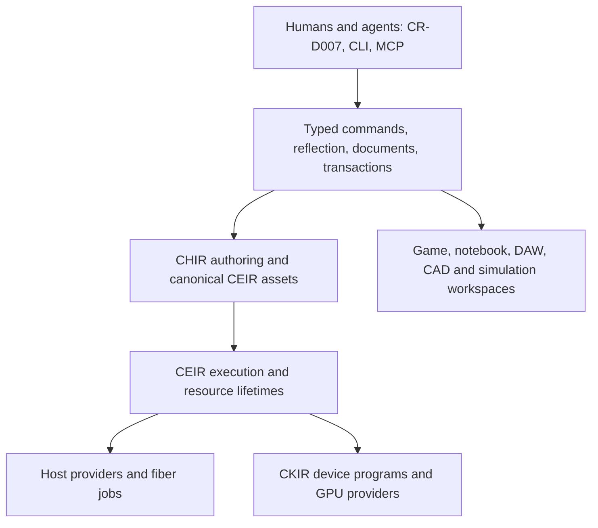

# Cerid whole-system architecture and qualification review

<!-- doc-role: reference -->
> Architecture evidence and recommendations. Live slice/finding state exists only in [ROADMAP](../ROADMAP.md).
> Rules: [AGENTS](../../AGENTS.md). Agent entry: [START_HERE](../../START_HERE.md).

## Verdict and architectural direction

Cerid has a substantial numerical, geometry, asset and execution foundation. Its central advantage is a shared
authoring/execution model rather than a collection of unrelated applications. The next work must turn that foundation
into qualified products: a fully authorable renderer, native crd-ui, CR-D007, and a scientific notebook, followed by
the preserved creative, simulation and manufacturing programmes. The breadth is intentional; completion must be
established separately for each contract rather than inferred from the presence of a module or schema.

The entire retained renderer library remains before UI, including offline transport, virtual geometry, hybrid GI and
neural rendering. CR-D007 then proves visual authoring of those same runtime assets. CHIR application-language
foundations precede UI behaviour; MATLAB-like scientific semantics are completed with the notebook. Windows/Linux
qualify first, with explicit macOS/browser and other hardware releases afterward. Inference and training qualify
together in the AI programme. Project collaboration uses an authoritative host with local recovery; multiplayer
uses a separate authoritative simulation contract. These directions extend the existing
[delivery decision](../decisions/0129-renderer-ui-editor-delivery-order.md).

This diagram describes ownership, not a second schedule. Application algorithms remain authored assets; native
providers supply explicitly declared platform/host mechanisms. Native C++ scripts remain first-class extensions,
with their effects and lifetime exposed through the same schemas. Agent access operates through the same command
implementation as the UI. A command transport, shared IR, or common scheduler does not erase domain-specific rules
for timing, numerical precision, authorization, collaboration or physical actuation.

## Evidence boundary and source inventory

The [earlier audit](2026-09-12-system-audit.md) remains the detailed renderer/CEIR migration evidence, including
A01–A27. This review extends its scope. The [census manifest](2026-09-12-whole-system-census.json) enumerates all
96 engine module manifests, header/test-directory presence, review classification, sampled source hashes and finding
owners. A test directory is not a test pass; its absence does not prove missing coverage in sibling targets.

The following family map covers the entire module inventory. The manifest assigns every module to exactly one
family. Public surfaces and selected implementations were inspected for architectural gaps. This is not a line-by-line
correctness proof of every algorithm and does not requalify historical benchmark boards.

| Family | Existing foundation and review boundary | Required qualification direction |
|---|---|---|
| Core/platform/application | core, platform, app, time, config, log, vm | OS/ISA lifecycle, input, clocks, nonblocking browser host, shutdown and deployment |
| Ownership/concurrency | memory, containers, jobs | Allocation lifetimes, fiber migration, pressure/cancellation, portable context switching |
| Numerical/scientific | math, units and all hesap modules | Preserve numerical/peer evidence; audit public units, scientific CHIR, CPU/GPU equivalence |
| Execution | CEIR, cook, host/GPU bridges and CHIR | Preserve completed substrate; full application language, capability-bounded tools, training workloads |
| GPU/compiler | gpu-context providers, kir and emitter providers | Actual provider execution, feature tiers, physical hardware, compiler/driver cache identity |
| Rendering/asset cooking | render-* modules, scene-render, draw, cookers | RAH, full retained technique library, offline/real-time compatibility and editor authoring |
| Resource/data integration | resources and asset-io | Bounded import, binary install, dependency closure, provenance, recovery and interchange |
| Scene/entity integration | scene, preset and profile | Stable reflected identity, transactional mutation, bulk jobs, scripts, replication and save/load |
| Geometry/representation | geometry-* modules, meshgen and lod | Existing scope preserved; future exact/toleranced CAD, modeling, large-world and domain adapters |
| Physics | eylem and rigid/viz modules | Future authorized resume only; physical correctness plus matched peer-crush programmes |
| Creative time/media | anim, timeline and audio | Complete posing, sequencer, sample-accurate real-time graph, DAW and plugin qualification |
| Observability/debug | perf, perf-ui, imgui and draw-imgui | Production telemetry, captures, regressions; ImGui remains debug/recovery only |

Named product modules for crd-ui, the CR-D007 editor, networking, CAD/CAM/EDA, and a full model-training service are
not present as corresponding engine module manifests in this census. That is an inventory fact, not proof that no
reusable primitives exist. In particular, the tensor/autodiff/DSP/geometry/CEIR components must be reused rather than
reimplemented inside future applications.

## Foundational gaps

**G01 — Qualification is wider than implementation inventory.** The engine has 96 module manifests, but no single
module count establishes a browser product, a reproducible simulation, an agent-controlled editor or a secure server.
The current [source index](../systems/README.md) and [earlier audit](2026-09-12-system-audit.md#module-boundaries)
are the starting evidence. **Recommendation:** QUAL records workload/platform tuples, dependencies and release gates;
source census and release qualification are separate activities. Retain every original master ID.

**G02 — Job portability has a concrete source gap.** [Jobs CMake](../../engine/foundation/jobs/CMakeLists.txt) chooses
`fiber_switch_win64.asm` for Windows and `fiber_switch_lin64.S` otherwise, using an OS branch rather than an ISA
matrix. It also documents compiler-specific context-switch/TLS restrictions. This does not establish ARM64, macOS
ABI or WASM support. **Recommendation:** explicit OS/ABI/ISA selection, architecture guards, native ARM64 qualification
and a browser scheduler adaptation; preserve current optimizer guards until their exact failing configurations pass.
Emscripten documents main-browser-thread blocking hazards and cross-origin isolation requirements for pthreads.
Browser execution therefore needs a real lifecycle design, not a renamed native fiber file. [S01](#source-s01)

**G03 — Scratch and task ownership need consumer proof.** [Jobs](../../engine/foundation/jobs/include/crd/jobs/jobs.hpp)
requires counters to be waited, and frame marks belong to the current worker's arena.
[HostProvider](../../engine/execution/ceir-host/include/crd/ceir/host/host_provider.hpp) already uses jobs-backed parallel work,
per-execution cancellation and owned scratch; do not add a duplicate executor. Migrating fibers and long-lived
application operations need explicit arena ownership, drain-on-cancel, callback epochs and fairness. Audit actual
consumers under nested/suspended work before claiming a race. CORE-USE covers the renderer/editor consumer path;
JOBS-HARD carries the broader substrate work at its authorized resume.

**G04 — Allocator richness is not application integration.** [IAllocator](../../engine/foundation/memory/include/crd/memory/allocator.hpp)
provides explicit ownership and `try_allocate`; its earlier fatal-OOM summary coexists with later recoverable paths.
The allocator family includes TLSF, growable pools, streaming and thread-safe wrappers. Qualification needs a lifecycle
map for document, frame, job, persistent asset, streaming, plugin and GPU memory; no hidden default-allocator escape
in bounded consumers. Test failure injection, alignment/overflow, fragmentation, deferred cross-thread frees and
pool integrity. Resolve the documented dependency-cycle concern through FOUNDATION-AUDIT, not a speculative rewrite.

**G05 — Native/CHIR scripting and reflection are not complete from reserved fields.**
[ScriptComponent](../../engine/world/scene/include/crd/scene/script_component.hpp) explicitly reserves a handle/storage
contract. [Component registration](../../engine/world/scene/include/crd/scene/component_registry.hpp) exposes traits and
an address-based C++ type key; [component reflection](../../engine/world/scene/include/crd/scene/component.hpp) is a seam,
not proof of portable generated metadata. REFLECT/SCRIPT must join C++ annotations, authored schemas, ECS bindings,
commands, inspectors and serialization. LibTooling is a primary reference for compilation-database-aware C++ AST
tools; a regex over headers is insufficient for templates, aliases and conditional compilation. [S02](#source-s02)

Use stable semantic/schema IDs across asset files and reload generations; native addresses remain local lookup aids.
Specify C ABI/version negotiation, allocator ownership, errors, callbacks, quiescence and rollback for DLL/shared-object
replacement. Arbitrary native code cannot be made safe merely by attaching a CEIR capability label: trusted native
extensions and isolated untrusted processes need different admission modes. Browser extensions use supported cooked
code/WASM/remote providers, not desktop DLL semantics.

**G06 — ECS needs a product workload audit.** The [World](../../engine/world/scene/include/crd/scene/world.hpp),
[system](../../engine/world/scene/include/crd/scene/system.hpp), registration and retained debt contracts are substantial
reuse. Qualify stable entity/component identity, stale-handle rejection, schema migration, deferred structural edits,
query invalidation, hierarchy changes, parallel access declarations and deterministic command application. Benchmark
editor bursts, streaming worlds and large homogeneous simulations separately. Do not duplicate scene storage in a
notebook or put UiWorld nodes into SceneWorld; shared reflection/documents connect the independent owners.

**G07 — CHIR is still a small language foundation.** Its [node kinds](../../engine/execution/chir/include/crd/chir/node.hpp)
and [lowering](../../engine/execution/chir/src/lower.cpp) establish the CEIR-32 path, not MATLAB semantics. LANG retains full
application behaviour. CHIR-SCI adds specified array indexing/slicing, broadcasting, matrix versus elementwise
operators, complex/precision rules, functions/modules, units, tables, plotting, debugger/source maps, package/import
rules and interactive execution. Choose compatibility deliberately: pin a MATLAB-like supported surface and explicit
differences, never imply every MATLAB toolbox or proprietary file format is automatically supported.

Notebook acceptance is executable: edit cells, inspect variables, interrupt/restart, save/reopen, reproduce a result,
switch CPU/GPU, diagnose a shape/unit error and export a report through both CR-D007 and its standalone host. Reuse
hesap kernels and the common document/command model. Native user functions and CHIR functions share reflection,
capabilities and ECS bindings; no second language runtime or notebook-specific scheduler.

## Agent and AI architecture

**G08 — Existing MCP verbs are a seed, not whole-product control.**
[ceridc verbs](../../tools/ceridc/include/crd/ceridc/verbs.hpp) and its [MCP dispatcher](../../tools/ceridc/src/mcp.cpp)
already share command implementations. The [hesap registry](../../engine/numerics/hesap/include/crd/hesap/cli/command_registry.hpp)
is another reuse source. CMD/AGENT must expose discoverable typed schemas, capabilities, units, progress, cancellation,
transactional previews and structured errors. An agent must inspect a project, propose a patch, execute it under its
grant, observe real state/pixels/results, compare an objective and restore a checkpoint through public services.

Remote tools need principal/project/object authorization, request and result budgets, audited mutations and protocol
version negotiation. The MCP security guidance explicitly rejects token passthrough and covers confused-deputy and
SSRF risks. Keep model text, tool descriptions and project content outside the authority boundary. Use a capability
grant and validated arguments, not a prompt asking the model to behave. [S03](#source-s03)

**G09 — Full AI requires model, training and deployment contracts.** The
[tensor](../../engine/numerics/hesap-tensor/include/), [autodiff](../../engine/numerics/hesap-autodiff/include/),
[CKIR](../../engine/gpu/kir/include/) and [CEIR](../../engine/execution/ceir/include/) layers supply building blocks. MLR-render
must provide every inference/training dependency used by the pre-UI neural renderer. The later complete AI programme
qualifies **inference and training together**, including full training of a scoped model, fine-tuning, distillation,
evaluation and deployment; it cannot close on inference alone. No model-size or universal hardware promise is inferred.

Model assets include graph/opset/IR versions, tensor layouts/shapes, precision/quantization, weights, tokenizer and
normalization, training configuration, dataset/split provenance, checkpoints and declared capabilities. ONNX versions
its IR and operator sets separately; importer acceptance must pin both and reject unsupported operators rather than
silently execute a different model. External tensors require bounded sizes and contained paths. [S04](#source-s04)

Inference qualification measures prefill/decode, first-token latency, batch/sequence scaling, KV-cache pressure,
streaming/cancellation, deterministic tiers and task quality alongside throughput. llama.cpp supplies a primary
reference and matched-peer implementation for quantized multi-backend inference; it does not become Cerid's owning
architecture by default. External libraries remain optional adapters/oracles. [S05](#source-s05)

Training includes gradients and numerical checks, optimizer state, mixed precision/overflow, checkpoint/resume,
deterministic data ordering, resource admission, distributed communication semantics when enabled, and an evaluation
set independent of tuning. Game brains combine authored policy/state/planning with bounded model inference; they
produce validated intents, not arbitrary engine writes. Test inference overruns, unavailable models and adversarial
observations. Ship a small specialized agent trained and deployed inside a real game and a product-workflow assistant.
Record model/seed/results when bitwise replay is unavailable; do not label stochastic output deterministic.

**G10 — Arbitrary-skeleton posing needs its own programme.** Existing
[pose sampling](../../engine/world/anim/include/crd/anim/pose.hpp) provides clip sampling, composition and skinning palettes.
It is not full IK, learned posing or physics-assisted motion. Cascadeur's documented AutoPosing supports humanoid and
quadruped characters with its standard rig; that reference does not establish arbitrary topology. [S06](#source-s06)

POSE therefore starts with topology/DOF/constraint/limit/contact descriptions and stable rig identity, then generic IK
and optimization, learned proposals, physical correction and authoring. Qualify humanoids, quadrupeds, birds, many-legged
creatures, tails/tentacles and articulated mechanisms. Unsupported learned topology must use the generic solver or
return an explicit limit. Evaluate contact slip, penetration, balance, momentum, limits, temporal continuity, edit
latency and animator control. Physical correctness must not be inferred from a plausible pose image. Training and
inference share AI assets; solver/body dynamics reuse eylem, hesap-opt/autodiff and animation rather than a second physics engine.

## Secure networking and collaboration

**G11 — The transport/security product is planned, not established by current modules.** The retained 4.2 rows cover
transport, replay, synchronization, lobbies and ROS2; the module census has no crd-net implementation. NET expands
their acceptance: owned channel/schema contracts, authenticated sessions, encryption, identity, key rotation, expiry,
replay protection, congestion, fragmentation/reassembly, compact/delta payloads, backpressure and observability.

Admit packets through bounded stages: size/header/version sanity, cheap routing and admission controls, protocol-
appropriate address/authentication validation, replay/window checks, then bounded application decode and authorization.
Some initial transport messages must be parsed before identity exists; "no processing" is not a literal achievable
contract. Do not allocate an unbounded connection or decompress content merely because a source address is present.
QUIC's pre-validation anti-amplification limit is a concrete reference, not a complete DDoS solution. [S07](#source-s07)

Use maintained cryptographic implementations behind Cerid-owned interfaces. Separate authentication from authorization
and application correctness. TLS 1.3 early data has replay considerations; non-idempotent project/game mutations must
not execute as replayable early data without a proven application policy. [S08](#source-s08) Security gates measure
invalid/spoofed and authenticated-abusive traffic, bytes and packets per second, CPU/allocation caps, valid-client
latency, flood recovery and secret handling. Volumetric saturation also requires deployment/upstream defenses; document
capacity and failure envelopes instead of promising an attack-proof network.

**G12 — Collaboration and multiplayer must share plumbing without sharing incorrect semantics.** Competitive games
need server authority, input validation, prediction/reconciliation, interest management, snapshots, rollback/replay,
join/rejoin and version negotiation. Projects need durable transactions, actor identity, branches/history, offline
edits, conflict presentation, selective undo, binary asset closure, permissions and host failover. A shared command
schema does not make one update protocol correct for both.

An authoritative project host accepts validated transactions. Local/offline work is retained and reconciled explicitly.
Evaluate CRDTs for text and independent properties, with transaction validation or explicit conflicts for graphs,
topology, parameter constraints and binary assets. Automerge demonstrates that concurrent property writes may preserve
multiple values even while replicas converge; convergence is not automatic semantic conflict resolution. [S09](#source-s09)

The browser hub uses the same documents, commands and permission model, with streamed large artifacts and presence
kept separate from durable history. WebTransport offers streams and datagrams, but deployment/browser support and
fallback behaviour still require qualification; no raw UDP or desktop socket assumption. [S10](#source-s10) A remote
audio session also distinguishes shared DAW edits from low-latency live audio, whose clock/jitter constraints are separate.

## Time, units, media and extensibility

**G13 — Units need a boundary census, plus frames and time scales.**
[Units](../../engine/foundation/units/include/) is a real shared substrate. Raw public examples such as `sample_clip(..., f32 t,...)`
in [pose](../../engine/world/anim/include/crd/anim/pose.hpp) need a classified boundary review: internal numerical lanes may
stay raw; public physical quantities require the existing typed rule. Do not mechanically wrap every dimensionless
number. Add coordinate frame/handedness/origin, timestamp epoch/scale, uncertainty and calibration metadata where a
dimension alone cannot prevent a wrong answer. Distinguish points/vectors and absolute temperature/differences.

Simulation time, wall/monotonic time, audio sample time, rational cinematic time and UTC/TAI/TDB conversions need
explicit bridges. SPICE's separate ephemeris, frame, spacecraft-clock and leap-second kernels illustrate why "seconds"
alone is insufficient for aerospace data. Pin data versions as part of reproducibility. [S11](#source-s11)

**G14 — Audio has a precise remaining gap.**
[AudioCommand](../../engine/media/audio/include/crd/audio/audio_realtime.hpp) carries `at_frame` but documents block-start
application in v1; its voice pool is bounded. The [offline graph](../../engine/media/audio/include/crd/audio/audio_graph.hpp)
has per-sample automation and a separate real-time path. AUDIO-CEIR must close these into a qualified authored graph
with feedback/delay semantics, sample-offset events, latency compensation, variable block sizes, streaming/recording,
device change and no-allocation/no-lock execution. This source distinction is not a report of an observed dropout.

CLAP's thread contract explicitly identifies real-time constraints and operations to avoid. Use that as an adapter
acceptance reference, while owning the Cerid scheduler/parameter interfaces. [S12](#source-s12) DAW adds multitrack
record/edit, routing, buses, automation, instruments, MIDI/MPE, plugin state, meters, latency compensation, bounce/freeze,
tempo/time signatures, recovery and portable project closure. NLE/sequencer completes clips, takes, synchronization,
conform, color and export on the same rational-time/document substrate.

**G15 — General plugins need more than audio formats.** The accepted
[native intrinsic/plugin levels](../decisions/0110-native-intrinsic-schema-and-plugin-levels.md) and PLG audio rows are
reuse. EXT supplies general manifests, dependency/ABI versions, owned allocation and service lookup, capability grants,
signature/provenance policy, isolated scanning, crash containment, install/remove and hot-reload rollback. Commands,
schemas, UI widgets and CEIR providers unregister by owner with in-flight lifetime protection. A plugin can contribute
authoring and capabilities without leaking vendor types or overriding application trust policy.

## Renderer, UI and hardware qualification

**G16 — Web requires application services, not just shader emission.**
[kir-webgpu](../../engine/gpu/kir-webgpu/CMakeLists.txt) is an emitter module; the current GPU-context manifests are
Vulkan/DX12/CUDA. WEB must establish the actual provider, asset installation, asynchronous execution, persistent
documents, offline recovery, browser permissions/lifecycle, accessible UI projection, input/IME and audio. Test
threaded and single-thread deployments with explicit service fallbacks. WebGPU features and limits are adapter-specific;
device loss requires a recovery path. The WebGPU explainer is useful architecture guidance, not itself a W3C Standard.
[S13](#source-s13)

**G17 — Hardware coverage must be a measured tuple.** Extend the existing PQP/MAC/WEB/ROCM gates with CPU feature
tiers, ARM64, discrete/UMA memory, representative Intel/AMD/NVIDIA GPUs, driver/compiler versions, low-memory cases,
headless/presentation and unsupported-feature paths. A Vulkan success on one NVIDIA Windows device cannot qualify
AMD Linux, and WSL cannot prove native Wayland/X11 presentation. Required hardware that was not run remains unqualified.
CORE-USE and QUAL address current consumers; future platform rows retain separate evidence and capability contracts.

**G18 — Renderer beauty and compatibility need shared semantics.** RAH and the
[full retained catalogue](../design/rendering-ui-contracts.md) remain binding. Add explicit asset compatibility tests
across real-time/offline, including camera/lens/shutter, material/light definitions, geometry/deformation, units,
color/alpha, AOVs and caches. Different integrators may have different accuracy/performance tiers, but the difference
must be declared. OpenColorIO's scene/display distinction is a useful interchange reference; scene-linear results,
display rendering, and UI colors cannot be indiscriminately tone-mapped together. [S14](#source-s14)

Offline qualification includes convergence/bias, spectral/volume/hair/subsurface cases from OFF, noise/denoising
evaluation, resumable tiles/checkpoints, deterministic sample assignment, output metadata and cancellation. PBRT's
wavefront discussion demonstrates that GPU scheduling/layout is part of performance, so benchmark whole integrators,
queues and transfers rather than a single intersection kernel. [S15](#source-s15)

Neural rendering retains authored upscaling/denoising/materials/caches and scene representations. The original 3DGS
work combines representation optimization and rendering; viewing a trained splat asset does not qualify its training,
editing, relighting or dynamic-scene extensions. Give each requested extension its own oracle and workload. [S16](#source-s16)

**G19 — Native UI needs design and interaction evidence.** C2 schemas, glass proofs and ImGui panels do not implement
crd-ui. Preserve the entire I2D contract: owned text/vector stack, separate UiWorld, Canvas, input, IME, accessibility,
styling, virtualization, docking, code/node/timeline editors and publishing. Add an executable design gallery and
representative dense workspaces, dark/light/high-contrast themes, typography/spacing/icon/state rules, interaction
latency, keyboard-only and assistive-technology tasks. WCAG 2.2's focus, target-size and dragging alternatives provide
web acceptance references; native UI also needs actual platform accessibility adapters and tests. [S17](#source-s17)

INPUT also owns authored action/context maps, chord/sequence binding, rebinding persistence, controller deadzones,
haptics and hotplug, without conflating physical keys with text. Audio qualification includes multichannel/bus layouts,
sample-rate conversion/clock drift and declared spatial/HRTF/ambisonic paths. Each runs through its public services.

## Modeling, science and manufacturing

**G20 — Geometry breadth does not yet establish a complete modeling product.** Keep geometry implementation untouched
during this planning pass. MODEL later joins selection/edit modes, topology operations, subdivision/sculpt/paint,
UV/attributes, modifiers/procedural graphs, instancing, constraints, import/export and non-destructive history through
CR-D007 commands. Mesh rendering and exact/toleranced CAD solids have different contracts. BREP needs robust predicates,
surface/edge tolerances, validity and repair diagnostics, stable feature naming and tessellation with controlled error.
Open CASCADE's Boolean specification explicitly treats curve intersections in terms of tolerance; "exact CAD" must
not become an unsupported assertion that all NURBS intersections are exact arithmetic. [S18](#source-s18)

**G21 — PCB/CAM must qualify manufactured data, not only a picture.** Retained CAD/CAM and 3.1.17 scope includes
multilayer stackups, schematic connectivity, footprints/pads/vias, copper zones, differential/length constraints,
DRC/ERC, mechanical integration and BOM/placement/manufacturing output. EDA adds explicit children for these, preserving
CAM.7 as its integration point. Ucamco provides the format specifications, fabrication examples, test files and reference
viewer needed for Gerber interoperability. [S19](#source-s19) KiCad's PCB documentation separately treats Gerber jobs
and drilling output; a board screenshot or isolated copper layer is not a complete fabrication package. [S20](#source-s20)

CAM adds cutter/stock/fixture/machine definitions, coordinate systems, feed/speed limits, tool compensation, collision
and gouge checking, postprocessor versions and round-trip simulation of emitted NC code. Output qualification uses
declared tolerances and independent checks. Generating an artifact and issuing a command to a physical machine are
different capabilities. Keep actuation opt-in with explicit limits and a separate operational safety case.

**G22 — Physics needs both accuracy and stronger performance gates.** Existing eylem plans preserve rigid/contact,
articulation, CCD, soft/cloth/fluid, FEM, GPU and differentiable scope. Some retained text still calls within 2× a peer
"elite"; the present peer-crush direction supersedes that completion bar. Keep the original benchmark scenes but require
matched quality and full boards. Box2D warns that engine determinism does not make the surrounding application
deterministic. [S21](#source-s21) Jolt's PerformanceTest is a reproducible multicore peer candidate; MuJoCo explains
solver/integrator accuracy tradeoffs useful for robotics comparison. [S22](#source-s22), [S23](#source-s23)

PHYS-QUAL pins peer revisions, physical models, tolerances, time steps, collision shapes, constraints, threading and
timing boundaries. Use Box2D for 2D, Jolt/Bullet/PhysX where comparable for games, and MuJoCo/Drake-type robotics
oracles where applicable. Do not force byte identity across different solvers; use analytic solutions, conservation,
constraint residuals, convergence and long-duration replay. Keep deterministic tiers separate from non-deterministic
fast modes. All future kernels retain the full numerical/performance mandate.

**G23 — Digital twins need co-simulation, sensor and experiment semantics.** Retained CONTROL/CFD/FEA, robotics,
aerospace and astrodynamics rows need shared typed signals, frames, clocks, uncertainty, calibration and provenance.
SIM adds scenario assets, multi-rate stepping, event ordering, solver coupling, rollback/checkpoint, convergence,
record/replay, experiment sweeps and trustworthy telemetry. FMI 3.0.2 distinguishes model exchange, co-simulation and
scheduled execution with clocks; it supplies an interoperability reference, not a replacement for CEIR's scheduler.
[S24](#source-s24)

SENSOR qualifies camera/depth/LiDAR/radar/IMU/GNSS and other declared sensor models, latency/dropout/noise, rolling
shutter, calibration, timestamp synchronization and ground truth. ROS2 QoS demonstrates why sensor traffic may use
best effort with bounded queues rather than the same reliability policy as commands. [S25](#source-s25) Autonomous
vehicle simulation adds roads, actors, scenarios, adverse conditions and closed-loop evaluation; ASAM OpenSCENARIO
is a relevant exchange contract distinct from road geometry. [S26](#source-s26) Validate space/aerospace models with
reference data and explicit frame/time conversions, not photorealism alone.

**G24 — Embedded code generation needs a bounded target contract.** 3.1.18 must cover more than an ARM build flag:
supported CHIR/CEIR subset, fixed memory, bounded loops/stack, target arithmetic, deterministic I/O scheduling,
generated C/C++ and metadata, host-versus-target equivalence, RTOS/bare-metal adapters, SIL/PIL/HIL and traceability.
Generated code must reject unsupported dynamic capabilities. Scientific experiments and simulation evidence do not
by themselves certify a controller or authorize deployment to physical equipment. Keep certification evidence and
physical deployment as separately qualified product capabilities.

**G25 — Interchange, buildings and large worlds need semantic preservation.** INTEROP extends the existing asset
system with versioned conformance fixtures and explicit loss reports for glTF/USD, CAD formats and media. OpenUSD's
composition model includes references, variants and overrides; a mesh-only import loses these semantics unless the
supported subset is declared. [S27](#source-s27) AEC adds IFC entities/relationships/property sets, georeferencing,
large-coordinate precision, building assemblies, review/measurement and architectural rendering. buildingSMART's
IFC overview establishes the data-exchange scope; visualizing triangles alone is not a BIM round trip. [S28](#source-s28)

Large-world precision must include stable global coordinates, local render origins, unit/frame conversion and
streaming; never shift simulation identity or corrupt physics/sensor measurements to improve viewport precision.
WORLD.1 establishes those foundations; WORLD.2 and its close qualify actual physics/sensor consumers after they exist.
Engineering analyses require mesh/BC/material provenance, discretization and uncertainty studies, solver residuals,
verification cases and independent comparison. Medical/scientific visualization retains its own volume/measurement
and data-privacy acceptance; no clinical or engineering certification claim follows from renderer quality.

## Operational and documentation gaps

**G26 — Tool/asset distribution is a trust boundary.** CRDR parsing, cookers and plugin/model import need size,
path/dependency, decompression, schema and resource-budget gates. Content-addressed identity is not publisher identity.
Package/export adds reproducible dependency closure, provenance, signatures where required, rollback and versioned
cache invalidation. SLSA provenance identifies build inputs and execution metadata; adopting a provenance format does
not establish an assurance level without satisfying its requirements. [S29](#source-s29)

**G27 — Recovery and observability must span applications.** Reuse perf/jobs/resource/CEIR diagnostics. Add correlated
command→task→GPU traces, crash artifacts without secrets, resource pressure, structured failures, fuzz/property and
long-soak CI, reproducible failure bundles and migration matrices. Test clean installs, interrupted saves, corrupt
caches, revoked plugins and schema upgrades. Game publishing requires a complete standalone lifecycle, saves/config,
logs, input/UI and asset closure; export is not satisfied by producing an archive.

**G28 — Documentation quality must be enforced at task closure.** The existing compact rules and single table are
retained. [START_HERE](../../START_HERE.md) now provides one explicit entry. The
[quality contract](../design/system-quality-contract.md#close-out-for-every-kind-of-task) requires a session for every
implementation, fix or investigation, benchmark evidence at measurement time, recipes for implemented research and
correction of every affected current fact. It does not rewrite historical results or force edits to unchanged rules.
The validator checks structure and routing; it cannot prove code semantics or prevent an agent from making false claims.

**G29 — Historical scope conflicts need visible supersession.** ADR-0081 still contains C++-only wording below its
partial supersession note; ADR-0077 contains old rhi/ONNX integration assumptions and the
[archived inference phase](../archive/phases/phase-3.1.14-ml-inference.md#out-of-scope-this-phase) excludes training/custom kernels; old physics
bench text has a weaker bar. Current amendments point to CHIR/CEIR/CKIR, simultaneous inference/training qualification,
and matched peer-crush. Preserve original history and useful requirements. Source comments such as the CHIR-0 header's
"lowering pending" beside an existing lower.cpp must be refreshed with the owning implementation slice; they are not
new runtime defects.

**G30 — Cross-domain completeness needs runnable acceptance projects.** Add a maintained portfolio: exported 2D/3D
game, renderer/material/frame authoring, cinematic offline sequence, scientific notebook, specialized trained game AI,
agent-controlled modeling/rendering, collaborative engineering review, DAW session, PCB fabrication package, CAD/CAM
part, autonomous-sensor scenario and aerospace digital twin. Each project uses public modules and real command/asset
paths. Record scale, correctness, performance, portability, recovery and reproducibility. A domain closes only after
its own modules and a representative end-to-end consumer are qualified.

## Delivery and closure

The [master table](../ROADMAP.md#master-table) owns every slice and child. Existing renderer/UI plans are enriched,
not replaced. New CORE-USE/QUAL/MLR-render requirements protect the current path; REFLECT/CMD/SCRIPT/EXT/AGENT and
UI quality integrate within CR-D007; CHIR-SCI completes the notebook. Full AI training/inference, media/DAW, hardware
expansion and retained foundation/domain programmes follow their declared dependencies. Geometry/physics/domain
implementation remains outside this documentation task.

The design standard is a complete contract per bounded slice: public ownership, parameter/units table, algorithm
references, reusable substrate, failure modes, authored asset path, migrations/deletions, test oracles, matched peer
board and target-hardware evidence. Open questions about a future algorithm remain explicit review work in its owner
row. This review identifies known gaps across the stated vision; only repeated source review and product qualification
can discover and resolve the next ones.

## Primary sources

All sources accessed 2026-09-12. Versioned references are pinned baselines; unversioned project documentation can
change and must be pinned again before implementation. Sources justify the associated technical claims, not Cerid
completion or performance. Recommendations above are Cerid design judgments. No product benchmark was rerun here.

1. Emscripten contributors. [Pthreads support](https://emscripten.org/docs/porting/pthreads.html), current documentation; browser blocking and isolation constraints.

2. LLVM project. [LibTooling](https://clang.llvm.org/docs/LibTooling.html), current documentation; AST tooling and compilation databases.

3. MCP maintainers. [Security Best Practices, protocol 2025-11-25](https://modelcontextprotocol.io/docs/2025-11-25/tutorials/security/security_best_practices); authority, token passthrough, SSRF and session risks.

4. ONNX project. [ONNX Versioning](https://onnx.ai/onnx/repo-docs/Versioning.html), documentation served as 1.24.0; separate IR and opset versions.

5. ggml-org. [llama.cpp](https://github.com/ggml-org/llama.cpp), current repository; quantized inference and backend reference, no Cerid performance inference.

6. Nekki/Cascadeur. [AutoPosing](https://cascadeur.com/help/tools/animation_tools/autoposing), current documentation; supported rig classes and standard-rig requirement.

7. J. Iyengar and M. Thomson, IETF. [RFC 9000, QUIC](https://www.rfc-editor.org/rfc/rfc9000.html#section-8), May 2021, §8 and security considerations.

8. E. Rescorla, IETF. [RFC 8446, TLS 1.3](https://www.rfc-editor.org/rfc/rfc8446.html#section-8), August 2018, §8 early-data replay.

9. Automerge contributors. [Conflicts](https://automerge.org/docs/reference/documents/conflicts/), current documentation; concurrent property writes and retained conflicting values.

10. W3C WebTransport Working Group. [WebTransport](https://www.w3.org/TR/webtransport/), current published draft; streams/datagrams, not universal deployment availability.

11. NASA/JPL NAIF. [SPICE Concept](https://naif.jpl.nasa.gov/naif/spiceconcept.html); kernel families, reference frames and time conversions.

12. free-audio contributors. [CLAP thread-check contract](https://github.com/free-audio/clap/blob/main/include/clap/ext/thread-check.h), current header; audio/main-thread obligations.

13. GPU for the Web Community Group. [WebGPU Explainer](https://gpuweb.github.io/gpuweb/explainer/), 1 September 2026 draft community report; capabilities/limits/device lifecycle, not a normative W3C Standard.

14. OpenColorIO contributors. [Displays & Views](https://opencolorio.readthedocs.io/en/latest/guides/authoring/displays_views.html), current documentation; scene/display reference transforms.

15. M. Pharr, W. Jakob and G. Humphreys. [PBRT fourth edition, Mapping Path Tracing to the GPU](https://www.pbr-book.org/4ed/Wavefront_Rendering_on_GPUs/Mapping_Path_Tracing_to_the_GPU), 2023, §15.1; wavefront/throughput tradeoffs.

16. B. Kerbl, G. Kopanas, T. Leimkühler and G. Drettakis. [3D Gaussian Splatting for Real-Time Radiance Field Rendering](https://repo-sam.inria.fr/fungraph/3d-gaussian-splatting/), SIGGRAPH 2023; original paper/project.

17. W3C WAI. [What's New in WCAG 2.2](https://www.w3.org/WAI/standards-guidelines/wcag/new-in-22/), Recommendation published 5 October 2023; interaction/accessibility additions.

18. Open CASCADE Technology. [Boolean Operations](https://www.occt3d.com/dev/doc/overview/html/specification__boolean_operations.html), current technical specification; toleranced geometry/topology.

19. Ucamco. [Official Gerber Format](https://www.ucamco.com/en/gerber), specification/test-file index including revision 2024.05; authoritative format and validation resources.

20. KiCad project. [PCB Editor 10.0](https://docs.kicad.org/10.0/en/pcbnew/pcbnew.html), versioned documentation; fabrication/drill/job output contracts.

21. Box2D project. [Simulation](https://box2d.org/documentation/md_simulation.html), current documentation; application-versus-engine determinism.

22. Jorrit Rouwé and contributors. [Jolt Physics](https://github.com/jrouwe/JoltPhysics), current repository; PerformanceTest and multicore peer harness.

23. MuJoCo contributors. [Computation, version 3.3.5](https://mujoco.readthedocs.io/en/3.3.5/computation/), pinned technical baseline; integrator/solver/reproducibility distinctions. Re-pin the peer version before measuring.

24. Modelica Association Project FMI. [FMI Specification 3.0.2](https://fmi-standard.org/docs/3.0.2/), 27 November 2024; clocks, co-simulation and scheduled execution.

25. ROS 2 project. [Quality of Service settings, Humble](https://docs.ros.org/en/humble/Concepts/Intermediate/About-Quality-of-Service-Settings.html), pinned conceptual reference; bounded sensor-data reliability. Current Rolling/Jazzy pages were unavailable to this review; no newer-version conformance is inferred.

26. ASAM. [OpenSCENARIO XML](https://www.asam.net/standards/detail/openscenario-xml/), current standard overview; dynamic driving scenarios and related standards.

27. OpenUSD contributors. [Introduction to USD](https://openusd.org/release/intro.html), documentation served as 26.08; composition and overrides.

28. buildingSMART International. [Industry Foundation Classes](https://www.buildingsmart.org/standards/bsi-standards/industry-foundation-classes/?lang=en), current overview; IFC/BIM exchange scope.

29. SLSA project. [Provenance v1.1](https://slsa.dev/spec/v1.1/provenance), pinned specification; build definition/run metadata and inputs.
