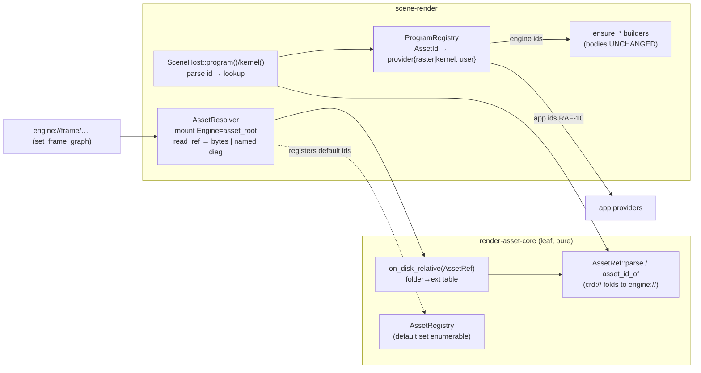

# RAF-9 — Engine default assets load by canonical `engine://` id through a public registry

> **Outcome:** **adopted** — RAF-9 shipped 2026-08-04 (`engine://` default-asset registry; session 2026-08-04-raf9-engine-default-assets). *(stamped 2026-08-07, doc-hygiene pass)*

## Context

RAF-1 shipped the **identity** half of the asset model — the `engine://`/`app://`/`plugin://`/`test://` schemes,
`AssetRef`/`asset_id_of`, and an `AssetRegistry` (`engine/render-asset-core/include/crd/renderasset/{identity,registry}.hpp`) —
but it was never wired to the live loader. Today `SceneRenderer` still selects everything by **relative filename**:

- `Impl::asset_text(const char* name, …)` (`scene_renderer.cpp:1078`) joins `asset_root + "/" + name` and reads via
  `crd::platform::fs` — callers pass names-with-extension (`"frame/forward_csm.frame.toml"`, `"material/scene.crdm"`).
- Frame fallbacks resolve by **stripping the literal `crd://frame/` prefix** in `resolve_frame_asset` (`:866`).
- The programs a frame names are resolved by a **hard-coded `str_is(id, "crd://scene/…")` chain** in
  `SceneHost::program()` / `SceneHost::kernel()` (`:4616`–`:4661`) that maps id-strings straight to C++ `ensure_*` builders.

Gate 9 forbids exactly these hidden/hard-coded selection paths. **Goal (verbatim):** default loads by canonical asset
id · no caller needs embedded TOML · same public registry as app assets · missing default reports a clear error ·
representative output unchanged · default inspectable/emittable/composable like an app graph · **no hard-coded hidden
fallback**.

**Non-negotiable safety property:** every change is id-routing over the **same files** and **same builders**, so the
sandbox must render **byte-identical** at every increment. A pixel-exact readback diff (`diffs == 0`, both backends) is
the standing gate — the REN-36.2 "authored == cooked == programmatic" archetype extended to "id-resolved == current".

### Two decisions locked in (differ from / confirm the draft)

1. **Resolver placement — split.** `render-asset-core` is a documented **leaf module** (`CMakeLists.txt:11`: "deps:
   crd-core / crd-containers / crd-memory only") depended on by 6+ modules. It gets only the **pure, I/O-free** path map
   (`AssetType`/folder → extension + `on_disk_relative(AssetRef)`), keeping it leaf. The **file-reading** `AssetResolver`
   (mount table + `platform::fs` read) lives in **scene-render**, which already has `platform::fs` and `asset_root`.
2. **crd://→engine:// asset rewrite — done this slice** (increment 4), pixel-neutral (identical `AssetId`).

## Design — two thin layers over what already exists

**Layer 1 — `on_disk_relative` (render-asset-core, pure) + `AssetResolver` (scene-render, I/O).**
render-asset-core adds a **folder→extension** table and `bool on_disk_relative(const AssetRef&, String& out)` yielding
e.g. `engine://frame/forward_csm` → `frame/forward_csm.frame.toml`. Extensions needed by the live read set:
`frame→.frame.toml`, `vertex→.crdv`, `material→.crdm`, `post→.crdp`, `lighting→.crdl` (extend as families are added).
scene-render adds `AssetResolver` holding a mount table (`Engine = asset_root`; app/plugin/test set by owners) with:
- `read_relative(StringView rel, String& out)` — the exact `asset_root + "/" + rel` + `exists` + `read_file_text` body
  lifted out of `Impl::asset_text`, so there is **one** read path.
- `read_ref(const AssetRef&, String& out, DiagnosticList&)` — `on_disk_relative` + `read_relative`; a miss emits a
  **named** diagnostic (reuse `DiagnosticList`), never a silent fallback.

Because `engine://` mounts the exact `asset_root`, the resolved file is the identical file loaded today → output
unchanged **by construction**. Default ids are `register_ref`'d into an `AssetRegistry` so the default set is
**enumerable** (Gate 9). `crd://` folds to `engine://` in `AssetRef::parse`, so lookups match before *and* after the
rewrite (same `AssetId`).

**Layer 2 — public `ProgramRegistry` (scene-render, exposed on `SceneRenderer`).**
`AssetId → provider`, where a provider follows the engine's existing `FramePassFn` idiom (function pointer + `void*
user`, **no `std::function`**): `IRasterProgram*(*)(void*)` for raster, `IGpuProgram*(*)(void*)` for kernels. Engine ids
register with `user = &impl` and a captureless thunk (`{ return static_cast<Impl*>(u)->ensure_mesh_program(); }`);
indexed families use the literal in the thunk (`ensure_cull_view_kernel(0U)` … `(4U)`, `ensure_moment_program(0U,0U)` …).
`SceneHost::program()`/`kernel()` stop being a `str_is` chain: they `AssetRef::parse` the incoming id (folding crd→engine)
to an `AssetId` and **look it up**; unregistered → nullptr, which the executor already reports by name → clear error.
This is public (`register_program`) — the seam an app / RAF-10 uses. The KEEP-list C++ builders become legitimate,
canonically-named, inspectable non-authored programs instead of a hidden branch. **`ensure_*` bodies do not change.**

**Explicitly NOT touched (they are graph resource names, not asset identity):** the bare-name `str_is` resolvers for
`storage_buffer` (`"instances"`, `"hits"`, `"taa_constants"`), draw-list queries (`"visbuffer_geometry"`,
`"impostor_geometry"`), the `"shadows"` capability flag, and `instance_program` (`"moment_convert"` etc.) — these stay.
Only the `crd://…` **program/kernel id** matches in `program()`/`kernel()` are replaced.

## Increments (each sandbox-safe + independently gated)

**1. Pure folder→extension map + `on_disk_relative` (render-asset-core, device-free).**
Add to render-asset-core (new small header/src, or extend `identity.*`): the folder→extension table and
`on_disk_relative(const AssetRef&, String&)`. Unit test in `tests/render-asset-core/`: `engine://frame/forward_csm` →
`frame/forward_csm.frame.toml`; the `crd://` alias yields the identical relative path **and** identical `AssetId`;
`app://x`.id() ≠ `engine://x`.id() (no shadowing); each covered family maps to its extension. *Gate: device-free; no
platform dep added to core; sandbox untouched.*

**2. `AssetResolver` + route content & frame selection through it (frames by id).**
New `AssetResolver` in scene-render (lift `read_relative` out of `asset_text`; add `read_ref`). Give `Impl` a resolver
(mount `Engine = asset_root` in `set_asset_root`/`init`). Reimplement `resolve_frame_asset` over `read_ref` (drop the
`crd://frame/` prefix strip). Point the internal default loads at ids: `set_asset_root` reparse, `set_soft_shadows`
moment/csm swap, and `init` all load `engine://frame/…` via the resolver. Add public
`SceneRenderer::set_frame_graph(const char* canonical_id)` (parse `engine://frame/…` → `read_ref` → `set_frame_graph_toml`);
keep `set_frame_graph_asset(relative)` as a thin wrapper (deleted at RAF-12). *Gate: sandbox renders identically via the
existing path; a `tests/frame-cook/` test loads a frame by `engine://` id and cooks byte-identically to the relative load.*

**3. `ProgramRegistry` replacing the `str_is()` chain.**
Add the registry + `SceneRenderer::register_program(canonical_id, provider)` + internal resolve. At init register every
engine program/kernel id (authored → provider that reads stages via the resolver and cooks; KEEP-list → provider calling
the C++ builder), and `register_ref` each into the `AssetRegistry`. Refactor `ensure_post_program` to a discriminator
(`bool is_agx`) so its two providers don't re-match strings. Replace the `crd://` matches in `SceneHost::program()`
(`:4618`–`:4634`) and `SceneHost::kernel()` (`:4641`–`:4659`) with parse-to-`AssetId` + registry lookup. *Gate: sandbox
renders BIT-IDENTICAL (pixel diff `== 0`, both backends — same ids → same providers → same builders); device-free test:
every engine program id resolves, an unknown id reports a clear error, the default set enumerates.*

**4. Sandbox selects by `engine://` id + the crd://→engine:// asset rewrite + the RAF-9 GATE.**
Convert the sandbox frame-selection strings (`pick_frame` table + `set_frame_graph_asset` calls in `sandbox/src/main.cpp`,
`~:901`–`:930`, `:1113`) to `engine://frame/…` ids through `set_frame_graph`. Rewrite the 16 `assets/frame/*.frame.toml`
`name`/`fallback` + `shader`/program refs `crd://`→`engine://` (leave bare `technique = "forward_csm"` untouched;
pixel-neutral, identical `AssetId`). **RAF-9 gate test** (mirror REN-36.2): (a) device-free — engine default loads by
canonical id through the public registry, no embedded TOML, missing default → clear error, default enumerates/emits;
(b) pixel-exact both backends (`tests/gpu-context-vulkan/test_vulkan_frame_graph.cpp` + dx12 mirror) — id-resolved
default renders BIT-IDENTICAL to pre-RAF-9. Delete the now-dead prefix-strip + `str_is` id chain. *Gate 9 met.*

**5. Close.** `scripts/per-slice-check.ps1` (sequential, both backends) + LLVM-20 tidy per changed file + smoke both
backends with `CRD_ASSETS_DIR`. Update the D-007 RAF-9 row + a short RAF-9 note (ADR-0106), session log, memory; propose
a Conventional Commits message (no AI trailer — user commits).

## Critical files

- **New:** render-asset-core folder→ext map + `on_disk_relative` (extend `identity.{hpp,cpp}` or a small new pair);
  `engine/scene-render/…/asset_resolver.{hpp,cpp}` (or fold into an existing scene-render internal header) — `AssetResolver`
  + `ProgramRegistry`; `tests/render-asset-core/` map test; RAF-9 gate test (device-free in `tests/frame-cook/`,
  pixel-exact in `tests/gpu-context-vulkan/test_vulkan_frame_graph.cpp` + the dx12 mirror).
- **Edit:** `engine/scene-render/src/scene_renderer.cpp` — `asset_text`→`read_relative`; `resolve_frame_asset`;
  internal default frame loads (`set_asset_root` `:2711`, `set_soft_shadows` `:2547`, init); `SceneHost::program()`/`kernel()`
  str_is id chain → registry; `ensure_post_program` discriminator; init registration of frames+programs.
  `engine/scene-render/include/crd/scenerender/scene_renderer.hpp` — `set_frame_graph(id)` + `register_program`.
  `sandbox/src/main.cpp` — frame-selection strings → `engine://` ids. `assets/frame/*.frame.toml` — crd://→engine://.
- **Reuse:** `AssetRef::parse`/`asset_id_of`/`AssetScheme`/`AssetType` + `AssetRegistry`
  (`render-asset-core/{identity,registry}.hpp`), `crd::platform::fs::{exists,read_file_text}`, `DiagnosticList`, the
  `FramePassFn` fn-ptr+`void*` idiom (`scene_renderer.hpp:551`), all `ensure_*` builders (bodies unchanged), the
  REN-36.2 pixel-exact readback scaffolding in the frame-graph tests.

## Verification (end-to-end)

- **Per increment:** the named ctest gate above (device-free structural + pixel-exact readback both backends) via the
  test binaries; LLVM-20 tidy on each changed file.
- **Slice close:** `scripts/per-slice-check.ps1` green (all configs, both backends); `crd-sandbox --smoke-test 2`
  (Vulkan + DX12, `CRD_ASSETS_DIR` set) shows cascade shadows ON + full instance count, byte-identical to pre-RAF-9;
  grep proves the `str_is` id chain and the `crd://frame/` prefix-strip are gone.
- **Gate 9 checklist, proven by the gate test:** loads by canonical id · no embedded TOML in any caller · same registry
  an app would use · missing default → named diagnostic · pixel-exact unchanged · default enumerable/emittable.

## Risks / notes

- **Biggest risk = Increment 3** (whole live frame's program resolution moves from inline match to registry). The
  pixel-exact gate + existing REN-36.2 / frame-graph suites are the net; if any texel differs, stop and diff.
- **crd→engine folding is load-bearing:** `AssetRef::parse` must fold `crd://` to `engine://` (identity.hpp §, verified)
  so registry lookups and `read_ref` match before the increment-4 rewrite and after. Do not use raw `asset_id_of` on the
  unfolded incoming id.
- **Techniques** (`forward_csm`, a bare frame string, `builtin:` bodies from `kForwardCsm*`) are the RuntimeProgram KEEP
  archetype: register under `engine://technique/…` for inspectability only; resolution stays the by-name builtin registry.
  Serializing `.crdt`→CKIR bodies is out of RAF-9 scope.
- **Cull is already authored `.crdv`** (not pure-C++): its provider is the authored-cook kind, no special-casing.
- Per-call `AssetRef::parse` in `program()`/`kernel()` allocates a small owned string from the frame allocator; negligible
  (dozen passes, `ensure_*` memoizes). Optimize to a stack-buffer fold only if profiling shows it.

---

## Appendix — verified facts to save the implementer a lap

These were confirmed by reading the working tree (which already carries prior RAF-8b WIP; the line numbers above
reflect that state).

**Confirmed folder → extension table** (from the actual `assets/` layout — key on the FOLDER string, NOT `AssetType`,
because `infer_type` has no `post` case and maps `light`, not `lighting`):

| folder | extension |
|-----------|--------------|
| frame | `.frame.toml` |
| vertex | `.crdv` |
| material | `.crdm` |
| post | `.crdp` |
| lighting | `.crdl` |
| technique | `.crdt` |
| lod | `.crdlod` |

**Increment 1 shape (render-asset-core, pure).** Add to `identity.hpp`/`identity.cpp` (they include
`<crd/containers/string.hpp>` already; no new deps):

- `StringView asset_extension(StringView folder) noexcept;` — the table above; `{}` for an unknown folder.
- `bool on_disk_relative(const AssetRef& ref, String& out);` — `if (!ref.valid()) return false;` take
  `ref.path()` (e.g. `"frame/forward_csm"`), split the first segment on `'/'`, look up `asset_extension`; if empty
  return false; else `out.append(path)` then `out.append(ext)`, return true. Pure — no I/O, so the leaf contract holds.
- Test (`tests/render-asset-core/`, new `test_asset_paths.cpp` added to that `CMakeLists.txt`, or appended to
  `test_render_asset_core.cpp`): `engine://frame/forward_csm` → `frame/forward_csm.frame.toml`; the `crd://` alias
  yields the identical relative path AND `AssetRef::parse("crd://frame/forward_csm").id() == parse("engine://…").id()`;
  `parse("app://frame/x").id() != parse("engine://frame/x").id()`; each of the 7 folders maps to its extension; an
  unknown folder (`engine://weird/x`) → `on_disk_relative` returns false.

**Load-bearing identity fact (already verified in `identity.cpp:67`):** `parse_scheme` folds `crd` → `AssetScheme::Engine`,
so `crd://…` and `engine://…` canonicalize identically and hash to the SAME `AssetId`. This is what makes the increment-3
registry lookup match the still-`crd://` live frames, and what makes the increment-4 asset rewrite pixel-neutral. Do the
lookup by parsed `AssetId` (via `AssetRef::parse`), never by raw `asset_id_of` on the unfolded string.

**Program vs kernel split in the host** (`SceneHost`, `scene_renderer.cpp`): `program()` returns `IRasterProgram*`,
`kernel()` returns `IGpuProgram*` — the ProgramRegistry needs both provider kinds. Only the `crd://…`-scheme id matches
in these two methods get replaced. The bare-name `str_is` resolvers elsewhere in `SceneHost` (`storage_buffer`
"instances"/"hits"/"taa_constants", draw-list "visbuffer_geometry"/"impostor_geometry", the "shadows" flag,
`instance_program` "moment_convert"/"moment_blur_x"/"moment_blur_y") are GRAPH RESOURCE NAMES, not asset identity —
leave them as-is.

**Callback idiom:** the codebase uses function-pointer + `void*` (`SceneRenderer::FramePassFn`, `scene_renderer.hpp:551`),
NOT `std::function`. Model providers the same way: `IRasterProgram*(*)(void*)` / `IGpuProgram*(*)(void*)` + `void* user`.
Engine registrations pass `user = &impl` with captureless thunks (a captureless lambda converts to a function pointer),
including the literal index for the `cull_view0..4` / `moment_*` families.

**Repo state note:** the working tree is a detached HEAD (now on branch `raf-9-engine-default-assets`) that already
contains prior uncommitted WIP (RAF-8b removal of the synchronous `record_one_group` draw path + a REN-40-F `--gpu-skin`
fix in `sandbox/src/main.cpp`) plus edits across several `docs/` and `engine/` files. That WIP is the baseline this plan
builds on — do not revert it. RAF-9 changes stack on top.
