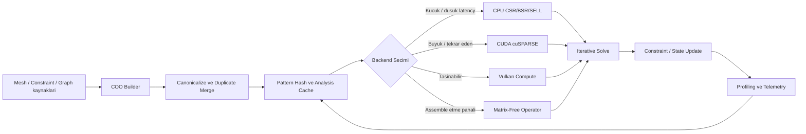
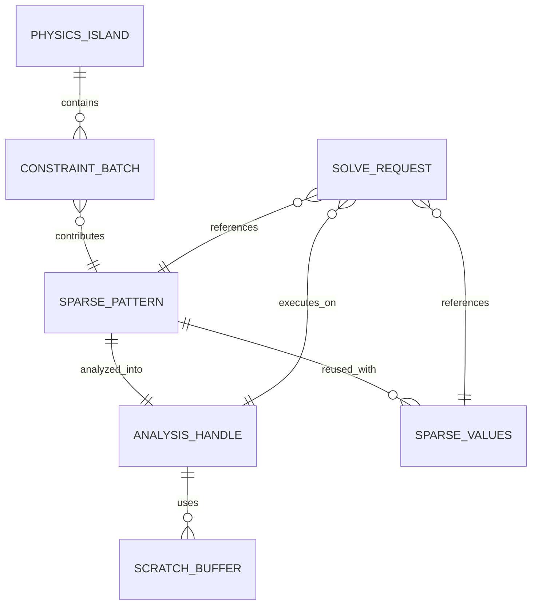
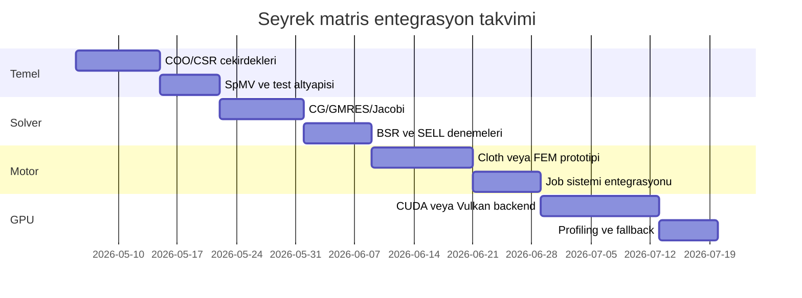

# Seyrek Matris Hesaplamaları ve Özel Oyun Motoru İçin Uygulamalı Rehber

## Yönetici özeti

Bu rapor, C++ tabanlı masaüstü bir oyun motoru varsayımıyla hazırlanmıştır; ana hedef platformlar Windows ve Linux, hızlandırılmış GPU yolu için CUDA, taşınabilir compute yolu için Vulkan kabul edilmiştir. Seyrek matris dünyasında asıl darboğaz çoğu zaman “aritmetik” değil “veri hareketi”dir: SpMV, SpMM, üçgensel çözüm ve önkoşullayıcı uygulaması gibi çekirdekler tipik olarak bellek bant genişliği, düzensiz erişim ve dolaylı indeksleme tarafından sınırlanır. Bu yüzden doğru formatı seçmek, çoğu pratik sistemde “hangi solver” sorusundan bile daha kritik hale gelir. citeturn36view0turn20view3turn20view13

Oyun motoru açısından en önemli sonuç şu: **her fizik veya grafik problemini seyrek matris olarak ifade etmek doğru değildir**. Rijit cisim temas çözümleri ve birçok gerçek-zamanlı constraint sistemi için matrix-free, warm-start’lı, Gauss-Seidel ailesi iteratif yöntemler daha düşük gecikmeli ve daha oyun-dostudur; buna karşılık örtük cloth, FEM/deformable, projective dynamics’in global adımı, mesh smoothing, Poisson/Laplacian tabanlı araçlar, batched graph analitiği ve offline asset solve hatları doğrudan seyrek matris altyapısından büyük fayda görür. Baraff–Witkin cloth sistemi her adımda büyük seyrek lineer sistemi modified CG ile çözerken, Projective Dynamics hem FEM hem de PBD çizgileri arasında köprü kurup global solve’u pratik hale getirir; Box2D tarafındaki sequential impulses ise özellikle hızlı ve kararlı iteratif constraint çözümünü öne çıkarır. citeturn26view1turn41view0turn21view12turn21view13

Pratik olarak senin motoruna en uygun ilk strateji şudur: içeride **COO biriktirici + kanonik CSR/BSR yürütme biçimi** kur; CPU tarafında önce güçlü bir SpMV/CG/GMRES/Jacobi/ILU temeli oluştur; ardından aynı pattern’in çok çerçeve tekrarlandığı, büyük ve bağlı sistemlere CUDA/cuSPARSE backend’i ekle; direct solver’ı ise editör, bake, import, mesh processing ve yüksek doğruluk isteyen offline yol için opsiyonel modül olarak tut. oneMKL ve PARDISO, Intel odaklı CPU/SYCL yolunda; PETSc ve Trilinos ise daha “framework” ölçeğinde soyutlama, preconditioner ve çoklu backend desteğinde anlamlıdır. Vulkan compute taşınabilir bir özel-kernel yoludur; fakat Vulkan’daki “sparse resources” özelliği seyrek lineer cebir değil, parçalı bellek bağlama mekanizmasıdır. citeturn20view14turn31view1turn20view15turn20view13turn20view10turn20view11turn20view12

Kısacası, motor mimarisi açısından “tek solver” değil, **çok katmanlı bir sparse stratejisi** gerekir: küçük ve çok sayıda ada için matrix-free iteratif; orta ölçekli tekrar eden deformable sistemler için assembled CSR/BSR + preconditioned iterative; editör/offline araçlar için direct factorization; büyük ve tekrar eden solve aralıkları için GPU sparse backend. Bu hibrit yaklaşım hem gecikmeyi kontrol eder hem de sistemi gelecekte FEM, cloth, graph analytics ve procedural toolchain tarafına açar. citeturn21view14turn21view9turn42view2turn26view8

## Temel teori

Seyrek matris, çoğu girdisi sıfır olan ve yalnızca sıfır olmayan katsayıları saklayarak bellek ile zaman kazancı sağlayan matristir. Birçok gerçek problemde bu yapı doğrudan problem topolojisinden gelir: grafiklerde adjacency/incidence/Laplacian yapıları, mesh ve FEM’de ise her elemanın yalnızca yerel komşulara bağlanması küresel sistem matrisini doğal olarak seyrek yapar. GraphBLAS yaklaşımı bu ilişkiyi özellikle netleştirir: graf sparse adjacency matrisi olarak yazıldığında, BFS gibi işlemler sparse matrix-vector adımlarıyla ifade edilebilir; FEM tarafında ise Projective Dynamics ve PhysX soft body belgeleri, deformable sistemlerin yerel eleman/constraint katkılarından oluşan büyük ama yerel bağlantılı sistemler kurduğunu gösterir. citeturn42view2turn26view5turn21view9turn41view0

### Format aileleri

Aşağıdaki tablo, format tanımlarından türetilmiş pratik bir özet veriyor. Depolama maliyetleri genel olarak `S = değer boyutu`, `I = indeks boyutu`, `m = satır`, `n = sütun`, `nnz = sıfır olmayan eleman sayısı`, `K = satır başına pad edilmiş maksimum nonzero`, `b = blok boyutu`, `nnzb = sıfır olmayan blok sayısı` kabul edilerek yazılmıştır. Format tanımları cuSPARSE, Eigen, PETSc ve SELL-C-σ çalışmasıyla uyumludur. citeturn24view0turn20view0turn24view2turn24view3turn23view2turn30view0turn33search0

| Format | Yaklaşık depolama | Güçlü taraf | Zayıf taraf | Motor için en mantıklı kullanım |
|---|---:|---|---|---|
| COO | `nnz*(S + 2I)` | Montaj, debug, incremental ekleme kolay | İşletim sırasında CSR kadar verimli değil | Constraint/element katkılarını toplamak |
| CSR | `nnz*(S + I) + (m+1)I` | CPU/GPU’de standart SpMV, iyi genel amaç | `x` vektörüne gather erişim düzensiz | Genel solve, cloth/FEM, graph kernels |
| CSC | `nnz*(S + I) + (n+1)I` | Sütun tabanlı direct/transpose işlemlerinde iyi | Satır ağırlıklı SpMV için zayıf | Direct solver arayüzleri, factorization |
| ELL | `m*K*(S + I)` | Düzenli satır uzunluklarında çok hızlı, SIMD/SIMT dostu | Padding patlayabilir | Uniform stencil/grid benzeri yapılar |
| SELL-C-σ | slice/padding’e bağlı | Geniş SIMD için iyi “catch-all” kompromis | Tuning ister | CPU SIMD odaklı yürütme |
| BSR | `nnzb*(b*b*S + I) + (mb+1)I` | Küçük dense bloklarla locality ve vectorization artar | Blok boyutu kötü seçilirse israf | 3x3, 6x6, 12x12 fizik/eleman blokları |
| Blocked-ELL | block-padded | Düzenli blok yapısında GPU için etkili | Padding ve dönüşüm maliyeti | Tetra/hex element blokları, özel GPU kernel |

Buradaki pratik kural basit: **montaj için COO, yürütme için CSR/BSR, çok düzenli satır yapısında ELL/SELL**. Özellikle fizik ve geometri tarafında 3D pozisyon, hız, dönme ya da tetra eleman katkıları doğal küçük yoğun bloklar halinde gelir; bu yüzden bloklu formatlar teoride “opsiyonel” görünse de pratikte ciddi fark yaratabilir. cuSPARSE BSR ve Blocked-ELL desteği, Eigen’in block sparse yapısı, PETSc’in BAIJ tipi ve Warp’ın BSR odaklı sparse modülü bunu doğrular. citeturn24view2turn24view3turn21view7turn21view8turn21view11

### Grafik ve mesh ile ilişki

Graf problemi tarafında sparse lineer cebirin en güzel tarafı, veri modelinin doğrudan adjacency veya incidence matrisi olmasıdır. GraphBLAS forumu açıkça, bir graf sparse adjacency matrisi olarak temsil edildiğinde BFS adımının bir sparse matrix-vector çarpımı olduğunu ve semiring genellemesiyle çok sayıda paralel graph algoritmasının kurulduğunu vurgular. SuiteSparse:GraphBLAS makalesi de breadth-first search, single-source shortest path, all-pairs shortest paths, PageRank ve merkezilik ölçülerinin bu çerçevede yazılabildiğini gösterir. Oyun motorunda bu özellikle klasik tek-ajan A*’dan çok, **çok kaynaklı erişilebilirlik, navmesh analitiği, influence propagation, visibility/precompute ve batched AI sorguları** için anlamlıdır. citeturn42view2turn42view0turn42view1

Mesh ve deformable sistemlerde ise seyrekliğin kaynağı “yerel etkileşim”dir. PhysX soft body dokümanı FEM tabanlı soft body simülasyonunun iki tetra mesh kullandığını söyler; Projective Dynamics ise local constraint/energy’lerden tek bir global implicit solve’a giden yolu kurar. Yani bir vertex ya da element, tüm sahneyle değil yalnızca komşuluk bölgesiyle kupledir; bu da global matrisin sparse olmasını sağlar. Bu, oyun motorunda cloth, volume-preserving softbody, shape matching benzeri sistemler için tam isabet bir modeldir. citeturn21view9turn41view0

### Sayısal kararlılık, koşulluluk ve önkoşullama

Sayısal tarafta en kritik kavram **condition number** yani `κ(A)`’dir. İll-conditioned bir sistemde küçük bir residual, küçük gerçek hata anlamına gelmeyebilir; klasik bağıntı, göreli çözüm hatasının göreli residual ile `κ(A)` ölçeğinde büyüyebileceğini gösterir. Başka deyişle, residual tek başına “çözdüm” demek için yeterli değildir; özellikle fiziksel sertlik kontrastı yüksek, kötü ölçeklenmiş veya neredeyse tekil alt-yapılar içeren sistemlerde bu çok görünür hale gelir. citeturn38view1turn38view0

Önkoşullama bu yüzden lüks değil merkezî araçtır. PETSc KSP el kitabı, modern iteratif lineer çözüm kodlarının merkezinde “Krylov yöntemi + preconditioner” ikilisinin olduğunu açıkça söyler. Qiang Ye’nin çalışması ise ill-conditioning’in hem iteratif yakınsamayı yavaşlattığını hem de doğruluğu sınırladığını; uygun `M ≈ A` önkoşullayıcısının sistemi daha iyi koşullu bir forma dönüştürerek yakınsamayı hızlandırdığını ve yeterince doğru uygulanırsa doğruluğa da yardım edebildiğini tartışır. Pratik karşılıkları Jacobi, block-Jacobi, ILU/IC, algebraic multigrid, Schur complement tabanlı yaklaşımlar ve problem-spesifik block preconditioner’lardır. citeturn20view3turn38view2turn13search0turn13search17

### Iterative ve direct solver ayrımı

Iteratif yöntemler, özellikle büyük sparse sistemlerde runtime için genelde ilk tercihtir. PETSc KSP belgeleri CG, GMRES ve benzeri Krylov yöntemlerini merkezî arayüz olarak sunar; aynı belgede CG’nin doğal normunun symmetric positive-definite sistem bağlamında tanımlandığı, GMRES’in ise genel nonsymmetric lineer sistemler için temel yöntemlerden biri olduğu görülür. Bu seni oyunda şu ayrıma götürür: **SPD elastik/global sistemlerde CG/PCG**, daha genel asimetrik sistemlerde **GMRES/BiCGSTAB/TFQMR** ailesi düşünülür. citeturn43view0turn43view1turn43view3

Direct solver tarafında resim daha farklıdır. PARDISO dokümanı SPD için `A = LL^T`, nonsymmetric için `A = LU`, symmetric indefinite için `A = LDL^T` faktorizasyon kullandığını açıkça belirtir. CHOLMOD arama/factorization aşamasında fill-reducing ordering ve symbolic factorization uygular; UMFPACK unsymmetric multifrontal sparse LU gerçekleştirir; SuiteSparseQR ise multifrontal, multithreaded sparse QR yaklaşımıyla daha zor veya least-squares ağırlıklı problemlerde güçlüdür. Direct solver’ların temel artısı sağlamlık ve tekrar çözümlerde yüksek kalite; temel eksisi ise fill-in ve bellek tüketimidir. Gerçek-zamanlı motorda bu yüzden onları çoğu zaman **offline, editör, import, baking veya aynı yapıyı çok kez çözen özel alt-sistemler** için ayırmak daha akıllıcadır. citeturn20view15turn11search0turn12search2turn6search7

## Veri yapıları ve hesaplama kalıpları

C++ implementasyonunda seyrek altyapının kalbi, “problem tanımı” ile “yürütme biçimi”ni ayırmaktır. COO benzeri bir builder katmanı; ardından kanonik CSR/BSR/SELL yürütme katmanı; onun üstünde de solver planı ve analysis cache olmalı. Bu ayrım, bir frame’de yalnızca değerler değişirken topolojinin sabit kalabildiği cloth/FEM tipinde altın değerindedir. cuSPARSE, oneMKL ve PARDISO’nun analysis/optimize aşamalarını ayrı tutması da tam olarak bu mühendislik ilkesini yansıtır. citeturn20view14turn31view1turn21view1turn20view15

Eigen’in sparse yapısı, motor içi referans model olarak çok öğreticidir. Dokümana göre `SparseMatrix` dört kompakt diziyle tutulur: `Values`, `InnerIndices`, `OuterStarts`, `InnerNNZs`; ayrıca row-major veya column-major seçilebilir. Sıralı inner-index eklemeleri yeniden allocation gerekmiyorsa `O(1)` olurken, rastgele ekleme `O(nnz_j)` maliyetine kayabilir. `makeCompressed()` çağrısı fazla boş alanı atar ve dış kütüphane wrapper’larının çoğu da zaten compressed giriş bekler. Bu tam olarak şunu söyler: **runtime yürütme matrisin compressed olması gereken yer, editör/builder ise esnek ama geçici alan**. citeturn23view2turn23view1turn23view0turn23view3

PETSc burada çok net bir performans dersi veriyor: doğru preallocation, matrix assembly performansını **50 kattan fazla** artırabilir. Aynı ailenin başka bir manuel sayfası, sıralı ve row-oriented girişin genellikle en hızlı assembly yolu olduğunu da söylüyor. Kendi motorunda bu, her constraint/element türü için “row nnz tahmini” tutmak, memory pool’dan tek seferde büyük bloklar ayırmak ve canonicalization öncesi duplicate toplama yapmak demek. Naif `push_back` + her frame sort + her frame reallocate yaklaşımı burada ciddi zaman kaybettirir. citeturn21view0turn33search16

Cache davranışı açısından en kritik gerçek, sparse çekirdeklerin çoğunda `values` ve `indices` akışının nispeten düzgün, fakat sağ taraf vektörü `x` erişimlerinin gather tarzı ve düzensiz olmasıdır. Bell–Garland raporu SpMV’yi açıkça memory-bandwidth verimliliği üzerinden tartışır; SELL-C-σ çalışması da geniş SIMD birimlerinde klasik CRS/CSR’nin kısa satır, fill ve düşük vectorization sorunlarını hafifletmek için slice tabanlı bir format önermiştir. PETSc MATSELL de benzer biçimde, contiguous row gruplarında benzer nonzero sayıları varsa AVX2/AVX512 destekli CPU’larda daha iyi performans verebildiğini söyler. Bu nedenle row-length histogram’ı ve satır başına nonzero varyansı, format seçimi için solver residual’ı kadar önemli metriklerdir. citeturn36view0turn30view0turn33search0

Bloklu formatlar oyun motorunda teorik değil, çok pratik bir avantaj sunar. Rijit cisim, articulated body ve deformable element katkılarında 3x3, 6x6 veya 12x12 gibi küçük yoğun bloklar doğal olarak ortaya çıkar. cuSPARSE BSR ve Blocked-ELL’i, PETSc BAIJ’i, Kokkos sparse container’ları ve Eigen block sparse yapısını bu yüzden es geçmemek gerekir. Bir scalar CSR sistemiyle aynı problemi temsil etmek çoğu zaman daha taşınabilir görünür; ama block locality, daha az indeks overhead’i ve daha iyi SIMD/SIMT kullanımı yüzünden BSR sahada çoğu kez daha iyi sonuç verir. citeturn24view2turn24view3turn21view8turn21view7turn21view6

Bir diğer kritik desen **matrix-free operator** yaklaşımıdır. PETSc’in `MATSHELL` tipi tam olarak “kendi veri yapınla ama standard mat-vec arayüzüyle” çalışmayı hedefler. Oyun motorunda özellikle contact Jacobian’ı, procedural stiffness operator’ları veya FFT/Laplacian benzeri örtük yapıların assemble edilmeden uygulanabildiği durumlarda bu çok değerlidir. Benim net önerim: assembled CSR/BSR yoluna ek olarak, aynı `ISparseOperator` arayüzünde matrix-free bir backend mutlaka bulunmalı. Ưsulsüz fizik alt-sistemlerini oraya koyarsın; doğrulama ve offline referans için assembled yolu saklarsın. citeturn33search3turn33search5

### Önerilen çekirdek veri modeli

Aşağıdaki iskelet, motor içi sparse altyapıyı “pattern / values / analysis / backend” diye ayıran pratik bir başlangıçtır:

```cpp
enum class SparseFormat : uint8_t {
    CSR,
    BSR,
    SELL,
    MatrixFree
};

struct SparsePattern {
    uint32_t rows = 0;
    uint32_t cols = 0;
    std::vector<uint32_t> outer;     // CSR row_ptr / BSR block_row_ptr
    std::vector<uint32_t> inner;     // CSR col_idx / BSR block_col_idx
    SparseFormat format = SparseFormat::CSR;
    uint16_t blockSize = 1;          // BSR için 1,3,6,12...
    uint64_t topologyHash = 0;       // constraint/mesh pattern için cache anahtarı
};

struct SparseValues {
    std::vector<float> values;
    uint32_t frameStamp = 0;
};

struct AnalysisHandle {
    uint64_t topologyHash = 0;
    SparseFormat optimizedFormat = SparseFormat::CSR;
    void* native = nullptr;          // cuSPARSE / oneMKL / custom backend planı
};

struct SolveRequest {
    const SparsePattern* pattern = nullptr;
    const SparseValues*  values  = nullptr;
    const float* rhs = nullptr;
    float* solution = nullptr;
    uint32_t maxIters = 0;
    float relTol = 1e-4f;
    bool warmStart = true;
};

class ISparseBackend {
public:
    virtual ~ISparseBackend() = default;
    virtual bool CanHandle(const SparsePattern&) const = 0;
    virtual AnalysisHandle Analyze(const SparsePattern&) = 0;
    virtual void Solve(const AnalysisHandle&, const SolveRequest&) = 0;
};
```

Bu ayrımın püf noktası, `SparsePattern` değişmediği sürece analysis/ordering/preprocess planını saklayabilmendir. Değerler frame frame değişse bile symbolic bilgi ve scratch buffer düzeni çoğu zaman yeniden kurulmaz.

## Paralel donanım ve kütüphane ekosistemi

CPU tarafında ilk gerçek ayrım “düşük gecikme” ve “yüksek throughput” arasındadır. Küçük ve orta boy solve’larda, özellikle fizik adaları çok parçalıysa, iyi cache’lenmiş bir CPU CSR/BSR/SELL yolu sık sık GPU’dan daha mantıklıdır. PETSc’in MATSELL notları AVX2/AVX512 için düzenli row gruplarında avantaj gösterebildiğini, SELL-C-σ çalışması da wide SIMD mimariler için tek bir “catch-all” format yaklaşımının mümkün olduğunu söyler. KokkosKernels sparse API’si CSR, BSR, CCS ve COO container’larıyla bu alanın taşınabilir C++ cephesini sunar. citeturn33search0turn30view0turn21view6turn21view5

Çok iş parçacıklı CPU planlamasında sparse hesaplar için anahtar kavram **bağımsız ada ve batchleme**’dir. Bullet’ın multithreaded sequential impulse solver’ı constraint’leri batch ve phase’lere ayırarak aynı faz içindeki batch’leri paralel çözmeyi hedefler. Jolt soft body mimarisi ise broadphase, collide, simulate, finalize işleri halinde ilerleyip tek bir soft body üzerinde bile çoklu thread çalıştırabilir. Bu, motor iş sistemi tarafından sparse solve’un “tek dev iş” değil, çok kademeli ve adalaştırılmış bir pipeline olarak ele alınması gerektiğini gösterir. citeturn21view14turn22view0turn22view2

GPU/CUDA tarafında entity["company","NVIDIA","gpu vendor"] ekosisteminin açık avantajı, hazır sparse BLAS çekirdeklerinin olgunluğudur. cuSPARSE Generic API; SpMV, SpMM ve benzeri temel işlemleri; CSR/COO gibi formatları; batch ve mixed data type senaryolarını destekler. `cusparseSpSV()` ayrıca analysis sonrası `updateMatrix()` ile değer güncelleme, CUDA graph capture ve hardware memory compression gibi optimizasyonlara da sahiptir. CUDA programlama kılavuzu warp shuffle fonksiyonlarının modern GPU’larda mevcut olduğunu söyler; bu da “one warp / one row” veya row reduction tarzı custom kernel yazımını pratik kılar. Kısacası, büyük ve tekrar eden solve’larda en kısa yol genelde ya doğrudan cuSPARSE’tır ya da cuSPARSE etrafında çok ince özel kernel’dir. citeturn20view13turn21view1turn28search1turn14search2

entity["company","Intel","chipmaker"] tarafında oneMKL’in iyi yanı, analysis ve execution ayrımını sürdüren inspector-executor yaklaşımıdır. `mkl_sparse_optimize()` ve SYCL tarafındaki `oneapi::mkl::sparse::optimize_gemv()` matris yapısını analiz edip optimize edilmiş veriyi handle içinde saklar; SYCL sürümünde bu optimizasyonların CPU ve GPU cihazlarında CSR/COO için desteklendiği de dokümana yazılmıştır. PARDISO ise aynı yapıya sahip ve benzer değerlere sahip çoklu matrislerde low-rank update ile factorization’ı hızlandırabilen, çok olgun bir CPU direct solver yoludur. Eğer motorunda editör araçları, static mesh solve veya aynı topolojide tekrar tekrar çözüm yapacaksan, oneMKL/PARDISO güçlü adaydır. citeturn20view14turn31view1turn20view15turn31view0

PETSc ve Trilinos farklı bir ligdedir: bunlar birer “tek kütüphane” değil, geniş solver ekosistemleri ve soyutlama katmanlarıdır. PETSc matris yaşam döngüsünü, KSP/PC solver-preconditioner çerçevesini, GPU matris tiplerini (`MATAIJCUSPARSE`) ve matrix-free shell yaklaşımını tek bir çatıda sunar; ayrıca hypre BoomerAMG’yi CUDA/HIP tarafına bağlayabilir. Trilinos tarafında Tpetra paralel sparse obje katmanını, Belos iteratif solver’ları, MueLu algebraic multigrid’i ve Ifpack2 incomplete factorization/preconditioner ailesini taşır; Kokkos üzerinden de performans taşınabilirliği hedefler. Runtime core’a bunları gömmek ağır olabilir; ama büyük ölçekli araç zinciri, araştırma branch’i veya solver plugin’i için son derece güçlüdürler. citeturn20view2turn20view3turn21view3turn32search0turn32search12turn20view4turn20view5turn20view6turn20view7turn32search5

entity["company","Apple","consumer tech company"] ve Vulkan tarafında önemli mühendislik notu şu: **Vulkan’daki sparse resources, sparse algebra değildir**. Vulkan compute belgeleri storage buffer’lar üzerinden genel amaçlı hesap yazmayı, subgroup belgeleri de ince taneli verimli paylaşımı anlatır; sparse resources ise `VkBuffer` ve `VkImage` nesnelerini non-contiguous `VkDeviceMemory` bloklarına bağlama mekanizmasıdır. Yani Vulkan’da sparse lineer cebir yapmak istiyorsan yolun “sparse residency” değil, compute shader + storage buffer + subgroup optimizasyonudur. Apple tarafında ise resmi sparse solver’lar Accelerate altında belgelenir ve sparse matrix oluşturma yolu CSC olarak anlatılır; Metal belgeleri compute threadgroup ve SIMD-group programlama modelini sunar. Bu yüzden macOS ekleyeceksen pratik yol çoğu zaman önce CPU Accelerate, sonra gerekiyorsa özel Metal compute kernel olur. citeturn20view10turn20view11turn20view12turn7search3turn7search7turn7search14turn14search5turn14search1

### Kütüphane karşılaştırması

| Kütüphane | En güçlü olduğu yer | Motor entegrasyonundaki rolü | Zayıf yan / dikkat |
|---|---|---|---|
| Eigen | Header-only geliştirme hızı, küçük/orta boy sparse projeler, referans implementasyon | Engine içi baseline CPU path, araçlar, testler | Çok büyük backend çeşitliliği ve ileri sparse ekosistem için sınırlı |
| oneMKL + PARDISO | Intel CPU/SYCL optimizasyonu, inspector-executor, olgun direct solver | Editör/offline solve, Intel ağırlıklı workstation hattı | Vendor ağırlığı ve entegrasyon karmaşıklığı |
| SuiteSparse | CHOLMOD, UMFPACK, SPQR, GraphBLAS, benchmark ekosistemi | Offline direct solve, graph analytics, referans doğrulama | Çekirdek runtime için paket seçimi dikkat ister |
| cuSPARSE | GPU sparse BLAS, SpMV/SpMM/SpSV, mixed type | Büyük tekrar eden runtime solve, CUDA backend | CUDA bağımlılığı, küçük işlerde launch/transfer maliyeti |
| PETSc | Solver/preconditioner framework, shell matris, GPU backend, AMG entegrasyonu | Araştırma branch’i, solver plugin, matrix-free deneyler | Runtime core için ağır olabilir |
| Trilinos | Tpetra/Belos/MueLu/Ifpack2 + Kokkos portability | HPC-esintili modüler solver katmanı | Build ve dependency maliyeti yüksek |

Bu tablonun dayanağı Eigen sparse tutorial’ı, oneMKL sparse optimize ve PARDISO belgeleri, SuiteSparse ana sayfası ve Matrix Collection açıklamaları, cuSPARSE Generic API ve PETSc/Trilinos resmi sayfalarıdır. Özellikle SuiteSparse Matrix Collection’ın repeatable benchmark sağlaması ve GraphBLAS bağlantısı, araç zinciri ile doğrulama hattı için ekstra değerlidir. citeturn23view0turn20view14turn20view15turn12search17turn26view8turn20view13turn20view2turn20view3turn20view4turn20view5turn20view6turn20view7

## Oyun motorunda kullanım alanları

Rijit cisim ve joint/contact çözümü, sparse lineer cebirin en ilginç ama en yanıltıcı oyun motoru alanıdır. Box2D constraint notları “global solver yavaş, iterative solver hızlı” ayrımını çok net kurar ve sequential impulses’ı hızlı/kararlı iteratif constraint çözümü olarak konumlandırır. Bullet’ın multithreaded sequential impulse solver’ı da constraint’leri batch ve phase’lere ayırarak paralelleştirir. Bunun pratik sonucu şu: rijit body solver’ını doğrudan dev bir explicit sparse matris çözümüne çevirmek çoğu oyun için gereksizdir; ama constraint Jacobian yapısını sparse olarak düşünmek, batchleme, graph coloring ve island decomposition tasarımını iyileştirir. citeturn21view12turn21view13turn21view14

Cloth ve deformable tarafında sparse yaklaşım çok daha doğrudan fayda sağlar. Baraff–Witkin sistemi her zaman adımında büyük, unbanded sparse lineer sistemi modified conjugate gradient ile çözer ve büyük zaman adımları alabilir. Projective Dynamics ise yerel projection/energy katkılarından global implicit solve kurup farklı constraint türlerini tek çatı altında toplar; yazarların sayfasındaki örnekte 49k DoF ve 43k constraint içeren sahne 10 iterasyon/frame ile 3.1 ms/iterasyon düzeyinde raporlanır. Daha yeni GPU tabanlı penetration-free projective dynamics çalışması ise 265K DOF’a kadar sahnelerde 7.7–26.8 FPS aralığı verir. Yani cloth/FEM için assembled sparse solve, gerçek-zaman ile offline arasında en net köprüdür. citeturn26view1turn41view0turn26view3

FEM soft body ve volumetrik deformasyon kullanıyorsan sparse yaklaşım daha da doğal hale gelir. PhysX soft body dokümanı, soft body simülasyonunun FEM ve iki tetrahedral mesh kombinasyonuyla kurulduğunu açıkça söyler. Böyle sistemlerde global matrisin blok yapısı genellikle 3x3 veya 12x12 yerel katkılardan oluşur; dolayısıyla BSR/Block-CSR sadece teorik değil, çok pratik bir veri biçimidir. Runtime’da PCG + block-Jacobi/ILU; editörde ise Cholesky/LU/QR gibi direct yol birlikte bulunabilir. citeturn21view9turn24view2turn21view8

Pathfinding ve graph algoritmalarında sparse lineer cebir “tek ajan A*’ı değiştirecek sihir” değildir; ama batched ve analitik taraflarda çok güçlüdür. GraphBLAS belgeleri ve SuiteSparse:GraphBLAS makalesi BFS, SSSP, APSP ve PageRank benzeri birçok işlemi sparse matris/vektör ve semiring diliyle ifade eder. Oyun motorunda bunun en mantıklı kullanım alanları; navgraph reachability önhesabı, çok kaynaklı etki yayılımı, area connectivity analizi, spawn/escape heatmap’leri ve araç tarafında toplu graph sorgularıdır. Tek aktörlü, heuristikli A* hâlâ latency açısından adjacency-list ekseninde kalır; ama çoklu sorgu ve offline analizde sparse algebra çok güçlüdür. citeturn42view2turn42view0turn26view5

Animasyon skinning ilk bakışta sparse lineer cebir değilmiş gibi görünür, ama özünde seyrek ağırlık operatörüdür. glTF 2.0 spesifikasyonu, vertex başına joint etkisinin set başına en fazla 4 olduğunu ve skinning matrisinin joint matrislerinin ağırlıklı lineer birleşimi olduğunu söyler. Bu, klasik runtime skinning için “genel CSR” kullan demek değil; tam tersine, sparsity **o kadar küçük ve sabittir ki** en iyi temsil genellikle `uvec4 joints + vec4 weights` biçimidir. Yani burada genel sparse solver değil, sparse düşünce biçimi önemlidir: sabit düşük dereceli bir operatörü özel veri yapısıyla temsil etmek gerekir. Jolt soft body skinning dokümanı da cloth’ı karakter animasyonuna kısmen “weighted” constraint’lerle bağlayan benzer fikri gösterir. citeturn17view0turn17view3turn22view0turn22view2

Collision detection’da broadphase’in kendisi tipik olarak sparse lineer cebir problemi değildir; ama collision response ve contact solve kesinlikle sparse/graph-lokal bir yapıdır. Özellikle contact manifold’lar yalnızca ilgili body çiftlerini bağladığından, constraint grafı seyrektir. Jolt’un collide/simulate/finalize işi ve Bullet’ın batch/phase çözümü de bunu doğrular. Benim önerim burada şu: broadphase ve narrowphase’i klasik veri yapılarında bırak; ama contact graph, island builder ve constraint solve katmanını sparse-aware tasarla. citeturn21view14turn22view2

### Gerçek zaman ve offline ayrımı

Gerçek-zamanlı çözümde öncelik “mutlak doğruluk” değil, **sınırlı iterasyonla kararlı görünüş, düşük gecikme, deterministik maliyet ve warm start**’tır. Box2D’nin accumulated impulse yaklaşımı ve iteratif solver vurgusu bu çizgiye çok iyi oturur. Buna karşılık offline / editor / bake tarafında aynı pattern’e sahip sistemi daha sağlam direct factorization ile çözmek, ordering ve symbolic phase’e daha çok zaman ayırmak, hatta birden çok RHS çözümü almak mantıklıdır. PARDISO’nun same-structure low-rank update notu da bu tekrar eden yapı senaryoları için özellikle kıymetlidir. citeturn21view13turn20view15

## Optimizasyon ve entegrasyon planı

Sparse sistemleri hızlı yapan şey çoğu zaman “daha akıllı matematik” değil, **aynı sparsity pattern’i yeniden kullanmak**tır. oneMKL `mkl_sparse_optimize()` ve `optimize_gemv()` ile, cuSPARSE `updateMatrix()` ile, PARDISO ise aynı yapıdaki matrisler için update/factorization mekanizmalarıyla bu fikri kurumsallaştırır. Senin motorda da pattern ve values ayrımı, analysis cache, scratch buffer pool ve solver plan cache ilk günden olmalı; aksi halde her frame symbolic fazı yeniden ödersin. citeturn20view14turn31view1turn21view1turn20view15

Preallocation ve canonical input da doğrudan optimizasyondur. PETSc’nin >50x assembly kazancı notu bunu açıkça söylüyor. Bu yüzden element/constraint montajında satır başı nnz tahmini, duplicate birleştirme, sorted row-oriented katkı ve arena/pool tabanlı geçici buffer ayırma; bütün “mikro optimizasyonlardan” önce gelir. Eğer bu taban zayıfsa, üzerine koyduğun SIMD, CUDA veya fancy preconditioner çoğu zaman beklenen farkı yaratmaz. citeturn21view0turn33search16

Format dönüşümü de önemli bir optimizasyon kaldıraç noktasıdır. Scalar CSR tek başına iyi bir başlangıçtır; fakat rigid-body ve FEM benzeri bloklu yapılarda BSR’a dönüşüm, CPU’da SELL/MATSELL’e dönüşüm veya GPU’da düzenli bloklar için Blocked-ELL türevi layout’lar doğrudan bant genişliği verimini artırabilir. Benim önerim: canonical formatın CSR olsun, ama analysis fazı sırasında “execution format recommendation” de üret. Aynı pattern için hem CPU hem GPU candidate plan saklamak, backend seçiminde çok işe yarar. citeturn24view2turn24view3turn33search0turn30view0

Batched solve da çoğu motorda gözden kaçıyor. ODTÜ’deki SpMM tezi, sparse matrix–multiple vectors çarpımının birçok problemde temel ve pahalı bir primitif olduğunu vurgular; cuSPARSE Generic API da SpMM’i doğrudan destekler. Bir frame’de aynı topolojiye sahip çok sayıda cloth parçası, aynı stiffness pattern’ine sahip çoklu RHS, ya da AI/graph tarafında çok kaynaklı frontier güncellemesi varsa, tek tek SpMV çağırmak yerine SpMM düşünmek gerekir. Bu, hem cache tarafında hem GPU launch overhead tarafında daha iyi ölçeklenir. citeturn26view9turn20view13

### Entegrasyon adımları

Benim önerdiğim entegrasyon sırası aşağıdaki gibi:

1. **Sparse temel tiplerini yaz.**  
   `TripletBuilder`, `CSRView`, `BSRView`, `DenseVectorView`, `AnalysisCacheKey` tiplerini tanımla. COO builder ile test/diagnostic kolay olur; execution tarafı CSR ile başlar. Bu, Eigen ve PETSc’in builder/compressed ayrımına bire bir uyar. citeturn23view0turn20view2

2. **Pattern–values ayrımını zorunlu kıl.**  
   Mesh topolojisi, constraint bağlantısı veya adjacency değişmediği sürece `topologyHash` sabit kalsın; sadece values güncellensin. Böylece oneMKL/cuSPARSE/PARDISO analysis sonucu yeniden kullanılabilir. citeturn31view1turn21view1turn20view15

3. **CPU referans backend’i önce bitir.**  
   İlk backend: CSR SpMV, transpose SpMV, CG, GMRES, Jacobi, block-Jacobi. Sonra ILU/IC veya direkt dış kütüphane adaptörü ekle. PETSc/Belos/Ifpack2 dokümantasyonu bu yolun teknik karşılıklarını çok iyi örnekler. citeturn20view3turn20view5turn20view7

4. **İş sistemine solver-aware fazlar ekle.**  
   `Assemble → Canonicalize → Analyze-or-Reuse → Solve → ScatterBack` ardışıklığı tek bir job değil; island bazlı bağımsız işler olmalı. Bullet ve Jolt mimarileri batch/phase yaklaşımının neden gerekli olduğunu net gösteriyor. citeturn21view14turn22view2

5. **GPU backend’i yalnız büyük ve tekrar eden işler için aç.**  
   Küçük sistemlerde CPU, büyük ve aynı pattern’i tekrar eden durumlarda GPU seç. cuSPARSE Generic API ile SpMV/SpMM temeli, sonra gerekirse custom kernel. Vulkan compute yolu taşınabilir fallback olarak ayrıca dursun. citeturn20view13turn20view10turn20view12

6. **Memory pool ve scratch yönetimini merkezileştir.**  
   Solver scratch, temporary reduction buffer, staging buffer ve device buffer ömürlerini frame allocator’dan ayır. Özellikle analysis buffer’ları topology yaşam süresine bağla; frame yaşam süresine değil. Bu yaklaşım inspector-executor modeline çok uygundur. citeturn20view14turn31view1

7. **Format seçim politikasını veriyle besle.**  
   Her solve için `nnz`, `nnz/row`, row-length variance, tekrar sayısı, RHS sayısı, solve süresi, bandwidth tahmini ve residual geçmişini kaydet. Sonra `CSR → BSR`, `CSR → SELL`, `CPU → CUDA` gibi kararları bu telemetriye bağla. SELL-C-σ ve MATSELL’in en büyük mesajı, tek formatın her matrise iyi davranmadığıdır. citeturn30view0turn33search0

8. **Doğrulama ve hata bütçesi kur.**  
   Residual, energy drift, penetration, constraint error ve frame budget birlikte takip edilmeli. Condition number yüzünden küçük residual her zaman küçük çözüm hatası anlamına gelmez; bu yüzden fiziksel invariant ve görsel hata metrikleri solver metrikleriyle birlikte izlenmeli. citeturn38view1turn38view2

### Önerilen mimari



### Veri ilişkileri



### C++ CPU başlangıç örneği

Aşağıdaki örnek, engine içinde hızlı bir referans CPU yolu kurmak için gayet iyi bir başlangıçtır. API mantığı Eigen’in sparse assembly ve compressed kullanımına yakındır. citeturn23view0turn23view1turn23view3

```cpp
#include <Eigen/Sparse>
#include <vector>

using SpMat = Eigen::SparseMatrix<float, Eigen::RowMajor, uint32_t>;
using Triplet = Eigen::Triplet<float, uint32_t>;

SpMat BuildLaplacianLikeSystem(uint32_t n)
{
    std::vector<Triplet> t;
    t.reserve(n * 3);

    for (uint32_t i = 0; i < n; ++i)
    {
        t.emplace_back(i, i, 2.0f);
        if (i > 0)     t.emplace_back(i, i - 1, -1.0f);
        if (i + 1 < n) t.emplace_back(i, i + 1, -1.0f);
    }

    SpMat A(n, n);
    A.setFromTriplets(t.begin(), t.end());
    A.makeCompressed();
    return A;
}

Eigen::VectorXf SolvePCG(const SpMat& A, const Eigen::VectorXf& b)
{
    Eigen::ConjugateGradient<SpMat, Eigen::Lower | Eigen::Upper,
                             Eigen::DiagonalPreconditioner<float>> cg;
    cg.setMaxIterations(64);
    cg.setTolerance(1e-4f);
    cg.compute(A);
    return cg.solve(b);
}
```

### CUDA cuSPARSE SpMV örneği

Bu örnek, Generic API akışının motor tarafında nasıl sarılabileceğini gösteriyor: descriptor kur, buffer size al, analysis/execute yap, handle’ı cache’le. API biçimi cuSPARSE Generic API belgeleriyle uyumludur. citeturn20view13turn28search2

```cpp
#include <cusparse.h>
#include <cuda_runtime.h>

struct CudaCsrSpMV {
    cusparseHandle_t handle{};
    cusparseSpMatDescr_t A{};
    cusparseDnVecDescr_t x{};
    cusparseDnVecDescr_t y{};
    void* buffer{};
    size_t bufferSize{};

    void Init(int rows, int cols, int nnz,
              int* dRowPtr, int* dColInd, float* dValues,
              float* dX, float* dY)
    {
        cusparseCreate(&handle);

        cusparseCreateCsr(&A,
            rows, cols, nnz,
            dRowPtr, dColInd, dValues,
            CUSPARSE_INDEX_32I, CUSPARSE_INDEX_32I,
            CUSPARSE_INDEX_BASE_ZERO, CUDA_R_32F);

        cusparseCreateDnVec(&x, cols, dX, CUDA_R_32F);
        cusparseCreateDnVec(&y, rows, dY, CUDA_R_32F);

        float alpha = 1.0f, beta = 0.0f;
        cusparseSpMV_bufferSize(
            handle,
            CUSPARSE_OPERATION_NON_TRANSPOSE,
            &alpha, A, x, &beta, y,
            CUDA_R_32F, CUSPARSE_SPMV_ALG_DEFAULT,
            &bufferSize);

        cudaMalloc(&buffer, bufferSize);
    }

    void Run()
    {
        float alpha = 1.0f, beta = 0.0f;
        cusparseSpMV(
            handle,
            CUSPARSE_OPERATION_NON_TRANSPOSE,
            &alpha, A, x, &beta, y,
            CUDA_R_32F, CUSPARSE_SPMV_ALG_DEFAULT,
            buffer);
    }
};
```

### Vulkan için basit CSR SpMV compute shader

Vulkan’da standart sparse BLAS yok; bu yüzden storage buffer + compute shader ile kendi çekirdeğini yazarsın. Aşağıdaki kernel, portable “baseline” örneğidir; optimize sürümde subgroup reduction ve satır-uzunluğu bazlı iş dağıtımı eklenir. Vulkan compute ve subgroup modeli resmi belgelerde anlatılır. citeturn20view10turn20view12

```glsl
#version 460
layout(local_size_x = 128) in;

layout(std430, binding = 0) readonly buffer RowPtr  { uint rowPtr[]; };
layout(std430, binding = 1) readonly buffer ColIdx  { uint colIdx[]; };
layout(std430, binding = 2) readonly buffer Values  { float values[]; };
layout(std430, binding = 3) readonly buffer X       { float x[]; };
layout(std430, binding = 4) writeonly buffer Y      { float y[]; };

layout(push_constant) uniform PC {
    uint numRows;
} pc;

void main() {
    uint row = gl_GlobalInvocationID.x;
    if (row >= pc.numRows) return;

    float sum = 0.0;
    uint begin = rowPtr[row];
    uint end   = rowPtr[row + 1];

    for (uint i = begin; i < end; ++i) {
        sum += values[i] * x[colIdx[i]];
    }

    y[row] = sum;
}
```

### CPU ve GPU fallback politikası

Aşağıdaki eşikler bilimsel sabit değil, engine için **başlangıç sezgisi** olarak düşünülmeli:

| Durum | İlk tercih |
|---|---|
| Çok sayıda küçük ada, düşük tekrar | CPU CSR / matrix-free |
| 3x3/6x6 bloklu yapı | CPU/GPU BSR |
| Düzenli satır uzunluğu ve SIMD ağır CPU | SELL / MATSELL |
| Aynı pattern, çok frame tekrar, büyük nnz | CUDA cuSPARSE |
| Portability önemli, vendor bağımlılığı istenmiyor | Vulkan compute |
| Editör, import, bake, yüksek doğruluk | Direct solver |
| Assembling pahalı, operator doğal ve lokal | Matrix-free shell |

## Vaka incelemeleri ve kıyaslar

Yayınlanmış performans rakamları “donanım ve problem sınıfı değişince bire bir karşılaştırılamaz”; yine de format ve solver kararları için çok değerli yön göstergelerdir. Bell–Garland çalışması, structured grid SpMV’de GTX 280 üzerinde single precision’da 36 GFLOP/s ve double precision’da yaklaşık 16 GFLOP/s; unstructured finite-element matrislerinde ise single’da 15+ GFLOP/s, double’da 10+ GFLOP/s ve yaklaşık 90 GB/s bant genişliği düzeylerini raporlar. Projective Dynamics örneği 49k DoF/43k constraint için 3.1 ms/iterasyon; penetration-free GPU PD ise 265K DoF için 7.7–26.8 FPS bildirir. PETSc’nin preallocation notu da assembly tarafında doğru veri yapısının tek başına 50x+ etki yapabildiğini gösterir. citeturn36view0turn29view0turn29view2turn29view3turn41view0turn26view3turn21view0

| Çalışma / sistem | Problem tipi | Raporlanan sonuç | Motor için çıkarım |
|---|---|---|---|
| Bell–Garland 2008 | Structured grid SpMV on CUDA | ~36 GFLOP/s SP, ~16 GFLOP/s DP | Düzenli sparsity, GPU ve format seçimini çok sever |
| Bell–Garland 2008 | Unstructured FE matrices | 15+ GFLOP/s SP, 10+ GFLOP/s DP, ~90 GB/s | Düzensiz yapıda bile GPU anlamlı; ama format farkı kritik |
| Projective Dynamics 2014 | Global implicit deformable solve | 49k DoF, 43k constraint, 3.1 ms/iter, 10 iter/frame | Runtime deformable için sparse global step pratik |
| Penetration-free PD GPU 2022 | GPU deformable + collision | 265K DoF, 7.7–26.8 FPS, `h = 1/100` | Büyük deformable sahnelerde GPU solve gerçekçi |
| PETSc assembly notu | Sparse matrix assembly | Doğru preallocation ile >50x | Veri yapısı ve montaj planı, solver kadar önemli |

Bu tabloyu üretirken kullanılan ana kaynaklar Bell–Garland CUDA raporu, Projective Dynamics yazar sayfası, GPU PD makalesi ve PETSc manual page’leridir. Bunların ortak mesajı, format/analysis/preallocation kararlarının aynı solver ailesi içinde bile bir mertebe fark yaratabildiğidir. citeturn36view0turn41view0turn26view3turn21view0

Engine içi benchmark kurarken bence iki veri kümesi aynı anda kullanılmalı. İlki, kendi sahnenden toplanmış gerçek matrisler: cloth stiffness, FEM tangent, contact island graph, nav adjacency, skinning weights. İkincisi ise SuiteSparse Matrix Collection gibi repeatable benchmark kaynaklarıdır; bu koleksiyon gerçek uygulamalardan gelen, kamuya açık ve tekrar üretilebilir sparse matrisler sağlar; bilgisayar grafikleri ve görüsü de dahil pek çok alanı kapsar. Bu sayede solver tuning’inin yalnız senin test sahnene overfit olmasını engellersin. citeturn26view7turn26view8

### Öğrenme yolu ve proje kilometre taşları

Bence en verimli öğrenme sırası “önce çekirdekler, sonra solver, sonra motor entegrasyonu” şeklinde olmalı:

- **Aşama bir**  
  COO builder, CSR canonicalization, transpose, duplicate merge, row histogram, basic SpMV. Burada amaç formatları içselleştirmek. Eigen sparse tutorial ve cuSPARSE format dokümanı ideal başlangıç kaynaklarıdır. citeturn23view2turn24view0turn20view0

- **Aşama iki**  
  CG, GMRES, Jacobi, block-Jacobi; residual ve gerçek hata farkını görmek için koşullu/ill-conditioned testler. PETSc KSP dokümanı ve conditioning notları burada çok faydalıdır. citeturn20view3turn43view1turn38view1turn38view2

- **Aşama üç**  
  BSR ve SELL denemeleri; satır uzunluğu dağılımının performansa etkisini ölçmek. PETSc MATSELL ve SELL-C-σ çalışması tam bu konuya odaklanır. citeturn33search0turn30view0

- **Aşama dört**  
  Küçük implicit cloth veya mass-spring sistemi yaz; explicit Euler ile implicit solve’u kıyasla. Baraff–Witkin ve Projective Dynamics burada doğrudan uygulama rehberidir. citeturn26view1turn41view0

- **Aşama beş**  
  GraphBLAS mantığıyla adjacency matrix üzerinden batched BFS/SSSP prototipi kur. Tek-ajan A* ile değil, çoklu kaynak propagation ve offline analytics ile kıyasla. citeturn42view2turn42view0

- **Aşama altı**  
  CUDA/cuSPARSE veya Vulkan compute backend’i ekle; küçük/orta/büyük problem eşiklerini kendi donanımında ölç. cuSPARSE Generic API ve Vulkan compute/subgroup belgeleri burada ana kaynaktır. citeturn20view13turn20view10turn20view12

### Önerdiğim uygulama takvimi



### Seçilmiş kaynaklar

Ana resmi ve birincil kaynakları şu sırayla çalışmanı öneririm:

- Eigen sparse tutorial ve quick reference; internal storage, compressed mode ve insertion davranışı için çok öğreticidir. citeturn23view2turn23view1turn23view0
- cuSPARSE storage formats ve Generic API belgeleri; CUDA backend yazacaksan temel referans bunlardır. citeturn24view0turn24view2turn24view3turn20view13turn21view1
- oneMKL sparse optimize / PARDISO belgeleri; CPU direct ve inspector-executor yolunu anlamak için. citeturn20view14turn31view1turn20view15turn31view0
- PETSc `mat`, `ksp`, `pc`, `MATSHELL`, `MATSELL`, `MATAIJCUSPARSE`; soyut solver mimarisi için çok değerli. citeturn20view2turn20view3turn33search3turn33search0turn32search0turn21view3
- Trilinos Tpetra, Belos, MueLu, Ifpack2; büyük solver stack düşünüyorsan. citeturn20view4turn20view5turn20view6turn20view7
- Bell–Garland SpMV on CUDA raporu; format-donanım ilişkisini gerçekten anlamak için hâlâ temel metinlerden biridir. citeturn36view0turn29view0turn29view2turn29view3
- Baraff–Witkin cloth ve Projective Dynamics; oyun/graphics tarafındaki sparse solve’un klasik uygulamalarıdır. citeturn26view1turn41view0
- GraphBLAS ve SuiteSparse:GraphBLAS; graph işlemlerini sparse algebra ile düşünmek için. citeturn42view2turn26view5turn42view0
- glTF 2.0 skinning bölümü; skinning’in neden fixed-degree sparse operatör gibi düşünülebileceğini net gösterir. citeturn17view0turn17view3

Türkçe veya Türkiye’den yakın kaynak olarak da üç malzeme özellikle iyi duruyor:  
entity["organization","Orta Dogu Teknik Universitesi","ankara university"] bünyesindeki “Parallel Sparse and Banded Matrix – Multiple Vectors Multiplication” tezi SpMM ve erişim örüntülerine odaklanıyor; yine aynı üniversitedeki paralel FEM altyapısı tezi seyrek matris sıkıştırma ve sınır matris çözümünü tartışıyor; entity["organization","Bogazici Universitesi","istanbul university"] ders notları ise conditioning/condition number tarafında kısa ama faydalı bir özet sunuyor. Bunlar doğrudan motor kodu yazdırmaz ama kavramsal boşlukları hızlı kapatır. citeturn26view9turn26view10turn38view0

Toparlarsam, özel oyun motorunda sparse altyapıyı başarıyla kullanmanın anahtarı “bir solver seçmek” değil, **problem sınıfına göre doğru sparse temsili ve doğru yürütme yolunu seçmek**tir. Rijit body/contact için sparse-aware ama çoğu zaman matrix-free iteratif yaklaşım; cloth/FEM/deformable için assembled CSR/BSR + preconditioned iterative; editör ve bake için direct factorization; büyük tekrar eden sistemler için CUDA sparse backend; portability gerekirse Vulkan compute; hepsinin üstünde de pattern cache, memory pool, telemetry ve job-system entegrasyonu. Bence uzun vadede seni en çok ileri taşıyacak setup tam olarak bu hibrit mimari olur. citeturn21view12turn21view14turn21view9turn20view13turn20view15turn20view10turn26view8