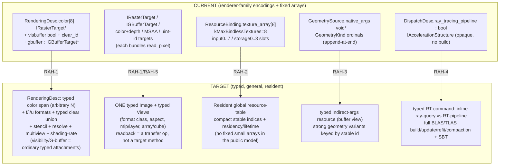

# RAH-0 — Canonical GPU-model audit (design note)

> **Band:** RAH (Render Architecture Hardening), post-RAF programme — see `docs/detours/D-007-gpu-program-system.md`
> §POST-RAF PROGRAMME (PR-7 RAH, PR-9). **Status:** RAH-0 design note (the first gated RAH slice). **Kind:** audit +
> breaking-change plan + no-loss proof. **No code is changed by this note.**
>
> **RAH-0 gate:** *a reviewed design note that identifies every planned breaking change and proves that no existing
> shipped asset or mechanic is lost.* This document is that note.

The post-RAF programme hardens the canonical GPU model **before** the library explodes (RPL/GVA/LSH/…/I2D/SPR). This
audit inventories today's canonical command/resource/pass types, classifies every field as general-GPU vs
renderer-family-specific vs escape-hatch vs historical-cap vs duplicate, draws the old→target ownership, lists the
breaking changes with their owning sub-slice, and proves the target model still expresses every shipped asset/mechanic.

Everything below cites the code as it stands (verified from source, not prose).

---

## 1. Inventory — the canonical types (grouped, with citations)

### 1.1 Pass / executor model — `engine/render-pass/include/crd/renderpass/executor_registry.hpp`

| Type | Fields | Cite |
|---|---|---|
| `ExecutorTypeId` | `u64 value` (name hash; records store this, never the string) | `:39` |
| `QueueKind` | `Graphics · Compute · Transfer` | `:51` |
| `ExecutorParamType` | `Bool · I32 · U32 · F32 · Vec4 · Enum` | `:59` |
| `TypedValue` | tagged union over the param types (no `void*`) | `:70` |
| `SlotAccess` | `Read · Write · ReadWrite` | `:85` |
| `SlotResourceKind` | `ColorTarget · DepthTarget · Texture · StorageBuffer · UniformBuffer · AccelStructure` | `:93` |
| `ParamSpec` | `name_hash · type · required` | `:104` |
| `ResourceSlotSpec` | `name_hash · kind · access · required` | `:112` |
| `ExecutorSchema` | `version · queue · FixedArray<ParamSpec,12> params · FixedArray<ResourceSlotSpec,16> slots` | `:121` |
| `PassExecutorDesc` | `id · name(diag-only) · schema` | `:130` |
| `ParamValue` / `ResourceRef` | payload entries (`ResourceRef` = `slot_name_hash · kind · access · resource_id`) | `:138`,`:145` |
| `PassPayload` | `executor · schema_version · queue · FixedArray<ParamValue,12> · FixedArray<ResourceRef,16>` | `:155` |
| caps | `kMaxExecutorParams = 12` · `kMaxExecutorSlots = 16` | `:31`,`:36` |

The 14 built-in executors are registered in `engine/render-pass/src/executor_registry.cpp:79` (`register_builtin_executors`):
`scene.raster · fullscreen.raster · compute.dispatch · transfer.{clear,copy,blit,resolve} · raytrace.{dispatch,pipeline}
· mesh.raster · mesh.indirect · tess.raster · visbuffer.raster · present`. Their schemas name **fixed enumerated slots**:
`scene.raster` → `color · depth · geometry · color1 · color2 · color3 · input0..3 · read_buffer0/1`;
`fullscreen.raster` → `color · input0..7 · constants`; `compute.dispatch` → `storage · storage1..3 · args · sampled`.

### 1.2 Canonical command model — `engine/gpu-context/include/crd/gpu/command_model.hpp`

| Type | Fields | Cite |
|---|---|---|
| caps | `kMaxColorAttachments = 8` · `kMaxBindings = 16` · `kMaxBindlessTextures = 8` | `:33-35` |
| `LoadOp` / `StoreOp` | `Load · Clear · DontCare` / `Store · DontCare` | `:38`,`:44` |
| `ColorAttachmentDesc` | `IRasterTarget* target · load · store · ClearColor clear · BlendMode blend` | `:52` |
| `DepthStencilAttachmentDesc` | `IRasterTarget* target · enabled · load · store · clear_depth · depth_test · DepthCompare compare` | `:64` |
| `RenderingDesc` | `width · height · sample_count · FixedArray<ColorAttachmentDesc,8> color · DepthStencilAttachmentDesc depth · IRasterTarget* shading_rate_attachment · **bool visbuffer · u32 clear_id** · **IGBufferTarget\* gbuffer**` | `:76-96` |
| `ResourceBinding` | `frequency · kind · slot · IStorageBuffer* · ITexture* · **ITexture\* const\* texture_array · u32 array_count** · SamplerDesc` | `:105` |
| `ResourceBindingTable` | `FixedArray<ResourceBinding, kMaxBindings=16>` | `:117` |
| `GeometryKind` | `None · StoragePull · Indexed · Indirect · IndirectCount · Meshlet · MeshletIndirect · Patches · MultiStoragePull · MultiIndexed` | `:120` |
| `GeometrySource` | counts/offsets · `IStorageBuffer* index/args/count` · **`void* native_args`** · meshlet groups · patch fields · host multi-draw pointers | `:137-170` |
| `RasterCommandKind` | strong variant (`Draw … DrawMultiIndexed`) | `:173` |
| `RasterState` | `PassRasterState raster · ShadingRate · ShadingRateCombiner · ConservativeMode` | `:189` |
| `RasterDrawPacket` | `IRasterProgram* program · command · geometry · bindings · state` | `:199` |
| `DispatchDesc` | `IGpuProgram* kernel · kind · groups · args · bindings · bool ray_tracing_pipeline · IAccelerationStructure*` | `:214` |
| `TransferDesc` | `kind · IRasterTarget* dst/src · ClearColor · SamplerFilter` | `:239` |
| `TraceDesc` | `raygen · miss · closest_hit · any_hit · intersection · callable · IAccelerationStructure* · width/height/depth · bindings` | `:251` |
| `ICommandEncoder` | `begin_rendering · draw · end_rendering · dispatch · transfer · trace_rays` | `:268` |
| `CommandError` | 15 structural errors incl. `TooManyColorAttachments · BindlessCountExceeded · GeometryCommandMismatch` | `:289` |

### 1.3 Resource / target interfaces — `engine/gpu-context/include/crd/gpu/raster_context.hpp`

`IRasterTarget` (RGBA8 offscreen; `read_pixel` host-readback) `:198`; color+depth targets (`create_color_depth_target`,
D32_SFLOAT) `:331`; MSAA-resolve targets `:322`; a `create_texture`/uint-id target for visbuffer `:448,:479`;
`IGBufferTarget` (distinct: `attachment_count()` + `read_pixel(attachment,x,y)`) `:763`; `ITexture`
(`width/height/is_depth()` — format-derived, no views) `:781`; `IStorageBuffer` (`read_u32`) `:803`;
`IAccelerationStructure` (opaque, no build/refit/compaction surface) `:751`. Shared state vocab: `ClearColor` `:25`,
`BlendMode` `:42`, `DepthCompare` `:56`, `SamplerFilter` `:74`, `SamplerDesc` `:84`, `PassRasterState` `:130`,
`ShadingRate*` `:154-179`, `IndexedDraw` `:664`.

### 1.4 Frame-graph resource model — `engine/render-graph/include/crd/rendergraph/frame_graph.hpp`

`using crd::renderpass::SlotResourceKind` `:100` (ONE definition, good). `ResourceLifetime{Transient·Persistent·History}`
`:104`; `GraphResource{name·kind·lifetime·size_class}` `:112`; `FrameGraphTemplate` `:128`; `compile` aliases transients
by `size_class` + non-overlapping lifetime `:305`; `CompiledResource`/`ResolvedResource` carry `SlotResourceKind` +
physical slot `:146,:178`; `kMaxAuthoredCounters = 8` `:393`.

### 1.5 Folded pass params — `engine/frame-cook/include/crd/framecook/frame_asset.hpp`

Post-RAF fold: a pass = metadata + a typed `FrameParam` bag; `pp::` name constants; role bits `kDepthOnly · kMrt ·
kComposite · kIndirect` carried as folded flags (they select the same-executor behaviour that `FramePassKind` used to
encode). `kExec*` `ExecutorTypeId` constants mirror the 14 built-ins.

---

## 2. Classification of every notable field

Legend: **(a)** general GPU semantics (keep) · **(b)** renderer-family-specific encoding · **(c)** backend-native/untyped
escape hatch · **(d)** bounded capacity that is a historical test limit, not a deliberate public contract · **(e)**
duplicate notion.

| Field / type | Class | Note + owning sub-slice |
|---|---|---|
| `LoadOp/StoreOp`, `ClearColor`, `DepthCompare`, `BlendMode`, `PassRasterState`, `ShadingRate*` | **(a)** | general; keep. RAH-1 only widens clear to a typed union + adds stencil load/store. |
| `RenderingDesc.visbuffer` + `clear_id` | **(b)** | visibility buffer as a **boolean mode** + a reinterpreted clear. RAH-1: an ordinary R32_UINT typed color attachment with a typed integer clear value. |
| `RenderingDesc.gbuffer : IGBufferTarget*` | **(b)+(e)** | G-buffer as a **distinct target type on its own field**. RAH-1: an N-attachment typed MRT span; delete the special field. |
| `frame_asset` role bits `kDepthOnly/kMrt/kComposite/kIndirect` | **(b)** | renderer-family selectors folded onto the pass. RAH-1/RAH-3: depth-only = "zero color attachments"; MRT = "N color attachments"; composite/indirect = geometry/command variant — all become structural, not flags. |
| `ColorAttachmentDesc.target : IRasterTarget*` / `depth.target : IRasterTarget*` | **(e)** | color and depth both typed as `IRasterTarget` (an RGBA8 abstraction) — depth is not RGBA8. RAH-1: a typed attachment referencing a general typed image + view (format/aspect/mip/layer). |
| `ResourceBinding.texture_array : ITexture* const*` + `array_count` + `kMaxBindlessTextures = 8` | **(c)+(d)** | bindless as a **fixed small pointer array**; the cap literally "matches the legacy draw_bindless array capacity" (`command_model.hpp:35`). RAH-2: a resident global resource-table with compact stable indices + residency/lifetime; no fixed array in the public model. |
| `GeometrySource.native_args : void*` (+ `native_handle()` convention) | **(c)** | an untyped backend-native handle in the canonical model. RAH-3: a typed indirect-args resource (a buffer view), no `void*`. |
| `GeometryKind` "appended at END" kinds (`MultiStoragePull/MultiIndexed`) | **(c)** | ordinal stability is a cook-compat hazard (renumbering reinterprets cooked payloads). RAH-3: strong typed geometry variants keyed by a stable id, not enum ordinal. |
| `kMaxExecutorSlots = 16`, `input0..7`, `storage0..3`, `read_buffer0/1`, `color1..3` | **(d)+(b)** | enumerated fixed slots sized to today's shapes; `input0..7` = the bindless-8 limit re-expressed; `color1..3` = MRT role bits. RAH-1/RAH-2: variable typed attachment spans + resource-table reads, not numbered slots. |
| `kMaxColorAttachments = 8`, `kMaxBindings = 16`, `kMaxAuthoredCounters = 8`, `context.hpp kMax = 8` | **(d)** | reasonable ceilings, but declare them as **deliberate public contracts** (with rationale) in RAH-8's capability manifest, or lift where a later band needs more (bindless especially). |
| `IRasterTarget` vs `IGBufferTarget` vs color+depth vs MSAA-resolve vs uint-id targets | **(e)** | ≥4 bespoke target types. RAH-1: ONE typed image + typed views; "target" = an attachment referencing a view. |
| `ITexture.is_depth()` (format-derived flag) | **(b)/(a-ish)** | a coarse texture with a single boolean instead of a format/aspect/view. RAH-2: typed views (format class, aspect, mip/layer). Keep the "sampler chosen from format" rule. |
| every target bundling `read_pixel(...)` host-readback | **(e)** | readback is welded onto the target abstraction (a test-shaped coupling). RAH-5: readback is a transfer/staging operation on a general image, not a target method. |
| `IAccelerationStructure` (opaque, no build/update/refit/compaction/instance surface) | **(a) but incomplete** | fine as an opaque handle; RAH-4 adds the backend-neutral BLAS/TLAS build/update/refit/copy/compaction + SBT contract around it. |
| `DispatchDesc.ray_tracing_pipeline : bool` + `acceleration_structure` on a dispatch | **(b)** | RT-via-compute expressed as a boolean on a compute dispatch + inline-vs-pipeline overloading. RAH-4: distinct inline-ray-query vs RT-pipeline is data on a typed RT command, not a bool on `DispatchDesc`. |

**General model strengths to preserve (do NOT regress):** the whole "verbs → values" consolidation (one
`RasterDrawPacket`/`DispatchDesc`/`TransferDesc`/`TraceDesc`, `RasterCommandKind` strong variant, host-side
`validate_*`), the typed executor schema + payload validator, `ExecutorTypeId` name-hash resolved once at cook time, the
one shared `SlotResourceKind`, and the transient-aliasing frame-graph. RAH refines the escape hatches and family-specific
encodings **on top of** this — it is not a rewrite.

---

## 3. Old → current → target ownership

**The canonical command/resource/attachment/binding interface (the seam other bands lower to)** stays: a *rendering
scope* (typed attachments + load/store/clear/resolve) brackets *draw packets* (program + resource-table bindings +
typed geometry + strong command variant + state); *dispatch/transfer/trace* record outside a scope; everything is
host-validated with no device. RAH hardens the field *types*; the shape of the seam is unchanged.

---

## 4. Planned breaking changes (each with owner + migration)

1. **Typed attachment model** (RAH-1) — replace `RenderingDesc.visbuffer/clear_id/gbuffer` + `color[8]:IRasterTarget*`
   with a typed color-attachment span over general images/views (arbitrary N, f/i/u formats, typed clear union, stencil
   load/store, per-attachment resolve, multiview, shading-rate). *Migration:* the cooker emits typed attachments;
   visibility = one R32_UINT attachment; G-buffer = N attachments; depth-only = zero color attachments. The folded role
   bits (`kDepthOnly/kMrt`) become structural (attachment count) and are dropped from the pass param bag.
2. **One typed image + typed views** (RAH-1/RAH-2), retiring the bespoke target zoo (`IRasterTarget`/`IGBufferTarget`/
   color-depth/MSAA/uint-id). *Migration:* create-target calls return views over a general image; `read_pixel`/
   `read_u32` become a staging **readback transfer** (RAH-5), not a target method.
3. **Resident resource-table bindless** (RAH-2) — remove `ResourceBinding.texture_array`/`array_count` +
   `kMaxBindlessTextures=8` + `input0..N` fixed slots from the conceptual model; bind arbitrary validated combinations by
   compact stable index with residency/lifetime. *Migration:* the cooked program contract maps names → table indices; the
   fixed input slots become table reads; the desc cap-8 is lifted (a stress test exceeds production counts).
4. **Typed indirect args + stable geometry variants** (RAH-3) — delete `GeometrySource.native_args:void*`; make indirect
   args a typed buffer view; key geometry/command variants by a **stable id**, not an enum ordinal (kills the
   append-at-end cook hazard). *Migration:* backends read the typed view; existing `GeometryKind` values map 1:1 to
   stable ids.
5. **Production RT model** (RAH-4) — split RT off `DispatchDesc.ray_tracing_pipeline:bool`; a typed RT command carries
   inline-ray-query vs RT-pipeline as data, multi raygen/miss/hit-group + SBT sections + BLAS/TLAS build/update/refit/
   copy/compaction + instance masks + capability/fallback around `IAccelerationStructure`. *Migration:* today's inline
   dispatch (`acceleration_structure` on `DispatchDesc`) and `TraceDesc` map onto the two typed RT command forms.
6. **Transfer/sparse/streaming family** (RAH-5) — a complete buffer/image copy/blit/resolve/mip-gen/staging/readback +
   sparse residency command set; readback moves here off the targets.
7. **Contract-aware validation** (RAH-6) — extend host `validate_*` with program-contract checks (binding
   type/frequency/array-length/range/alignment/format-class, comparison-sampler↔depth, FS-outputs↔attachments,
   geometry↔stage-family, declared↔recorded accesses, capabilities).
8. **Dependency-driven Program Registry** (RAH-7) — retire `scene_renderer.cpp`'s hand-listed ~40-cache retire-all; a
   registry keyed by stable program/variant identity with granular invalidation.
9. **Capability + maturity manifest** (RAH-8) — the fixed caps (`kMaxColorAttachments`, `kMaxBindings`,
   `kMaxAuthoredCounters`, contexts `kMax`) become declared, rationale'd public contracts or are lifted.

All of 1–5 are payload/type changes behind the existing cook → compile → execute seam; the blob format versions and the
byte-identity round-trip discipline from RAF-12.3 apply (bump the version, prove the round-trip).

---

## 5. No-loss proof — every shipped asset/mechanic maps onto the target model

| Shipped thing (today) | Current encoding | Target-model representation | Lost? |
|---|---|---|---|
| `forward_basic/csm/csm_gpu/csm_moment` frames | `scene.raster` color+depth, blend, CSM `for_each` | typed color+depth attachments; GPU-cull = typed indirect args (RAH-3) | No |
| tonemap (`agx`/`srgb`) | `fullscreen.raster` `input0..N` + blend | fullscreen pass reading resource-table indices | No |
| `scene_mesh` / `scene_tess` | `mesh.raster` / `tess.raster` geometry variants | strong geometry variants keyed by stable id (RAH-3) | No |
| `scene_visbuffer` | `RenderingDesc.visbuffer=true` + `clear_id` | one R32_UINT typed color attachment + typed integer clear (RAH-1) | No |
| deferred G-buffer MRT (`color1..3`, `test_frame_graph_gpu`) | `gbuffer:IGBufferTarget*` / `color1..3` slots | N typed color attachments in the color span (RAH-1) | No |
| `scene_rt` gate + inline ray-query tests | `TraceDesc` / `DispatchDesc.acceleration_structure`+`ray_tracing_pipeline` | typed RT command (pipeline vs inline as data) over the same AS (RAH-4) | No |
| CPU multi-draw batch (`DrawMulti/…Indexed`) | append-at-end `GeometryKind` + host pointers | strong geometry variant keyed by stable id (RAH-3) | No |
| GPU-cull indirect (`compute.dispatch`→`args`→`scene.raster`) | `storage/args/sampled` slots + `native_args` | resource-table + typed indirect-args view (RAH-2/3) | No |
| RAF-10 app-custom executors | `register_pass_executor` + typed schema/payload | unchanged — the schema/payload/validator seam is preserved | No |
| the 14 built-in executors | fixed enumerated slots | same executors; slots become typed attachment spans + table reads | No |
| transient aliasing + present | `ResourceLifetime` + `size_class`; `present` | unchanged | No |
| host-readback gates (`read_pixel`) | target method | staging readback transfer (RAH-5); test helpers call that | No (test-path change only) |

**No shipped asset or mechanic is lost.** The one behaviour that *moves* rather than staying identical is host-readback:
it becomes a transfer op instead of a target method — a test-harness change, not a runtime capability loss.

---

## 6. Gate restatement + what RAH-1 tackles first

**RAH-0 gate (this note):** every planned breaking change is identified (§4) and no shipped asset/mechanic is lost (§5).
**RAH DoD (band):** no renderer-specific special case remains in the canonical command model; views/bindings are
production-complete for later bands; RT + transfer support later systems without another redesign; program reload is
dependency-driven; feature claims are machine-readable + CI-gated.

**RAH-1 first move:** land the **typed attachment model** — because it removes the two worst family-specific encodings at
once (`visbuffer` bool + `gbuffer` distinct target) and unblocks RPL-2 (deferred) and RPL-3 (visibility), plus the I2D
CanvasCompositor (which needs typed color attachments + a typed clear union + blend, not a boolean mode). Sequence:
typed image+view → typed color span + typed clear union + stencil/resolve → migrate `scene.raster`/`visbuffer.raster`
schemas → prove byte-identical cook round-trip + both-backend golden on the existing forward/visbuffer/G-buffer frames.

---

## Seam for the parallel I2D-0 ADR

The UI/2D `CanvasDisplayList` lowers to **the canonical command/resource/attachment/binding interface defined above** —
specifically: a *rendering scope* (RAH-1 typed color attachment + typed clear + blend + optional depth) bracketing *draw
packets* (a UiMaterial program + resource-table bindings (RAH-2) + a typed geometry source (RAH-3, usually a fullscreen
or quad/instanced-quad) + strong command variant + state), with backdrop/offscreen-layer effects as additional scopes
scheduled by the RAF frame graph. I2D-0 should treat **RAH-1 typed attachments** and **RAH-2 resource-table bindless** as
its hard prerequisites (they are I2D-1 Canvas's lowering target) and reference this note for the exact field-level
contract rather than the current `color1..3`/`input0..7`/`IGBufferTarget` shapes, which RAH-1/RAH-2 replace.
