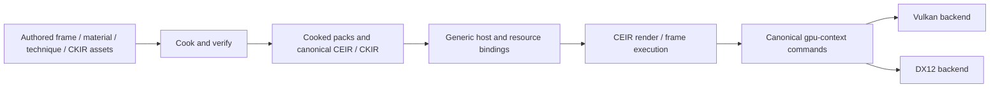

# Rendering and executable-asset foundation

<!-- doc-role: reference -->
> Technical reference; verify dated claims against current contracts/source. Current work: [ROADMAP](../ROADMAP.md); current rules: [AGENTS](../../AGENTS.md).

The current rendering stack is gpu-context + CEIR/CKIR + the render-asset modules. The old rhi/renderer/shader
modules are retired ([ADR-0105](../decisions/0105-retire-rhi-renderer-gpu-context-is-the-graphics-layer.md)).
This overview describes ownership; [ROADMAP](../ROADMAP.md#master-table) alone tracks remaining work.

## Asset to frame

`.frame.toml` is an authoring projection of `ceir.frame`; its converter and execution integration follow
[ADR-0127](../decisions/0127-ceir-frame-dialect-and-converter.md). CKIR describes kernels and shader stages.
CHIR is a higher-level source frontend into CEIR. Native compilers/backends lower these representations;
applications do not select a private C++ renderer path instead of their authored graph.

## Ownership

- **render-asset-core:** asset identity, diagnostics, dependency and cooked/interface metadata.
- **render-program / render-material:** program stage/binding/variant contracts and material definitions/instances.
- **render-pass:** registered pass schemas/mechanics. The source registry is the authority for the current executor set.
- **frame/technique/vertex/light/material-cook and shader-cook:** authoring frontends into canonical cooked artifacts.
- **render-graph and ceir-gpu:** execution and canonical GPU command materialization; no second UI scheduler.
- **gpu-context:** public device/program/command facade. Vulkan/DX12 own native graphics objects; CUDA is compute-only.
- **scene-render:** a scene consumer/host; extracts/binds scene data and loads authored algorithms.
- **draw:** debug visualization over the GPU facade; not the future retained UI or Canvas compositor.
- **resources:** identity, loading, ownership, packs, streaming and resource reload mechanisms shared by consumers.

A material describes surface response; a technique combines a surface with shading/lighting; a frame graph describes
pass/resource composition. A backend pipeline is a compiled object derived from those contracts. These identities
must remain distinct so local edits invalidate only the correct dependency closure.

## Editing and runtime

Engine builtins mount first and applications shadow asset names through the same resolution rules. A development
host may read authored source and invoke cookers; the execution runtime installs cooked artifacts. Shipping builds
consume cooked packs. Runtime editing means staging and installing a replacement, not a hidden source-import bypass.
The asset replacement and builder-deletion law is pinned in PRINCIPLES and AGENTS.

CEIR-34 moved the program hand-list to [scene_programs.manifest](../../assets/scene_programs.manifest) and removed
its residual overlay verb path. That does not imply a complete generic program registry: specialized recipe dispatch,
retire-all caches and source-reload reinitialization still exist in
[scene_renderer.cpp](../../engine/scene-render/src/scene_renderer.cpp). RAH-7 owns their completion.

## Remaining boundary work

The [command model](../../engine/gpu-context/include/crd/gpu/command_model.hpp) still has attachment/binding limits,
legacy G-buffer and opaque command seams. RAH-1…8 complete typed views, resident tables, strong commands, RT,
transfers, validation, granular reload and capability evidence. The
[audit](../research/2026-09-12-system-audit.md) names exact findings and limits.

A working CKIR kernel or CEIR proof does not qualify a complete renderer family. The full RPL/GVA/LSH/ARG/RTX/MAT/
TPR/VFX/TXS/VGE/OFF contracts remain in the [catalogue](../design/rendering-ui-contracts.md). Runtime qualification
comes before UI by ADR-0129; visual CR-D007 authoring acceptance closes afterward. Per-feature backend/determinism
claims come from the capability manifest and executing tests, never from this overview.

The planned UiWorld and SceneWorld are separate consumers of common Canvas/render/resource services. See
[ADR-0107](../decisions/0107-ui-2d-architecture.md) and the
[execution contract](../design/renderer-ui-execution-contract.md). The
[older RAF overview](../archive/2026-09-12-superseded-plans.md#system-rendering-foundation) is retained as history.
