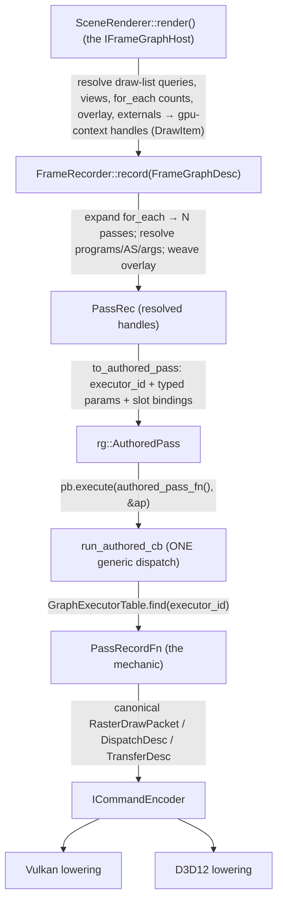

# Rendering Foundation (the RAF architecture)

> The gold-standard asset-driven rendering foundation built by the **RAF band** (D-007, RAF-0…13). One overview for
> the whole stack: what each concept is, how the pieces depend on each other, and how a frame flows from an authored
> asset to backend commands. Mission constitution:
> `docs/research/2026-08-03-gold-standard-asset-driven-rendering.md`. Decisions: ADR-0106 (unified runtime),
> ADR-0098/0101/0103/0104 (CKIR + IR-as-crdr). This doc is the RAF-13 answer to *"a new engineer can answer from docs
> …"* — read it once and the questions in the last section should all be answerable.

## 1. The one idea

**Every GPU program the engine runs is an ASSET, not C++.** An application (or the engine itself, or an agent)
describes a renderer with a handful of declarative assets; the cooker proves those assets fit together; the runtime
executes them without interpreting strings; and each backend lowers ONE canonical command model. Adding a texture, a
material, a pass, or a whole renderer is an **asset edit — never an engine-interface change** (§22-34/35).

The five authored declarations, each cooked to a canonical binary:

| declaration | file | describes | cooked by → |
|---|---|---|---|
| **Frame graph** | `*.frame.toml` → `.crdr` | the SCHEDULE — which passes exist, what they read/write, formats, draw lists | `crd-frame-cook` |
| **Technique** | `*.crdt` | the LIGHTING MODEL — how a surface is shaded (a `.crdl` lighting graph) | `crd-technique-cook` |
| **Geometry stage** | `*.crdv` | the VERTEX/amplification stage | `crd-vertex-cook` |
| **Light set** | `*.crdl` | the LIGHT model a technique consumes | `crd-light-cook` |
| **Surface** | `*.crdm` | the MATERIAL — surface response, no lighting | `crd-material-cook` |

All cook to **CKIR** (the central shader IR) or a canonical blob, and load on Vulkan AND D3D12 to produce
bit-identical output. ⛔ If a rendering change needs a recompile, it belongs in one of these, not in code.

## 2. What each concept IS (the vocabulary)

- **Material** (`crd-render-material`) — a SURFACE response: base colour, roughness, textures/samplers, a surface
  graph. It structurally **cannot** touch lighting state (`RenderChannel` split). Many instances share one definition.
- **Technique** — a SHADING algorithm (Lambert, standard PBR forward, toon, forward+CSM). It consumes a surface + a
  light set and produces the fragment program. It **cannot** schedule frame passes.
- **Render phase** — WHEN/WHERE a draw happens (shadow, depth-prepass, g-buffer, forward). A pass names a phase; a
  material variant is selected per (technique, material, phase).
- **Pass executor** (`crd-render-pass`) — the MECHANIC of a pass ("bind these attachments and iterate a draw list",
  "dispatch a kernel", "copy"). A **registered** unit with a stable `ExecutorTypeId`, a typed versioned schema (its
  params + resource slots + queue), and a runtime record callback. Built-ins: `scene.raster`, `fullscreen.raster`,
  `compute.dispatch`, `transfer.{clear,copy,blit,resolve}`, `raytrace.{dispatch,pipeline}`, `tess.raster`,
  `mesh.raster`, `mesh.indirect`, `visbuffer.raster`, `present`. **A new mechanic is a new registered executor — never
  an engine-enum edit** (this is what retired `FramePassKind` at RAF-12.3).
- **Frame graph** (`crd-render-graph`) — the TOPOLOGY: a DAG of passes over graph-owned resources, with derived
  ordering, barriers, transient aliasing, persistent/history buffers, subgraphs, anchors/injection and one submission.
  It owns no scene entities and holds no arbitrary logic.
- **Program** (`crd-render-program`) — a shader+program CONTRACT: typed stage I/O, resource declarations with binding
  frequencies, a `VariantKey`, an interface hash. Cooking resolves names+frequencies to stable layout slots.
- **Application render pipeline** — the app's chosen top-level frame graph + its material/technique/executor assets,
  composed over the engine defaults through the SAME public registries the engine uses.
- **Backend pipeline object** — a Vulkan/D3D12 PSO (or shader-object) the backend creates by lowering the canonical
  command model; its cache key contains every correctness-relevant property.

## 3. Module dependency graph (one-way, acyclic)

```
render-asset-core   (identity · diagnostics · dependency graph · cooked-header · BindingKind/Frequency)
        ▲
        ├── render-program   (shader+program contract)
        ├── render-pass      (executor registry + typed PassPayload)   ◄── gpu-context (command model, IFrameGraph)
        └── render-graph     (frame-graph runtime: template · compile · execute_frame · run_authored_cb)
                ▲
        frame-cook   (FrameGraphDesc · .crdr blob · FrameRecorder · the cooked→template load bridge)
                ▲
        scene-render (SceneRenderer = the IFrameGraphHost orchestrator)  ──►  app assets (public registries)
```

Every RAF module is a leaf added without a back-edge. `render-graph` depends on neither `frame-cook` nor `scene`, so
the host seam (below) keeps `frame-cook ⊥ scene`.

## 4. Asset lifecycle

```mermaid
flowchart LR
  A["authoring text<br/>*.frame.toml / *.crdm / *.crdt / *.crdv / *.crdl"]
  A -->|parse + VALIDATE by name| D["Desc (in-memory)<br/>FrameGraphDesc, MaterialDef, …"]
  D -->|cook: names+frequencies → stable slots<br/>executor name → ExecutorTypeId| C["Cooked blob (.crdr)<br/>CookedHeader: magic·schema·interface-hash·content-hash·deps"]
  C -->|load: read header, reject bad schema/version| R["Runtime form<br/>generation-tagged RuntimeSlot / PassPayload"]
  R -->|variant key: technique+gen · material+gen · phase · caps| V["Program variant (CKIR)"]
  V -->|graph compile: lifetimes · aliasing · barriers · one submission| P["CompiledFrameGraph / AuthoredPass list"]
  P -->|record via ONE dispatch| E["run_authored_cb → executor → ICommandEncoder"]
  E -->|direct backend lowering| B["Vulkan / D3D12 commands + PSOs"]
```



The **five forms stay separate** (§22-4): authoring text · Desc · cooked blob · runtime/compiled · backend object.
The `Desc` keeps typed authoring fields (validated authoring data, §8); the RUNTIME reads the typed `PassPayload` /
`AuthoredPass`, never the Desc — so no single struct spans all stages.

## 5. Per-frame command lifecycle (the live path)



Key properties this path guarantees: the pass mechanic is the cooked `ExecutorTypeId` (**no record-time string
lookup**, §22-18); ordinary draw recording does **no heap allocation** (§22-19); ordering/barriers/aliasing/one-
submission are DERIVED by the graph, never authored. The **programmatic / hand-built** path
(`FrameGraphTemplate → compile → execute_frame`) funnels through the **same** `run_authored_cb` executors — that
shared funnel is the "hand-built == authored" guarantee (§22-7 / Gate 7).

## 6. The canonical command model (RAF-2)

One backend-neutral model collapses the old ~57 combinatorial `draw_*/dispatch_*/trace_*` verbs
(`gpu-context/command_model.hpp`): explicit `RenderingDesc` (attachments with load/store/clear/blend), a typed
`ResourceBindingTable` (Frame/Pass/Material/Object/Draw frequencies), an 8-variant `GeometrySource`, strong
`RasterCommandKind` (Draw · DrawIndexed · DrawIndirect · DrawIndexedIndirect(+Count) · DispatchMesh(+Indirect) ·
DrawPatches), and `DispatchDesc`/`TransferDesc`/`TraceDesc`. The `TranslatingCommandEncoder` lowers every kind through
each backend directly — no verb-per-feature-combination survives on `IRasterContext` (§22-9, RAF-12.4).

## 7. How to … (the Gate-13 questions, answered)

- **Replace the renderer (app, no engine edit):** mount app assets under `app://`; select a frame graph by canonical
  id (`SceneRenderer::set_frame_graph("app://frame/…")`), or include an engine graph as a subgraph, or inject a pass
  at a declared anchor. Add an `app://material/…`, an `app://technique/…`, or an `app://post/…` display transform —
  each shadows an engine name through the same public registry (last-match wins). Proven end-to-end by
  `tests/scene-render/test_raf10_app.cpp` (10 ways, both backends), which is forbidden to call any engine-private
  method, add a backend virtual, edit a central enum, hard-code a backend slot, or embed its frame asset as a string.
- **Add a custom pass mechanic:** register a `PassRecordFn` under a stable id —
  `SceneRenderer::register_pass_executor("app://executor/outline", fn, user)` — and author a `kind = "custom"` pass
  whose `executor = "app://executor/outline"`. The renderer resolves it through the SAME `GraphExecutorTable` a
  built-in uses (`executor_type_id` hashes both identically). No new enum, no engine edit.
- **Diagnose invalid bindings:** every cross-asset contract is checked **at cook time, by name**, and returns a typed
  diagnostic (never a runtime surprise on a player's machine): unknown pass kind, missing shader/kernel/draw-list,
  a fullscreen MRT, a visbuffer target that isn't `R32Uint`, a composite with no blend, a raytrace with no
  acceleration structure, a custom pass with no `executor`, a technique whose declared pass-frequency bindings don't
  match a pass's reads (name+location+width+interpolation), a duplicate binding slot, an out-of-range layer, …
- **What is rebuilt after a shader reload (RAF-11):** the reloader computes the dependency closure
  (`DependencyGraph::affected_by`, reverse-BFS), rebuilds only the affected set deepest-first, REJECTS the whole set on
  an interface-hash change (never a half-generation), commits atomically (last-good on failure), and defers freeing the
  retired GPU objects until `frames_in_flight` `begin_frame` cycles have passed. A shader-body edit re-runs
  `init_programs` (made re-runnable) which re-cooks the program variants and bumps the shared program-input generation.

## 8. Where the code lives

`engine/render-asset-core` · `engine/render-program` · `engine/render-material` · `engine/render-pass` ·
`engine/render-graph` · `engine/frame-cook` · `engine/scene-render`. Assets: `assets/frame|technique|vertex|lighting`
+ `.crdm` materials. Gates: `crd-<module>-tests` (`raf<N>` tags), `crd-scene-render-tests` (the live GPU gate, both
backends), `crd-render-graph-gpu-tests` (hand-built == authored), the sandbox `--smoke-test 2` (the real 11-pass frame).
